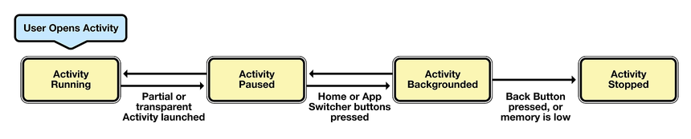
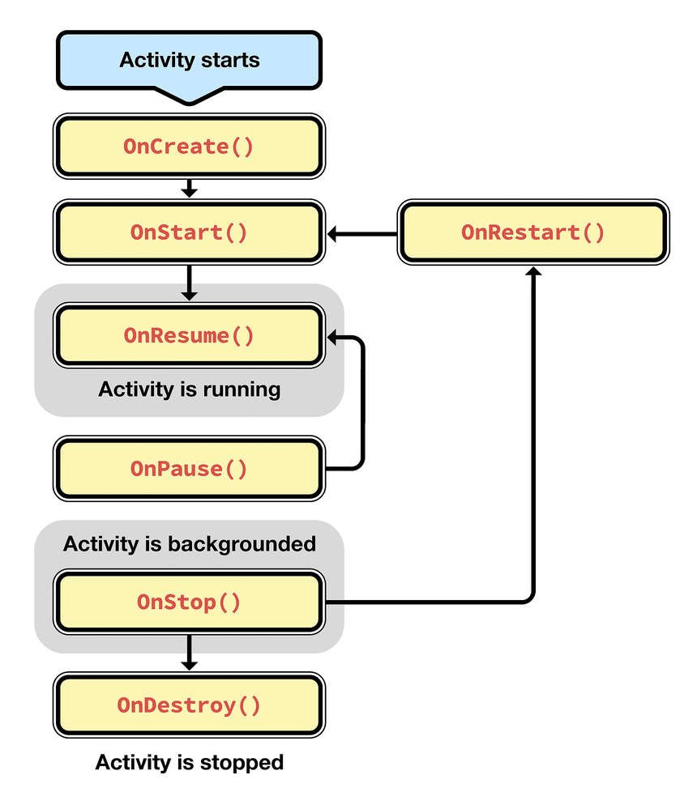
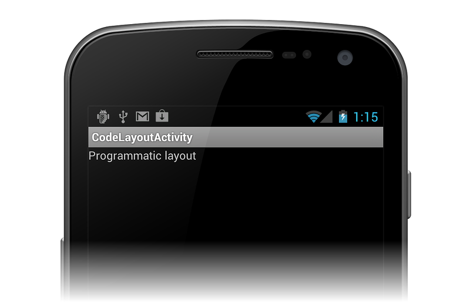
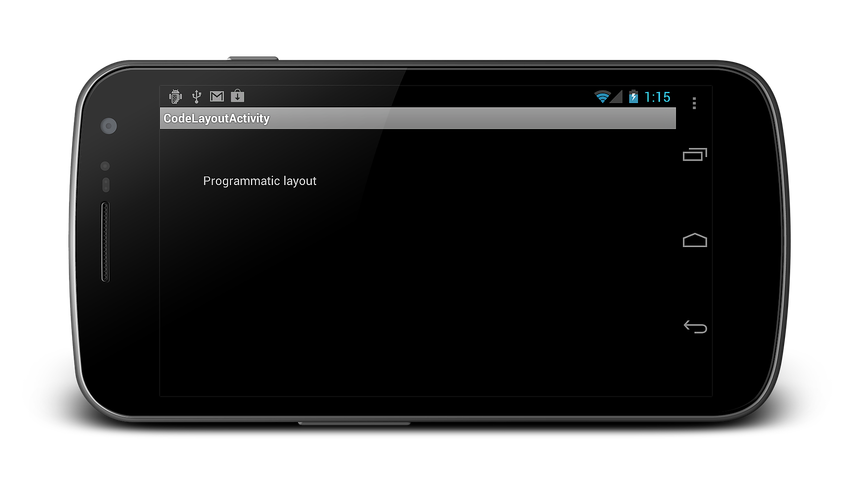
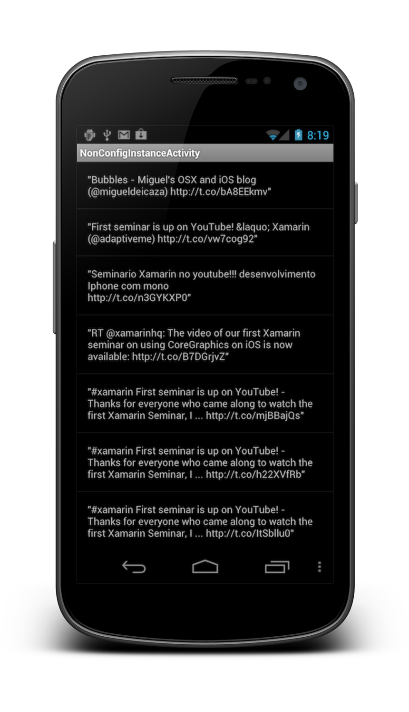

# Activity Lifecycle

_Activities are a fundamental building block of Android applications and they can exist in a number of different states. The activity lifecycle begins with instantiation and ends with destruction, and includes many states in between. When an activity changes state, the appropriate lifecycle event method is called, notifying the activity of the impending state change and allowing it to execute code to adapt to that change. This article examines the lifecycle of activities and explains the responsibility that an activity has during each of these state changes to be part of a well-behaved, reliable application._

## Activity Lifecycle Overview

Activities are an unusual programming concept specific to Android. In
traditional application development there is usually a static main
method, which is executed to launch the application. With Android,
however, things are different; Android applications can be launched via
any registered activity within an application. In practice, most
applications will only have a specific activity that is specified as
the application entry point. However, if an application crashes, or is
terminated by the OS, the OS can try to restart the application at the
last open activity or anywhere else within the previous activity stack.
Additionally, the OS may pause activities when they're not active,
and reclaim them if it is low on memory. Careful consideration must be
made to allow the application to correctly restore its state in the
event that an activity is restarted, especially if that activity
depends on data from previous activities.

The activity lifecycle is implemented as a collection of methods the OS
calls throughout the lifecycle of an activity. These methods allow
developers to implement the functionality that is necessary to satisfy
the state and resource management requirements of their applications.

It is extremely important for the application developer to analyze the
requirements of each activity to determine which methods exposed by the
activity lifecycle need to be implemented. Failure to do this can
result in application instability, crashes, resource bloat, and
possibly even underlying OS instability.

This chapter examines the activity lifecycle in detail, including:

- Activity States
- Lifecycle Methods
- Retaining the State of an Application

This section also includes a
[walkthrough](~/android/app-fundamentals/activity-lifecycle/saving-state.md)
that provide practical examples on how to efficiently save state during
the Activity lifecycle. By the end of this chapter you should have an
understanding of the Activity lifecycle and how to support it in an
Android application.

## Activity Lifecycle

The Android activity lifecycle comprises a collection of methods
exposed within the Activity class that provide the developer with a
resource management framework. This framework allows developers to meet
the unique state management requirements of each activity within an
application and properly handle resource management.

### Activity States

The Android OS arbitrates Activities based on their state. This helps
Android identify activities that are no longer in use, allowing the OS
to reclaim memory and resources. The following diagram illustrates the
states an Activity can go through during its lifetime:

[](images/image1.png#lightbox)

These states can be broken into 4 main groups as follows:

1. *Active or Running* &ndash; Activities are considered active or running
    if they are in the foreground, also known as the top of the
    activity stack. This is considered the highest priority activity in
    Android, and as such will only be killed by the OS in extreme
    situations, such as if the activity tries to use more memory than
    is available on the device as this could cause the UI to become
    unresponsive.

1. *Paused* &ndash; When the device goes to sleep, or an activity is still
    visible but partially hidden by a new, non-full-sized or
    transparent activity, the activity is considered paused. Paused
    activities are still alive, that is, they maintain all state and
    member information, and remain attached to the window manager. This
    is considered to be the second highest priority activity in Android
    and, as such, will only be killed by the OS if killing this
    activity will satisfy the resource requirements needed to keep the
    Active/Running Activity stable and responsive.

1. *Stopped/Backgrounded* &ndash; Activities that are completely obscured by
    another activity are considered stopped or in the background.
    Stopped activities still try to retain their state and member
    information for as long as possible, but stopped activities are
    considered to be the lowest priority of the three states and, as
    such, the OS will kill activities in this state first to satisfy
    the resource requirements of higher priority activities.

1. *Restarted* &ndash; It is possible for an activity that is anywhere
    from paused to stopped in the lifecycle to be removed from memory
    by Android. If the user navigates back to the activity it must be
    restarted, restored to its previously saved state, and then
    displayed to the user.

### Activity Re-Creation in Response to Configuration Changes

To make matters more complicated, Android throws one more wrench in the
mix called Configuration Changes. Configuration changes are rapid
activity destruction/re-creation cycles that occur when the
configuration of an activity changes, such as when the device is
[rotated](~/android/app-fundamentals/handling-rotation.md)
(and the activity needs to get re-built in landscape or portrait mode),
when the keyboard is displayed (and the activity is presented with an
opportunity to resize itself), or when the device is placed in a dock,
among others.

Configuration changes still cause the same Activity State changes that
would occur during stopping and restarting an activity. However, in
order to make sure that an application feels responsive and performs
well during configuration changes, it's important that they are
handled as quickly as possible. Because of this, Android has a specific
API that can be used to persist state during configuration changes.
We'll cover this later in the
[Managing State Throughout the Lifecycle](~/android/app-fundamentals/activity-lifecycle/index.md#Managing_State_Throughout_the_Lifecycle)
section.

### Activity Lifecycle Methods

The Android SDK and, by extension, the Xamarin.Android framework
provide a powerful model for managing the state of activities within an
application. When an activity's state is changing, the activity is
notified by the OS, which calls specific methods on that activity. The
following diagram illustrates these methods in relation to the
Activity Lifecycle:

[](images/image2.png#lightbox)

As a developer, you can handle state changes by overriding these
methods within an activity. It's important to note, however, that all
lifecycle methods are called on the UI thread and will block the OS
from performing the next piece of UI work, such as hiding the current
activity, displaying a new activity, etc. As such, code in these
methods should be as brief as possible to make an application feel well
performing. Any long-running tasks should be executed on a background
thread.

Let's examine each of these lifecycle methods and their use:

#### OnCreate

[OnCreate](xref:Android.App.Activity.OnCreate*)
is the first method to be called when an activity is created.
`OnCreate` is always overridden to perform any startup initializations
that may be required by an Activity such as:

- Creating views
- Initializing variables
- Binding static data to lists

`OnCreate` takes a
[Bundle](xref:Android.OS.Bundle)
parameter, which is a dictionary for storing and passing state
information and objects between activities If the bundle is not null,
this indicates the activity is restarting and it should restore its
state from the previous instance. The following code illustrates how to
retrieve values from the bundle:

```csharp
protected override void OnCreate(Bundle bundle)
{
   base.OnCreate(bundle);

   string intentString;
   bool intentBool;

   if (bundle != null)
   {
      intentString = bundle.GetString("myString");
      intentBool = bundle.GetBoolean("myBool");
   }

   // Set our view from the "main" layout resource
   SetContentView(Resource.Layout.Main);
}
```

Once `OnCreate` has finished, Android will call `OnStart`.

#### OnStart

[OnStart](xref:Android.App.Activity.OnStart)
is always called by the system after `OnCreate` is finished. Activities
may override this method if they need to perform any specific tasks
right before an activity becomes visible such as refreshing current
values of views within the activity. Android will call `OnResume`
immediately after this method.

#### OnResume

The system calls
[OnResume](xref:Android.App.Activity.OnResume)
when the Activity is ready to start interacting with the user.
Activities should override this method to perform tasks such as:

- Ramping up frame rates (a common task in game development)
- Starting animations
- Listening for GPS updates
- Display any relevant alerts or dialogs
- Wire up external event handlers

As an example, the following code snippet shows how to initialize the camera:

```csharp
public void OnResume()
{
    base.OnResume(); // Always call the superclass first.

    if (_camera==null)
    {
        // Do camera initializations here
    }
}
```

`OnResume` is important because any operation that is done in `OnPause`
should be un-done in `OnResume`, since it's the only lifecycle method
that is guaranteed to execute after `OnPause` when bringing the
activity back to life.

#### OnPause

[OnPause](xref:Android.App.Activity.OnPause)
is called when the system is about to put the activity into the
background or when the activity becomes partially obscured. Activities
should override this method if they need to:

- Commit unsaved changes to persistent data

- Destroy or clean up other objects consuming resources

- Ramp down frame rates and pausing animations

- Unregister external event handlers or notification handlers (i.e.
    those that are tied to a service). This must be done to prevent
    Activity memory leaks.

- Likewise, if the Activity has displayed any dialogs or alerts, they
    must be cleaned up with the `.Dismiss()` method.

As an example, the following code snippet will release the camera, as
the Activity cannot make use of it while paused:

```csharp
public void OnPause()
{
    base.OnPause(); // Always call the superclass first

    // Release the camera as other activities might need it
    if (_camera != null)
    {
        _camera.Release();
        _camera = null;
    }
}
```

There are two possible lifecycle methods that will be called after `OnPause`:

1. `OnResume` will be called if the Activity is to be returned to the foreground.
1. `OnStop` will be called if the Activity is being placed in the background.

#### OnStop

[OnStop](xref:Android.App.Activity.OnStop)
is called when the activity is no longer visible to the user. This
happens when one of the following occurs:

- A new activity is being started and is covering up this activity.
- An existing activity is being brought to the foreground.
- The activity is being destroyed.

`OnStop` may not always be called in low-memory situations, such as
when Android is starved for resources and cannot properly background
the Activity. For this reason, it is best not to rely on `OnStop`
getting called when preparing an Activity for destruction. The next
lifecycle methods that may be called after this one will be `OnDestroy`
if the Activity is going away, or `OnRestart` if the Activity is coming
back to interact with the user.

#### OnDestroy

[OnDestroy](xref:Android.App.Activity.OnDestroy)
is the final method that is called on an Activity instance before it's
destroyed and completely removed from memory. In extreme situations
Android may kill the application process that is hosting the Activity,
which will result in `OnDestroy` not being invoked. Most Activities
will not implement this method because most clean up and shut down has
been done in the `OnPause` and `OnStop` methods. The `OnDestroy` method
is typically overridden to clean up long running tasks that might
leak resources. An example of this might be background threads that
were started in `OnCreate`.

There will be no lifecycle methods called after the Activity has been destroyed.

#### OnRestart

[OnRestart](xref:Android.App.Activity.OnRestart)
is called after your activity has been stopped, prior to it being
started again. A good example of this would be when the user presses
the home button while on an activity in the application. When this
happens `OnPause` and then `OnStop` methods are called, and the
Activity is moved to the background but is not destroyed. If the user
were then to restore the application by using the task manager or a
similar application, Android will call the `OnRestart` method of the
activity.

There are no general guidelines for what kind of logic should be
implemented in `OnRestart`. This is because `OnStart` is always invoked
regardless of whether the Activity is being created or being restarted,
so any resources required by the Activity should be initialized in
`OnStart`, rather than `OnRestart`.

The next lifecycle method called after `OnRestart` will be `OnStart`.

### Back vs. Home

Many Android devices have two distinct buttons: a "Back" button and
a "Home" button. An example of this can be seen in the following
screenshot of Android 4.0.3:

[](images/image4.png#lightbox)

There is a subtle difference between the two buttons, even though they
appear to have the same effect of putting an application in the
background. When a user clicks the Back button, they are telling
Android that they are done with the activity. Android will destroy the
Activity. In contrast, when the user clicks the Home button the
activity is merely placed into the background &ndash; Android will not kill
the activity.

<a name="Managing_State_Throughout_the_Lifecycle"></a>

## Managing State Throughout the Lifecycle

When an Activity is stopped or destroyed the system provides an
opportunity to save the state of the Activity for later rehydration.
This saved state is referred to as instance state. Android provides
three options for storing instance state during the Activity lifecycle:

1. Storing primitive values in a `Dictionary` known as a
   [Bundle](xref:Android.OS.Bundle)
   that Android will use to save state.

1. Creating a custom class that will hold complex values such as
   bitmaps. Android will use this custom class to save state.

1. Circumventing the configuration change lifecycle and assuming
   complete responsibility for maintaining state in the activity.

This guide covers the first two options.

### Bundle State

The primary option for saving instance state is to use a key/value
dictionary object known as a
[Bundle](xref:Android.OS.Bundle).
Recall that when an Activity is created that the `OnCreate` method is
passed a bundle as a parameter, this bundle can be used to restore the
instance state. It is not recommended to use a bundle for more complex
data that won't quickly or easily serialize to key/value pairs (such as
bitmaps); rather, it should be used for simple values like strings.

An Activity provides methods to help with saving and retrieving the instance state in the Bundle:

- [OnSaveInstanceState](xref:Android.App.Activity.OnSaveInstanceState*)
    &ndash; This is invoked by Android when the
    activity is being destroyed. Activities can implement this method
    if they need to persist any key/value state items.

- [OnRestoreInstanceState](xref:Android.App.Activity.OnRestoreInstanceState*)
    &ndash; This is called after the `OnCreate`
    method is finished, and provides another opportunity for an
    Activity to restore its state after initialization is complete.

The following diagram illustrates how these methods are used:

[](images/image3.png#lightbox)

#### OnSaveInstanceState

[OnSaveInstanceState](xref:Android.App.Activity.OnSaveInstanceState*)
will be called as the Activity is being stopped. It will receive a
bundle parameter that the Activity can store its state in. When a
device experiences a configuration change, an Activity can use the
`Bundle` object that is passed in to preserve the Activity state by
overriding `OnSaveInstanceState`. For example, consider the following
code:

```csharp
int c;

protected override void OnCreate (Bundle bundle)
{
  base.OnCreate (bundle);

  this.SetContentView (Resource.Layout.SimpleStateView);

  var output = this.FindViewById<TextView> (Resource.Id.outputText);

  if (bundle != null) {
    c = bundle.GetInt ("counter", -1);
  } else {
    c = -1;
  }

  output.Text = c.ToString ();

  var incrementCounter = this.FindViewById<Button> (Resource.Id.incrementCounter);

  incrementCounter.Click += (s,e) => {
    output.Text = (++c).ToString();
  };
}
```

The code above increments an integer named `c` when a button named
`incrementCounter` is clicked, displaying the result in a `TextView`
named `output`. When a configuration change happens - for example, when
the device is rotated - the above code would lose the value of `c`
because the `bundle` would be `null`, as shown in the figure below:

[](images/07.png#lightbox)

To preserve the value of `c` in this example, the Activity can
override `OnSaveInstanceState`, saving the value in the bundle as shown
below:

```csharp
protected override void OnSaveInstanceState (Bundle outState)
{
  outState.PutInt ("counter", c);
  base.OnSaveInstanceState (outState);
}
```

Now when the device is rotated to a new orientation, the integer is saved in
the bundle and is retrieved with the line:

```csharp
c = bundle.GetInt ("counter", -1);
```

> [!NOTE]
> It is important to always call the base implementation of
> `OnSaveInstanceState` so that the state of the view hierarchy can also be saved.

##### View State

Overriding `OnSaveInstanceState` is an appropriate mechanism for saving
transient data in an Activity across orientation changes, such as the
counter in the above example. However, the default implementation of
`OnSaveInstanceState` will take care of saving transient data in the UI
for every view, so long as each view has an ID assigned. For example,
say an application has an `EditText` element defined in XML as follows:

```xml
<EditText android:id="@+id/myText"
  android:layout_width="fill_parent"
  android:layout_height="wrap_content"/>
```

Since the `EditText` control has an `id` assigned, when
the user enters some data and rotates the device, the data is still displayed,
as shown below:

[](images/08.png#lightbox)

#### OnRestoreInstanceState

[OnRestoreInstanceState](xref:Android.App.Activity.OnRestoreInstanceState*)
will be called after `OnStart`. It provides an activity the opportunity
to restore any state that was previously saved to a Bundle during the
previous `OnSaveInstanceState`. This is the same bundle that is
provided to `OnCreate`, however.

The following code demonstrates how state can be restored in
`OnRestoreInstanceState`:

```csharp
protected override void OnRestoreInstanceState(Bundle savedState)
{
    base.OnRestoreSaveInstanceState(savedState);
    var myString = savedState.GetString("myString");
    var myBool = savedState.GetBoolean("myBool");
}
```

This method exists to provide some flexibility around when state should
be restored. Sometimes it is more appropriate to wait until all
initializations are done before restoring instance state. Additionally,
a subclass of an existing Activity may only want to restore certain
values from the instance state. In many cases, it's not necessary to
override `OnRestoreInstanceState`, since most activities can restore
state using the bundle provided to `OnCreate`.

For an example of saving state using a `Bundle`, refer to the
[Walkthrough - Saving the Activity state](saving-state.md).

#### Bundle Limitations

Although `OnSaveInstanceState` makes it easy to save transient
data, it has some limitations:

- It is not called in all cases. For example, pressing **Home** or
    **Back** to exit an Activity will not result in
    `OnSaveInstanceState` being called.

- The bundle passed into `OnSaveInstanceState` is not designed for
    large objects, such as images. In the case of large objects, saving
    the object from
    [OnRetainNonConfigurationInstance](xref:Android.App.Activity.OnRetainNonConfigurationInstance)
    is preferable, as discussed below.

- Data saved by using the bundle is serialized, which can lead to
    delays.

Bundle state is useful for simple data that doesn't use much memory,
whereas *non-configuration instance data* is useful for more complex
data, or data that is expensive to retrieve, such as from a web service
call or a complicated database query. Non-configuration instance data
gets saved in an object as needed. The next section introduces
`OnRetainNonConfigurationInstance` as a way of preserving more complex
data types through configuration changes.

### Persisting Complex Data

In addition to persisting data in the bundle, Android also supports
saving data by overriding
[OnRetainNonConfigurationInstance](xref:Android.App.Activity.OnRetainNonConfigurationInstance)
and returning an instance of a `Java.Lang.Object` that contains the
data to persist. There are two primary benefits of using
`OnRetainNonConfigurationInstance` to save state:

- The object returned from `OnRetainNonConfigurationInstance`
    performs well with larger, more complex data types because memory
    retains this object.

- The `OnRetainNonConfigurationInstance` method is called on demand,
    and only when needed. This is more economical than using a manual
    cache.

Using `OnRetainNonConfigurationInstance` is suitable for scenarios
where it is expensive to retrieve the data multiple times, such as in web
service calls. For example, consider the following code that searches
Twitter:

```csharp
public class NonConfigInstanceActivity : ListActivity
{
  protected override void OnCreate (Bundle bundle)
  {
    base.OnCreate (bundle);
    SearchTwitter ("xamarin");
  }

  public void SearchTwitter (string text)
  {
    string searchUrl = String.Format("http://search.twitter.com/search.json?" + "q={0}&rpp=10&include_entities=false&" + "result_type=mixed", text);

    var httpReq = (HttpWebRequest)HttpWebRequest.Create (new Uri (searchUrl));
    httpReq.BeginGetResponse (new AsyncCallback (ResponseCallback), httpReq);
  }

  void ResponseCallback (IAsyncResult ar)
  {
    var httpReq = (HttpWebRequest)ar.AsyncState;

    using (var httpRes = (HttpWebResponse)httpReq.EndGetResponse (ar)) {
      ParseResults (httpRes);
    }
  }

  void ParseResults (HttpWebResponse httpRes)
  {
    var s = httpRes.GetResponseStream ();
    var j = (JsonObject)JsonObject.Load (s);

    var results = (from result in (JsonArray)j ["results"] let jResult = result as JsonObject select jResult ["text"].ToString ()).ToArray ();

    RunOnUiThread (() => {
      PopulateTweetList (results);
    });
  }

  void PopulateTweetList (string[] results)
  {
    ListAdapter = new ArrayAdapter<string> (this, Resource.Layout.ItemView, results);
  }
}
```

This code retrieves results from the web formatted as JSON, parses them, and
then presents the results in a list, as shown in the following screenshot:

[](images/06.png#lightbox)

When a configuration change occurs - for example, when a device is
rotated - the code repeats the process. To reuse the
originally retrieved results and not cause needless, redundant network
calls, we can use `OnRetainNonconfigurationInstance` to save the
results, as shown below:

```csharp
public class NonConfigInstanceActivity : ListActivity
{
  TweetListWrapper _savedInstance;

  protected override void OnCreate (Bundle bundle)
  {
    base.OnCreate (bundle);

    var tweetsWrapper = LastNonConfigurationInstance as TweetListWrapper;

    if (tweetsWrapper != null) {
      PopulateTweetList (tweetsWrapper.Tweets);
    } else {
      SearchTwitter ("xamarin");
    }

    public override Java.Lang.Object OnRetainNonConfigurationInstance ()
    {
      base.OnRetainNonConfigurationInstance ();
      return _savedInstance;
    }

    ...

    void PopulateTweetList (string[] results)
    {
      ListAdapter = new ArrayAdapter<string> (this, Resource.Layout.ItemView, results);
      _savedInstance = new TweetListWrapper{Tweets=results};
    }
}
```

Now when the device is rotated, the original results are retrieved from
the `LastNonConfiguartionInstance` property. In this example, the
results consist of a `string[]` containing tweets. Since
`OnRetainNonConfigurationInstance` requires that a `Java.Lang.Object`
be returned, the `string[]` is wrapped in a class that subclasses
`Java.Lang.Object`, as shown below:

```csharp
class TweetListWrapper : Java.Lang.Object
{
  public string[] Tweets { get; set; }
}
```

For example, attempting to use a `TextView` as the object returned from
`OnRetainNonConfigurationInstance` will leak the Activity, as
illustrated by the code below:

```csharp
TextView _textView;

protected override void OnCreate (Bundle bundle)
{
  base.OnCreate (bundle);

  var tv = LastNonConfigurationInstance as TextViewWrapper;

  if(tv != null) {
    _textView = tv;
    var parent = _textView.Parent as FrameLayout;
    parent.RemoveView(_textView);
  } else {
    _textView = new TextView (this);
    _textView.Text = "This will leak.";
  }

  SetContentView (_textView);
}

public override Java.Lang.Object OnRetainNonConfigurationInstance ()
{
  base.OnRetainNonConfigurationInstance ();
  return _textView;
}
```

In this section, we learned how to preserve simple state data with the
`Bundle`, and persist more complex data types with
`OnRetainNonConfigurationInstance`.

## Summary

The Android activity lifecycle provides a powerful framework for state
management of activities within an application but it can be tricky to
understand and implement. This chapter introduced the different states
that an activity may go through during its lifetime, as well as the
lifecycle methods that are associated with those states. Next, guidance
was provided as to what kind of logic should be performed in each of
these methods.

## Related Links

- [Handling Rotation](~/android/app-fundamentals/handling-rotation.md)
- [Android Activity](xref:Android.App.Activity)
