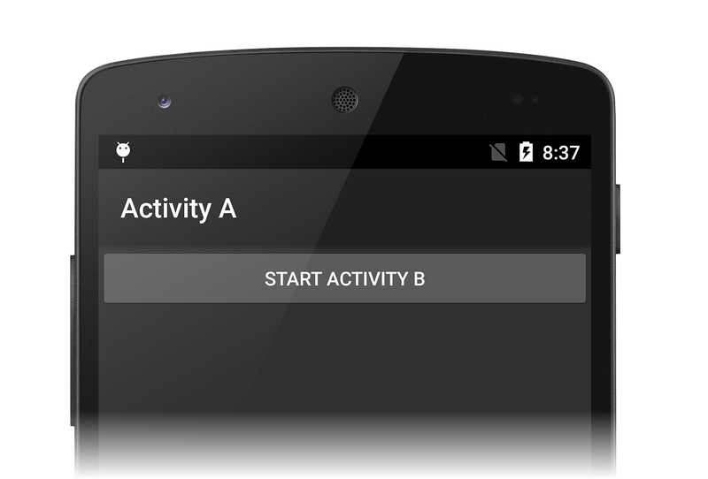
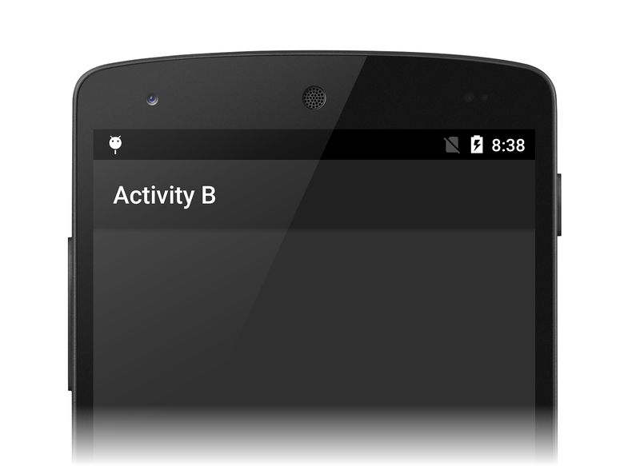
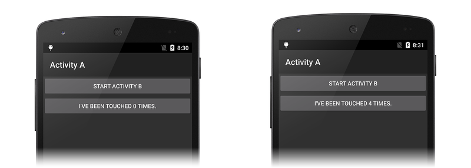
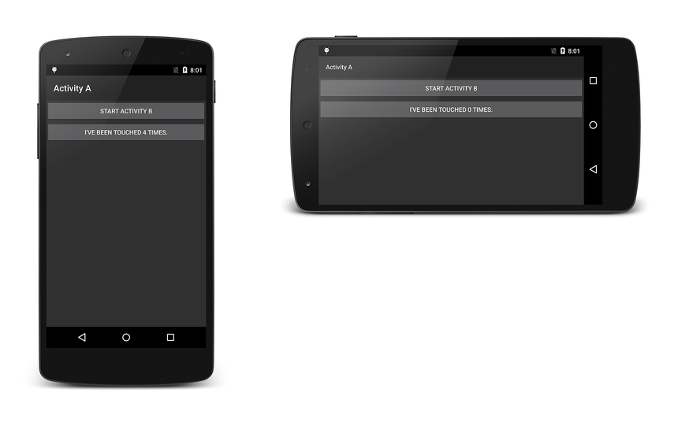

# Walkthrough - Saving the Activity state

_We have covered the theory behind saving state in the Activity Lifecycle guide; now, let's walk through an example._

## Activity State Walkthrough

Let's open the **ActivityLifecycle_Start** project (in the
[ActivityLifecycle](/samples/xamarin/monodroid-samples/activitylifecycle)
sample), build it, and run it. This is a very simple project that has
two activities to demonstrate the activity lifecycle and how the
various lifecycle methods are called. When you start the application,
the screen of `MainActivity` is displayed:

[](saving-state-images/01-activity-a.png#lightbox)

### Viewing State Transitions

Each method in this sample writes to the IDE application output window 
to indicate activity state. (To open the output window in Visual Studio,
type **CTRL-ALT-O**; to open the output window in Visual Studio for Mac,
click **View > Pads > Application Output**.)

When the app first starts, the output window displays the state changes 
of *Activity A*: 

```shell
[ActivityLifecycle.MainActivity] Activity A - OnCreate
[ActivityLifecycle.MainActivity] Activity A - OnStart
[ActivityLifecycle.MainActivity] Activity A - OnResume
```

When we click the **Start Activity B** 
button, we see *Activity A* pause and stop while *Activity B* goes
through its state changes: 

```shell
[ActivityLifecycle.MainActivity] Activity A - OnPause
[ActivityLifecycle.SecondActivity] Activity B - OnCreate
[ActivityLifecycle.SecondActivity] Activity B - OnStart
[ActivityLifecycle.SecondActivity] Activity B - OnResume
[ActivityLifecycle.MainActivity] Activity A - OnStop
```

As a result, *Activity B* is started and displayed in place of 
*Activity A*: 

[](saving-state-images/02-activity-b.png#lightbox)

When we click the **Back** button, *Activity B* is destroyed and 
*Activity A* is resumed: 

```shell
[ActivityLifecycle.SecondActivity] Activity B - OnPause
[ActivityLifecycle.MainActivity] Activity A - OnRestart
[ActivityLifecycle.MainActivity] Activity A - OnStart
[ActivityLifecycle.MainActivity] Activity A - OnResume
[ActivityLifecycle.SecondActivity] Activity B - OnStop
[ActivityLifecycle.SecondActivity] Activity B - OnDestroy
```

### Adding a Click Counter

Next, we're going to change the application so that we have a button 
that counts and displays the number of times it is clicked. First, 
let's add a `_counter` instance variable to `MainActivity`:

```csharp
int _counter = 0;
```

Next, let's edit the **Resource/layout/Main.axml** layout file and 
add a new `clickButton` that displays the number of times the user 
has clicked the button. The resulting **Main.axml** should resemble 
the following: 

```xml
<?xml version="1.0" encoding="utf-8"?>
<LinearLayout xmlns:android="http://schemas.android.com/apk/res/android"
    android:orientation="vertical"
    android:layout_width="fill_parent"
    android:layout_height="fill_parent">
    <Button
        android:id="@+id/myButton"
        android:layout_width="fill_parent"
        android:layout_height="wrap_content"
        android:text="@string/mybutton_text" />
    <Button
        android:id="@+id/clickButton"
        android:layout_width="fill_parent"
        android:layout_height="wrap_content"
        android:text="@string/counterbutton_text" />
</LinearLayout>
```

Let's add the following code to the end of the
[OnCreate](xref:Android.App.Activity.OnCreate*)
method in `MainActivity` &ndash; this code handles click events from
the `clickButton`:

```csharp
var clickbutton = FindViewById<Button> (Resource.Id.clickButton);
clickbutton.Text = Resources.GetString (
    Resource.String.counterbutton_text, _counter);
clickbutton.Click += (object sender, System.EventArgs e) =>
{
    _counter++;
    clickbutton.Text = Resources.GetString (
        Resource.String.counterbutton_text, _counter);
} ;
```

When we build and run the app again, a new button appears that increments 
and displays the value of `_counter` on each click:

[](saving-state-images/03-touched.png#lightbox)

But when we rotate the device to landscape mode, this count is lost:

[](saving-state-images/05-rotate-nosave.png#lightbox)

Examining the application output, we see that *Activity A* 
was paused, stopped, destroyed, recreated, restarted, then resumed 
during the rotation from portrait to landscape mode: 

```shell
[ActivityLifecycle.MainActivity] Activity A - OnPause
[ActivityLifecycle.MainActivity] Activity A - OnStop
[ActivityLifecycle.MainActivity] Activity A - On Destroy

[ActivityLifecycle.MainActivity] Activity A - OnCreate
[ActivityLifecycle.MainActivity] Activity A - OnStart
[ActivityLifecycle.MainActivity] Activity A - OnResume
```

Because *Activity A* is destroyed and recreated again when the
device is rotated, its instance state is lost. Next, we will 
add code to save and restore the instance state.

### Adding Code to Preserve Instance State

Let's add a method to `MainActivity` to save the instance state. Before
*Activity A* is destroyed, Android automatically calls
[OnSaveInstanceState](xref:Android.App.Activity.OnSaveInstanceState*)
and passes in a
[Bundle](xref:Android.OS.Bundle) that we can use to store our
instance state. Let's use it to save our click count as an integer
value:

```csharp
protected override void OnSaveInstanceState (Bundle outState)
{
    outState.PutInt ("click_count", _counter);
    Log.Debug(GetType().FullName, "Activity A - Saving instance state");

    // always call the base implementation!
    base.OnSaveInstanceState (outState);    
}
```

When *Activity A* is recreated and resumed, Android passes this 
`Bundle` back into our `OnCreate` method. Let's add code to `OnCreate` 
to restore the `_counter` value from the passed-in `Bundle`. Add the 
following code just before the line where `clickbutton` is defined: 

```csharp
if (bundle != null)
{
    _counter = bundle.GetInt ("click_count", 0);
    Log.Debug(GetType().FullName, "Activity A - Recovered instance state");
}
```

Build and run the app again, then click the second button a few times. When
we rotate the device to landscape mode, the count is preserved!

[](saving-state-images/06-rotate-save.png#lightbox)

Let's take a look at the output window to see what happened:

```shell
[ActivityLifecycle.MainActivity] Activity A - OnPause
[ActivityLifecycle.MainActivity] Activity A - Saving instance state
[ActivityLifecycle.MainActivity] Activity A - OnStop
[ActivityLifecycle.MainActivity] Activity A - On Destroy

[ActivityLifecycle.MainActivity] Activity A - OnCreate
[ActivityLifecycle.MainActivity] Activity A - Recovered instance state
[ActivityLifecycle.MainActivity] Activity A - OnStart
[ActivityLifecycle.MainActivity] Activity A - OnResume
```

Before the
[OnStop](xref:Android.App.Activity.OnStop) method was called,
our new `OnSaveInstanceState` method was called to save the `_counter`
value in a `Bundle`. Android passed this `Bundle` back to us when it
called our `OnCreate` method, and we were able to used it to restore
the `_counter` value to where we left off.

## Summary

In this walkthough, we have used our knowledge of the Activity
Lifecycle to preserve state data.

## Related Links

- [ActivityLifecycle (sample)](/samples/xamarin/monodroid-samples/activitylifecycle)
- [Activity Lifecycle](~/android/app-fundamentals/activity-lifecycle/index.md)
- [Android Activity](xref:Android.App.Activity)