# Understanding Android API levels

_Xamarin.Android has several Android API level settings that determine your app's compatibility with multiple versions of Android. This guide explains what these settings mean, how to configure them, and what effect they have on your app at run time._

## Quick start

Xamarin.Android exposes three Android API level project settings:

- [Target Framework](#framework) &ndash; Specifies which framework to
    use in building your application. This API level is used at
    *compile* time by Xamarin.Android.

- [Minimum Android Version](#minimum) &ndash; Specifies the oldest
    Android version that you want your app to support. This API level
    is used at *run* time by Android.

- [Target Android Version](#target) &ndash; Specifies the version of
    Android that your app is intended to run on. This API level is used
    at *run* time by Android.

Before you can configure an API level for your project, you must
install the SDK platform components for that API level. For more
information about downloading and installing Android SDK components,
see [Android SDK Setup](~/android/get-started/installation/android-sdk.md).

> [!NOTE]
> Beginning in August 2020, the Google Play Console requires that new apps target API level 29 (Android 10.0) or higher.
Existing apps are required to target API level 29 or higher beginning in November 2020. For more information, see 
[Target API level requirements for the Play Console](https://support.google.com/googleplay/android-developer/answer/9859152#targetsdk) in "Create and set up your app" in the Play Console documentation.

<!-- markdownlint-disable MD001 -->

# [Visual Studio](#tab/windows)

Normally, all three Xamarin.Android API levels are set to the same
value. On the **Application** page, set **Compile using Android version
(Target Framework)** to the latest stable API version (or, at a
minimum, to the Android version that has all of the features you need).
In the following screenshot, the Target Framework is set to
**Android 7.1 (API Level 25 - Nougat)**:

[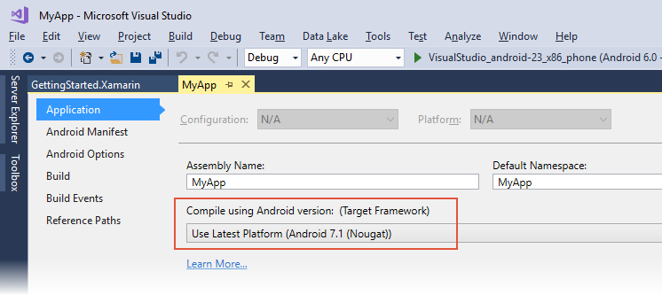](android-api-levels-images/vs-defaults.png#lightbox)

On the **Android Manifest** page, set the Minimum Android version to
**Use Compile using SDK version** and set the Target Android version to
the same value as the Target Framework version (in the following
screenshot, the Target Android Framework is set to **Android 7.1
(Nougat)**):

[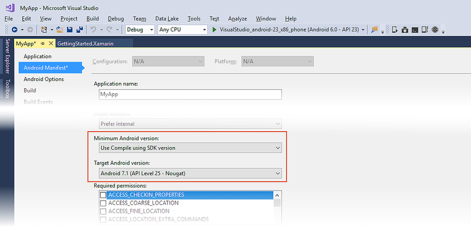](android-api-levels-images/vs-manifest-defaults.png#lightbox)

If you want to maintain backward compatibility with an earlier version
of Android, set **Minimum Android version to target** to the oldest
version of Android that you want your app to support. (Note that API
Level 14 is the minimum API level required for
[Google Play services and Firebase support](https://android-developers.googleblog.com/2016/11/google-play-services-and-firebase-for-android-will-support-api-level-14-at-minimum.html).)
The following example configuration supports Android versions from API
Level 14 through API level 25:

[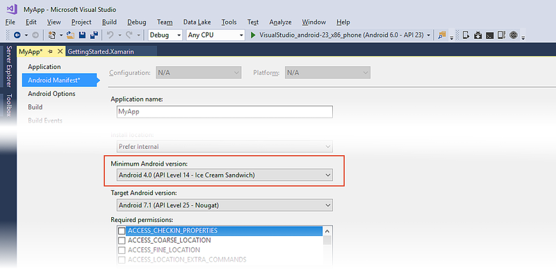](android-api-levels-images/vs-minimum.png#lightbox)

# [Visual Studio for Mac](#tab/macos)

Normally, all three Xamarin.Android API levels are set to the same
value. Set **Target framework** to the latest stable API version (or,
at a minimum, to the Android version that has all of the features you
need). To set the **Target framework**, navigate to **Build > General**
in the **Project Options**. In the following screenshot, the Target
Framework is set to **Use the latest installed platform (8.0)**:

[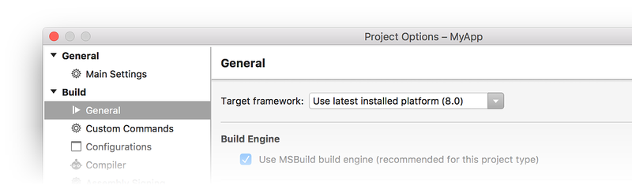](android-api-levels-images/xs-default-target.png#lightbox)

The Minimum and Target Android version settings can be found under
**Build > Android Application** in **Project Options**. Set the Minimum
Android version to **Automatic - use target framework version** and set
the Target Android version to the same value as the Target Framework
version. In the following screenshot, the Target Android Framework is
set to **Android 8.0 (API level 26)** to match the Target Framework
setting above:

[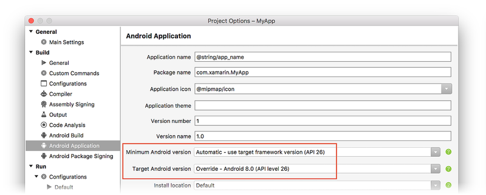](android-api-levels-images/xs-default-app.png#lightbox)

If you want to maintain backward compatibility with an earlier version
of Android, change **Minimum Android version** to the oldest version of
Android that you want your app to support. Note that API Level 14 is
the minimum API level required for
[Google Play services and Firebase support](https://android-developers.googleblog.com/2016/11/google-play-services-and-firebase-for-android-will-support-api-level-14-at-minimum.html).
For example, the following configuration supports Android versions as
early as API Level 14:

[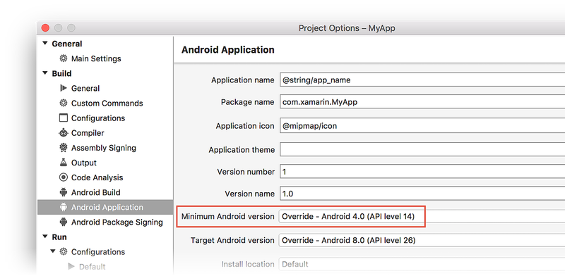](android-api-levels-images/xs-minimum.png#lightbox)

-----

If your app supports multiple Android versions, your code must include
runtime checks to ensure that your app works with the Minimum Android
version setting (see
[Runtime Checks for Android Versions](#runtimechecks) below for
details). If you are consuming or creating a library, see
[API Levels and Libraries](#libraries) below for best practices in
configuring API level settings for libraries.

## Android versions and API levels

As the Android platform evolves and new Android versions are released,
each Android version is assigned a unique integer identifier, called
the *API Level*. Therefore, each Android version corresponds to a
single Android API Level. Because users install apps on older as well
as the most recent versions of Android, real-world Android apps must be
designed to work with multiple Android API levels.

### Android versions

Each release of Android goes by multiple names:

- The Android version, such as **Android 9.0**
- A code (or dessert) name, such as _Pie_
- A corresponding API level, such as **API level 28**

An Android code name may correspond to multiple versions and API levels
(as seen in the table below), but each Android version corresponds to
exactly one API level.

In addition, Xamarin.Android defines *build version codes* that map to
the currently known Android API levels. The following table can help
you translate between API level, Android version, code name, and
Xamarin.Android build version code (build version codes are defined in
the `Android.OS` namespace):

[!include[](~/android/includes/api-levels.md)]

As this table indicates, new Android versions are released frequently
&ndash; sometimes more than one release per year. As a result, the
universe of Android devices that might run your app includes of a wide
variety of older and newer Android versions. How can you guarantee that
your app will run consistently and reliably on so many different
versions of Android? Android's API levels can help you manage this
problem.

### Android API levels

Each Android device runs at exactly *one* API level &ndash; this API
level is guaranteed to be unique per Android platform version. The API
level precisely identifies the version of the API set that your app
can call into; it identifies the combination of manifest elements,
permissions, etc. that you code against as a developer. Android's
system of API levels helps Android determine whether an application is
compatible with an Android system image prior to installing the
application on a device.

When an application is built, it contains the following API level
information:

- The *target* API level of Android that the app is built to
    run on.

- The *minimum* Android API level that an Android device must
    have to run your app. 

These settings are used to ensure that the functionality needed to run
the app correctly is available on the Android device at installation
time. If not, the app is blocked from running on that device. For
example, if the API level of an Android device is lower than the
minimum API level that you specify for your app, the Android device
will prevent the user from installing your app.

## Project API level settings

The following sections explain how to use the SDK Manager to prepare
your development environment for the API levels you want to target,
followed by detailed explanations of how to configure *Target
Framework*, *Minimum Android version*, and *Target Android version*
settings in Xamarin.Android.

### Android SDK platforms

Before you can select a Target or Minimum API level in Xamarin.Android,
you must install the Android SDK platform version that corresponds to
that API level. The range of available choices for Target Framework,
Minimum Android version, and Target Android version is limited to the
range of Android SDK versions that you have installed. You can use the
SDK Manager to verify that the required Android SDK versions are
installed, and you can use it to add any new API levels that you need
for your app. If you are not familiar with how to install API levels,
see [Android SDK Setup](~/android/get-started/installation/android-sdk.md).

<a name="framework"></a>

### Target Framework

The *Target Framework* (also known as `compileSdkVersion`) is the
specific Android framework version (API level) that your app is
compiled for at build time. This setting specifies what APIs your 
app *expects* to use when it runs, but it has no effect on which APIs 
are actually available to your app when it is installed. As a result,
changing the Target Framework setting does not change runtime behavior.

The Target Framework identifies which library versions your application
is linked against &ndash; this setting determines which APIs you can use in
your app. For example, if you want to use the
[NotificationBuilder.SetCategory](xref:Android.App.Notification.Builder.SetCategory*)
method that was introduced in Android 5.0 Lollipop, you must set the
Target Framework to **API Level 21 (Lollipop)** or later. If you set
your project's Target Framework to an API level such as **API Level 19
(KitKat)** and try to call the `SetCategory` method in your code, you
will get a compile error.

We recommend that you always compile with the *latest* available Target
Framework version. Doing so provides you with helpful warning messages
for any deprecated APIs that might be called by your code. Using the
latest Target Framework version is especially important when you use
the latest support library releases &ndash; each library expects your
app to be compiled at that support library's minimum API level or
greater.

# [Visual Studio](#tab/windows)

To access the Target Framework setting in Visual Studio, open the
project properties in **Solution Explorer** and select the
**Application** page:

[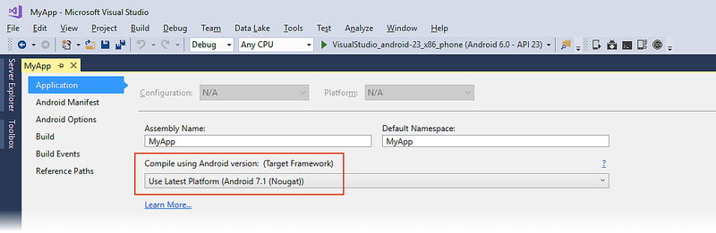](android-api-levels-images/vs-target-framework.png#lightbox)

Set the Target Framework by selecting an API level in the drop-down
menu under **Compile using Android version** as shown above.

# [Visual Studio for Mac](#tab/macos)

To access the Target Framework setting in Visual Studio for Mac,
right-click the project name and select **Options**; this opens the
**Project Options** dialog. In this dialog, navigate to **Build >
General** as shown here:

[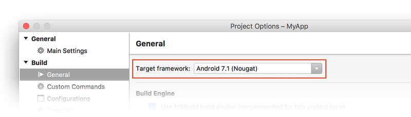](android-api-levels-images/xs-target-framework.png#lightbox)

Set the Target Framework by selecting an API level in the drop-down
menu to the right of **Target framework** as shown above.

-----

<a name="minimum"></a>

### Minimum Android Version

The *Minimum Android version* (also known as `minSdkVersion`) is the
oldest version of the Android OS (i.e., the lowest API level) that can
install and run your application. By default, an app can only be
installed on devices matching the Target Framework setting or higher;
if the Minimum Android version setting is *lower* than the Target
Framework setting, your app can also run on earlier versions of
Android. For example, if you set the Target Framework to **Android 7.1
(Nougat)** and set the Minimum Android version to **Android 4.0.3 (Ice
Cream Sandwich)**, your app can be installed on any platform from API
level 15 to API level 25, inclusive.

Although your app may successfully build and install on this range of
platforms, this does not guarantee that it will successfully *run* on
all of these platforms. For example, if your app is installed on
**Android 5.0 (Lollipop)** and your code calls an API that is available
only in **Android 7.1 (Nougat)** and newer, your app will get a runtime
error and possibly crash. Therefore, your code must ensure &ndash; at
runtime &ndash; that it calls only those APIs that are supported by the
Android device that it is running on. In other words, your code must
include explicit runtime checks to ensure that your app uses newer APIs
only on devices that are recent enough to support them.
[Runtime Checks for Android Versions](#runtimechecks), later in this
guide, explains how to add these runtime checks to your code.

# [Visual Studio](#tab/windows)

To access the Minimum Android version setting in Visual Studio, open
the project properties in **Solution Explorer** and select the
**Android Manifest** page. In the drop-down menu under **Minimum
Android version** you can select the Minimum Android version for your
application:

[](android-api-levels-images/vs-minimum-version.png#lightbox)

If you select **Use Compile using SDK version**, the Minimum
Android version will be the same as the Target Framework setting.

# [Visual Studio for Mac](#tab/macos)

To access the Minimum Android version in Visual Studio for Mac,
right-click the project name and select **Options**; this opens the
**Project Options** dialog. Navigate to **Build > Android Application**.
Using the drop-down menu to the right of **Minimum Android version**,
you can set the Minimum Android version for your application:

[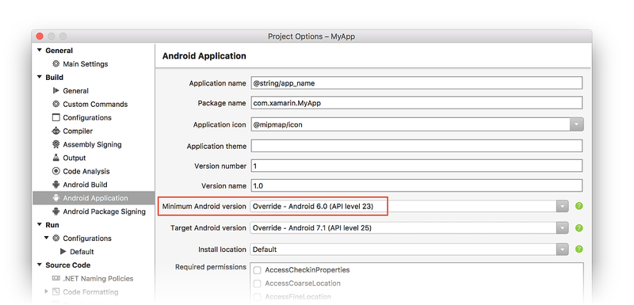](android-api-levels-images/xs-minimum-version.png#lightbox)

If you select **Automatic &ndash; use target framework version**, the
Minimum Android version will be the same as the Target Framework
setting.

-----

<a name="target"></a>

### Target Android Version

The *Target Android Version* (also known as `targetSdkVersion`) is the
API level of the Android device where the app expects to run. Android
uses this setting to determine whether to enable any compatibility
behaviors &ndash; this ensures that your app continues to work the way
you expect. Android uses the Target Android version setting of your app
to figure out which behavior changes can be applied to your app without
breaking it (this is how Android provides forward compatibility).

The Target Framework and the Target Android version, while having very
similar names, are not the same thing. The Target Framework setting
communicates target API level information to Xamarin.Android for use 
at *compile time*, while the Target Android version communicates target
API level information to Android for use at *run time* (when the app is
installed and running on a device).

# [Visual Studio](#tab/windows)

To access this setting in Visual Studio, open the project properties in
**Solution Explorer** and select the **Android Manifest** page. In the
drop-down menu under **Target Android version** you can select the
Target Android version for your application:

[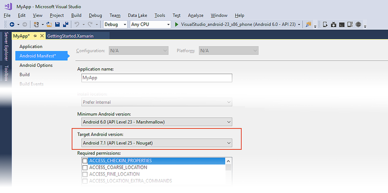](android-api-levels-images/vs-target-version.png#lightbox)

We recommend that you explicitly set the Target Android version to the
latest version of Android that you use to test your app. Ideally,
it should be set to the latest Android SDK version &ndash; this allows
you to use new APIs prior to working through the behavior changes. For
most developers, we *do not* recommend setting the Target Android
version to **Use Compile using SDK version**.

# [Visual Studio for Mac](#tab/macos)

To access this setting in Visual Studio for Mac, right-click the
project name and select **Options**; this opens the **Project Options**
dialog. Navigate to **Build > Android Application**. Using the
drop-down menu to the right of **Target Android version**, you can set
the Target Android version for your application:

[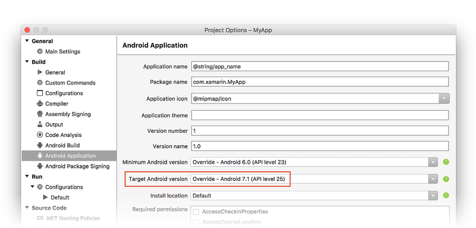](android-api-levels-images/xs-target-version.png#lightbox)

We recommend that you explicitly set the Target Android version to the
latest version of Android that you use to test your app. Ideally, it
should be set to the latest available Android SDK version &ndash; this
allows you to use new APIs prior to working through the behavior
changes. For most developers, we do not recommend setting the Target
Android version to **Automatic - use target framework version**.

-----

In general, the Target Android Version should be bounded by the Minimum
Android Version and the Target Framework. That is:

**Minimum Android Version <= Target Android Version <= Target Framework**

For more information about SDK levels, see the Android Developer
[uses-sdk](https://developer.android.com/guide/topics/manifest/uses-sdk-element.html)
documentation.

<a name="runtimechecks"></a>

## Runtime checks for Android versions

As each new version of Android is released, the framework API is
updated to provide new or replacement functionality. With few
exceptions, API functionality from earlier Android versions is carried
forward into newer Android versions without modifications. As a result,
if your app runs on a particular Android API level, it will typically
be able to run on a later Android API level without modifications. But
what if you also want to run your app on earlier versions of Android?

If you select a Minimum Android version that is *lower* than your
Target Framework setting, some APIs may not be available to your app at
runtime. However, your app can still run on an earlier device, but with
reduced functionality. For each API that is not available on Android
platforms corresponding to your Minimum Android version setting, your
code must explicitly check the value of the
`Android.OS.Build.VERSION.SdkInt` property to determine the API level
of the platform the app is running on. If the API level is *lower* than
the Minimum Android version that supports the API you want to call,
then your code has to find a way to function properly without making
this API call.

For example, let's suppose that we want to use the
[NotificationBuilder.SetCategory](xref:Android.App.Notification.Builder.SetCategory*)
method to categorize a notification when running on **Android 5.0
Lollipop** (and later), but we still want our app to run on earlier
versions of Android such as **Android 4.1 Jelly Bean** (where
`SetCategory` is not available). Referring to the Android version table
at the beginning of this guide, we see that the build version code for
**Android 5.0 Lollipop** is `Android.OS.BuildVersionCodes.Lollipop`. To
support older versions of Android where `SetCategory` is not available,
our code can detect the API level at runtime and conditionally call
`SetCategory` only when the API level is greater than or equal to the
Lollipop build version code:

```csharp
if (Android.OS.Build.VERSION.SdkInt >= Android.OS.BuildVersionCodes.Lollipop)
{
    builder.SetCategory(Notification.CategoryEmail);
}
```

In this example, our app's Target Framework is set to **Android 5.0
(API Level 21)** and its Minimum Android version is set to **Android
4.1 (API Level 16)**. Because `SetCategory` is available in API level
`Android.OS.BuildVersionCodes.Lollipop` and later, this example code
will call `SetCategory` only when it is actually available &ndash; it
will *not* attempt to call `SetCategory` when the API level 
is 16, 17, 18, 19, or 20. The functionality is reduced on these earlier 
Android versions only to the extent that notifications are not sorted properly
(because they are not categorized by type), yet the notifications are
still published to alert the user. Our app still works, but its
functionality is slightly diminished.

In general, the build version check helps your code decide at runtime
between doing something the new way versus the old way. For example:

```csharp
if (Android.OS.Build.VERSION.SdkInt >= Android.OS.BuildVersionCodes.Lollipop)
{
    // Do things the Lollipop way
}
else
{
    // Do things the pre-Lollipop way
}
```

There's no fast and simple rule that explains how to reduce or modify
your app's functionality when it runs on older Android versions that
are lacking one or more APIs. In some cases (such as in the
`SetCategory` example above), it's sufficient to omit the API
call when it's not available. However, in other cases, you may need to
implement alternate functionality for when
`Android.OS.Build.VERSION.SdkInt` is detected to be less than the API
level that your app needs to present its optimum experience.

<a name="libraries"></a>

## API levels and libraries

# [Visual Studio](#tab/windows)

When you create a Xamarin.Android library project (such as a class
library or a bindings library), you can configure only the Target
Framework setting &ndash; the Minimum Android version and the Target
Android version settings are not available. That is because there is no
**Android Manifest** page:

[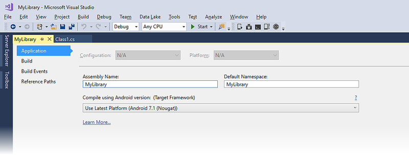](android-api-levels-images/vs-library-options.png#lightbox)

# [Visual Studio for Mac](#tab/macos)

When you create a Xamarin.Android library project, there is no
**Android Application** page where you can configure the Minimum
Android version and the Target Android version &ndash; the Minimum
Android version and Target Android version settings are not available.
That is because there is no **Build > Android Application** page:

[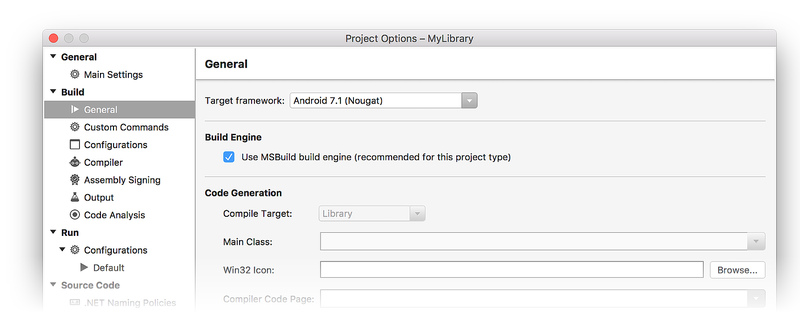](android-api-levels-images/xs-library-options.png#lightbox)

-----

The Minimum Android version and Target Android version settings are
not available because the resulting library is not a stand-alone app &ndash;
the library could be run on any Android version, depending on the app
that it is packaged with. You can specify how the library is to 
be *compiled*, but you can't predict which platform API level the library
will be run on. With this in mind, the following best practices should
be observed when consuming or creating libraries:

- **When consuming an Android library** &ndash; If you are consuming
    an Android library in your application, be sure to set your app's
    Target Framework setting to an API level that is *at least as high
    as* the Target Framework setting of the library.

- **When creating an Android library** &ndash; If you are creating an
    Android library for use by other applications, be sure to set its
    Target Framework setting to the minimum API level that it needs in
    order to compile.

These best practices are recommended to help prevent the situation
where a library attempts to call an API that is not available at
runtime (which can cause the app to crash). If you are a library
developer, you should strive to restrict your usage of API calls to a
small and well-established subset of the total API surface area. Doing
so helps to ensure that your library can be used safely across a wider
range of Android versions.

## Summary

This guide explained how Android API levels are used to manage app
compatibility across different versions of Android. It provided
detailed steps for configuring the 
Xamarin.Android *Target Framework*, *Minimum Android version*, 
and *Target Android version* project
settings. It provided instructions for using the Android SDK Manager to
install SDK packages, included examples of how to write code to deal
with different API levels at runtime, and explained how to manage API
levels when creating or consuming Android libraries. It also provided a
comprehensive list that relates API levels to Android version numbers
(such as Android 4.4), Android version names (such as Kitkat), and
Xamarin.Android build version codes.

## Related Links

- [Android SDK Setup](~/android/get-started/installation/android-sdk.md)
- [SDK CLI Tooling Changes](~/android/troubleshooting/sdk-cli-tooling-changes.md)
- [Picking your compileSdkVersion, minSdkVersion, and targetSdkVersion](https://medium.com/google-developers/picking-your-compilesdkversion-minsdkversion-targetsdkversion-a098a0341ebd)
- [What is API Level?](https://developer.android.com/guide/topics/manifest/uses-sdk-element.html#ApiLevels)
- [Codenames, Tags, and Build Numbers](https://source.android.com/source/build-numbers)
