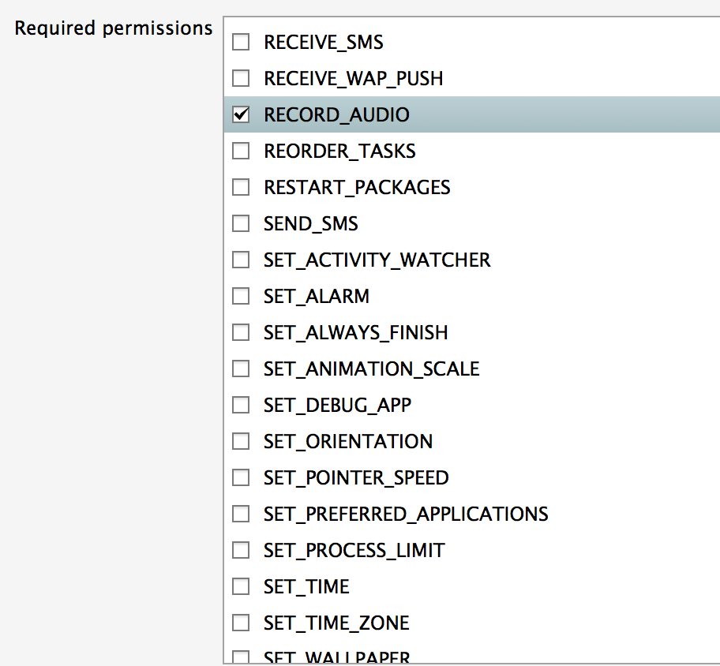

# Android Audio

_The Android OS provides extensive support for multimedia, encompassing both audio and video. This guide focuses on audio in Android and covers playing and recording audio using the built-in audio player and recorder classes, as well as the low-level audio API. It also covers working with Audio events broadcast by other applications, so that developers can build well-behaved applications._

## Overview

Modern mobile devices have adopted functionality that formerly would
have required dedicated pieces of equipment &ndash; cameras, music
players and video recorders. Because of this, multimedia frameworks
have become a first-class feature in mobile APIs.

Android provides extensive support for multimedia. This article
examines working with audio in Android, and covers the following topics

1. **Playing Audio with MediaPlayer** &ndash; Using the built-in
    `MediaPlayer` class to play audio, including local audio files and
    streamed audio files with the `AudioTrack` class.

2. **Recording Audio** &ndash; Using the built-in `MediaRecorder`
    class to record audio.

3. **Working with Audio Notifications** &ndash; Using audio
    notifications to create well-behaved applications that respond
    correctly to events (such as incoming phone calls) by suspending or
    canceling their audio outputs.

4. **Working with Low-Level Audio** &ndash; Playing audio using the
    `AudioTrack` class by writing directly to memory buffers. Recording
    audio using the `AudioRecord` class and reading directly from
    memory buffers.

## Requirements

This guide requires Android 2.0 (API level 5) or higher. Please note
that debugging audio on Android must be done on a device.

It is necessary to request the `RECORD_AUDIO` permissions in **AndroidManifest.XML**:



## Playing Audio with the MediaPlayer Class

The simplest way to play audio in Android is with the built-in
[MediaPlayer](xref:Android.Media.MediaPlayer) class.
`MediaPlayer` can play either local or remote files by passing in the
file path. However, `MediaPlayer` is very state-sensitive and calling
one of its methods in the wrong state will cause an exception to be
thrown. It's important to interact with `MediaPlayer` in the order
described below to avoid errors.

### Initializing and Playing

Playing audio with `MediaPlayer` requires the following sequence:

1. Instantiate a new
   [MediaPlayer](xref:Android.Media.MediaPlayer) object.

1. Configure the file to play via the
   [SetDataSource](xref:Android.Media.MediaPlayer.SetDataSource*)
   method.

1. Call the
   [Prepare](xref:Android.Media.MediaPlayer.Prepare) method to
   initialize the player.

1. Call the
   [Start](xref:Android.Media.MediaPlayer.Start) method to
   start the audio playing.

The code sample below illustrates this usage:

```csharp
protected MediaPlayer player;
public void StartPlayer(String  filePath)
{
  if (player == null) {
    player = new MediaPlayer();
  } else {
    player.Reset();
    player.SetDataSource(filePath);
    player.Prepare();
    player.Start();
  }
}
```

### Suspending and Resuming Playback

The playback can be suspended by calling the
[Pause](xref:Android.Media.MediaPlayer.Pause) method:

```csharp
player.Pause();
```

To resume paused playback, call the
[Start](xref:Android.Media.MediaPlayer.Start) method.
This will resume from the paused location in the playback:

```csharp
player.Start();
```

Calling the
[Stop](xref:Android.Media.MediaPlayer.Stop) method on the
player ends an ongoing playback:

```csharp
player.Stop();
```

When the player is no longer needed, the resources must be released by
calling the
[Release](xref:Android.Media.MediaPlayer.Release) method:

```csharp
player.Release();
```

## Using the MediaRecorder Class to Record Audio

The corollary to `MediaPlayer` for recording audio in Android is the
[MediaRecorder](xref:Android.Media.MediaRecorder) class. Like the
`MediaPlayer`, it is state-sensitive and transitions through several
states to get to the point where it can start recording. In
order to record audio, the `RECORD_AUDIO` permission must be set. For
instructions on how to set application permissions see
[Working with AndroidManifest.xml](~/android/platform/android-manifest.md).

### Initializing and Recording

Recording audio with the `MediaRecorder` requires the following steps:

1. Instantiate a new
   [MediaRecorder](xref:Android.Media.MediaRecorder) object.

2. Specify which hardware device to use to capture the audio input via
   the [SetAudioSource](xref:Android.Media.MediaRecorder.SetAudioSource*)
   method.

3. Set the output file audio format using the
   [SetOutputFormat](xref:Android.Media.MediaRecorder.SetOutputFormat*)
   method. For a list of supported audio types see
   [Android Supported Media Formats](https://developer.android.com/guide/appendix/media-formats.html).

4. Call the
   [SetAudioEncoder](xref:Android.Media.MediaRecorder.SetAudioEncoder*)
   method to set the audio encoding type.

5. Call the
   [SetOutputFile](xref:Android.Media.MediaRecorder.SetOutputFile*)
   method to specify the name of the output file that the audio data is
   written to.

6. Call the
   [Prepare](xref:Android.Media.MediaRecorder.Prepare)
   method to initialize the recorder.

7. Call the
   [Start](xref:Android.Media.MediaRecorder.Start) method
   to start recording.

The following code sample illustrates this sequence:

```csharp
protected MediaRecorder recorder;
void RecordAudio (String filePath)
{
  try {
    if (File.Exists (filePath)) {
      File.Delete (filePath);
    }
    if (recorder == null) {
      recorder = new MediaRecorder (); // Initial state.
    } else {
      recorder.Reset ();
      recorder.SetAudioSource (AudioSource.Mic);
      recorder.SetOutputFormat (OutputFormat.ThreeGpp);
      recorder.SetAudioEncoder (AudioEncoder.AmrNb);
      // Initialized state.
      recorder.SetOutputFile (filePath);
      // DataSourceConfigured state.
      recorder.Prepare (); // Prepared state
      recorder.Start (); // Recording state.
    }
  } catch (Exception ex) {
    Console.Out.WriteLine( ex.StackTrace);
  }
}
```

### Stopping recording

To stop the recording, call the `Stop` method on the `MediaRecorder`:

```csharp
recorder.Stop();
```

### Cleaning up

Once the `MediaRecorder` has been stopped, call the
[Reset](xref:Android.Media.MediaRecorder.Reset) method to
put it back into its idle state:

```csharp
recorder.Reset();
```

When the `MediaRecorder` is no longer needed, its resources must be
released by calling the
[Release](xref:Android.Media.MediaRecorder.Release)
method:

```csharp
recorder.Release();
```

## Managing Audio Notifications

### The AudioManager Class

The [AudioManager](xref:Android.Media.AudioManager) class provides
access to audio notifications that let applications know when audio
events occur. This service also provides access to other audio
features, such as volume and ringer mode control. The `AudioManager`
allows an application to handle audio notifications to control audio
playback.

### Managing Audio Focus

The audio resources of the device (the built-in player and recorder)
are shared by all running applications.

Conceptually, this is similar to applications on a desktop computer
where only one application has the keyboard focus: after selecting one
of the running applications by mouse-clicking it, the keyboard input
goes only to that application.

Audio focus is a similar idea and prevents more than one application
from playing or recording audio at the same time. It is more
complicated than keyboard focus because it is voluntary &ndash; the
application can ignore that fact that it does not currently have audio
focus and play regardless &ndash; and because there are different types of
audio focus that can be requested. For example, if the requestor is
only expected to play audio for a very short time, it may request
transient focus.

Audio focus may be granted immediately, or initially denied and granted
later. For example, if an application requests audio focus during a
phone call, it will be denied, but focus may well be granted once the
phone call is finished. In this case, a listener is registered in order
to respond accordingly if audio focus is taken away. Requesting audio
focus is used to determine whether or not it is OK to play or record
audio.

For more information about audio focus, see
[Managing Audio Focus](https://developer.android.com/training/managing-audio/audio-focus.html).

#### Registering the Callback for Audio Focus

Registering the `FocusChangeListener` callback from the
`IOnAudioChangeListener` is an important part of obtaining and
releasing audio focus. This is because the granting of audio focus may
be deferred until a later time. For example, an application may request
to play music while there is a phone call in progress. Audio focus will
not be granted until the phone call is finished.

For this reason, the callback object is passed as a parameter into the
`GetAudioFocus` method of the `AudioManager`, and it is this call that
registers the callback. If audio focus is initially denied but later
granted, the application is informed by invoking `OnAudioFocusChange`
on the callback. The same method is used to tell the application that
audio focus is being taken away.

When the application has finished using the audio resources, it calls
the `AbandonFocus` method of the `AudioManager`, and again passes in
the callback. This deregisters the callback and releases the audio
resources, so that other applications may obtain audio focus.

#### Requesting Audio Focus

The steps required to request the audio resources of the device are as
follow:

1. Obtain a handle to the `AudioManager` system service.

2. Create an instance of the callback class.

3. Request the audio resources of the device by calling the
    `RequestAudioFocus` method on the `AudioManager` . The parameters
    are the callback object, the stream type (music, voice call, ring
    etc.) and the type of the access right being requested (the audio
    resources can be requested momentarily or for an indefinite period,
    for example).

4. If the request is granted, the `playMusic` method is invoked
    immediately, and the audio starts to play back.

5. If the request is denied, no further action is taken. In this case,
    the audio will only play if the request is granted at a later time.

The code sample below shows these steps:

```csharp
Boolean RequestAudioResources(INotificationReceiver parent)
{
  AudioManager audioMan = (AudioManager) GetSystemService(Context.AudioService);
  AudioManager.IOnAudioFocusChangeListener listener  = new MyAudioListener(this);
  var ret = audioMan.RequestAudioFocus (listener, Stream.Music, AudioFocus.Gain );
  if (ret == AudioFocusRequest.Granted) {
    playMusic();
    return (true);
  } else if (ret == AudioFocusRequest.Failed) {
    return (false);
  }
  return (false);
}
```

#### Releasing Audio Focus

When the playback of the track is complete, the `AbandonFocus` method
on `AudioManager` is invoked. This allows another application to gain
the audio resources of the device. Other applications will receive a
notification of this audio focus change if they have registered their
own listeners.

## Low Level Audio API

The low-level audio APIs provide a greater control over audio playing
and recording because they interact directly with memory buffers
instead of using file URIs. There are some scenarios where this
approach is preferable. Such scenarios include:

1. When playing from encrypted audio files.

2. When playing a succession of short clips.

3. Audio streaming.

### AudioTrack Class

The [AudioTrack](xref:Android.Media.AudioTrack) class uses the
low-level audio APIs for recording, and is the low-level equivalent of
the `MediaPlayer` class.

#### Initializing and Playing

To play audio, a new instance of `AudioTrack` must be
instantiated. The argument list passed into the
[constructor](xref:Android.Media.AudioTrack) specifies
how to play the audio sample contained in the buffer. The arguments
are:

1. Stream type &ndash; Voice, ringtone, music, system or alarm.

2. Frequency &ndash; The sampling rate expressed in Hz.

3. Channel Configuration &ndash; Mono or stereo.

4. Audio format &ndash; 8 bit or 16 bit encoding.

5. Buffer size &ndash; in bytes.

6. Buffer mode &ndash; streaming or static.

After construction, the
[Play](xref:Android.Media.AudioTrack.Play) method of
`AudioTrack` is invoked, to set it up to start playing. Writing the
audio buffer to the `AudioTrack` starts the playback:

```csharp
void PlayAudioTrack(byte[] audioBuffer)
{
  AudioTrack audioTrack = new AudioTrack(
    // Stream type
    Stream.Music,
    // Frequency
    11025,
    // Mono or stereo
    ChannelOut.Mono,
    // Audio encoding
    Android.Media.Encoding.Pcm16bit,
    // Length of the audio clip.
    audioBuffer.Length,
    // Mode. Stream or static.
    AudioTrackMode.Stream);

    audioTrack.Play();
    audioTrack.Write(audioBuffer, 0, audioBuffer.Length);
}
```

#### Pausing and Stopping the Playback

Call the
[Pause](xref:Android.Media.AudioTrack.Pause) method to
pause the playback:

```csharp
audioTrack.Pause();
```

Calling the
[Stop](xref:Android.Media.AudioTrack.Stop) method will
terminate the playback permanently:

```csharp
audioTrack.Stop();
```

#### Cleanup

When the `AudioTrack` is no longer needed, its resources must be
released by calling [Release](xref:Android.Media.AudioTrack.Release):

```csharp
audioTrack.Release();
```

### The AudioRecord Class

The [AudioRecord](xref:Android.Media.AudioRecord) class is the
equivalent of `AudioTrack` on the recording side. Like `AudioTrack`, it
uses memory buffers directly, in place of files and URIs. It requires
that the `RECORD_AUDIO` permission be set in the manifest.

#### Initializing and Recording

The first step is to construct a new
[AudioRecord](xref:Android.Media.AudioRecord) object. The
argument list passed into the
[constructor](xref:Android.Media.AudioRecord) provides
all the information required for recording. Unlike in `AudioTrack`,
where the arguments are largely enumerations, the equivalent arguments
in `AudioRecord` are integers. These include:

1. Hardware audio input source such as microphone.

2. Stream type &ndash; Voice, ringtone, music, system or alarm.

3. Frequency &ndash; The sampling rate expressed in Hz.

4. Channel Configuration &ndash; Mono or stereo.

5. Audio format &ndash; 8 bit or 16 bit encoding.

6. Buffer size-in bytes

Once the `AudioRecord` is constructed, its
[StartRecording](xref:Android.Media.AudioRecord.StartRecording)
method is invoked. It is now ready to begin recording. The
`AudioRecord` continuously reads the audio buffer for input, and writes
this input out to an audio file.

```csharp
void RecordAudio()
{
  byte[] audioBuffer = new byte[100000];
  var audRecorder = new AudioRecord(
    // Hardware source of recording.
    AudioSource.Mic,
    // Frequency
    11025,
    // Mono or stereo
    ChannelIn.Mono,
    // Audio encoding
    Android.Media.Encoding.Pcm16bit,
    // Length of the audio clip.
    audioBuffer.Length
  );
  audRecorder.StartRecording();
  while (true) {
    try
    {
      // Keep reading the buffer while there is audio input.
      audRecorder.Read(audioBuffer, 0, audioBuffer.Length);
      // Write out the audio file.
    } catch (Exception ex) {
      Console.Out.WriteLine(ex.Message);
      break;
    }
  }
}
```

#### Stopping the Recording

Calling the
[Stop](xref:Android.Media.AudioRecord.Stop) method
terminates the recording:

```csharp
audRecorder.Stop();
```

#### Cleanup

When the `AudioRecord` object is no longer needed, calling its
[Release](xref:Android.Media.AudioRecord.Release)
method releases all resources associated with it:

```csharp
audRecorder.Release();
```

## Summary

The Android OS provides a powerful framework for playing, recording and
managing audio. This article covered how to play and record audio using
the high-level `MediaPlayer` and `MediaRecorder` classes. Next, it
explored how to use audio notifications to share the audio
resources of the device between different applications. Finally, it
dealt with how to playback and record audio using the low-level APIs,
which interface directly with memory buffers.

## Related Links

- [Working With Audio (sample)](/samples/xamarin/monodroid-samples/example-workingwithaudio)
- [Media Player](xref:Android.Media.MediaPlayer)
- [Media Recorder](xref:Android.Media.MediaRecorder)
- [Audio Manager](xref:Android.Media.AudioManager)
- [Audio Track](xref:Android.Media.AudioTrack)
- [Audio Recorder](xref:Android.Media.AudioRecord)