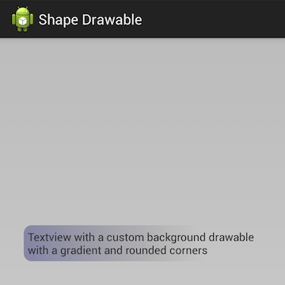
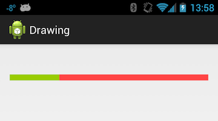

# Android Graphics and Animation

_Android provides a very rich and diverse framework for supporting 2D graphics and animations. This topic introduces these frameworks and discusses how to create custom graphics and animations for use in a Xamarin.Android application._

## Overview

Despite running on devices that are traditionally of limited power, the
highest rated mobile applications often have a sophisticated User
Experience (UX), complete with high quality graphics and animations
that provide an intuitive, responsive, dynamic feel. As mobile
applications get more and more sophisticated, users have begun to
expect more and more from applications.

Luckily for us, modern mobile platforms have very powerful frameworks
for creating sophisticated animations and custom graphics while
retaining ease of use. This enables developers to add rich
interactivity with very little effort.

UI API frameworks in Android can roughly be split into two categories:
Graphics and Animation.

Graphics are further split into different approaches for doing 2D and
3D graphics. 3D graphics are available via a number of built in
frameworks such as OpenGL ES (a mobile specific version of OpenGL), and
third-party frameworks such as MonoGame (a cross platform toolkit
compatible with the XNA toolkit). Although 3D graphics are not within
the scope of this article, we will examine the built-in 2D drawing
techniques.

Android provides two different API's for creating 2D graphics. One is a
high level declarative approach and the other a programmatic low-level
API:

- **Drawable Resources** &ndash; These are used to create custom graphics 
    either programmatically or (more typically) by embedding drawing 
    instructions in XML files. Drawable resources are typically defined 
    as XML files that contain instructions or actions for Android to 
    render a 2D graphic. 

- **Canvas** &ndash; this is a low level API that involves drawing 
    directly on an underlying bitmap. It provides very fine-grained 
    control over what is displayed. 

In addition to these 2D graphics techniques, Android also provides
several different ways to create animations:

- **Drawable Animations** &ndash; Android also supports
    frame-by-frame animations known as *Drawable Animation*. This is
    the simplest animation API. Android sequentially loads and displays
    Drawable resources in sequence (much like a cartoon).

- **View Animations** &ndash; *View Animations* are the original
    animation API's in Android and are available in all versions of
    Android. This API is limited in that it will only work with View
    objects and can only perform simple transformations on those Views.
    View animations are typically defined in XML files found in the
    `/Resources/anim` folder.

- **Property Animations** &ndash; Android 3.0 introduced a new set of
    animation API's known as *Property Animations*. These new API's
    introduced an extensible and flexible system that can be used to
    animate the properties of any object, not just View objects. This
    flexibility allows animations to be encapsulated in distinct
    classes that will make code sharing easier.

View Animations are more suitable for applications that must support
the older pre-Android 3.0 API's (API level 11). Otherwise applications
should use the newer Property Animation API's for the reasons that were
mentioned above.

All of these frameworks are viable options, however where possible,
preference should be given to Property Animations, as it is a more
flexible API to work with. Property Animations allow for animation
logic to be encapsulated in distinct classes that makes code sharing
easier and simplifies code maintenance.

## Accessibility

Graphics and animations help to make Android apps attractive and fun to
use; however, it is important to remember that some interactions occur
via screenreaders, alternate input devices, or with assisted zoom.
Also, some interactions may occur without audio capabilities.

Apps are more usable in these situations if they have been designed
with accessibility in mind: providing hints and navigation assistance
in the user-interface, and ensuring there is text-content or
descriptions for pictorial elements of the UI.

Refer to
[Google's Accessibility Guide](https://developer.android.com/guide/topics/ui/accessibility/) for
more information on how to utilize Android's accessibility APIs.

## 2D Graphics

Drawable Resources are a popular technique in Android applications. As
with other resources, Drawable Resources are declarative &ndash;
they're defined in XML files. This approach allows for a clean
separation of code from resources. This can simplify development and
maintenance because it is not necessary to change code to update or
change the graphics in an Android application. However, while Drawable
Resources are useful for many simple and common graphic requirements,
they lack the power and control of the Canvas API.

The other technique, using the
[Canvas](xref:Android.Graphics.Canvas) object, is very similar to
other traditional API frameworks such as System.Drawing or iOS's Core
Drawing. Using the Canvas object provides the most control of how 2D
graphics are created. It is appropriate for situations where a Drawable
Resource will not work or will be difficult to work with. For example,
it may be necessary to draw a custom slider control whose appearance
will change based on calculations related to the value of the slider.

Let's examine Drawable Resources first. They are simpler and cover the
most common custom drawing cases.

### Drawable Resources

Drawable Resources are defined in an XML file in the directory
`/Resources/drawable`. Unlike embedding PNG or JPEG's, it is not
necessary to provide density-specific versions of Drawable Resources.
At runtime, an Android application will load these resources and use
the instructions contained in these XML files to create 2D graphics.
Android defines several different types of Drawable Resources:

- [ShapeDrawable](https://developer.android.com/guide/topics/resources/drawable-resource.html#Shape)
    &ndash; This is a Drawable object that draws a primitive geometric shape
    and applies a limited set of graphical effects on that shape. They
    are very useful for things such as customizing Buttons or setting
    the background of TextViews. We will see an example of how to use a
    `ShapeDrawable` later in this article.

- [StateListDrawable](https://developer.android.com/guide/topics/resources/drawable-resource.html#StateList)
    &ndash; This is a Drawable Resource that will change appearance based on
    the state of a widget/control. For example, a button may change its
    appearance depending on whether it is pressed or not.

- [LayerDrawable](https://developer.android.com/guide/topics/resources/drawable-resource.html#LayerList)
    &ndash; This Drawable Resource that will stack several other drawables one
    on top of another. An example of a *LayerDrawable* is shown in the
    following screenshot:

    

- [TransitionDrawable](https://developer.android.com/guide/topics/resources/drawable-resource.html#Transition)
    &ndash; This is a *LayerDrawable* but with one difference. A
    *TransitionDrawable* is able to animate one layer showing up over
    top another.

- [LevelListDrawable](https://developer.android.com/guide/topics/resources/drawable-resource.html#LevelList)
    &ndash; This is very similar to a *StateListDrawable* in that it will
    display an image based on certain conditions. However, unlike a
    *StateListDrawable*, the *LevelListDrawable* displays an image
    based on an integer value. An example of a *LevelListDrawable*
    would be to display the strength of a WiFi signal. As the strength
    of the WiFi signal changes, the drawable that is displayed will
    change accordingly.

- [ScaleDrawable](https://developer.android.com/guide/topics/resources/drawable-resource.html#Scale)/[ClipDrawable](https://developer.android.com/guide/topics/resources/drawable-resource.html#Clip)
    &ndash; As their name implies, these Drawables provide both scaling and
    clipping functionality. The *ScaleDrawable* will scale another
    Drawable, while the *ClipDrawable* will clip another Drawable.

- [InsetDrawable](https://developer.android.com/guide/topics/resources/drawable-resource.html#Inset)
    &ndash; This Drawable will apply insets on the sides of another Drawable
    resource. It is used when a View needs a background that is smaller
    than the View's actual bounds.

- XML [BitmapDrawable](https://developer.android.com/guide/topics/resources/drawable-resource.html#Bitmap)
    &ndash; This file is a set of instructions, in XML, that are to be
    performed on an actual bitmap. Some actions that Android can
    perform are tiling, dithering, and anti-aliasing. One of the very
    common uses of this is to tile a bitmap across the background of a
    layout.

#### Drawable Example

Let's look at a quick example of how to create a 2D graphic using a
`ShapeDrawable`. A `ShapeDrawable` can define one of the four basic shapes:
rectangle, oval, line, and ring. It is also possible to apply basic
effects, such as gradient, colour, and size. The following XML is a
`ShapeDrawable` that may be found in the *AnimationsDemo* companion
project (in the file `Resources/drawable/shape_rounded_blue_rect.xml`).
It defines a rectangle with a purple gradient background and rounded
corners:

```xml
<?xml version="1.0" encoding="utf-8"?>
<shape xmlns:android="http://schemas.android.com/apk/res/android" android:shape="rectangle">
<!-- Specify a gradient for the background -->
<gradient android:angle="45"
          android:startColor="#55000066"
          android:centerColor="#00000000"
          android:endColor="#00000000"
          android:centerX="0.75" />

<padding android:left="5dp"
          android:right="5dp"
          android:top="5dp"
          android:bottom="5dp" />

<corners android:topLeftRadius="10dp"
          android:topRightRadius="10dp"
          android:bottomLeftRadius="10dp"
          android:bottomRightRadius="10dp" />
</shape>
```

We can reference this Drawable Resource declaratively in a Layout or
other Drawable as shown in the following XML:

```xml
<RelativeLayout xmlns:android="http://schemas.android.com/apk/res/android"
    android:layout_width="fill_parent"
    android:layout_height="fill_parent"
    android:background="#33000000">
    <TextView android:layout_width="wrap_content"
              android:layout_height="wrap_content"
              android:layout_centerInParent="true"
              android:background="@drawable/shape_rounded_blue_rect"
              android:text="@string/message_shapedrawable" />
</RelativeLayout>
```

Drawable Resources can also be applied programmatically. The following
code snippet shows how to programmatically set the background of a
TextView:

```csharp
TextView tv = FindViewById<TextView>(Resource.Id.shapeDrawableTextView);
tv.SetBackgroundResource(Resource.Drawable.shape_rounded_blue_rect);
```

To see what this would look like, run the *AnimationsDemo* project and
select the Shape Drawable item from the main menu. We should see
something similar to the following screenshot:

[](graphics-and-animation-images/image2.png#lightbox)

For more details about the XML elements and syntax of Drawable
Resources, consult
[Google's documentation](https://developer.android.com/guide/topics/resources/drawable-resource.html#Shape).

### Using the Canvas Drawing API

Drawables are powerful but have their limitations. Certain things are
either not possible or very complex (for example: applying a filter to
a picture that was taken by a camera on the device). It would be very
difficult to apply red-eye reduction by using a Drawable Resource.
Instead, the Canvas API allows an application to have very fine-grained
control to selectively change colors in a specific part of the picture.

One class that is commonly used with the Canvas is the
[Paint](xref:Android.Graphics.Paint) class. This class holds
colour and style information about how to draw. It is used to provide
things such a color and transparency.

The Canvas API uses the *painter's model* to draw 2D graphics.
Operations are applied in successive layers on top of each other. Each
operation will cover some area of the underlying bitmap. When the area
overlaps a previously painted area, the new paint will partially or
completely obscure the old. This is the same way that many other
drawing APIs such as System.Drawing and iOS's Core Graphics work.

There are two ways to obtain a `Canvas` object. The first way involves
defining a [Bitmap](xref:Android.Graphics.Bitmap) object, and then
instantiating a `Canvas` object with it. For example, the following
code snippet creates a new canvas with an underlying bitmap:

```csharp
Bitmap bitmap = Bitmap.CreateBitmap(100, 100, Bitmap.Config.Argb8888);
Canvas canvas = new Canvas(b);
```

The other way to obtain a `Canvas` object is by the
[OnDraw](xref:Android.Views.View.OnDraw*) callback method that
is provided the
[View](xref:Android.Views.View) base class. Android calls this
method when it decides a View needs to draw itself and passes in a
`Canvas` object for the View to work with.

The Canvas class exposes methods to programmatically provide the draw
instructions. For example:

- [Canvas.DrawPaint](xref:Android.Graphics.Canvas.DrawPaint*)
    &ndash; Fills the entire canvas's bitmap with the specified paint.

- [Canvas.DrawPath](xref:Android.Graphics.Canvas.DrawPath*)
    &ndash; Draws the specified geometric shape using the specified
    paint.

- [Canvas.DrawText](xref:Android.Graphics.Canvas.DrawText*)
    &ndash; Draws the text on the canvas with the specified colour. The
    text is drawn at location `x,y` .

#### Drawing with the Canvas API

Here's an example of the Canvas API in action. The following code
snippet shows how to draw a view:

```csharp
public class MyView : View
{
    protected override void OnDraw(Canvas canvas)
    {
        base.OnDraw(canvas);
        Paint green = new Paint {
            AntiAlias = true,
            Color = Color.Rgb(0x99, 0xcc, 0),
        };
        green.SetStyle(Paint.Style.FillAndStroke);

        Paint red = new Paint {
            AntiAlias = true,
            Color = Color.Rgb(0xff, 0x44, 0x44)
        };
        red.SetStyle(Paint.Style.FillAndStroke);

        float middle = canvas.Width * 0.25f;
        canvas.DrawPaint(red);
        canvas.DrawRect(0, 0, middle, canvas.Height, green);
    }
}
```

This code above first creates a red paint and a green paint object. It
fills the content of the canvas with red, and then instructs the canvas
to draw a green rectangle that is 25% of the width of the canvas. An
example of this can be seen by in `AnimationsDemo` project that is
included with the source code for this article. By starting up the
application and selecting the Drawing item from the main menu, we
should a screen similar to the following:

[](graphics-and-animation-images/image3.png#lightbox)

## Animation

Users like things that move in their applications. Animations are a
great way to improve the user experience of an application and help it
stand out. The best animations are the ones that users don't notice
because they feel natural. Android provides the following three API's
for animations:

- **View Animation** &ndash; This is the original API. These
    animations are tied to a specific View and can perform simple
    transformations on the contents of the View. Because of it's
    simplicity, this API still useful for things like alpha animations,
    rotations, and so forth.

- **Property Animation** &ndash; Property animations were introduced
    in Android 3.0. They enable an application to animate almost
    anything. Property animations can be used to change any property of
    any object, even if that object is not visible on the screen.

- **Drawable Animation** &ndash; This a special Drawable resource
    that is used to apply a very simple animation effect to layouts.

In general, property animation is the preferred system to use as it is
more flexible and offers more features.

### View Animations

View animations are limited to Views and can only perform animations on
values such as start and end points, size, rotation, and transparency.
These types of animations are typically referred to as *tween
animations*. View animations can be defined two ways &ndash;
programmatically in code or by using XML files. XML files are the
preferred way to declare view animations, as they are more readable and
easier to maintain.

The animation XML files will be stored in the `/Resources/anim`
directory of a Xamarin.Android project. This file must have one of the
following elements as the root element :

- `alpha` &ndash; A fade-in or fade-out animation.

- `rotate` &ndash; A rotation animation.

- `scale` &ndash; A resizing animation.

- `translate` &ndash; A horizontal and/or vertical motion.

- `set` &ndash; A container that may hold one or more of the other
    animation elements.

By default, all animations in an XML file will be applied
simultaneously. To make animations occur sequentially, set the
`android:startOffset` attribute on one of the elements defined above.

It is possible to affect the rate of change in an animation by using an
*interpolator*. An interpolator makes it possible for animation effects
to be accelerated, repeated, or decelerated. The Android framework
provides several interpolators out of the box, such as (but not limited
to):

- `AccelerateInterpolator` / `DecelerateInterpolator` &ndash; these
    interpolators increase or decrease the rate of change in an
    animation.

- `BounceInterpolator` &ndash; the change bounces at the end.

- `LinearInterpolator` &ndash; the rate of changes is constant.

The following XML shows an example of an animation file that combines
some of these elements:

```xml
<?xml version="1.0" encoding="utf-8"?>
<set xmlns:android=http://schemas.android.com/apk/res/android
     android:shareInterpolator="false">

    <scale android:interpolator="@android:anim/accelerate_decelerate_interpolator"
           android:fromXScale="1.0"
           android:toXScale="1.4"
           android:fromYScale="1.0"
           android:toYScale="0.6"
           android:pivotX="50%"
           android:pivotY="50%"
           android:fillEnabled="true"
           android:fillAfter="false"
           android:duration="700" />

    <set android:interpolator="@android:anim/accelerate_interpolator">
        <scale android:fromXScale="1.4"
               android:toXScale="0.0"
               android:fromYScale="0.6"
               android:toYScale="0.0"
               android:pivotX="50%"
               android:pivotY="50%"
               android:fillEnabled="true"
               android:fillBefore="false"
               android:fillAfter="true"
               android:startOffset="700"
               android:duration="400" />

        <rotate android:fromDegrees="0"
                android:toDegrees="-45"
                android:toYScale="0.0"
                android:pivotX="50%"
                android:pivotY="50%"
                android:fillEnabled="true"
                android:fillBefore="false"
                android:fillAfter="true"
                android:startOffset="700"
                android:duration="400" />
    </set>
</set>
```

This animation will perform all of the animations simultaneously. The
first scale animation will stretch the image horizontally and shrink it
vertically, and then the image will simultaneously be rotated 45
degrees counter-clockwise and shrink, disappearing from the screen.

The animation can be programmatically applied to a View by inflating
the animation and then applying it to a View. Android provides the
helper class `Android.Views.Animations.AnimationUtils` that will
inflate an animation resource and return an instance of
`Android.Views.Animations.Animation`. This object is applied to a View
by calling `StartAnimation` and passing the `Animation` object. The
following code snippet shows an example of this:

```csharp
Animation myAnimation = AnimationUtils.LoadAnimation(Resource.Animation.MyAnimation);
ImageView myImage = FindViewById<ImageView>(Resource.Id.imageView1);
myImage.StartAnimation(myAnimation);
```

Now that we have a fundamental understanding of how View Animations
work, lets move to Property Animations.

### Property Animations

Property animators are a new API that was introduced in Android 3.0.
They provide a more extensible API that can be used to animate any
property on any object.

All property animations are created by instances of the 
[Animator](xref:Android.Animation.Animator)
subclass. Applications do not directly use this class, instead they use
one of it's subclasses:

- [ValueAnimator](xref:Android.Animation.ValueAnimator) &ndash;
    This class is the most important class in the entire property
    animation API. It calculates the values of properties that need to
    be changed. The `ViewAnimator` does not directly update those
    values; instead, it raises events that can be used to update
    animated objects.

- [ObjectAnimator](xref:Android.Animation.ObjectAnimator)
    &ndash; This class is a subclass of `ValueAnimator` . It is meant
    to simplify the process of animating objects by accepting a target
    object and property to update.

- [AnimationSet](xref:Android.Animation.AnimatorSet)
    &ndash; This class is responsible for orchestrating how animations
    run in relation to one another. Animations may run simultaneously,
    sequentially, or with a specified delay between them.

*Evaluators* are special classes that are used by animators to
calculate the new values during an animation. Out of the box, Android
provides the following evaluators:

- [IntEvaluator](xref:Android.Animation.IntEvaluator)
     &ndash; Calculates values for integer properties.

- [FloatEvaluator](xref:Android.Animation.FloatEvaluator)
     &ndash; Calculates values for float properties.

- [ArgbEvaluator](xref:Android.Animation.ArgbEvaluator)
    &ndash; Calculates values for colour properties.

If the property that is being animated is not a `float`, `int` or
colour, applications may create their own evaluator by implementing the
`ITypeEvaluator` interface. (Implementing custom evaluators is beyond
the scope of this topic.)

#### Using the ValueAnimator

There are two parts to any animation: calculating animated values and
then setting those values on properties on some object. 
[ValueAnimator](xref:Android.Animation.ValueAnimator)
will only calculate the values, but it will not operate on objects
directly. Instead, objects will be updated inside event handlers that
will be invoked during the animation lifespan. This design allows
several properties to be updated from one animated value.

You obtain an instance of `ValueAnimator` by calling one of the
following factory methods:

- `ValueAnimator.OfInt`
- `ValueAnimator.OfFloat`
- `ValueAnimator.OfObject`

Once that is done, the `ValueAnimator` instance must have its duration
set, and then it can be started. The following example shows how to
animate a value from 0 to 1 over the span of 1000 milliseconds:

```csharp
ValueAnimator animator = ValueAnimator.OfInt(0, 100);
animator.SetDuration(1000);
animator.Start();
```

But itself, the code snippet above is not very useful &ndash; the
animator will run but there is no target for the updated value. The
`Animator` class will raise the Update event when it decides that it is
necessary to inform listeners of a new value. Applications may provide
an event handler to respond to this event as shown in the following
code snippet:

```csharp
MyCustomObject myObj = new MyCustomObject();
myObj.SomeIntegerValue = -1;

animator.Update += (object sender, ValueAnimator.AnimatorUpdateEventArgs e) =>
{
    int newValue = (int) e.Animation.AnimatedValue;
    // Apply this new value to the object being animated.
    myObj.SomeIntegerValue = newValue;
};
```

Now that we have an understanding of `ValueAnimator`, lets learn more
about the `ObjectAnimator`.

#### Using the ObjectAnimator

[ObjectAnimator](xref:Android.Animation.ObjectAnimator) is a
subclass of `ViewAnimator` that combines the timing engine and value
computation of the `ValueAnimator` with the logic required to wire up
event handlers. The `ValueAnimator` requires applications to explicitly
wire up an event handler &ndash; `ObjectAnimator` will take care of
this step for us.

The API for `ObjectAnimator` is very similar to the API for
`ViewAnimator`, but requires that you provide the object and the name
of the property to update. The following example shows an example 
of using `ObjectAnimator`:

```csharp
MyCustomObject myObj = new MyCustomObject();
myObj.SomeIntegerValue = -1;

ObjectAnimator animator = ObjectAnimator.OfFloat(myObj, "SomeIntegerValue", 0, 100);
animator.SetDuration(1000);
animator.Start();
```

As you can see from the previous code snippet, `ObjectAnimator` can
reduce and simplify the code that is necessary to animate an object.

### Drawable Animations

The final animation API is the Drawable Animation API. Drawable
animations load a series of Drawable resources one after the other and
display them sequentially, similar to a flip-it cartoon.

Drawable resources are defined in an XML file that has an
`<animation-list>` element as the root element and a series of `<item>`
elements that define each frame in the animation. This XML file is
stored in the `/Resource/drawable` folder of the application. The
following XML is an example of a drawable animation:

```xml
<animation-list xmlns:android="http://schemas.android.com/apk/res/android">
  <item android:drawable="@drawable/asteroid01" android:duration="100" />
  <item android:drawable="@drawable/asteroid02" android:duration="100" />
  <item android:drawable="@drawable/asteroid03" android:duration="100" />
  <item android:drawable="@drawable/asteroid04" android:duration="100" />
  <item android:drawable="@drawable/asteroid05" android:duration="100" />
  <item android:drawable="@drawable/asteroid06" android:duration="100" />
</animation-list>
```

This animation will run through six frames. The `android:duration`
attribute declares how long each frame will be displayed. The next code
snippet shows an example of creating a Drawable animation and starting
it when the user clicks a button on the screen:

```csharp
AnimationDrawable _asteroidDrawable;

protected override void OnCreate(Bundle bundle)
{
    base.OnCreate(bundle);
    SetContentView(Resource.Layout.Main);

    _asteroidDrawable = (Android.Graphics.Drawables.AnimationDrawable)
    Resources.GetDrawable(Resource.Drawable.spinning_asteroid);

    ImageView asteroidImage = FindViewById<ImageView>(Resource.Id.imageView2);
    asteroidImage.SetImageDrawable((Android.Graphics.Drawables.Drawable) _asteroidDrawable);

    Button asteroidButton = FindViewById<Button>(Resource.Id.spinAsteroid);
    asteroidButton.Click += (sender, e) =>
    {
        _asteroidDrawable.Start();
    };
}
```

At this point we have covered the foundations of the animation APIs
available in an Android application.

## Summary

This article introduced a lot of new concepts and API's to help add
some graphics to an Android application. First it discussed the various
2D graphics API's and demonstrated how Android allows applications to
draw directly to the screen using a Canvas object. We also saw some
alternate techniques that allow graphics to be declaratively 
created using XML files. Then we went on to discuss the old and new 
API's for creating animations in Android.

## Related Links

- [Animation Demo (sample)](/samples/xamarin/monodroid-samples/animationdemo)
- [Animation and Graphics](https://developer.android.com/guide/topics/graphics/index.html)
- [Using Animations to Bring your Mobile Apps to Life](https://youtu.be/ikSk_ILg3d0)
- [AnimationDrawable](xref:Android.Graphics.Drawables.AnimationDrawable)
- [Canvas](xref:Android.Graphics.Canvas)
- [Object Animator](xref:Android.Animation.ObjectAnimator)
- [Value Animator](xref:Android.Animation.ValueAnimator)