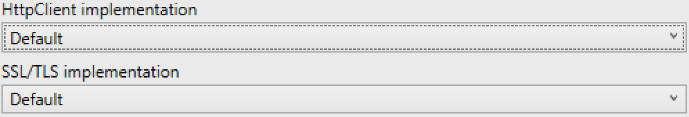
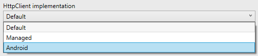
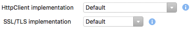
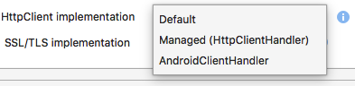
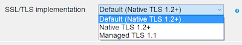
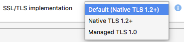
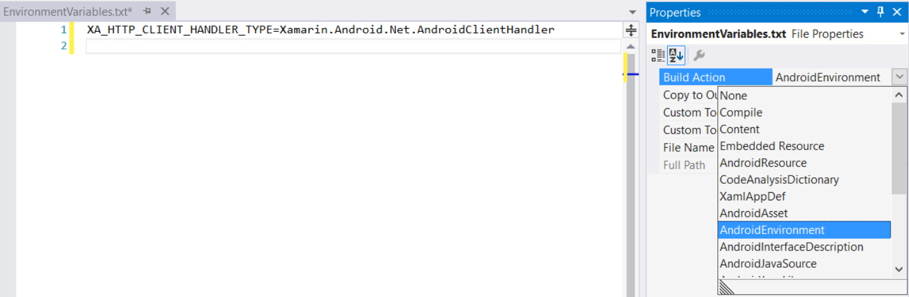
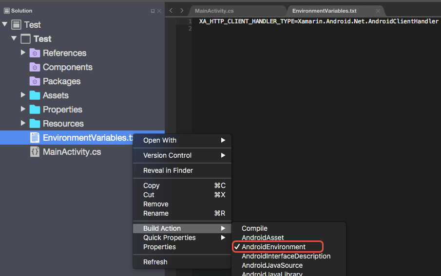

# HttpClient Stack and SSL/TLS Implementation Selector for Android

_The HttpClient Stack and SSL/TLS Implementation selectors determine the HttpClient and SSL/TLS implementation that will be used by your Xamarin.Android apps._

## Overview

Xamarin.Android provides two combo boxes that will control the TLS
settings for an Android app. One combo box will identify which
`HttpMessageHandler` will use when instantiating an `HttpClient`
object, while the other identifies which TLS implementation will be
used by web requests.

> [!NOTE]
> Projects must reference the **System.Net.Http** assembly.

# [Visual Studio](#tab/vswin)

The settings for the HttpClient stack are found in the Project Options
for a Xamarin.Android project. Click on the **Android Options** tab,
and then click on the **Advanced Options** button. This will display
the **Advanced Android Options** dialog which has two combo boxes, one
for the HttpClient implementation and one for the SSL/TLS
implementation:


[](http-stack-images/tls07-vs.png#lightbox)

## HttpClient Stack Selector

This project option controls which `HttpMessageHandler` implementation
will be used each time an `HttpClient` object is instantiated. By
default, this is the managed `HttpClientHandler`.

[](http-stack-images/tls04-vs.png#lightbox) 


# [Visual Studio for Mac](#tab/vsmac)

The settings for the HttpClient stack are found in the Project Options
for a Xamarin.Android Project. Click on the **Build > Android Build**
settings and click on the **General** tab:

[](http-stack-images/tls07-xs.png#lightbox)

## HttpClient Stack Selector

This project option controls which `HttpMessageHandler` implementation
will be used each time an `HttpClient` object is instantiated. By
default, this is the managed `HttpClientHandler`.



-----

### Managed (HttpClientHandler)

Managed handler is the fully managed HttpClient handler that has been
shipped with previous Xamarin.Android versions.

#### Pros:

- It is the most compatible (features) with MS .NET and older Xamarin versions.

#### Cons:

- It is not fully integrated with the OS (eg. limited to TLS 1.0).
- It is usually much slower (eg. encryption) than native API.
- It requires more managed code, creating larger applications.

### AndroidClientHandler

AndroidClientHandler is the new handler that delegates to native
Java/OS code instead of implementing everything in managed code.

#### Pros:

- Use native API for better performance and smaller executable size.
- Support for the latest standards, eg. TLS 1.2.

#### Cons:

- Requires Android 5.0 or later.
- Some HttpClient features/options are not available.

### Choosing a Handler

The choice between `AndroidClientHandler` and `HttpClientHandler`
depends upon the needs of your application. `AndroidClientHandler` is a
good choice if all of the following apply:

-   You require TLS 1.2+ support.
-   Your app is targeting Android 5.0 (API 21) or later.
-   You need TLS 1.2+ support for `HttpClient`.
-   You don't need TLS 1.2+ support for `WebClient`.

`HttpClientHandler` is a good choice if you need TLS 1.2+ support but
must support versions of Android earlier than Android 5.0. It is also a
good choice if you need TLS 1.2+ support for `WebClient`.

Beginning with Xamarin.Android 8.3, `HttpClientHandler` defaults to
Boring SSL (`btls`) as the underlying TLS provider. The Boring SSL
TLS provider offers the following advantages:

-   It supports TLS 1.2.
-   It supports all Android versions.
-   It provides TLS 1.2 support for both `HttpClient` and `WebClient`.

The disadvantage of using Boring SSL as the underling TLS provider is
that it can increase the size of the resulting APK (it adds about 1MB
of additional APK size per supported ABI).

Beginning with Xamarin.Android 8.3, the default TLS provider is Boring
SSL (`btls`). If you do not want to use Boring SSL, you can revert to
the historical managed SSL implementation by setting the
`$(AndroidTlsProvider)` property to `legacy` (for more information
about setting build properties, see
[Build Process](~/android/deploy-test/building-apps/build-process.md)).


### Programatically Using `AndroidClientHandler`

The `Xamarin.Android.Net.AndroidClientHandler` is an
`HttpMessageHandler` implementation specifically for Xamarin.Android.
Instances of this class will use the native `java.net.URLConnection`
implementation for all HTTP connections. This will theoretically
provide an increase in HTTP performance and smaller APK sizes.

This code snippet is an example of how to explicitly for a single
instance of the `HttpClient` class:

```csharp
// Android 5.0 or higher, Xamarin.Android 6.1 or higher
HttpClient client = new HttpClient(new Xamarin.Android.Net.AndroidClientHandler ());
```

> [!NOTE]
> The underlying Android device must support TLS 1.2 (ie. Android 5.0 and later)


## SSL/TLS implementation build option

This project option controls what underlying TLS library will be used
by all web request, both `HttpClient` and `WebRequest`. By default, TLS
1.2 is selected:

# [Visual Studio](#tab/vswin)

[](http-stack-images/tls05-vs.png#lightbox)

# [Visual Studio for Mac](#tab/vsmac)

[](http-stack-images/tls05-xs.png#lightbox)

-----

For example:

```csharp
var client = new HttpClient();
```

If the HttpClient implementation was set to **Managed** and the TLS
implementation was set to **Native TLS 1.2+**, then the `client` object
would automatically use the managed `HttpClientHandler` and TLS 1.2
(provided by the BoringSSL library) for its HTTP requests.

However, if the **HttpClient implementation** is set to
`AndroidHttpClient`, then all `HttpClient` objects will use the
underlying Java class `java.net.URLConnection` and will be unaffected
by the **TLS/SSL implementation** value. `WebRequest` objects would use
the BoringSSL library.

## Other ways to control SSL/TLS configuration

There are three ways that a Xamarin.Android application can control the TLS settings:

1. Select the HttpClient implmentation and default TLS library in the Project Options.
2. Programatically using `Xamarin.Android.Net.AndroidClientHandler`.
3. Declare environment variables (optional).

Of the three choices, the recommended approach is to use the
Xamarin.Android project options to declare the default
`HttpMessageHandler` and TLS for the entire app. Then, if necessary,
programmatically instantiate `Xamarin.Android.Net.AndroidClientHandler`
objects. These options are described above.

The third option &ndash; using environment variables &ndash; is explained below.

### Declare Environment Variables

There are two environment variables that are related to the use of TLS in Xamarin.Android:

-   `XA_HTTP_CLIENT_HANDLER_TYPE` &ndash; This environment variable
    declares the default `HttpMessageHandler` that the application will
    use. For example:

    ```csharp
    XA_HTTP_CLIENT_HANDLER_TYPE=Xamarin.Android.Net.AndroidClientHandler
    ```

-   `XA_TLS_PROVIDER` &ndash; This environment variable will declare
    which TLS library will be used, either `btls`, `legacy`, or
    `default` (which is the same as omitting this variable):

    ```csharp
    XA_TLS_PROVIDER=btls
    ```

This environment variable is set by adding an _environment file_ to the
project. An environment file is a Unix-formatted plain-text file with a
build action of **AndroidEnvironment**:

# [Visual Studio](#tab/vswin)



# [Visual Studio for Mac](#tab/vsmac)



-----

Please see the [Xamarin.Android Environment](~/android/deploy-test/environment.md) guide for more details about environment variables and Xamarin.Android.


## Related Links

- [Transport Layer Security (TLS)](~/cross-platform/app-fundamentals/transport-layer-security.md)
