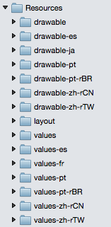
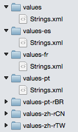
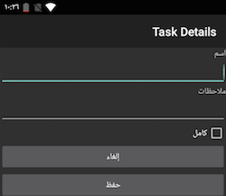
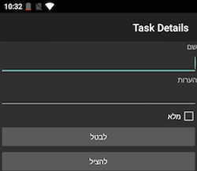

# Android Localization

_This document introduces the localization features of the Android SDK and how to access them with Xamarin._

## Android Platform Features

This section describes the main localization features of Android. Skip to the
[next section](#basics) to see specific code and examples.

### Locale

Users choose their language in **Settings > Language & input**. This
selection controls both the language displayed and regional settings
used (eg. for date and number formatting).

The current locale can be queried via the current context's `Resources`:

```csharp
var lang = Resources.Configuration.Locale; // eg. "es_ES"
```

This value will be a locale identifier that contains both a language
code and a locale code, separated by an underscore. For reference, here is a [list of Java locales](https://www.oracle.com/technetwork/java/javase/locales-137662.html) and
[Android-supported locales via StackOverflow](https://stackoverflow.com/questions/7973023/what-is-the-list-of-supported-languages-locales-on-android).

Common examples include:

- `en_US` for English (United States)
- `es_ES` for Spanish (Spain)
- `ja_JP` for Japanese (Japan)
- `zh_CN` for Chinese (China)
- `zh_TW` for Chinese (Taiwan)
- `pt_PT` for Portuguese (Portugal)
- `pt_BR` for Portuguese (Brazil)

### LOCALE_CHANGED

Android generates `android.intent.action.LOCALE_CHANGED` when the user
changes their language selection.

Activities can opt to handle this by setting the `android:configChanges`
attribute on the activity, like this:

```csharp
[Activity (Label = "@string/app_name", MainLauncher = true, Icon="@drawable/launcher",
    ConfigurationChanges = ConfigChanges.Locale | ConfigChanges.ScreenSize | ConfigChanges.Orientation)]
```

<a name="basics"></a>

## Internationalization Basics in Android

Android's localization strategy has the following key parts:

- Resource folders to contain localized strings, images, and other
  resources.

- `GetText` method, which is used to retrieve localized strings in code

- `@string/id` in AXML files, to automatically place localized strings
  in layouts.

### Resource Folders

Android applications manage most content in resource folders, such as:

- **layout** - contains AXML layout files.
- **drawable** - contains images and other drawable resources.
- **values** - contains strings.
- **raw** - contains data files.

Most developers are already familiar with the use of **dpi** suffixes
on the **drawable** directory to provide multiple versions of an image,
letting Android choose the correct version for each device. The same
mechanism is used to provide multiple language translations by
suffixing resource directories with language and culture identifiers.



> [!NOTE]
> When specifying a top-level language like `es` only
two characters are required; however when specifying a full locale, the
directory name format requires a dash and lowercase **r** to separate
the two parts, for example **pt-rBR** or **zh-rCN**. Compare this to
the value returned in code, which has an underscore (eg. `pt_BR`). Both
of these are different to the value .NET `CultureInfo` class uses,
which has a dash only (eg. `pt-BR`). Keep these differences in mind
when working across Xamarin platforms.

#### Strings.xml file format

A localized **values** directory (eg. **values-es** or **values-pt-rBR**) should
contain a file called **Strings.xml**
that will contain the translated text for that locale.

Each translatable string is an XML element with the resource ID specified
as the `name` attribute and the translated string as the value:

```xml
<string name="app_name">TaskyL10n</string>
```

You need to escape according to normal XML rules, and the `name`
must be a valid Android resource ID (no spaces or dashes). Here is
an example of the default (English) strings file for the example:

**values/Strings.xml**

```xml
<resources>
    <string name="app_name">TaskyL10n</string>
    <string name="taskadd">Add Task</string>
    <string name="taskname">Name</string>
    <string name="tasknotes">Notes</string>
    <string name="taskdone">Done</string>
    <string name="taskcancel">Cancel</string>
</resources>
```

The Spanish directory **values-es** contains a file with the same
name (**Strings.xml**) that contains the translations:

**values-es/Strings.xml**

```xml
<?xml version="1.0" encoding="utf-8"?>
<resources>
    <string name="app_name">TaskyLeon</string>
    <string name="taskadd">agregar tarea</string>
    <string name="taskname">Nombre</string>
    <string name="tasknotes">Notas</string>
    <string name="taskdone">Completo</string>
    <string name="taskcancel">Cancelar</string>
</resources>
```



With the strings files set-up, the translated values can be referenced
in both layouts and code.

### AXML Layout Files

To reference localized strings in layout files, use the `@string/id` syntax. This
XML snippet from the sample shows `text` properties being set with localized
resource IDs (some other attributes have been omitted):

```xml
<TextView
    android:id="@+id/NameLabel"
    android:text="@string/taskname"
    ... />
<CheckBox
    android:id="@+id/chkDone"
    android:text="@string/taskdone"
    ... />
```

### GetText Method

To retrieve translated strings in code, use the `GetText` method and
pass the resource ID:

```csharp
var cancelText = Resources.GetText (Resource.String.taskcancel);
```

#### Quantity Strings

Android string resources also let you create *quantity strings* which
allow translators to provide different translations for different quantities, such as:

- "There is 1 task left."
- "There are 2 tasks still to do."

(rather than a generic "There are n task(s) left").

In the **Strings.xml**

```xml
<plurals name="numberOfTasks">
   <!--
      As a developer, you should always supply "one" and "other"
      strings. Your translators will know which strings are actually
      needed for their language.
    -->
   <item quantity="one">There is %d task left.</item>
   <item quantity="other">There are %d tasks still to do.</item>
 </plurals>
```

To render the complete string use the `GetQuantityString` method, passing the
resource ID and the value to be displayed (which is passed twice). The
second parameter is used by Android to determine *which* `quantity` string to use,
the third parameter is the value actually substituted into the string (both
are required).

```csharp
var translated = Resources.GetQuantityString (
                    Resource.Plurals.numberOfTasks, taskcount, taskcount);`
```

Valid `quantity` switches are:

- zero
- one
- two
- few
- many
- other

They're described in more detail in the [Android docs](https://developer.android.com/guide/topics/resources/string-resource.html#Plurals).
If a given language does not require 'special' handling, those `quantity` strings
will be ignored (for example, English only uses `one` and `other`; specifying a `zero`
string will have no effect, it will not be used).

### Images

Localized images follow the same rules as strings files: all images referenced
in the application should be placed in **drawable** directories so there is a fallback.

Locale-specific images should then be placed in qualified drawable folders
such as **drawable-es** or **drawable-ja** (dpi specifiers can also be added).

In this screenshot, four images are saved in the **drawable** directory, but only
one, **flag.png**, has localized copies in other directories.


#### Other Resource Types

You can also provide other types of alternative, language-specific
resources including layouts, animations, and raw files. This means you
could provide a specific screen layout for one or more of your target
languages, for example you could create a layout specifically for
German that allows for very long text labels.

Android 4.2 introduced support for
[right to left (RTL) languages](https://android-developers.blogspot.fr/2013/03/native-rtl-support-in-android-42.html)
if you set the application setting `android:supportsRtl="true"`. The
resource qualifier `"ldrtl"` can be included in a directory name to
contain custom layouts that are designed for RTL display.

For more information on resource directory naming and fallback, refer
to the Android docs for
[providing alternative resources](https://developer.android.com/guide/topics/resources/providing-resources.html#AlternativeResources).

### App name

The application name is easy to localize by using a `@string/id` in for the
`MainLauncher` activity:

```csharp
[Activity (Label = "@string/app_name", MainLauncher = true, Icon="@drawable/launcher",
    ConfigurationChanges =  ConfigChanges.Orientation | ConfigChanges.Locale)]
```

### Right-to-Left (RTL) Languages

Android 4.2 and newer provides full support for RTL layouts, described
in detail in the
[Native RTL Support blog](https://android-developers.blogspot.dk/2013/03/native-rtl-support-in-android-42.html).

When using Android 4.2 (API level 17) and newer, alignment values can be
specified with `start` and `end` instead of `left` and `right` (for
example `android:paddingStart`). There are also new APIs like
`LayoutDirection`, `TextDirection`, and `TextAlignment` to help build
screens that adapt for RTL readers.

The following screenshot shows the [localized **Tasky** sample](https://github.com/conceptdev/xamarin-samples/tree/master/TaskyL10n) in Arabic:

[](localization-images/rtl-ar.png#lightbox) 

The next screenshot shows the [localized **Tasky** sample](https://github.com/conceptdev/xamarin-samples/tree/master/TaskyL10n) in Hebrew:

[](localization-images/rtl-he.png#lightbox)

RTL text is localized using **Strings.xml** files in the same way as
LTR text.

## Testing

Make sure to thoroughly test the default locale. Your application will
crash if the default resources cannot be loaded for some reason (i.e.
they are missing).

### Emulator Testing

Refer to Google's
[Testing on an Android Emulator](https://developer.android.com/guide/topics/resources/localization.html#testing)
section for instructions on how to set an emulator to a specific 
locale using the ADB shell.

```shell
adb shell setprop persist.sys.locale fr-CA;stop;sleep 5;start
```

### Device Testing

To test on a device, change the language in the **Settings** app.

> [!TIP]
> Make a note of the icons and location of the menu items so
> that you can revert the language to the original setting.

## Summary

This article covers the basics of localizing Android applications using
the built-in resource handling. You can learn more about i18n and L10n
for iOS, Android and cross-platform (including Xamarin.Forms) apps in
[this cross-platform guide](~/cross-platform/app-fundamentals/localization.md).

## Related Links

- [Tasky (localized in code) (sample)](https://github.com/conceptdev/xamarin-samples/tree/master/TaskyL10n)
- [Android Localizing with Resources](https://developer.android.com/guide/topics/resources/localization.html)
- [Cross-Platform Localization Overview](~/cross-platform/app-fundamentals/localization.md)
- [Xamarin.Forms Localization](~/xamarin-forms/app-fundamentals/localization/index.md)
- [iOS Localization](~/ios/app-fundamentals/localization/index.md)
