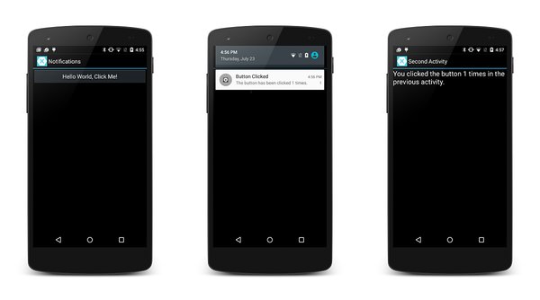
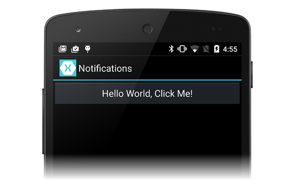
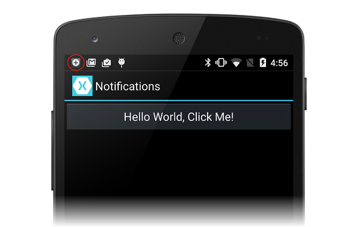
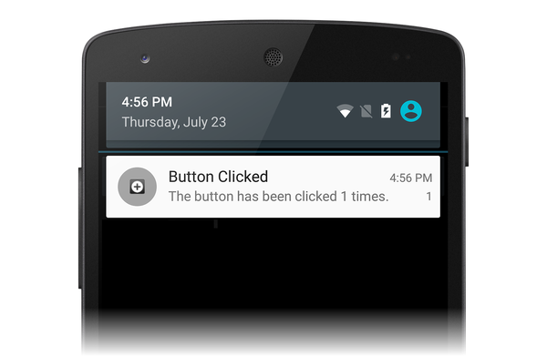
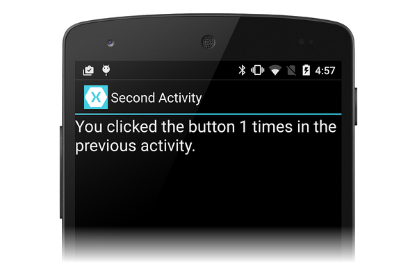

# Walkthrough - Using local notifications in Xamarin.Android

_This walkthrough demonstrates how to use local notifications in Xamarin.Android applications. It demonstrates the basics of creating and publishing a local notification. When the user clicks the notification in the notification area, it starts up a second Activity._

## Overview

In this walkthrough, we will create an Android application that raises
a notification when the user clicks a button in an Activity. When the
user clicks the notification, it launches a second Activity that
displays the number of times the user had clicked the button in the
first Activity.

The following screenshots illustrate some examples of this application:

[](local-notifications-walkthrough-images/1-overview.png#lightbox)

> [!NOTE]
> This guide focuses on the [NotificationCompat APIs](https://developer.android.com/reference/android/support/v4/app/NotificationCompat.html) from the [Android support library](https://www.nuget.org/packages/Xamarin.Android.Support.v4/). These APIs will ensure maximum backwards compatibility to Android 4.0 (API level 14).

## Creating the project

To begin, let's create a new Android project using the **Android App**
template. Let's call this project **LocalNotifications**. (If you are
not familiar with creating Xamarin.Android projects, see
[Hello, Android](~/android/get-started/hello-android/hello-android-quickstart.md).)

Edit the resource file **values/Strings.xml** so that it contains two extra string resources that will be used when it is time to create the notification channel:

```xml
<?xml version="1.0" encoding="utf-8"?>

<resources>
  <string name="Hello">Hello World, Click Me!</string>
  <string name="ApplicationName">Notifications</string>

  <string name="channel_name">Local Notifications</string>
  <string name="channel_description">The count from MainActivity.</string>
</resources>
```

### Add the Android.Support.V4 NuGet package

In this walkthrough, we are using `NotificationCompat.Builder` to build
our local notification. As explained in
[Local Notifications](~/android/app-fundamentals/notifications/local-notifications.md),
we must include the
[Android Support Library v4](https://www.nuget.org/packages/Xamarin.Android.Support.v4/)
NuGet in our project to use `NotificationCompat.Builder`.

Next, let's edit **MainActivity.cs** and add the following `using`
statement so that the types in `Android.Support.V4.App` are available
to our code:

```csharp
using Android.Support.V4.App;
```

Also, we must make it clear to the compiler that we are using the
`Android.Support.V4.App` version of `TaskStackBuilder` rather than the
`Android.App` version. Add the following `using` statement to resolve
any ambiguity:

```csharp
using TaskStackBuilder = Android.Support.V4.App.TaskStackBuilder;
```

### Create the notification channel

Next, add a method to `MainActivity` that will create a notification channel (if necessary):

```csharp
void CreateNotificationChannel()
{
    if (Build.VERSION.SdkInt < BuildVersionCodes.O)
    {
        // Notification channels are new in API 26 (and not a part of the
        // support library). There is no need to create a notification
        // channel on older versions of Android.
        return;
    }

    var name = Resources.GetString(Resource.String.channel_name);
    var description = GetString(Resource.String.channel_description);
    var channel = new NotificationChannel(CHANNEL_ID, name, NotificationImportance.Default)
                  {
                      Description = description
                  };

    var notificationManager = (NotificationManager) GetSystemService(NotificationService);
    notificationManager.CreateNotificationChannel(channel);
}
```

Update the `OnCreate` method to call this new method:

```csharp
protected override void OnCreate(Bundle bundle)
{
    base.OnCreate(bundle);
    SetContentView(Resource.Layout.Main);

    CreateNotificationChannel();
}
```

### Define the notification ID

We will need a unique ID for our notification and notification channel. Let's edit
**MainActivity.cs** and add the following static instance variable to
the `MainActivity` class:

```csharp
static readonly int NOTIFICATION_ID = 1000;
static readonly string CHANNEL_ID = "location_notification";
internal static readonly string COUNT_KEY = "count";
```

### Add code to generate the notification

Next, we need to create a new event handler for the button `Click`
event. Add the following method to `MainActivity`:

```csharp
void ButtonOnClick(object sender, EventArgs eventArgs)
{
    // Pass the current button press count value to the next activity:
    var valuesForActivity = new Bundle();
    valuesForActivity.PutInt(COUNT_KEY, count);

    // When the user clicks the notification, SecondActivity will start up.
    var resultIntent = new Intent(this, typeof(SecondActivity));

    // Pass some values to SecondActivity:
    resultIntent.PutExtras(valuesForActivity);

    // Construct a back stack for cross-task navigation:
    var stackBuilder = TaskStackBuilder.Create(this);
    stackBuilder.AddParentStack(Class.FromType(typeof(SecondActivity)));
    stackBuilder.AddNextIntent(resultIntent);

    // Create the PendingIntent with the back stack:
    var resultPendingIntent = stackBuilder.GetPendingIntent(0, (int) PendingIntentFlags.UpdateCurrent);

    // Build the notification:
    var builder = new NotificationCompat.Builder(this, CHANNEL_ID)
                  .SetAutoCancel(true) // Dismiss the notification from the notification area when the user clicks on it
                  .SetContentIntent(resultPendingIntent) // Start up this activity when the user clicks the intent.
                  .SetContentTitle("Button Clicked") // Set the title
                  .SetNumber(count) // Display the count in the Content Info
                  .SetSmallIcon(Resource.Drawable.ic_stat_button_click) // This is the icon to display
                  .SetContentText($"The button has been clicked {count} times."); // the message to display.

    // Finally, publish the notification:
    var notificationManager = NotificationManagerCompat.From(this);
    notificationManager.Notify(NOTIFICATION_ID, builder.Build());

    // Increment the button press count:
    count++;
}
```

The `OnCreate` method of MainActivity must make the call to create the notification channel and assign the `ButtonOnClick` method to the
`Click` event of the button (replace the delegate event handler
provided by the template):

```csharp
protected override void OnCreate(Bundle bundle)
{
    base.OnCreate(bundle);
    SetContentView(Resource.Layout.Main);

    CreateNotificationChannel();

    // Display the "Hello World, Click Me!" button and register its event handler:
    var button = FindViewById<Button>(Resource.Id.MyButton);
    button.Click += ButtonOnClick;
}
```

### Create a second activity

Now we need to create another activity that Android will display when
the user clicks our notification. Add another Android Activity to your
project called **SecondActivity**. Open **SecondActivity.cs** and
replace its contents with this code:

```csharp
using System;
using Android.App;
using Android.OS;
using Android.Widget;

namespace LocalNotifications
{
    [Activity(Label = "Second Activity")]
    public class SecondActivity : Activity
    {
        protected override void OnCreate(Bundle bundle)
        {
            base.OnCreate(bundle);

            // Get the count value passed to us from MainActivity:
            var count = Intent.Extras.GetInt(MainActivity.COUNT_KEY, -1);

            // No count was passed? Then just return.
            if (count <= 0)
            {
                return;
            }

            // Display the count sent from the first activity:
            SetContentView(Resource.Layout.Second);
            var txtView = FindViewById<TextView>(Resource.Id.textView1);
            txtView.Text = $"You clicked the button {count} times in the previous activity.";
        }
    }
}
```

We must also create a resource layout for **SecondActivity**. Add a new
**Android Layout** file to your project called **Second.axml**. Edit
**Second.axml** and paste in the following layout code:

```xml
<?xml version="1.0" encoding="utf-8"?>
<LinearLayout xmlns:android="http://schemas.android.com/apk/res/android"
    android:orientation="vertical"
    android:layout_width="fill_parent"
    android:layout_height="fill_parent"
    android:minWidth="25px"
    android:minHeight="25px">
    <TextView
        android:text=""
        android:textAppearance="?android:attr/textAppearanceLarge"
        android:layout_width="fill_parent"
        android:layout_height="wrap_content"
        android:id="@+id/textView1" />
</LinearLayout>
```

### Add a notification icon

Finally, add a small icon that will appear in the notification area
when the notification is launched. You can copy
[this icon](local-notifications-walkthrough-images/ic-stat-button-click.png)
to your project or create your own custom icon. Name the icon file
**ic\_stat\_button\_click.png** and copy it to the
**Resources/drawable** folder. Remember to use **Add > Existing Item
...** to include this icon file in your project.

### Run the application

Build and run the application. You should be presented with the
first activity, similar to the following screenshot:

[](local-notifications-walkthrough-images/2-start-screen.png#lightbox)

As you click the button, you should notice that the small icon for the
notification appears in the notification area:

[](local-notifications-walkthrough-images/3-notification-icon.png#lightbox)

If you swipe down and expose the notification drawer, you should see
the notification:

[](local-notifications-walkthrough-images/4-notifications.png#lightbox)

When you click the notification, it should disappear, and our other
activity should be launched &ndash; looking somewhat like the
following screenshot:

[](local-notifications-walkthrough-images/5-second-activity.png#lightbox)

Congratulations! At this point you have completed the Android local
notification walkthrough and you have a working sample that you can
refer to. There is a lot more to notifications than we have shown here,
so if you want more information, take a look at
[Google's documentation on notifications](https://developer.android.com/guide/topics/ui/notifiers/notifications.html).

## Summary

This walkthrough used `NotificationCompat.Builder` to create and
display notifications. It showed a basic example of how to start up a
second Activity as a way to respond to user interaction with the
notification, and it demonstrated the transfer of data from the first
Activity to the second Activity.

## Related Links

- [LocalNotifications (sample)](/samples/xamarin/monodroid-samples/localnotifications)
- [Android Oreo Notification Channels](https://blog.xamarin.com/android-oreo-notification-channels/)
- [Notification](xref:Android.App.Notification)
- [NotificationManager](xref:Android.App.NotificationManager)
- [NotificationCompat.Builder](https://developer.android.com/reference/android/support/v4/app/NotificationCompat.Builder.html)
- [PendingIntent](xref:Android.App.PendingIntent)