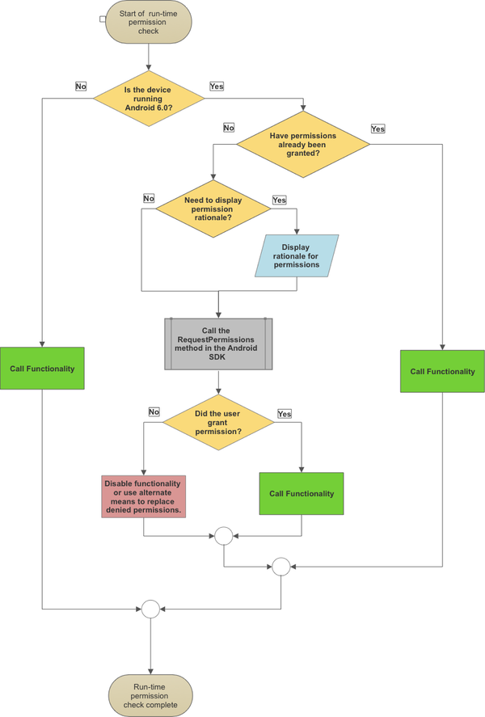
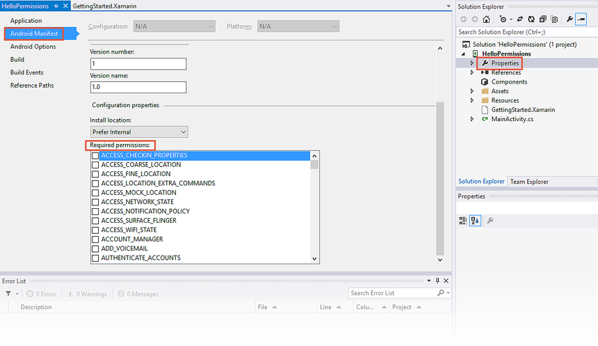
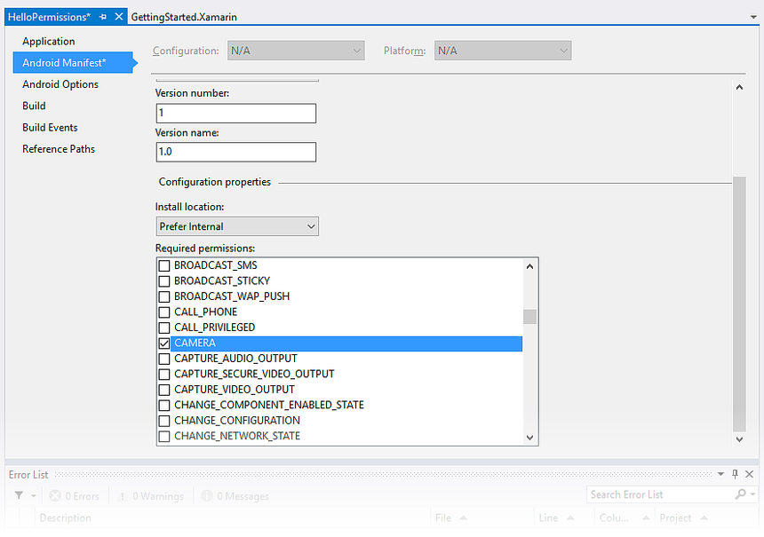
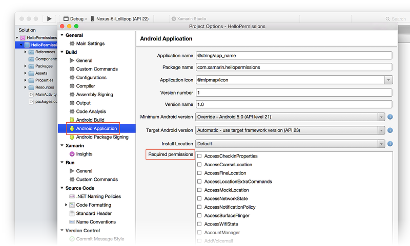
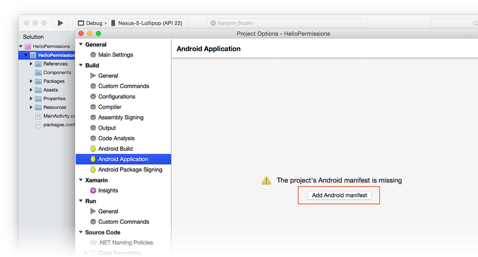
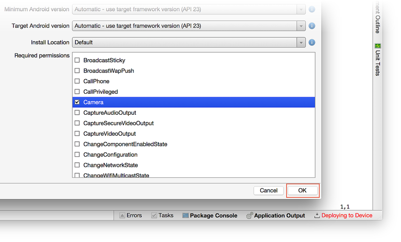

# Permissions In Xamarin.Android

## Overview

Android applications run in their own sandbox and for security reasons do not have access to certain system resources or hardware on the device. The user must explicitly grant permission to the app before it may use these resources. For example, an application cannot access the GPS on a device without explicit permission from the user. Android will throw a `Java.Lang.SecurityException` if an app tries to access a protected resource without permission.

Permissions are declared in the **AndroidManifest.xml** by the application developer when the app is developed. Android has two different workflows for obtaining the user's consent for those permissions:

- For apps that targeted Android 5.1 (API level 22) or lower, the permission request occurred when the app was installed. If the user did not grant the permissions, then the app would not be installed. Once the app is installed, there is no way to revoke the permissions except by uninstalling the app.
- Starting in Android 6.0 (API level 23), users were given more control over permissions; they can grant or revoke permissions as long as the app is installed on the device. This screenshot shows the permission settings for the Google Contacts app. It lists the various permissions and allows the user to enable or disable permissions:

 

Android apps must check at run-time to see if they have permission to access a protected resource. If the app does not have permission, then it must make requests using the new APIs provided by the Android SDK for the user to grant the permissions. Permissions are divided into two categories:

- **Normal Permissions** &ndash; These are permissions which pose little security risk to the user's security or privacy. Android 6.0 will automatically grant normal permissions at the time of installation. Please consult the Android documentation for a [complete list of normal permissions](https://developer.android.com/guide/topics/permissions/normal-permissions.html).
- **Dangerous Permissions** &ndash; In contrast to normal permissions, dangerous permissions are those that protect the user's security or privacy. These must be explicitly granted by the user. Sending or receiving an SMS message is an example of an action requiring a dangerous permission.

> [!IMPORTANT]
> The category that a permission belongs to may change over time.  It is possible that a permission which was categorized as a "normal" permission may be elevated in future API levels to a dangerous permission.

Dangerous permissions are further sub-divided into [_permission groups_](https://developer.android.com/guide/topics/permissions/requesting.html#perm-groups). A permission group will hold permissions that are logically related. When the user grants permission to one member of a permission group, Android automatically grants permission to all members of that group. For example, the [`STORAGE`](https://developer.android.com/reference/android/Manifest.permission_group.html#STORAGE) permission group holds both the `WRITE_EXTERNAL_STORAGE` and `READ_EXTERNAL_STORAGE` permissions. If the user grants permission to `READ_EXTERNAL_STORAGE`, then the `WRITE_EXTERNAL_STORAGE` permission is automatically granted at the same time.

Before requesting one or more permissions, it is a best practice to provide a rationale as to why the app requires the permission before requesting the permission. Once the user understands the rationale, the app can request permission from the user. By understanding the rationale, the user can make an informed decision if they wish to grant the permission and understand the repercussions if they do not. 

The whole workflow of checking and requesting permissions is known as a _run-time permissions_ check, and can be summarized in the following diagram: 

[](permissions-images/02-permissions-workflow.png#lightbox)

The Android Support Library backports some of the new APIs for permissions to older versions of Android. These backported APIs will automatically check the version of Android on the device so it is not necessary to perform an API level check each time.  

This document will discuss how to add permissions to a Xamarin.Android application and how apps that target Android 6.0 (API level 23) or higher should perform a run-time permission check.

> [!NOTE]
> It is possible that permissions for hardware may affect how the app is filtered by Google Play. For example, if the app requires permission for the camera, then Google Play will not show the app in the Google Play Store on a device that does not have a camera installed.

<a name="requirements"></a>

## Requirements

It is strongly recommended that Xamarin.Android projects include the [Xamarin.Android.Support.Compat](https://www.nuget.org/packages/Xamarin.Android.Support.Compat/) NuGet package. This package will backport permission specific APIs to older versions of Android, providing one common interface without the need to constantly check the version of Android that the app is running on.

## Requesting System Permissions

The first step in working with Android permissions is to declare the permissions in the Android manifest file. This must be done regardless of the API level that the app is targetting.

Apps that target Android 6.0 or higher cannot assume that because the user granted permission at some point in the past, that the permission will  be valid the next time. An app that targets Android 6.0 must always perform a runtime permission check. Apps that target Android 5.1 or lower do not need to perform a run-time permission check.

> [!NOTE]
> Applications should only request the permissions that they require.

### Declaring Permissions in the Manifest

Permissions are added to the  **AndroidManifest.xml** with the `uses-permission` element. For example, if an application is to locate the position of the device, it requires fine and course location permissions. The following two elements are added to the manifest: 

```xml
<uses-permission android:name="android.permission.ACCESS_COARSE_LOCATION" />
<uses-permission android:name="android.permission.ACCESS_FINE_LOCATION" />
```

<!-- markdownlint-disable MD001 -->

# [Visual Studio](#tab/windows)

It is possible to declare the permissions using the tool support built into Visual Studio:

1. Double-click **Properties** in the **Solution Explorer** and select the **Android Manifest** tab in the Properties window:

    [](permissions-images/04-required-permissions-vs.png#lightbox)

2. If the application does not already have an AndroidManifest.xml, click **No AndroidManifest.xml found. Click to add one** as shown below:

    [](permissions-images/05-no-manifest-vs.png#lightbox)

3. Select any permissions your application needs from the **Required permissions** list and save:

    [](permissions-images/06-selected-permission-vs.png#lightbox)

# [Visual Studio for Mac](#tab/macos)

It is possible to declare the permissions using the tool support built into Visual Studio for Mac:

1. Double-click the project in the **Solution Pad** and select **Options > Build > Android Application**:

    [](permissions-images/04-required-permissions-xs.png#lightbox)

2. Click the **Add Android Manifest** button if the project does not already have an **AndroidManifest.xml**:

    [](permissions-images/05-no-manifest-xs.png#lightbox)

3. Select any permissions your application needs from the **Required permissions** list and click **OK**:

    [](permissions-images/03-select-permission-xs.png#lightbox)
    
-----

Xamarin.Android will automatically add some permissions at build time to Debug builds. This will make debugging the application easier. In particular, two notable permissions are `INTERNET` and `READ_EXTERNAL_STORAGE`. These automatically-set permissions will not appear to be enabled in the **Required permissions** list. Release builds, however, use only the permissions that are explicitly set in the **Required permissions** list. 

For apps that target Android 5.1(API level 22) or lower, there is nothing more that needs to be done. Apps that will run on Android 6.0 (API 23 level 23) or higher should proceed on to the next section on how to perform run time permission checks. 

### Runtime Permission Checks in Android 6.0

The `ContextCompat.CheckSelfPermission`  method (available with the Android Support Library) is used to check if a specific permission has been granted. This method will return a [`Android.Content.PM.Permission`](xref:Android.Content.PM.Permission) enum which has one of two values:

- **`Permission.Granted`** &ndash; The specified permission has been granted.
- **`Permission.Denied`** &ndash; The specified permission has not been granted.

This code snippet is an example of how to check for the Camera permission in an Activity: 

```csharp
if (ContextCompat.CheckSelfPermission(this, Manifest.Permission.Camera) == (int)Permission.Granted) 
{
    // We have permission, go ahead and use the camera.
} 
else 
{
    // Camera permission is not granted. If necessary display rationale & request.
}
```

It is a best practice to inform the user as to why a permission is necessary for an application so that an informed decision can be made to grant the permission. An example of this would be an app that takes photos and geo-tags them. It is clear to the user that the camera permission is necessary, but it might not be clear why the app also needs the location of the device. The rationale should display a message to help the user understand why the location permission is desirable and that the camera permission is required.

The `ActivityCompat.ShouldShowRequestPermissionRationale` method is used to determine if the rationale should be shown to the user. This method will return `true` if the rationale for a given permission should be displayed. This screenshot shows an example of a Snackbar displayed by an application that explains why the app needs to know the location of the device:

 

If the user grants the permission, the `ActivityCompat.RequestPermissions(Activity activity, string[] permissions, int requestCode)` method should be called. This method requires the following parameters:

- **activity** &ndash; This is the activity that is requesting the permissions and is to be informed by Android of the results.
- **permissions** &ndash; A list of the permissions that are being requested.
- **requestCode** &ndash; An integer value that is used to match the results of the permission request to a `RequestPermissions` call. This value should be greater than zero.

This code snippet is an example of the two methods that were discussed. First, a check is made to determine if the permission rationale should be shown. If the rationale is to be shown, then a Snackbar is displayed with the rationale. If the user clicks **OK** in the Snackbar, then the app will request the permissions. If the user does not accept the rationale, then the app should not proceed to request permissions. If the rationale is not shown, then the Activity will request the permission:

```csharp
if (ActivityCompat.ShouldShowRequestPermissionRationale(this, Manifest.Permission.AccessFineLocation)) 
{
    // Provide an additional rationale to the user if the permission was not granted
    // and the user would benefit from additional context for the use of the permission.
    // For example if the user has previously denied the permission.
    Log.Info(TAG, "Displaying camera permission rationale to provide additional context.");

    var requiredPermissions = new String[] { Manifest.Permission.AccessFineLocation };
    Snackbar.Make(layout, 
                   Resource.String.permission_location_rationale,
                   Snackbar.LengthIndefinite)
            .SetAction(Resource.String.ok, 
                       new Action<View>(delegate(View obj) {
                           ActivityCompat.RequestPermissions(this, requiredPermissions, REQUEST_LOCATION);
                       }    
            )
    ).Show();
}
else 
{
    ActivityCompat.RequestPermissions(this, new String[] { Manifest.Permission.Camera }, REQUEST_LOCATION);
}
```

`RequestPermission` can be called even if the user has already granted permission. Subsequent calls are not necessary, but they provide the user with the opportunity to confirm (or revoke) the permission. When `RequestPermission` is called, control is handed off to the operating system, which will display a UI for accepting the permissions:  


After the user is finished, Android will return the results to the Activity via a callback method, `OnRequestPermissionResult`. This method is a part of the interface  `ActivityCompat.IOnRequestPermissionsResultCallback` which must be implemented by the Activity. This interface has a single method, `OnRequestPermissionsResult`, which will be invoked by Android to inform the Activity of the user's choices. If the user has granted the permission, then the app can go ahead and use the protected resource. An example of how to implement `OnRequestPermissionResult` is shown below: 

```csharp
public override void OnRequestPermissionsResult(int requestCode, string[] permissions, Permission[] grantResults)
{
    if (requestCode == REQUEST_LOCATION) 
    {
        // Received permission result for camera permission.
        Log.Info(TAG, "Received response for Location permission request.");

        // Check if the only required permission has been granted
        if ((grantResults.Length == 1) && (grantResults[0] == Permission.Granted)) {
            // Location permission has been granted, okay to retrieve the location of the device.
            Log.Info(TAG, "Location permission has now been granted.");
            Snackbar.Make(layout, Resource.String.permission_available_camera, Snackbar.LengthShort).Show();            
        } 
        else 
        {
            Log.Info(TAG, "Location permission was NOT granted.");
            Snackbar.Make(layout, Resource.String.permissions_not_granted, Snackbar.LengthShort).Show();
        }
    } 
    else 
    {
        base.OnRequestPermissionsResult(requestCode, permissions, grantResults);
    }
}
```  

## Summary

This guide discussed how to add and check for permissions in an Android device. The differences in how permissions work between old Android apps (API level < 23) and new Android apps (API level > 22). It discussed how to perform run-time permission checks in Android 6.0.

## Related Links

- [List of Normal Permissions](https://developer.android.com/guide/topics/permissions/normal-permissions.html)
- [Runtime Permissions Sample App](https://github.com/xamarin/monodroid-samples/tree/master/android-m/RuntimePermissions)
- [Handling Permissions in Xamarin.Android](https://github.com/xamarin/recipes/tree/master/Recipes/android/general/projects/add_permissions_to_android_manifest)
