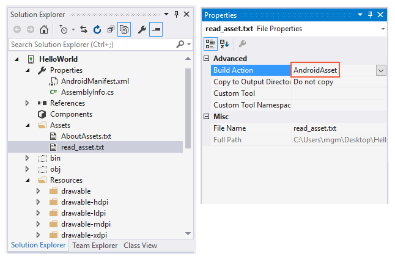
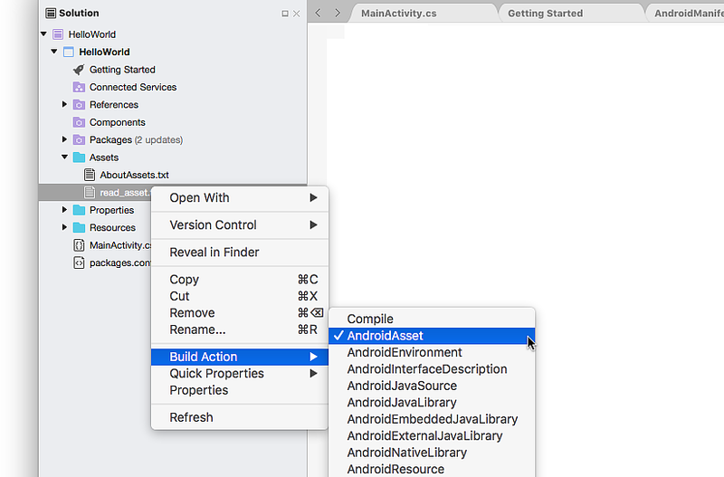

# Using Android Assets

_Assets_ provide a way to include arbitrary files like text, xml,
fonts, music, and video in your application. If you try to include
these files as "resources", Android will process them into its resource
system and you will not be able to get the raw data. If you want to
access data untouched, Assets are one way to do it.

Assets added to your project will show up just like a file system that
can read from by your application using
[AssetManager](xref:Android.Content.Res.AssetManager).
In this simple demo, we are going to add a text file asset to our
project, read it using `AssetManager`, and display it in a TextView.

## Add Asset to Project

Assets go in the `Assets` folder of your project. Add a new text file
to this folder called `read_asset.txt`. Place some text in it like "I
came from an asset!".

# [Visual Studio](#tab/windows)

Visual Studio should have set the **Build Action** for this file to
**AndroidAsset**:

 

# [Visual Studio for Mac](#tab/macos)

Visual Studio for Mac should have set the **Build Action** for this file to
**AndroidAsset**:

[](android-assets-images/asset-properties-xs.png#lightbox)

-----

Selecting the correct **BuildAction** ensures that the file will be
packaged into the APK at compile time.

## Reading Assets

Assets are read using an
[AssetManager](xref:Android.Content.Res.AssetManager). An
instance of the `AssetManager` is available by accessing the
[Assets](xref:Android.Content.Context.Assets) property on an
`Android.Content.Context`, such as an Activity.
In the following code, we open our **read_asset.txt** asset, read the
contents, and display it using a TextView.

```csharp
protected override void OnCreate (Bundle bundle)
{
    base.OnCreate (bundle);

    // Create a new TextView and set it as our view
    TextView tv = new TextView (this);
    
    // Read the contents of our asset
    string content;
    AssetManager assets = this.Assets;
    using (StreamReader sr = new StreamReader (assets.Open ("read_asset.txt")))
    {
        content = sr.ReadToEnd ();
    }

    // Set TextView.Text to our asset content
    tv.Text = content;
    SetContentView (tv);
}
```

### Reading Binary Assets

The use of `StreamReader` in the above example is ideal for text assets. For binary assets, use the following code:

```csharp
protected override void OnCreate (Bundle bundle)
{
    base.OnCreate (bundle);

    // Read the contents of our asset
    const int maxReadSize = 256 * 1024;
    byte[] content;
    AssetManager assets = this.Assets;
    using (BinaryReader br = new BinaryReader (assets.Open ("mydatabase.db")))
    {
        content = br.ReadBytes (maxReadSize);
    }

    // Do something with it...

}
```

## Running the Application

Run the application and you should see the following:


## Related Links

- [AssetManager](xref:Android.Content.Res.AssetManager)
- [Context](xref:Android.Content.Context)
