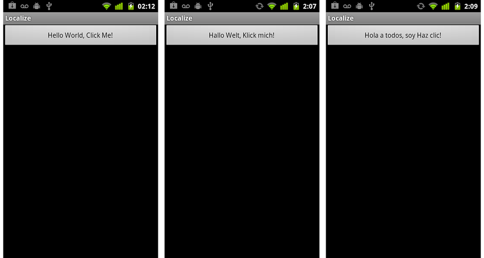
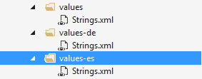

# Application Localization and String Resources

Application localization is the act of providing alternate resources to
target a specific region or locale. For example, you might provide
localized language strings for various countries, or you might change
colors or layout to match particular cultures. Android will load and
use the resources appropriate for the device's locale at runtime time
without any changes to the source code.

For example, the image below shows the same application running in
three different device locales, but the text displayed in each button
is specific to the locale that each device is set to:

[](application-localization-images/01-click-me.png#lightbox)

In this example, the contents of a layout file, **Main.axml** looks
something like this:

```xml
<?xml version="1.0" encoding="utf-8"?>
<LinearLayout xmlns:android="http://schemas.android.com/apk/res/android"
   android:orientation="vertical"
   android:layout_width="fill_parent"
   android:layout_height="fill_parent"
   >
<Button  
   android:id="@+id/myButton"
   android:layout_width="fill_parent"
   android:layout_height="wrap_content"
android:text="@string/hello"
   />
</LinearLayout>
```

In the example above, the string for the button was loaded from the
resources by providing the resource ID for the string:

# [Visual Studio](#tab/windows)


 
# [Visual Studio for Mac](#tab/macos)


 
-----
 
## Localizing Android Apps

Read the [Introduction to Localization](~/cross-platform/app-fundamentals/localization.md)
for tips and guidance on localizing mobile apps.

The [Localizing Android Apps](~/android/app-fundamentals/localization.md) guide contains
more specific examples on how to translate strings and localize images using
Xamarin.Android.


## Related Links

- [Localizing Android Apps](~/android/app-fundamentals/localization.md)
- [Cross-Platform Localization Overview](~/cross-platform/app-fundamentals/localization.md)
