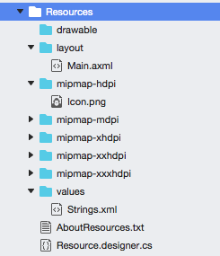

# Default Resources

Default resources are items that are not specific to any particular
device or form factor, and therefore are the default choice by the
Android OS if no more specific resources can be found. As such, they're
the most common type of resource to create. They're organized into
sub-directories of the **Resources** directory according to their
resource type:

# [Visual Studio](#tab/windows)

In the image above, the project has default values for drawable resources,
layouts, and values (XML files that contain simple values).

A complete list of resource types is provided below:

- **animator** &ndash; XML files that describe property animations.
   Property animations were introduced in API level 11 (Android 3.0)
   and provides for the animation of properties on an object. Property
   animations are a more flexible and powerful way to describe
   animations on any type of object.

- **anim** &ndash; XML files that describe *tween* animations. Tween
   animations are a series of animation instructions to perform
   transformations on the contents of a View object, or example,
   rotation an image or growing the size of text. Tween animations are
   limited to only View objects.

- **color** &ndash; XML files that describe a state list of colors. To
   understand color state lists, consider a UI widget such as a Button.
   It may have different states such as pressed or disabled, and
   the button may change color with each change in state. The list is
   expressed in a state list.

- **drawable** &ndash; Drawable resources are a general
   concept for graphics that can be compiled into the application and
   then accessed by API calls or referenced by other XML resources.
   Some examples of drawables are bitmap files (.png, .gif, .jpg),
   special resizable bitmaps known as
   [Nine-Patches](https://developer.android.com/guide/topics/graphics/2d-graphics.html#nine-patch),
   state lists, generic shapes defined in XML, etc.

- **layout** &ndash; XML files that describe a user interface layout,
   such as an activity or a row in a list.

- **menu** &ndash; XML files that describe application menus such as
   *Options Menus*, *Context Menus*, and *submenus*. For an example of
   menus, see the
   [Popup Menu Demo](/samples/xamarin/monodroid-samples/popupmenudemo) or the
   [Standard Controls](/samples/xamarin/mobile-samples/standardcontrols/) sample.

- **raw** &ndash; Arbitrary files that are saved in their raw, binary
   form. These files are compiled into an Android application in a
   binary format.

- **values** &ndash; XML files that contain simple values. An XML file
   in the values directory does not define a single resource, but
   instead can define multiple resources. For example one XML file may
   hold a list of string values, while another XML file may hold a list
   of color values.

- **xml** &ndash; XML files that are similar in function to the .NET
   configuration files. These are arbitrary XML that can be read at run
   time by the application.

# [Visual Studio for Mac](#tab/macos)

In the image above, the project has default values for drawable resources,
layouts, and values (XML files that contain simple values).

A complete list of resource types is provided below:

- **animator** &ndash; XML files that describe property animations.
   Property animations were introduced in API level 11 (Android 3.0)
   and provides for the animation of properties on an object. Property
   animations are a more flexible and powerful way to describe
   animations on any type of object.

- **anim** &ndash; XML files that describe *tween* animations. Tween
   animations are a series of animation instructions to perform
   transformations on the contents of a View object, or example,
   rotation an image or growing the size of text. Tween animations are
   limited to only View objects.

- **color** &ndash; XML files that describe a state list of colors. To
   understand color state lists, consider a UI widget such as a Button.
   It may make have different states such as pressed or disabled, and
   the button may change color with each change in state. The list is
   expressed in a state list.

- **font** &ndash; Starting in API level 26, it is possible to embed
   fonts as a resource in an Android application. The Support Library
   26 will backport fonts to API level 14. Embedding fonts allows
   applications to load custom fonts directly from XML layouts without
   needing to import them as assets before use.

- **mipmap** &ndash; Drawable resources are a general
   concept for graphics that can be compiled into the application and
   then accessed by API calls or referenced by other XML resources.
   Some examples of drawables are bitmap files (.png, .gif, .jpg),
   special resizable bitmaps known as
   [Nine-Patches](https://developer.android.com/guide/topics/graphics/2d-graphics.html#nine-patch),
   state lists, generic shapes defined in XML, etc.

- **layout** &ndash; XML files that describe a user interface layout,
   such as an activity or a row in a list.

- **menu** &ndash; XML files that describe application menus such as
   *Options Menus*, *Context Menus*, and *submenus*. For an example of
   menus, see the
   [Popup Menu Demo](/samples/xamarin/monodroid-samples/popupmenudemo) or the
   [Standard Controls](/samples/xamarin/mobile-samples/standardcontrols/) sample.

- **raw** &ndash; Arbitrary files that are saved in their raw, binary
   form. These files are compiled into an Android application in a
   binary format.

- **values** &ndash; XML files that contain simple values. An XML file
   in the values directory does not define a single resource, but
   instead can define multiple resources. For example one XML file may
   hold a list of string values, while another XML file may hold a list
   of color values.

- **xml** &ndash; XML files that are similar in function to the .NET
   configuration files. These are arbitrary XML that can be read at run
   time by the application

-----