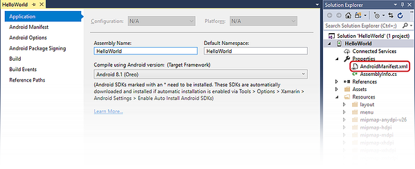
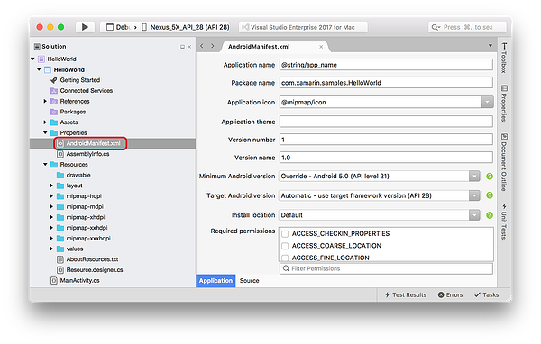
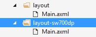
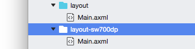
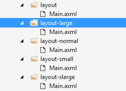
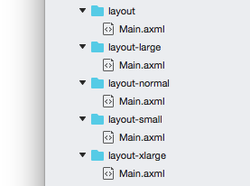
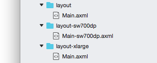
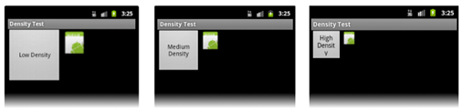
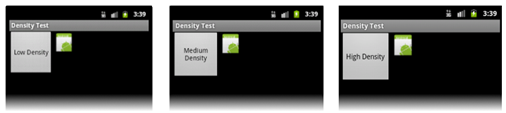
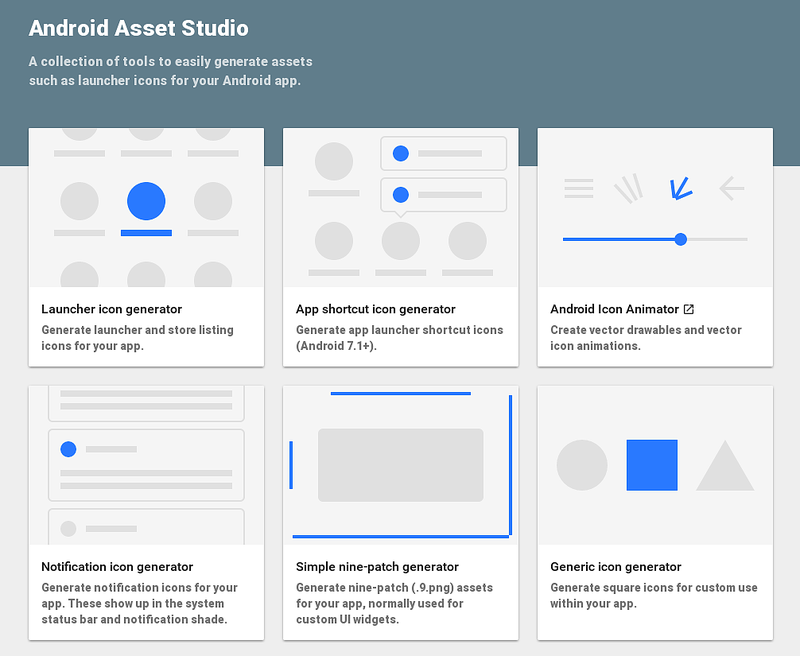

# Creating resources for varying screens

Android itself runs on many different devices, each having a wide variety of
resolutions, screen sizes, and screen densities. Android will perform scaling
and resizing to make your application work on these devices, but this may result
in a sub-optimal user experience. For example, images could appear blurry, or they may be positioned as expected on a view.


## Concepts

A few terms and concepts are important to understand to support
multiple screens.

- **Screen Size** &ndash; The amount of physical space for displaying
  your application

- **Screen Density** &ndash; The number of pixels in any given area on
  the screen. The typical unit of measure is dots per inch (dpi).

- **Resolution** &ndash; The total number of pixels on the screen. When
  developing applications, resolution is not as important as screen
  size and density.

- **Density-independent pixel (dp)** &ndash; A virtual unit of
  measure to allow layouts to be designed independent of density. This formula is used to convert dp into screen pixels:

    px &equals; dp &times; dpi &divide; 160

- **Orientation** &ndash; The screen's orientation is considered to be
  landscape when it is wider than it is tall. In contrast, portrait
  orientation is when the screen is taller than it is wide. The
  orientation can change during the lifetime of an application as the
  user rotates the device.

Notice that the first three of these concepts are inter-related &ndash;
increasing the resolution without increasing the density will increase
the screen size. However if both the density and resolution are
increased, then the screen size can remain unchanged. This relationship
between screen size, density, and resolution complicate screen support quickly.

To help deal with this complexity, the Android framework prefers to use
*density-independent pixels (dp)* for screen layouts. By using density
independent pixels, UI elements will appear to the user to have the
same physical size on screens with different densities.


## Supporting various screen sizes and densities

Android handles most of the work to render the layouts properly for
each screen configuration. However, there are some actions that can be
taken to help the system out.

The use of density-independent pixels instead of actual pixels in
layouts is sufficient in most cases to ensure density independence.
Android will scale the drawables at runtime to the appropriate size.
However, it is possible that scaling will cause bitmaps to appear
blurry. To work around this problem, supply alternate
resources for the different densities. When designing devices for
multiple resolutions and screen densities, it will prove easier to start
with the higher resolution or density images and then scale down.


### Declare the supported screen size

Declaring the screen size ensures that only supported devices can
download the application. This is accomplished by setting the
[supports-screens](http://developer.android.com/guide/topics/manifest/supports-screens-element.html)
element in the **AndroidManifest.xml** file. This element is used to
specify what screen sizes are supported by the application. A given
screen is considered to be supported if the application can properly place
its layouts to fill screen. By using this manifest element, the
application will not show up in
[*Google Play*](https://play.google.com/) for devices that do not meet
the screen specifications. However, the application will still run on
devices with unsupported screens, but the layouts may appear blurry and
pixelated.

Supported screen sixes are declared in the **Properites/AndroidManifest.xml** file of the solution:

# [Visual Studio](#tab/windows)

[](resources-for-varying-screens-images/01-android-manifest.w1581.png#lightbox)

# [Visual Studio for Mac](#tab/macos)

[](resources-for-varying-screens-images/01-android-manifest.m761.png#lightbox)

-----

Edit **AndroidManifest.xml** to include [supports-screens](http://developer.android.com/guide/topics/manifest/supports-screens-element.html):

```xml
<manifest xmlns:android="http://schemas.android.com/apk/res/android"
          android:versionCode="1"
          android:versionName="1.0"
          package="HelloWorld.HelloWorld">
      <uses-sdk android:minSdkVersion="21" android:targetSdkVersion="27" />
      <supports-screens android:resizable="true"
                        android:smallScreens="true"
                        android:normalScreens="true"
                        android:largeScreens="true" />
      <application android:allowBackup="true"
                   android:icon="@mipmap/ic_launcher"
                   android:label="@string/app_name"
                   android:roundIcon="@mipmap/ic_launcher_round"
                   android:supportsRtl="true" android:theme="@style/AppTheme">
  </application>
</manifest>
```

### Provide alternate layouts for different screen sizes


Alternate layouts make it possible to customize a view for a specifc screen size, changing the positioning or size of the component UI elements.

Starting with API Level 13 (Android 3.2), the screen sizes are
deprecated in favor of using the sw*N*dp qualifier. This new qualifier
declares the amount of space a given layout needs. It is
recommended that applications that are meant to run on Android 3.2 or
higher should be using these newer qualifiers.

For example, if a layout required a minimum 700 dp of screen width, the
alternate layout would go in a folder **layout-sw700dp**:

# [Visual Studio](#tab/windows)



# [Visual Studio for Mac](#tab/macos)



-----


As a guideline, here are some numbers for various devices:

- **Typical phone** &ndash; 320 dp: a typical phone

- **A 5" tablet / "tweener" device** &ndash; 480 dp: such as the Samsung Note

- **A 7" tablet** &ndash; 600 dp: such as the Barnes &amp; Noble Nook

- **A 10" tablet** &ndash; 720 dp: such as the Motorola Xoom

For applications that target API levels up to 12 (Android 3.1), the
layouts should go in directories that use the qualifiers
**small**/**normal**/**large**/**xlarge** as generalizations of the
various screen sizes that are available in most devices. For example,
in the image below, there are alternate resources for the four
different screen sizes:

# [Visual Studio](#tab/windows)



# [Visual Studio for Mac](#tab/macos)



-----

The following is a comparison of how the older pre-API Level 13 screen
size qualifiers compare to density-independent pixels:

- 426 dp x 320 dp is **small**

- 470 dp x 320 dp is **normal**

- 640 dp x 480 dp is **large**

- 960 dp x 720 dp is **xlarge**

The newer screen size qualifiers in API level 13 and up have a higher
precedence than the older screen qualifiers of API levels 12 and lower.
For applications that will span the old and the new API levels, it may
be necessary to create alternate resources using both sets of
qualifiers as shown in the following screenshot:

# [Visual Studio](#tab/windows)


# [Visual Studio for Mac](#tab/macos)



-----


### Provide different bitmaps for different screen densities

Although Android will scale bitmaps as necessary for a device, the
bitmaps themselves may not elegantly scale up or down: they may become
fuzzy or blurry. Providing bitmaps appropriate for the screen density
will mitigate this problem.

For example, the image below is an example of layout and appearance
problems that may occur when density-specify resources are not
provided.



Compare this to a layout that is designed with density-specific
resources:




### Create varying density resources with Android Asset Studio

The creation of these bitmaps of various densities can be a bit
tedious. As such, Google has created an online utility that can reduce
some of the tedium involved with the creation of these bitmaps called the
[**Android Asset Studio**](https://romannurik.github.io/AndroidAssetStudio/).

[](resources-for-varying-screens-images/08-android-asset-studio.png#lightbox)

This website will help with creation of bitmaps that target the four
common screen densities by providing one image. Android Asset Studio
will then create the bitmaps with some customizations and then allow
them to be downloaded as a zip file.


## Tips for multiple screens

Android runs on a bewildering number of devices, and the combination of
screen sizes and screen densities can seem overwhelming. The following
tips can help minimize the effort necessary to support various devices:

- **Only design and develop for what you need** &ndash; There are many different devices out there, but some exist in rare form factors
  that may take significant effort to design and develop for. The
  [**Screen Size and Density**](http://developer.android.com/resources/dashboard/screens.html)
  dashboard is a page provided by Google that provides data on
  breakdown of the screen size/screen density matrix. This breakdown
  provides insight on how to development effort on supporting screens.

- **Use DPs rather than Pixels** - Pixels become troublesome as screen
  density changes. Do not hardcode pixel values. Avoid pixels in favor
  of dp (density-independent pixels).

- **Avoid** [AbsoluteLayout](https://developer.xamarin.com/api/type/Android.Widget.AbsoluteLayout/)
  **Wherever Possible** &ndash; it is deprecated in API level 3
  (Android 1.5) and will result in brittle layouts. It should not be
  used. Instead, try to use more flexible layout widgets such as
  [**LinearLayout**](https://developer.xamarin.com/api/type/Android.Widget.LinearLayout/),
  [**RelativeLayout**](https://developer.xamarin.com/api/type/Android.Widget.RelativeLayout/),
  or the new
  [**GridLayout**](https://developer.xamarin.com/api/type/Android.Widget.GridLayout/).

- **Pick one layout orientation as your default** &ndash; For example,
  instead of providing the alternate resources **layout-land** and
  **layout-port**, put the resources for landscape in **layout**, and
  the resources for portrait into **layout-port**.

- **Use LayoutParams for Height and Width** - When defining UI elements
  in an XML layout file, an Android application using the
  **wrap_content** and **fill_parent** values will have more success
  ensure a proper look across different devices than using pixel or
  density-independent units. These dimension values cause Android to
  scale bitmap resources as appropriate. For this same reason,
  density-independent units are best reserved for when specifying the
  margins and padding of UI elements.


## Testing multiple screens

An Android application must be tested against all configurations
that will be supported. Ideally devices should be tested on the actual
devices themselves but in many cases this is not possible or practical.
In this case, the use of the emulator and Android Virtual Devices setup
for each device configuration will be useful.

The Android SDK provides some emulator skins may be used to create
AVDs will replicate the size, density, and resolution of many devices.
Many of the hardware vendors likewise provide skins for their devices.

Another option is to use the services of a third party testing service.
These services will take an APK, run it on many different devices, and
then provide feedback how the application worked.
