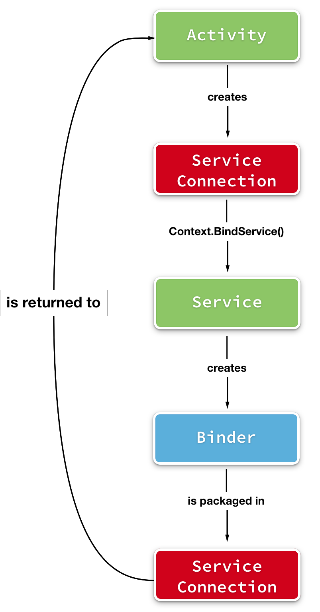
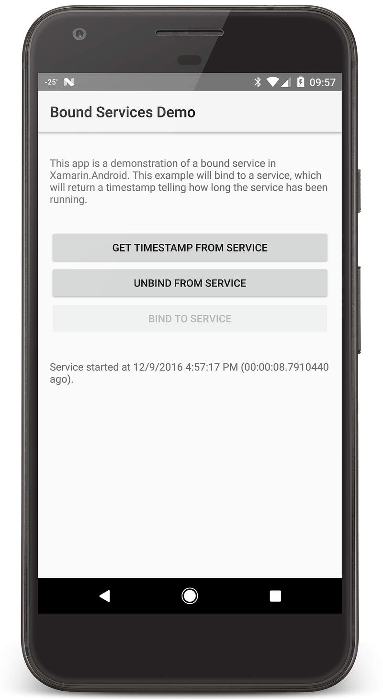
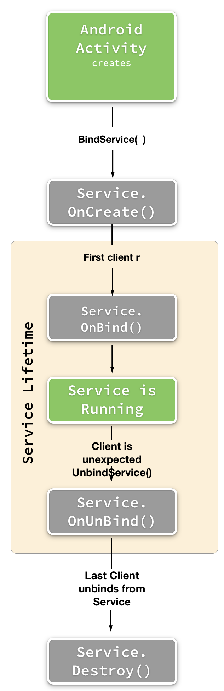

# Bound Services in Xamarin.Android

_Bound services are Android services that provide a client-server interface that a client (such as an Android Activity) can interact with. This guide will discuss the key components involved with creating a bound service and how to use it in a Xamarin.Android application._

## Bound Services Overview

Services that provide a client-server interface for clients to directly interact with the service are referred to as  _bound services_.  There can be multiple clients connected to a single instance of a service at the same time. The bound service and the client are isolated from each other. Instead, Android provides a series of intermediate objects that manage the state of the connection between the two. This state is maintained by an object that implements the [`Android.Content.IServiceConnection`](xref:Android.Content.IServiceConnection) interface.  This object is created by the client and passed as a parameter to the [`BindService`](xref:Android.Content.Context.BindService*) method. The `BindService` is available on any [`Android.Content.Context`](xref:Android.Content.Context) object (such as an Activity). It is a request to the Android operating system to start up the service and bind a client to it. There are three ways to a client may bind to a service using the `BindService` method:

- **A service binder** &ndash; A service binder is a class that implements the [`Android.OS.IBinder`](xref:Android.OS.IBinder) interface. Most applications will not implement this interface directly, instead they will extend the [`Android.OS.Binder`](xref:Android.OS.Binder) class. This is the most common approach and is suitable for when the service and the client exist in the same process.
- **Using a Messenger** &ndash; This technique is suitable for when the service might exist in a separate process. Instead, service requests are marshalled between the client and service via an [`Android.OS.Messenger`](xref:Android.OS.Messenger). An [`Android.OS.Handler`](xref:Android.OS.Handler) is created in the service which will handle the `Messenger` requests. This will be covered in another guide.
- **Using Android Interface Definition Language (AIDL)** &ndash; [AIDL](https://developer.android.com/guide/components/aidl) is an advanced technique that will not be covered in this guide.

Once a client has been bound to a service, communication between the two is occurs via `Android.OS.IBinder` object.  This object is responsible for the interface that will allow the client to interact with the service. It is not necessary for each Xamarin.Android application to implement this interface from scratch, the Android SDK provides the [`Android.OS.Binder`](xref:Android.OS.Binder) class which takes care of most of the code required with marshalling the object between the client and the service.

When a client is done with the service, it must unbind from it by calling the `UnbindService` method. Once the last client has unbound from a service, Android will stop and dispose of the bound service.

This diagram illustrates how the Activity, service connection, binder, and service all related to each other:



This guide will discuss how to extend the `Service` class to implement a bound service. It will also cover implementing `IServiceConnection` and extending `Binder` to allow a client to communicate with the service. A sample app accompanies this guide, which contain a solution with a single Xamarin.Android project called **[BoundServiceDemo](https://github.com/xamarin/monodroid-samples/tree/master/ApplicationFundamentals/ServiceSamples/BoundServiceDemo)** . This is a very basic application which demonstrates how to implement a service and how to bind an activity to it. The bound service has a very simple API with only one method, `GetFormattedTimestamp`, which returns a string that tells the user when the service has started and how long it has been running. The app also allows the user to manually unbind and bind to the service.

[](bound-services-images/bound-services-03.png#lightbox)

## Implementing and Consuming a Bound Service

There are three components that must be implemented in order for an Android application to consume a bound service:

1. **Extend the `Service` class and Implement the Lifecycle Callback Methods** &ndash; This class will contain the code that will perform the work that will be requested of the service. This will be covered in more detail below.
2. **Create a Class that Implements `IServiceConnection`** &ndash; This interface provides callback methods will invoked by Android to notify the client when the connection to the service has changed, i.e. the client has connected or disconnected to the service. The service connection will also provide a reference to an object that the client can use to directly interact with the service. This reference is known as the _binder_.
3. **Create a Class that Implements `IBinder`** &ndash; A _Binder_ implementation provides the API that a client uses to communicate with the service. The Binder can either provide a reference to the bound service, allowing methods to be directly invoked or the Binder can provide a client API that encapsulates and hides the bound service from the application. An `IBinder` must provide the necessary code for remote procedure calls. It is not necessary (or recommended) to implement the `IBinder` interface directly. Instead applications should extend the `Binder` type which provides most of the base functionality required by an `IBinder`.
4. **Starting and Binding to a Service** &ndash; Once the service connection, binder, and service have been created the Android application is responsible for starting the service and binding to it.

Each of these steps will be discussed in the following sections in more detail.

### Extend the `Service` Class

To create a service using Xamarin.Android, it is necessary to subclass `Service` and to adorn the class with the [`ServiceAttribute`](xref:Android.App.ServiceAttribute). The attribute is used by the Xamarin.Android build tools to properly register the service in the app's **AndroidManifest.xml** file
Much like an activity, a bound service has it's own lifecycle and callback methods associated with the significant events in it's lifecycle. The following list is an example of some of the more common callback methods that a service will implement:

- `OnCreate` &ndash; This method is invoked by Android as it is instantiating the service. It is used to initialize any variables or objects that are required by the service during it's lifetime. This method is optional.
- `OnBind` &ndash; This method must be implemented by all bound services. It is invoked when the first client tries to connect to the service. It will return an instance of `IBinder` so that the client may interact with the service. As long as the service is running, the `IBinder` object will be used to fulfill any future client requests to bind to the service.
- `OnUnbind` &ndash; This method is called when all bound clients have unbound. By returning  `true` from this method, the service will later call `OnRebind` with the intent passed to `OnUnbind` when new clients bind to it. You would do this when a service continues running after it has been unbound. This would happen if the recently unbound service were also a started service, and  `StopService` or  `StopSelf` hadn’t been called. In such a scenario,  `OnRebind` allows the intent to be retrieved. The default returns  `false` , which does nothing. Optional.
- `OnDestroy` &ndash; This method is called when Android is destroying the service. Any necessary cleanup, such as releasing resources, should be performed in this method. Optional.

The key lifecycle events of a bound service are shown in this diagram:



The following code snippet, from the companion application that accompanies this guide, shows how to implement a bound service in Xamarin.Android:

```csharp
using Android.App;
using Android.Util;
using Android.Content;
using Android.OS;

namespace BoundServiceDemo
{
    [Service(Name="com.xamarin.ServicesDemo1")]
    public class TimestampService : Service, IGetTimestamp
    {
        static readonly string TAG = typeof(TimestampService).FullName;
        IGetTimestamp timestamper;

        public IBinder Binder { get; private set; }

        public override void OnCreate()
        {
            // This method is optional to implement
            base.OnCreate();
            Log.Debug(TAG, "OnCreate");
            timestamper = new UtcTimestamper();
        }

        public override IBinder OnBind(Intent intent)
        {
            // This method must always be implemented
            Log.Debug(TAG, "OnBind");
            this.Binder = new TimestampBinder(this);
            return this.Binder;
        }

        public override bool OnUnbind(Intent intent)
        {
            // This method is optional to implement
            Log.Debug(TAG, "OnUnbind");
            return base.OnUnbind(intent);
        }

        public override void OnDestroy()
        {
            // This method is optional to implement
            Log.Debug(TAG, "OnDestroy");
            Binder = null;
            timestamper = null;
            base.OnDestroy();
        }

        /// <summary>
        /// This method will return a formatted timestamp to the client.
        /// </summary>
        /// <returns>A string that details what time the service started and how long it has been running.</returns>
        public string GetFormattedTimestamp()
        {
            return timestamper?.GetFormattedTimestamp();
        }
    }
}
```

In the sample, the `OnCreate` method initializes an object that holds the logic for retrieving and formatting a timestamp that would be requested by a client. When the first client tries to bind to the service, Android will invoke the `OnBind` method. This service will instantiate a `TimestampBinder` object that will allow the clients to access this instance of the running service. The `TimestampBinder` class is discussed in the next section.

### Implementing IBinder

As mentioned, an `IBinder` object provides the communication channel between a client and a service. Android applications should not implement the `IBinder` interface, the [`Android.OS.Binder`](xref:Android.OS.Binder) should be extended. The `Binder` class provides much of the necessary infrastructure which is necessary marshal the binder object from the service (which may be running in a separate process)  to the client. In most cases, the `Binder` subclass is only a few lines of code and wraps a reference to the service. In this example, `TimestampBinder` has a property that exposes the `TimestampService` to the client:

```csharp
public class TimestampBinder : Binder
{
    public TimestampBinder(TimestampService service)
    {
        this.Service = service;
    }

    public TimestampService Service { get; private set; }
}
```

This `Binder` makes it possible to invoke the public methods on the service; for example:

```csharp
string currentTimestamp = serviceConnection.Binder.Service.GetFormattedTimestamp()
```

Once `Binder` has been extended, it is necessary to implement `IServiceConnection` to connect everything together.

### Creating the Service Connection

The `IServiceConnection` will  present|introduce|expose|connect the `Binder` object to the client. In addition to implementing the `IServiceConnection` interface, the class must extend `Java.Lang.Object`. The service connection should also provide some way that the client can access the `Binder` (and therefore communicate with the bound service).

This code is from the accompanying sample project is one possible way to implement `IServiceConnection`:

```csharp
using Android.Util;
using Android.OS;
using Android.Content;

namespace BoundServiceDemo
{
    public class TimestampServiceConnection : Java.Lang.Object, IServiceConnection, IGetTimestamp
    {
        static readonly string TAG = typeof(TimestampServiceConnection).FullName;

        MainActivity mainActivity;
        public TimestampServiceConnection(MainActivity activity)
        {
            IsConnected = false;
            Binder = null;
            mainActivity = activity;
        }

        public bool IsConnected { get; private set; }
        public TimestampBinder Binder { get; private set; }

        public void OnServiceConnected(ComponentName name, IBinder service)
        {
            Binder = service as TimestampBinder;
            IsConnected = this.Binder != null;

            string message = "onServiceConnected - ";
            Log.Debug(TAG, $"OnServiceConnected {name.ClassName}");

            if (IsConnected)
            {
                message = message + " bound to service " + name.ClassName;
                mainActivity.UpdateUiForBoundService();
            }
            else
            {
                message = message + " not bound to service " + name.ClassName;
                mainActivity.UpdateUiForUnboundService();
            }

            Log.Info(TAG, message);
            mainActivity.timestampMessageTextView.Text = message;

        }

        public void OnServiceDisconnected(ComponentName name)
        {
            Log.Debug(TAG, $"OnServiceDisconnected {name.ClassName}");
            IsConnected = false;
            Binder = null;
            mainActivity.UpdateUiForUnboundService();
        }

        public string GetFormattedTimestamp()
        {
            if (!IsConnected)
            {
                return null;
            }

            return Binder?.GetFormattedTimestamp();
        }
    }
}

```

As a part of the binding process, Android will invoke the `OnServiceConnected` method, providing the `name` of the service that is being bound and the `binder` that holds a reference to the service itself. In this example, the service connection has two properties, one that holds a reference to the Binder and a boolean flag for if the client is connected to the service or not.

The `OnServiceDisconnected` method is only invoked when the connection between a client and a service is unexpectedly lost or broken. This method allows the client a chance to respond to the interruption in service.  

## Starting and Binding to a Service with an Explicit Intent

To use a bound service, a client (such as an Activity) must instantiate an object that implements `Android.Content.IServiceConnection` and invoke the `BindService` method. `BindService` will return `true` if the service is bound to, `false` if it is not. The `BindService` method takes three parameters:

- **An `Intent`** &ndash; The Intent should explicitly identify which service to connect to.
- **An `IServiceConnection` Object** &ndash; This object is an intermediary that provides callback methods to notify the client when the bound service is started  and stopped.
- **[`Android.Content.Bind`](xref:Android.Content.Bind)
 enum** &ndash; This parameter is a set of flags are used by the system to when bind the object. The most commonly used value is [`Bind.AutoCreate`](xref:Android.Content.Bind.AutoCreate), which will automatically start the service if it isn't already running.

The following Code snippet is an example of how to start a bound service in an Activity using an explicit intent:

```csharp
protected override void OnStart ()
{
    base.OnStart ();

    if (serviceConnection == null)
    {
        this.serviceConnection = new TimestampServiceConnection(this);
    }

    Intent serviceToStart = new Intent(this, typeof(TimestampService));
    BindService(serviceToStart, this.serviceConnection, Bind.AutoCreate);

}
```

> [!IMPORTANT]
> Starting with Android 5.0 (API level 21) it is only possible to bind to a service with an explicit intent.

## Architectural Notes About the Service Connection and the Binder.

Some OOP purists may disapprove of the previous implementation of the `TimestampBinder` class as it is a violation of the [Law of Demeter](https://en.wikipedia.org/wiki/Law_of_Demeter) which, in it's simplest form states "Don't talk to strangers; only talk to your friends". This particular implementation exposes the concrete `TimestampService` class to all clients.

Strictly speaking, it is not necessary for the client to know about the `TimestampService` and exposing that concrete class to clients can make an application more brittle and harder to maintain over it's lifetime. An alternate approach is to use an interface which exposes the `GetFormattedTimestamp()` method, and proxy calls to the service through the `Binder` (or possible the service connection class):  

```csharp
public class TimestampBinder : Binder, IGetTimestamp
{
    TimestampService service;
    public TimestampBinder(TimestampService service)
    {
        this.service = service;
    }

    public string GetFormattedTimestamp()
    {
        return service?.GetFormattedTimestamp();
    }
}
```

This particular example allow an activity to invoke methods on the service itself:

```csharp
// In this example the Activity is only talking to a friend, i.e. the IGetTimestamp interface provided by the Binder.
string currentTimestamp = serviceConnection.Binder.GetFormattedTimestamp()
```

## Related Links

- [Android.App.Service](xref:Android.App.Service)
- [Android.Content.Bind](xref:Android.Content.Bind)
- [Android.Content.Context](xref:Android.Content.Context)
- [Android.Content.IServiceConnection](xref:Android.Content.IServiceConnection)
- [Android.OS.Binder](xref:Android.OS.Binder)
- [Android.OS.IBinder](xref:Android.OS.IBinder)
- [BoundServiceDemo (sample)](/samples/xamarin/monodroid-samples/applicationfundamentals-servicesamples-boundservicedemo)