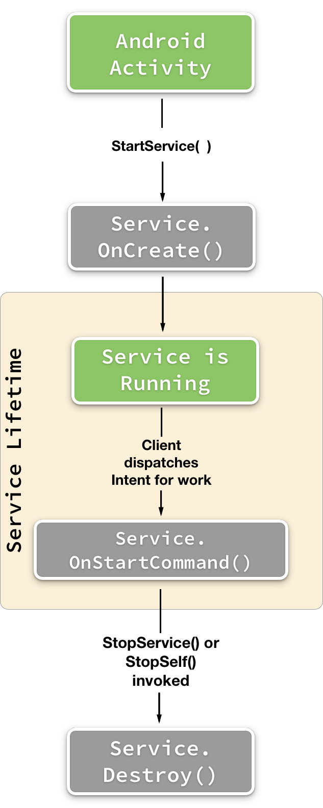

# Started Services with Xamarin.Android

## Started Services Overview

Started services typically perform a unit of work without providing any direct feedback or results to the client. An example of a unit of work is a service that uploads a file to a server. The client will make a request to a service to upload a file from the device to a website. The service will quietly upload the file (even if the app has no Activities in the foreground), and terminate itself when the upload is finished. It is important to realize that a started service will run on the UI thread of an application. This means that if a service is to perform work that will block the UI thread, it must create and dispose of threads as necessary.

Unlike a bound service, there is no communication channel between a "pure" started service and its clients. This means that a started service will implement some different lifecycle methods than a bound service. The following list highlights the common lifecycle methods in a started service:

- `OnCreate` &ndash; Called one time when the service is first started. This is where initialization code should be implemented.
- `OnBind` &ndash; This method must be implemented by all service classes, however a started service does not typically have a client bound to it. Because of this, a started service just returns `null`. In contrast, a hybrid service (which is the combination of a bound service and a started service) has to implement and return a `Binder` for the client.
- `OnStartCommand` &ndash; Called for each request to start the service, either in response to a call to `StartService` or a restart by the system. This is where the service can begin any long-running task. The method returns a  `StartCommandResult` value that indicates how or if the system should handle restarting the service after a shutdown due to low memory. This call takes place on the main thread. This method is described in more detail below.
- `OnDestroy` &ndash; This method is called when the Service is being destroyed. It is used to perform any final clean up required.

The important method for a started service is the `OnStartCommand` method. It will be invoked each time the service receives a request to do some work. The following code snippet is an example of `OnStartCommand`: 

```csharp
public override StartCommandResult OnStartCommand (Android.Content.Intent intent, StartCommandFlags flags, int startId)
{
    // This method executes on the main thread of the application.
    Log.Debug ("DemoService", "DemoService started");
    ...
    return StartCommandResult.Sticky;
}
```

The first parameter is an `Intent` object containing the meta-data about the work to perform. The second parameter contains a `StartCommandFlags` value that provides some information about the method call. This parameter has one of two possible values:

- `StartCommandFlag.Redelivery` &ndash; This means that the `Intent` is a re-delivery of a previous `Intent`. This value is provided when the service had returned `StartCommandResult.RedeliverIntent` but was stopped before it could be properly shut down.
-`StartCommandFlag.Retry` &dash; This value is received when a previous `OnStartCommand` call failed and Android is trying to start the service again with the same intent as the previous failed attempt.

Finally, the third parameter is an integer value that is unique to the application that identifies the request. It is possible that multiple callers may invoke the same service object. This value is used to associate a request to stop a service with a given request to start a service. It will be discussed in more detail in the section [Stopping the Service](#Stopping_the_Service). 

The value `StartCommandResult` is returned by the service as a suggestion to Android on what to do if the service is killed due to resource constraints. There are three possible values for `StartCommandResult`:

- **[StartCommandResult.NotSticky](xref:Android.App.StartCommandResult.NotSticky)** &ndash; This value tells Android that it is not necessary to restart the service that it has killed. As an example of this, consider a service that generates thumbnails for a gallery in an app. If the service is killed, it isn't crucial to recreate the thumbnail immediately &ndash; the thumbnail can be recreated the next time the app is run.
- **[StartCommandResult.Sticky](xref:Android.App.StartCommandResult.Sticky)** &ndash; This tells Android to restart the Service, but not to deliver the last Intent that started the Service. If there are no pending Intents to handle, then a `null` will be provided for the Intent parameter. An example of this might be a music player app; the service will restart ready to play music, but it will play the last song.
- **[StartCommandResult.RedeliverIntent](xref:Android.App.StartCommandResult.RedeliverIntent)** &ndash; This value is will tell Android to restart the service and re-deliver the last `Intent`. An example of this is a service that downloads a data file for an app. If the service is killed, the data file still needs to be downloaded. By returning `StartCommandResult.RedeliverIntent`, when Android restarts the service it will also provide the Intent (which holds the URL of the file to download) to the service. This will enable the download to either restart or resume (depending on the exact implementation of the code).

There is a fourth value for `StartCommandResult` &ndash; `StartCommandResult.ContinuationMask`. This value is returned by `OnStartCommand` and it describes how Android will continue the service it has killed. This value isn't typically used to start a service.

The key lifecycle events of a started service are shown in this diagram: 



<a name="Stopping_the_Service"></a>

## Stopping the Service

A started service will keep running indefinitely; Android will keep the service running as long as there are sufficient system resources. Either the client must stop the service, or the service may stop itself when it is done its work. There are two ways to stop a service: 

- **[Android.Content.Context.StopService()](xref:Android.Content.Context.StopService*)** &ndash; A client (such as an Activity) can request a service stop by calling the `StopService` method:

    ```csharp
    StopService(new Intent(this, typeof(DemoService));
    ```

- **[Android.App.Service.StopSelf()](xref:Android.App.Service.StopSelf*)** &ndash; A service may shut itself down by invoking the `StopSelf`:

    ```csharp
    StopSelf();
    ```

### Using startId to Stop a Service

Multiple callers can request that a service be started. If there is an outstanding start request, the service can use the `startId` that is passed into `OnStartCommand` to prevent the service from being stopped prematurely. The `startId` will correspond to the latest call to `StartService`, and will be incremented each time it is called. Therefore, if a subsequent request to `StartService` has not yet resulted in a call to `OnStartCommand`, the service can call `StopSelfResult`, passing it the latest value of `startId` it has received (instead of simply calling `StopSelf`). If a call to `StartService` has not yet resulted in a corresponding call to `OnStartCommand`, the system will not stop the service, because the `startId` used in the `StopSelf` call will not correspond to the latest `StartService` call.

## Related Links

- [StartedServicesDemo (sample)](/samples/xamarin/monodroid-samples/applicationfundamentals-servicesamples-startedservicesdemo)
- [Android.App.Service](xref:Android.App.Service)
- [Android.App.StartCommandFlags](xref:Android.App.StartCommandFlags)
- [Android.App.StartCommandResult](xref:Android.App.StartCommandResult)
- [Android.Content.BroadcastReceiver](xref:Android.Content.BroadcastReceiver)
- [Android.Content.Intent](xref:Android.Content.Intent)
- [Android.OS.Handler](xref:Android.OS.Handler)
- [Android.Widget.Toast](xref:Android.Widget.Toast)
- [Status Bar Icons](https://developer.android.com/guide/practices/ui_guidelines/icon_design_status_bar.html)