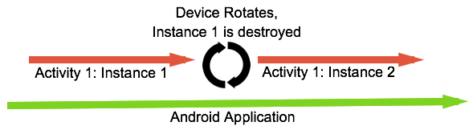

# Creating Android Services

_This guide discusses  Xamarin.Android services, which are Android components that allow work to be done without an active user interface. Services are very commonly used for tasks that are performed in the background, such as time consuming calculations, downloading files, playing music, and so on. It explains the different scenarios that services are suited for and shows how to implement them both for performing long-running background tasks as well as for providing an interface for remote procedure calls._

## Android Services Overview

Mobile apps are not like desktop apps. Desktops have copious amounts of resources such as screen real estate, memory, storage space, and a connected power supply, mobile devices do not. These constraints force mobile apps to behave differently. For example, the small screen on a mobile device typically means that only one app (i.e. Activity) is visible at a time. Other Activities are moved to the background and pushed into a suspended state where they cannot perform any work. However, just because an Android application is in the background does not mean that it is impossible for app to keep working. 

Android applications are made up of at least one of the following four primary components: _Activities_, _Broadcast Receivers_, _Content Providers_, and _Services_. Activities are the cornerstone of many great Android applications because they provide the UI that allows a user to interact with the application. However, when it comes to performing concurrent or background work, Activities are not always the best choice.

The primary mechanism for background work in Android is the _service_. An Android service is a component that is designed to do some work  without a user interface. A service might download a file, play music, or apply a filter to an image. Services can also be used for interprocess communication (_IPC_) between Android applications. For example one Android app might use the music player service that is from another app or an app might expose data (such as a person's contact information) to other apps via a service. 

Services, and their ability to perform background work, are crucial to providing a smooth and fluid user interface. All Android applications have a _main thread_ (also known as a _UI thread_) on which the Activities are run. To keep the device responsive, Android must be able to update the user interface at the rate of 60 frames per second. If an Android app performs too much work on the main thread, then Android will drop frames, which in turn causes the UI to appear jerky (also sometimes referred to as _janky_). This means that any work performed on the UI thread should complete in the time span between two frames, approximately 16 milliseconds (1 second every 60 frames). 

To address this concern, a developer may use threads in an Activity to perform some work that would block the UI. However, this could cause problems. It is very possible that Android will destroy and recreate the multiple instances of the Activity. However, Android will not automatically destroy the threads, which could result in memory leaks. A prime example of this is when the [device is rotated](~/android/app-fundamentals/handling-rotation.md) &ndash; Android will try to destroy the instance of the Activity and then recreate a new one:

This is a potential memory leak &ndash; the thread created by the first instance of the Activity will still be running. If the thread has a reference to the first instance of the Activity, this will prevent Android from garbage collecting the object. However, the second instance of the Activity is still created (which in turn might create a new thread). Rotating the device several times in rapid succession may exhaust all the RAM and force Android to terminate the entire application to reclaim memory.

As a rule of thumb, if the work to be performed should outlive an Activity, then a service should be created to perform that work. However, if the work is only applicable in the context of an Activity, then creating a thread to perform the work might be more appropriate. For example, creating a thumbnail for a photo that was just added to a photo gallery app should probably occur in a service. However, a thread might be more appropriate to play some music that should only be heard while an Activity is in the foreground.

Background work can be broken down into two broad classifications:

1. **Long Running Task** &ndash; This is work that is ongoing until explicitly stopped. An example of a _long running task_ is an app that streams music or that must monitor data collected from a sensor. These tasks must run even though the application has no visible user interface.
2. **Periodic Tasks** &ndash; (sometimes referred to as a _job_) A periodic task is one that is of relatively short in duration (several seconds) and is run on a schedule (i.e. once a day for a week or perhaps just once in the next 60 seconds). An example of this is downloading a file from the internet or generating a thumbnail for an image.

There are four different types of Android services:

* **Bound Service** &ndash; A _bound service_ is a service that  has some other component (typically an Activity) bound to it. A bound service provides an interface that allows the bound component and the service to interact with each other. Once there are no more clients bound to the service, Android will shut the service down. 

* **`IntentService`** &ndash; An _`IntentService`_ is a specialized subclass of the `Service` class that simplifies service creation and usage. An `IntentService` is meant to handle individual autonomous calls. Unlike a service, which can concurrently handle multiple calls, an `IntentService` is more like a _work queue processor_ &ndash; work is queued up and an `IntentService` processes each job one at a time on a single worker thread. Typically, an`IntentService` is not bound to an Activity or a Fragment. 

* **Started Service** &ndash; A _started service_ is a service that has been started by some other Android component (such as an Activity) and is run continuously in the background until something explicitly tells the service to stop. Unlike a bound service, a started service does not have any clients directly bound to it. For this reason, it is important to design started services so that they may be gracefully restarted as necessary.

* **Hybrid Service** &ndash; A _hybrid service_ is a service that has the characteristics of a _started service_ and a _bound service_. A hybrid service can be started by when a component binds to it or it may be started by some event. A client component may or may not be bound to the hybrid service. A hybrid service will keep running until it is explicitly told to stop, or until there are no more clients bound to it.

Which type of service to use is very dependent on application requirements. As a rule of thumb, an `IntentService` or a bound service are sufficient for most tasks that an Android application must perform, so  preference should be given to one of those two types of services. An `IntentService` is a good choice for "one-shot" tasks, such as downloading a file, while a bound service would be suitable when frequent interactions with an Activity/Fragment is required. 

While most services run in the background, there is a special sub-category known as a _foreground service_. This is a service that is given a higher priority (compared to a normal service) to perform some work for the user (such as playing music). 

It is also possible to run a service in its own process on the same device, this is sometimes referred to as a _remote service_ or as an _out-of-process service_. This does require more effort to create, but can be useful for when an application needs to share functionality with other applications, and can, in some cases, improve the user experience of an application. 

### Background Execution Limits in Android 8.0

Starting in Android 8.0 (API level 26), an Android application no longer have the ability to run freely in the background. When in the foreground, an app can start and run services without restriction. When an application moves into the background, Android will grant the app a certain amount of time to start and use services. Once that time has elapsed, the app can no longer start any services and any services that were started will be terminated. At this point it is not possible for the app to perform any work. Android considers an application to be in the foreground if one of the following conditions are met:

* There is a visible activity (either started or paused).
* The app has started a foreground service.
* Another app is in the foreground and is using components from an app that would be otherwise in the background. An example of this is if Application A, which is in the foreground, is bound to a service provided by Application B. Application B would then also be considered in the foreground, and not terminated by Android for being in the background.

There are some situations where, even though an app is in the background,  Android will wake up the app and relax these restrictions for a few minutes, allowing the app to perform some work:

* A high priority Firebase Cloud Message is received by the app.
* The app receives a broadcast. 
* The application receives and executes a `PendingIntent` in response to a Notification.

Existing Xamarin.Android applications may have to change how they perform background work to avoid any issues that might arise on Android 8.0. Here are some practical alternatives to an Android service:

* **Schedule work to run in the background using the Android Job Scheduler or the [Firebase Job Dispatcher](~/android/platform/firebase-job-dispatcher.md)** &ndash; These two libraries provide a framework for applications to segregate background work in to _jobs_, a discrete unit of work. Apps can then schedule the job with the operating system along with some criteria about when the job can run.
* **Start the service in the foreground** &ndash; a foreground service is useful for when the app must perform some task in the background and the user may need to periodically interact with that task. The foreground service will display a persistent notification so that the user is aware that the app is running a background task and also provides a way to monitor or interact with the task. An example of this would be a podcasting app that is playing back a podcast to the user or perhaps downloading a podcast episode so that it can be enjoyed later. 
* **Use a high priority Firebase Cloud Message (FCM)** &ndash; When Android receives a high priority FCM for an app, it will allow that app to run services in the background for a short period of time. This would be a good alternative to having a background service that polls an app in the background. 
* **Defer work for when the app comes into the foreground** &ndash; If none of the previous solutions are viable, then apps must develop their own way to pause and resume work when the app comes to the foreground.

## Related Links

* [Android Oreo Background Execution Limits](https://www.youtube.com/watch?v=Pumf_4yjTMc)
