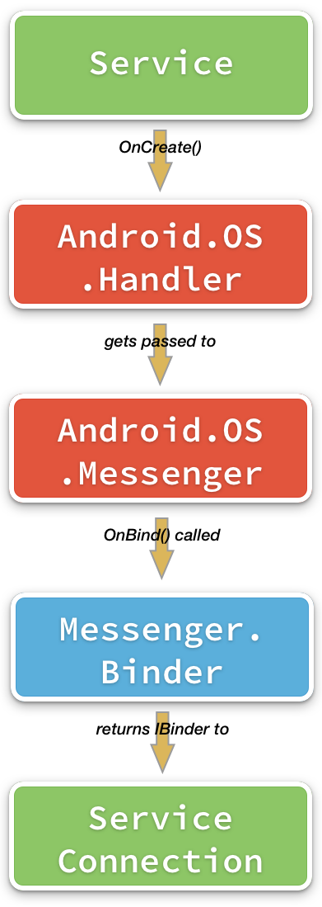
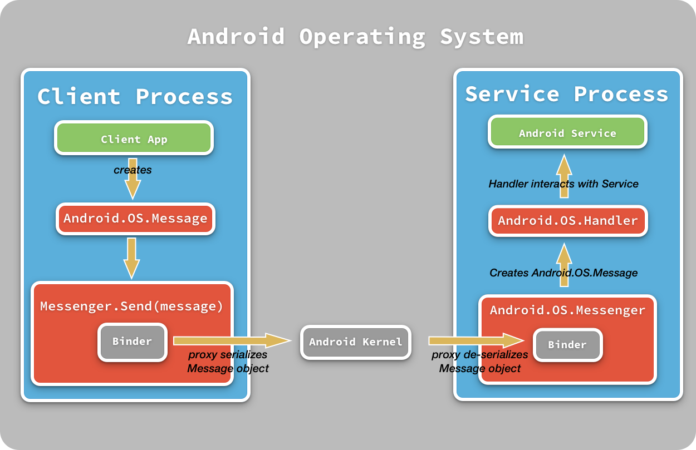
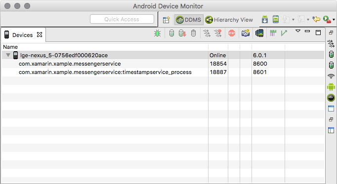
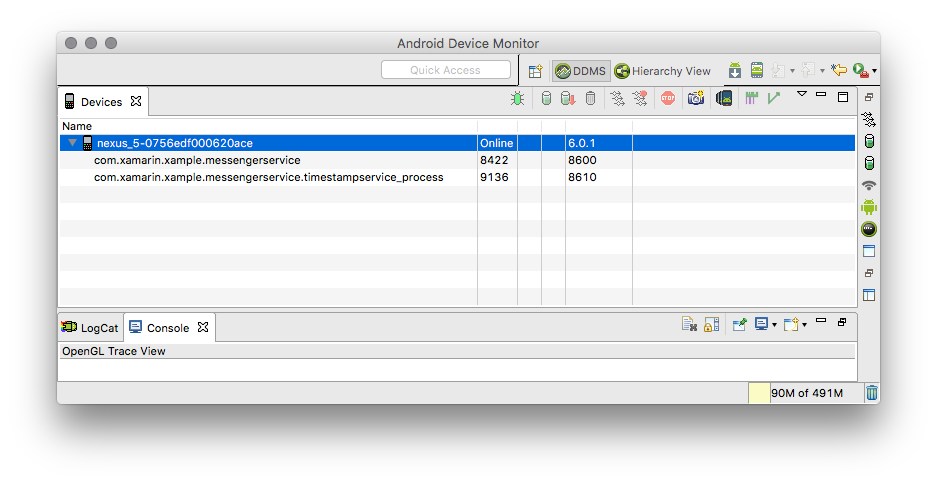
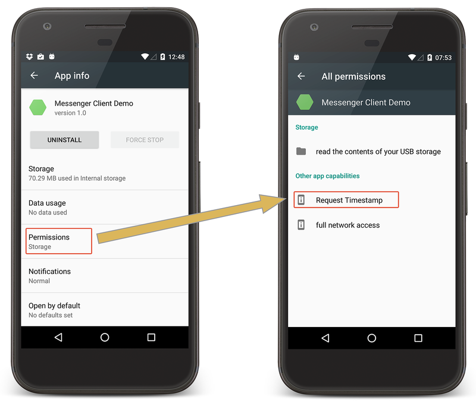

# Running Android Services in Remote Processes

_Generally, all components in an Android application will run in the same process. Android services are a notable exception to this in that they can be configured to run in their own processes and shared with other applications, including those from other Android developers. This guide will discuss how to create and use an Android remote service using Xamarin._

## Out of Process Services Overview

When an application starts up, Android creates a process in which to run the application. Typically, all the components the application will run in this one process. Android services are a notable exception to this in that they can be configured to run in their own processes and shared with other applications, including those from other Android developers. These types of services are referred to as _remote services_ or _out-of-process services_. The code for these services will be contained in the same APK as the main application; however, when the service is started Android will create a new process for just that service. In contrast, a service that runs in the same process as the rest of the application is sometimes referred to as a _local service_.

In general, it is not necessary for an application to implement a remote service. A local service is sufficient (and desirable) for an app's requirements in many cases. An out-of-process has it's own memory space which must be managed by Android. Although this does introduce more overhead to the overall application, there are some scenarios where it can be advantageous to run a service in its own process:

1. **Sharing Functionality** &ndash; Some application developers may have multiple apps and functionality that is shared between all the applications. Packaging that functionality in an Android service which runs in its own process may simplify application maintenance. It is also possible to package the service in its own stand-alone APK and deploy it separately from the rest of the application.
2. **Improving the User Experience** &ndash; There are two possible ways that an out-of-process service can improve the user experience of the application. The first way deals with memory management. When a garbage collection (GC) cycle occurs, Android will pause all activity in the process until the GC is complete. The user might perceive this pause as a "stutter" or "jank". When a service is running in it's own process, it is the service process that is paused, not the application process. This pause will be much less noticeable to the user as the application process (and therefore the user interface) is not paused.

    Secondly, if the memory requirements of a process becomes too large, Android may kill that process to free up resources for the device. If a service does have a large memory footprint and it is running in the same process as the UI, then when Android forcibly reclaims those resources the UI will be shut down, forcing the user to start the app. However, if a service, running in its own process is shut down by Android, the UI process remains unaffected. The UI can bind (and restart) the service, transparent to the user, and resume normal functioning.

3. **Improving Application Performance** &ndash; The UI process may be terminated or shut down independent of the service process. By moving lengthy startup tasks to an out-of-process service, it is possible that the startup time of the UI maybe improved (assuming that the service process is kept alive in between the times that UI is launched).

In many ways, binding to a service running in another process is the same as [binding to a local service](~/android/app-fundamentals/services/creating-a-service/bound-services.md). The client will invoke `BindService` to bind (and start, if necessary) the service. An `Android.OS.IServiceConnection` object will be created to manage the connection between the client and the service. If the client successfully binds to the service, then Android will return an object via the `IServiceConnection` that can be used to invoke methods on the service. The client then interacts with the service using this object. To review, here are the steps to bind to a service:

- **Create an Intent** &ndash; An explicit intent must be used to binding to the service.
- **Implement and Instantiate an `IServiceConnection` object** &ndash; The `IServiceConnection` object acts as an intermediary between the client and the service.  It is responsible for monitoring the connection between client and server.
- **Invoke the `BindService` method** &ndash; Calling `BindService` will dispatch the intent and the service connection created in the previous steps to Android, which will take care of starting the service and establishing communication between client and service.

The need to cross process boundaries does introduce extra complexity: the communication is one-way (client to server) and the client can't directly invoke methods on the service class. Recall that when a service is running the same process as the client, Android provides an `IBinder` object which may allow for  two-way communication. This is not the case with service running in its own process. A client communicates with a remote service with the help of the `Android.OS.Messenger` class.

When a client requests to bind with the remote service, Android will invoke the `Service.OnBind` lifecycle method, which will return the internal `IBinder` object that is encapsulated by the `Messenger`. The `Messenger` is a thin wrapper over a special `IBinder` implementation that is provided by the Android SDK. The `Messenger` takes care of the communication between the two different processes. The developer is unconcerned with the details of serializing a message, marshalling the message across the process boundary, and then deserializing it on the client. This work is handled by the `Messenger` object. This diagram shows the client-side Android components that are involved when a client initiates binding to an out-of-process service:


The `Service` class in the remote process will go through the same lifecycle callbacks that a bound service in a local process will go through, and many of the APIs involved are the same. `Service.OnCreate` is used to initialize a `Handler` and inject that into `Messenger` object. Likewise, `OnBind` is overridden, but instead of returning an `IBinder` object, the service will return the `Messenger`.  This diagram illustrates what happens in the service when a client is binding to it:



When a `Message` is received by a service, it is processed by in instance of `Android.OS.Handler`. The service will implement its own `Handler` subclass that must override the `HandleMessage` method. This method is invoked by the `Messenger` and receives the `Message` as a parameter. The `Handler` will inspect the `Message` meta-data and use that information to invoke methods on the service.

One-way communication occurs when a client creates a `Message` object and dispatches it to the service using the `Messenger.Send` method. `Messenger.Send` will serialize the `Message` and hand that serialized data off to Android, which will route the message across the process boundary and to the service.  The `Messenger` that is hosted by the service will create a `Message` object from the incoming data. This `Message` is placed into a queue, where messages are submitted one at a time to the `Handler`. The `Handler` will inspect the meta-data contained in the `Message` and invoke the appropriate methods on the `Service`. The following diagram illustrates these various concepts in action:



This guide will discuss the details of implementing an out-of-process service. It will discuss how to implement a service that is meant to run in its own process and how a client may communicate with that service using the `Messenger` framework. It will also briefly discuss two-way communication: the client sending a message to a service and the service sending a message back to the client. Because services can be shared between different applications, this guide will also discuss one technique for limiting client access to the service by using Android permissions.

> [!IMPORTANT]
> [Bugzilla 51940/GitHub 1950 - Services with isolated processes and custom Application class fail to resolve overloads properly](https://github.com/xamarin/xamarin-android/issues/1950) reports that a Xamarin.Android service will not start up properly when the `IsolatedProcess` is set to `true`. This guide is provided for a reference. A Xamarin.Android application should still be able to communicate with an out-of-process service that is written in Java.

## Requirements

This guide assumes familiarity with creating services.

Although it is possible to use implicit intents with apps that target older Android APIs, this guide will focus exclusively on the use of explicit intents. Apps targeting Android 5.0 (API level 21) or higher must use an explicit intent to bind with a service; this is the technique that will be demonstrated in this guide..

## Create a Service that Runs in a Separate Process

As described above, the fact that a service is running in its own process means that some different APIs are involved. As a quick overview, here are the steps to bind with and consume a remote service:  

- **Create the `Service` subclass** &ndash; Subclass the `Service` type and implement the lifecycle methods for a bound service. It is also necessary to set meta-data that will inform Android that the service is to run in its own process.
- **Implement a `Handler`** &ndash; The `Handler` is responsible for analyzing the client requests, extracting any parameters that were passed from the client, and invoking the appropriate methods on the service.
- **Instantiate a `Messenger`** &ndash; As described above, each `Service` must maintain an instance of the `Messenger` class that will route client requests to the `Handler` that was created in the previous step.

A service that is meant to run in its own process is, fundamentally, still a bound service. The service class will extend the base `Service` class and is decorated with the `ServiceAttribute` containing the meta-data that Android needs to bundle in the Android manifest. To begin with, the following properties of the `ServiceAttribute` that are important to an out-of-process service:

1. `Exported` &ndash; This property must be set to `true` to allow other applications to interact with the service. The default value of this property is `false`.
2. `Process` &ndash; This property must be set. It is used to specify the name of the process that the service will run in.
3. `IsolatedProcess` &ndash; This property will enable extra security, telling Android to run the service in an isolated sandbox with minimal permission to interact with the rest of the system.
4. `Permission` &ndash; It is possible to control client access to the service by specifying a permission that clients must request (and be granted).

To run a service its own process, the `Process` property on the `ServiceAttribute` must be set to the name of the service. To interact with outside applications, the `Exported` property should be set to `true`. If `Exported` is `false`, then only clients in the same APK (i.e. the same application) and running in the same process will be able to interact with the service.

What kind of process the service will run in depends on the value of the `Process` property. Android identifies three different types of processes:

- **Private Process** &ndash; A private process is one that is only
    available to the application that started it. To identify a process
    as private, its name must start with a **:** (semi-colon). The
    service depicted in the previous code snippet and screenshot is a private 
    process. The following code snippet is an example of the
    `ServiceAttribute`:

    ```csharp
    [Service(Name = "com.xamarin.TimestampService",
             Process=":timestampservice_process",
             Exported=true)]
    ```

- **Global Process** &ndash; A service that is run in a global
    process is accessible to all applications running on the device. A
    global process must be a fully qualified class name that starts
    with a lower case character.
    (Unless steps are taken to secure the service, other applications
    may bind and interact with it. Securing the service against
    unauthorized use will be discussed later in this guide.)

    ```csharp
    [Service(Name = "com.xamarin.TimestampService",
             Process="com.xamarin.xample.messengerservice.timestampservice_process",
             Exported=true)]
    ```

- **Isolated Process** &ndash; An isolated process is a process that
    runs in its own sandbox, isolated from the rest of the system and
    with no special permissions of its own. To run a service in an
    isolated process, the `IsolatedProcess` property of the
    `ServiceAttribute` is set to `true` as shown in this code snippet:
    
    ```csharp
    [Service(Name = "com.xamarin.TimestampService",
             IsolatedProcess= true,
             Process="com.xamarin.xample.messengerservice.timestampservice_process",
             Exported=true)]
    ```

An isolated service is a simple way to secure an application and
the device against untrusted code. For example, an app may download
and execute a script from a website. In this case, performing this
in an isolated process provides an additional layer of security
against untrusted code compromising the Android device.

> [!IMPORTANT]
> Once a service has been exported, the name of the service should not change. Changing the name of the service may break other applications that are using the service.

To see the effect that the `Process` property has, the following
screenshot shows a service running in its own private process:



This next screenshot shows `Process="com.xamarin.xample.messengerservice.timestampservice_process"`
and the service running in a global process:



Once the `ServiceAttribute` has been set, the service needs to implement a `Handler`.

### Implementing a Handler

To process client requests, the service must implement a `Handler` and override the `HandleMessage` method. This is the method takes a `Message` instance which encapsulates the method call from the client and translates that call into some action or task that the service will perform. The `Message` object exposes a property called `What` which is an integer value, the meaning of which is shared between the client and the service and relates to some task that the service is to perform for the client.

The following code snippet from the sample application shows one example of `HandleMessage`. In this example, there are two actions that a client can request of the service:

- The first action is a _Hello, World_ message, the client has sent a simple message to the service.
- The second action will invoke a method on the service and retrieve a string, in this case the string is a message that returns what time the service started and how long it has been running:

```csharp
public class TimestampRequestHandler : Android.OS.Handler
{
    // other code omitted for clarity

    public override void HandleMessage(Message msg)
    {
        int messageType = msg.What;
        Log.Debug(TAG, $"Message type: {messageType}.");

        switch (messageType)
        {
            case Constants.SAY_HELLO_TO_TIMESTAMP_SERVICE:
                // The client has sent a simple Hello, say in the Android Log.
                break;

            case Constants.GET_UTC_TIMESTAMP:
                // Call methods on the service to retrieve a timestamp message.
                break;
            default:
                Log.Warn(TAG, $"Unknown messageType, ignoring the value {messageType}.");
                base.HandleMessage(msg);
                break;
        }
    }
}
```

It is also possible to package parameters for the service in the `Message`. This will be discussed later in this guide. The next topic to consider is creating the `Messenger` object to process the incoming `Message`s.

### Instantiating the Messenger

As previously discussed, deserializing the `Message` object and invoking `Handler.HandleMessage` is the responsibility of the `Messenger` object. The `Messenger` class also provides an `IBinder` object that the client will use to send messages to the service.  

When the service starts, it will instantiate the `Messenger` and inject the `Handler`. A good place to perform this initialization is on the `OnCreate` method of the service. This code snippet is one example of a service that initializes its own `Handler` and `Messenger`:

```csharp
private Messenger messenger; // Instance variable for the Messenger

public override void OnCreate()
{
    base.OnCreate();
    messenger = new Messenger(new TimestampRequestHandler(this));
    Log.Info(TAG, $"TimestampService is running in process id {Android.OS.Process.MyPid()}.");
}
```

At this point, the final step is for the `Service` to override `OnBind`.

### Implementing Service.OnBind

All bound services, whether they run in their own process or not, must implement the `OnBind` method. The return value of this method is some object that the client can use to interact with the service. Exactly what that object is depends whether the service is a local service or a remote service. While a local service will return a custom `IBinder` implementation, a remote service will return the `IBinder` that is encapsulated but the `Messenger` that was created in the previous section:

```csharp
public override IBinder OnBind(Intent intent)
{
    Log.Debug(TAG, "OnBind");
    return messenger.Binder;
}
```

Once these three steps are accomplished, the remote service can be considered complete.

## Consuming the Service

All clients must implement some code to be able to bind and consume the remote service. Conceptually, from the client's viewpoint, there are very few differences between binding to local service or a remote service. The client invokes the `BindService` method, passing an explicit intent to identify the service and an `IServiceConnection` that helps manage the connection between the client and the service.

This code snippet is an example of how to create an **explicit intent** for binding to a remote service. The intent must identify the package that contains the service and the name of the service. One way to set this information is to use an `Android.Content.ComponentName` object and to provide that to the intent. This code snippet is one example:  

```csharp
// This is the package name of the APK, set in the Android manifest
const string REMOTE_SERVICE_COMPONENT_NAME = "com.xamarin.TimestampService";
// This is the name of the service, according the value of ServiceAttribute.Name
const string REMOTE_SERVICE_PACKAGE_NAME   = "com.xamarin.xample.messengerservice";

// Provide the package name and the name of the service with a ComponentName object.
ComponentName cn = new ComponentName(REMOTE_SERVICE_PACKAGE_NAME, REMOTE_SERVICE_COMPONENT_NAME);
Intent serviceToStart = new Intent();
serviceToStart.SetComponent(cn);
```

When the service is bound, the `IServiceConnection.OnServiceConnected` method is invoked and provides an `IBinder` to a client. However, the client will not directly use the `IBinder`. Instead, it will instantiate a `Messenger` object from that `IBinder`. This is the `Messenger` that the client will use to interact with the remote service.

The following is an example of a very basic `IServiceConnection` implementation that demonstrates how a client would handle connecting to and disconnecting from a service. Notice that the `OnServiceConnected` method receives and `IBinder`, and the client creates a `Messenger` from that `IBinder`:

```csharp
public class TimestampServiceConnection : Java.Lang.Object, IServiceConnection
{
    static readonly string TAG = typeof(TimestampServiceConnection).FullName;

    MainActivity mainActivity;
    Messenger messenger;

    public TimestampServiceConnection(MainActivity activity)
    {
        IsConnected = false;
        mainActivity = activity;
    }

    public bool IsConnected { get; private set; }
    public Messenger Messenger { get; private set; }

    public void OnServiceConnected(ComponentName name, IBinder service)
    {
        Log.Debug(TAG, $"OnServiceConnected {name.ClassName}");

        IsConnected = service != null;
        Messenger = new Messenger(service);

        if (IsConnected)
        {
            // things to do when the connection is successful. perhaps notify the client? enable UI features?
        }
        else
        {
            // things to do when the connection isn't successful.
        }
    }

    public void OnServiceDisconnected(ComponentName name)
    {
        Log.Debug(TAG, $"OnServiceDisconnected {name.ClassName}");
        IsConnected = false;
        Messenger = null;

        // Things to do when the service disconnects. perhaps notify the client? disable UI features?

    }
}
```

Once the service connection and the intent are created, it is possible for the client to call `BindService` and initiate the binding process:

```csharp
var serviceConnection = new TimestampServiceConnection(this);
BindService(serviceToStart, serviceConnection, Bind.AutoCreate);
```

After the client has successfully bound to the service and the `Messenger` is available, it is possible for the client to send `Messages` to the service.

## Sending Messages to the Service

Once the client is connected and has a `Messenger` object, it is possible to communicate with the service by dispatching `Message` objects via the `Messenger`. This communication is one-way, the client sends the message but there is no return message from the service to the client. In this regard, the `Message` is a fire-and-forget mechanism.

The preferred way to create a `Message` object is to use the [`Message.Obtain`](xref:Android.OS.Message) factory method. This method will pull a `Message` object from a global pool that is maintained by Android. `Message.Obtain` also has some overloaded methods that allow the `Message` object to be initialized with the values and parameters required by the service.  Once the `Message` is instantiated, it dispatched to the service by calling `Messenger.Send`. This snippet is one example of creating and dispatching a `Message` to the service process:

```csharp
Message msg = Message.Obtain(null, Constants.SAY_HELLO_TO_TIMESTAMP_SERVICE);
try
{
    serviceConnection.Messenger.Send(msg);
}
catch (RemoteException ex)
{
    Log.Error(TAG, ex, "There was a error trying to send the message.");
}
```

There are several different forms of the `Message.Obtain` method. The previous example uses the [`Message.Obtain(Handler h, Int32 what)`](xref:Android.OS.Message.Obtain). Because this is an asynchronous request to an out-of-process service; there will be no response from the service, so the `Handler` is set to `null`. The second parameter, `Int32 what`, will be stored in the `.What` property of the `Message` object. The `.What` property is used by code in the service process to invoke methods on the service.

The `Message` class also exposes two additional properties that may be of use to the recipient: `Arg1` and `Arg2`. These two properties are integer values that may have some special agreed upon values that have meaning between the client and the service. For example, `Arg1` may hold a customer ID and `Arg2` may hold a purchase order number for that customer. The [`Method.Obtain(Handler h, Int32 what, Int32 arg1, Int32 arg2)`](xref:Android.OS.Message.Obtain) can be used to set the two properties when the `Message` is created. Another way to populate these two values is to  set the `.Arg` and `.Arg2` properties directly on the `Message` object after it has been created.

### Passing Additional Values to the Service

It is possible to pass more complex data to the service by using a `Bundle`. In this case, extra values can be placed in a `Bundle` and sent along with the `Message` by setting the [`.Data` property](xref:Android.OS.Message.Data) property before sending.

```csharp
Bundle serviceParameters = new Bundle();
serviceParameters.

var msg = Message.Obtain(null, Constants.SERVICE_TASK_TO_PERFORM);
msg.Data = serviceParameters;

messenger.Send(msg);
```

> [!NOTE]
> In general, a `Message` should not have a payload larger than 1MB. The size limit may vary according the version of Android and on any proprietary changes the vendor might have made to their implementation of the Android Open Source Project (AOSP) that is bundled with the device.

## Returning Values from the Service

The messaging architecture that has been discussed to this point is one-way, the client sends a message to the service. If it is necessary for the service to return a value to a client then everything that has been discussed to this point is reversed. The service must create a `Message`, packaged any return values, and dispatch the `Message` via a `Messenger` to the client. However, the service does not create its own `Messenger`; instead, it relies on the client instantiating and package a `Messenger` as part of the initial request. The service will `Send` the message using this client-provided `Messenger`.  

The sequence of events for two-way communication is this:

1. The client binds to the service. When the service and the client connect, the `IServiceConnection` that is maintained by the client will have a reference to a `Messenger` object that is used to transmit `Message`s to the service. To avoid confusion, this will be referred to as the _Service Messenger_.
2. Client instantiates a `Handler` (referred to as the _Client Handler_) and uses that to initialize its own `Messenger` (the _Client Messenger_). Note that the Service Messenger and the Client Messenger are two different objects that handle traffic in two different directions. The Service Messenger handles messages from the client to the service, while the Client Messenger will handle messages from the service to the client.
3. The client creates a `Message` object, and sets the `ReplyTo` property with the Client Messenger. The message is then sent to the service using the Service Messenger.
4. The service receives the message from the client, and performs the requested work.
5. When it is time for the service to send the response to the client, it will use `Message.Obtain` to create a new `Message` object.
6. To send this message to the client, the service will extract the Client Messenger from the `.ReplyTo` property of the client message and use that to `.Send` the `Message` back to the client.
7. When the response is received by the client, it has its own `Handler` that will process the `Message` by inspecting the `.What` property (and if necessary, extracting any parameters contained by the `Message`).

This sample code demonstrates how the client will instantiate the `Message` and package a `Messenger` that the service should use for its response:

```csharp
Handler clientHandler = new ActivityHandler();
Messenger clientMessenger = new Messenger(activityHandler);

Message msg = Message.Obtain(null, Constants.GET_UTC_TIMESTAMP);
msg.ReplyTo = clientMessenger;

try
{
    serviceConnection.Messenger.Send(msg);
}
catch (RemoteException ex)
{
    Log.Error(TAG, ex, "There was a problem sending the message.");
}
```

The service must make some changes to its own `Handler` to extract the `Messenger` and use that to send replies to the client. This code snippet is an example of how the service's `Handler` would create a `Message` and send it back to the client:  

```csharp
// This is the message that the service will send to the client.
Message responseMessage = Message.Obtain(null, Constants.RESPONSE_TO_SERVICE);
Bundle dataToReturn = new Bundle();
dataToReturn.PutString(Constants.RESPONSE_MESSAGE_KEY, "This is the result from the service.");
responseMessage.Data = dataToReturn;

// The msg object here is the message that was received by the service. The service will not instantiate a client,
// It will use the client that is encapsulated by the message from the client.
Messenger clientMessenger = msg.ReplyTo;
if (clientMessenger!= null)
{
    try
    {
        clientMessenger.Send(responseMessage);
    }
    catch (Exception ex)
    {
        Log.Error(TAG, ex, "There was a problem sending the message.");
    }
}
```

Note that in the code samples above, the `Messenger` instance that is created by the client is *not* the same object that is received by the service. These are two different `Messenger` objects running in two separate processes that represent the communication channel.

## Securing the Service with Android Permissions

A service that runs in a global process is accessible by all applications running on that Android device. In some situations, this openness and availability is undesirable, and it is necessary to secure the service against access from unauthorized clients. One way to limit access to the remote service is to use Android Permissions.

Permissions can be identified by the `Permission` property of the `ServiceAttribute` that decorates the `Service` sub-class. This will name a permission that the client must be granted when binding to the service. If the client does not have the appropriate permissions, then Android will throw a `Java.Lang.SecurityException` when the client tries to bind to the service.

There are four different permission levels that Android provides:

- **normal** &ndash; This is the default permission level. It is used to identify low-risk permissions that can be automatically granted by Android to clients that request it. The user does not have to explicitly grant these permissions, but the permissions can be viewed in the app settings.
- **signature** &ndash; This is a special category of permission that will be granted automatically by Android to applications that are all signed with the same certificate. This permission is designed to make it easily for an application developer to share components or data between their apps without bothering the user for constant approvals.
- **signatureOrSystem** &ndash; This is very similar to the **signature** permissions described above. In addition to being automatically granted to apps that are signed by the same certificate, this permission will also be granted to apps that are signed the same certificate that was used to sign the apps installed with the Android system image. This permission is typically only used by Android ROM developers to allow their applications to work with third party apps. It is not commonly used by apps that are meant general distribution for the public at large.
- **dangerous** &ndash; Dangerous permissions are those that could cause problems for the user. For this reason, **dangerous** permissions must be explicitly approved by the user.

Because `signature` and `normal` permissions are automatically granted at installed time by Android, it is crucial that APK hosting the service be installed **before** the APK containing the client. If the client is installed first, Android will not grant the permissions. In this case, it will be necessary to uninstall the client APK, install the service APK, and then re-install the client APK.

There are two common ways to secure a service with Android permissions:

1. **Implement signature level security** &ndash; Signature level
    security means that permission is automatically granted to those
    applications that are signed with the same key that was used to sign
    the APK holding the service. This is a simple way for developers to
    secure their service yet keep them accessible from their own
    applications. Signature level permissions are declared by setting
    the `Permission` property of the `ServiceAttribute` to `signature`:

    ```csharp
    [Service(Name = "com.xamarin.TimestampService",
             Process="com.xamarin.TimestampService.timestampservice_process",
             Permission="signature")]
    public class TimestampService : Service
    {
    }
    ```

2. **Create a custom permission** &ndash; It is possible for the
    developer of the service to create a custom permission for the
    service. This is best for when a developer wants to share their
    service with applications from other developers. A custom permission
    requires a bit more effort to implement and will be covered below.

A simplified example of creating a custom `normal` permission will be described in the next section. For more information about Android permissions, please consult Google's documentation for [Best Practices & Security](https://developer.android.com/privacy-and-security/security-tips). For more information about Android permissions, see the [Permissions section](https://developer.android.com/guide/topics/manifest/manifest-intro.html#perms) of the Android documentation for the application manifest for more information about Android permissions.

> [!NOTE]
> In general, [Google discourages the use of custom permissions](https://developer.android.com/privacy-and-security/security-tips) as they may prove confusing to users.

### Creating a Custom Permission

To use a custom permission, it is declared by the service while the client explicitly requests that permission.

To create a permission in the service APK, a `permission` element is added to the `manifest` element in **AndroidManifest.xml**. This permission must have the `name`, `protectionLevel`, and `label` attributes set. The `name` attribute must be set to a string that uniquely identifies the permission. The name will be displayed in the **App Info** view of the **Android Settings** (as shown in the next section).

The `protectionLevel` attribute must be set to one of the four string values that were described above.  The `label` and `description` must refer to string resources and are used to provide a user-friendly name and description to the user.

This snippet is an example of declaring a custom `permission` attribute in **AndroidManifest.xml** of the APK that contains the service:

```xml
<manifest xmlns:android="http://schemas.android.com/apk/res/android"
          android:versionCode="1"
          android:versionName="1.0"
          package="com.xamarin.xample.messengerservice">

    <uses-sdk android:minSdkVersion="21" />

    <permission android:name="com.xamarin.xample.messengerservice.REQUEST_TIMESTAMP"
                android:protectionLevel="signature"
                android:label="@string/permission_label"
                android:description="@string/permission_description"
                />

    <application android:allowBackup="true"
            android:icon="@mipmap/icon"
            android:label="@string/app_name"
            android:theme="@style/AppTheme">

    </application>
</manifest>
```

Then, the **AndroidManifest.xml** of the client APK must explicitly request this new permission. This is done by adding the `users-permission` attribute to the **AndroidManifest.xml**:

```xml
<?xml version="1.0" encoding="utf-8"?>
<manifest xmlns:android="http://schemas.android.com/apk/res/android"
          android:versionCode="1"
          android:versionName="1.0"
          package="com.xamarin.xample.messengerclient">

    <uses-sdk android:minSdkVersion="21" />

    <uses-permission android:name="com.xamarin.xample.messengerservice.REQUEST_TIMESTAMP" />

    <application
            android:allowBackup="true"
            android:icon="@mipmap/icon"
            android:label="@string/app_name"
            android:theme="@style/AppTheme">
    </application>
    </manifest>
```

### View the Permissions Granted to an App

To view the permissions that an application has been granted, open the Android Settings app, and select **Apps**. Find and select the application in the list. From the **App Info** screen, tap **Permissions** which will bring up a view that shows all the permissions granted to the app:

[](out-of-process-services-images/ipc-06.png#lightbox)

## Summary

This guide was an advanced discussion about how to run an Android service in a remote process. The differences between a local and a remote service was explained, along with some reasons why a remote service can be helpful to stability and performance of an Android app. After explaining how to implement a remote service and how a client can communicate with the service, the guide went on to provide one way to limit access to the service from only authorized clients.

## Related Links

- [Handler](xref:Android.OS.Handler)
- [Message](xref:Android.OS.Message)
- [Messenger](xref:Android.OS.Messenger)
- [ServiceAttribute](xref:Android.App.ServiceAttribute)
- [The Exported attribute](https://developer.android.com/guide/topics/manifest/service-element.html#exported)
- [Processes and Threads](https://developer.android.com/guide/components/processes-and-threads.html)
- [Android Manifest - Permissions](https://developer.android.com/guide/topics/manifest/manifest-intro.html#perms)
- [Security Tips](https://developer.android.com/privacy-and-security/security-tips)
- [MessengerServiceDemo (sample)](/samples/xamarin/monodroid-samples/applicationfundamentals-servicesamples-messengerservicedemo)