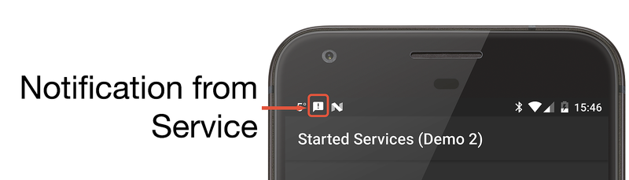
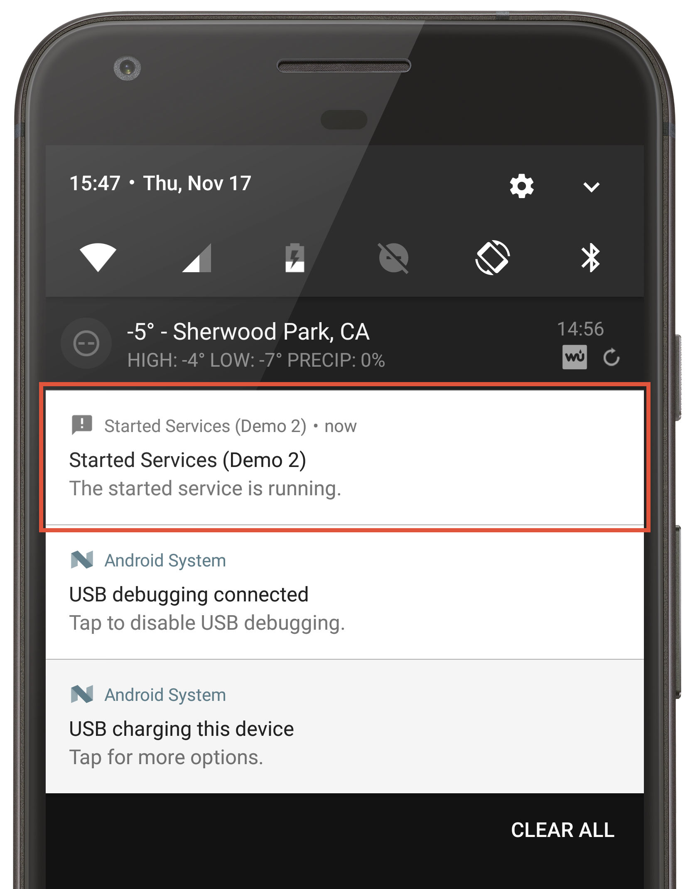

# Service Notifications

_This guide discusses how an Android service may use local notifications to dispatch information to a user._


## Service Notifications Overview

Service notifications allow an app to display information to the user, even if the Android application is not in the foreground. It is possible for a notification to provide actions for the user, such as displaying an Activity from an application. The following code sample demonstrates how a service might dispatch a notification to a user:

```csharp
[Service]
public class MyService: Service 
{
    // A notification requires an id that is unique to the application.
    const int NOTIFICATION_ID = 9000;
    
    public override StartCommandResult OnStartCommand(Intent intent, StartCommandFlags flags, int startId)
    {
        // Code omitted for clarity - here is where the service would do something.
    
        // Work has finished, now dispatch anotification to let the user know.
        Notification.Builder notificationBuilder = new Notification.Builder(this)
            .SetSmallIcon(Resource.Drawable.ic_notification_small_icon)
            .SetContentTitle(Resources.GetString(Resource.String.notification_content_title))
            .SetContentText(Resources.GetString(Resource.String.notification_content_text));
        
        var notificationManager = (NotificationManager)GetSystemService(NotificationService);
        notificationManager.Notify(NOTIFICATION_ID, notificationBuilder.Build());
    }
}
```

This screenshot is an example of the notification that is displayed:

[](service-notifications-images/01-notification.png#lightbox)

When the user slides down the notification screen from the top, the full notification is displayed:




## Updating A Notification

To update a notification, the service will republish the notification using the same notification ID. Android will display or update the notification in the status bar as necessary.

```csharp 
void UpdateNotification(string content)
{
   var notification = GetNotification(content, pendingIntent);

   NotificationManager notificationManager = (NotificationManager)GetSystemService(Context.NotificationService);
   notificationManager.Notify(NOTIFICATION_ID, notification);
}

Notification GetNotification(string content, PendingIntent intent)
{
   return new Notification.Builder(this)
           .SetContentTitle(tag)
           .SetContentText(content)
           .SetSmallIcon(Resource.Drawable.NotifyLg)
           .SetLargeIcon(BitmapFactory.DecodeResource(Resources, Resource.Drawable.Icon))
           .SetContentIntent(intent).Build();
}
```

More information about notifications is available in the [Local Notifications](~/android/app-fundamentals/notifications/local-notifications.md) section of the [Android Notifications](~/android/app-fundamentals/notifications/index.md) guide.


## Related Links

- [Local Notifications in Android](~/android/app-fundamentals/notifications/local-notifications.md)
