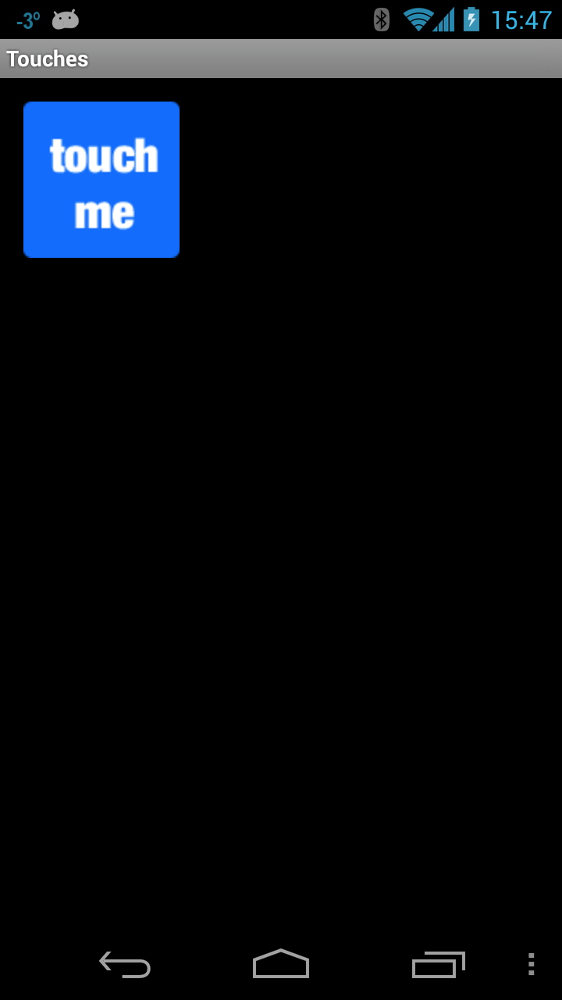
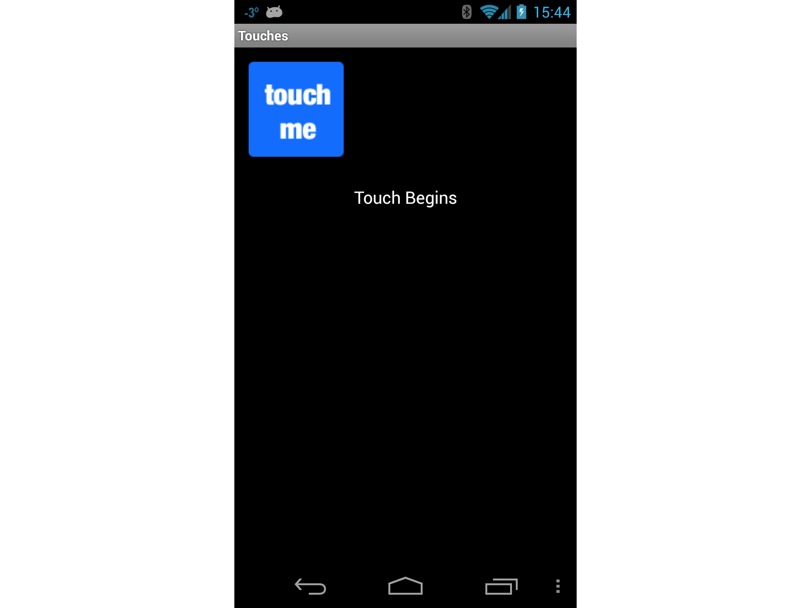
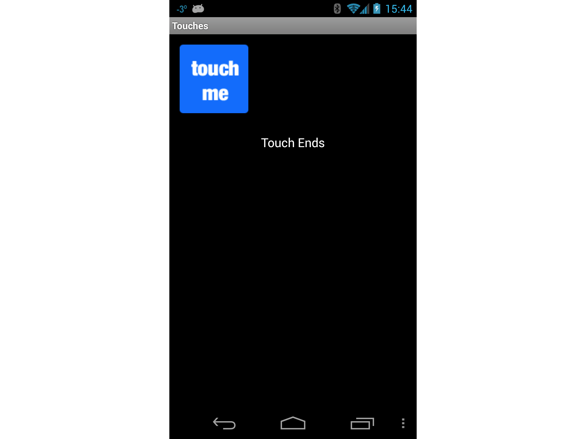
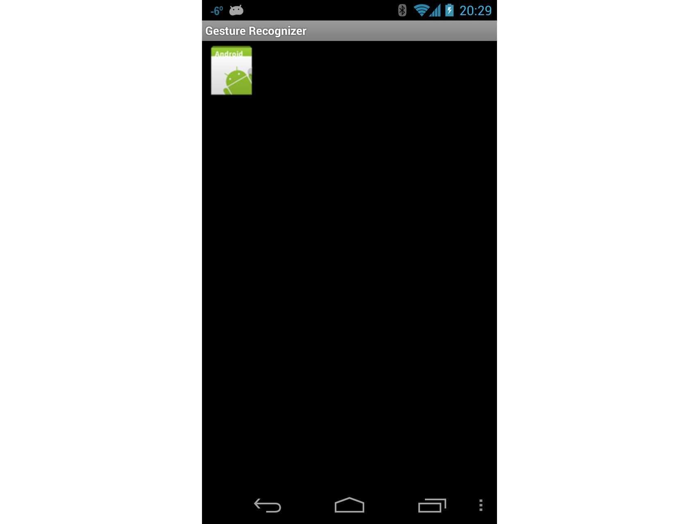
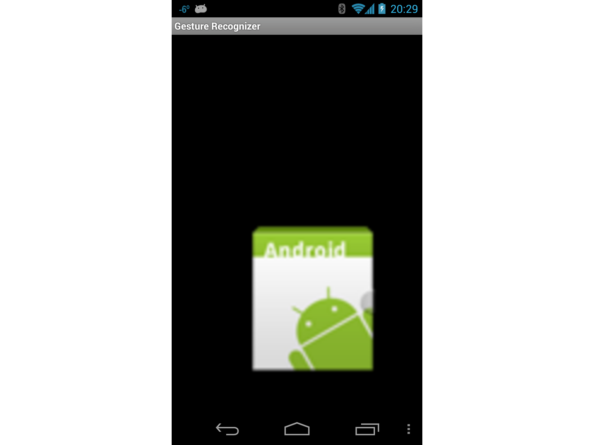
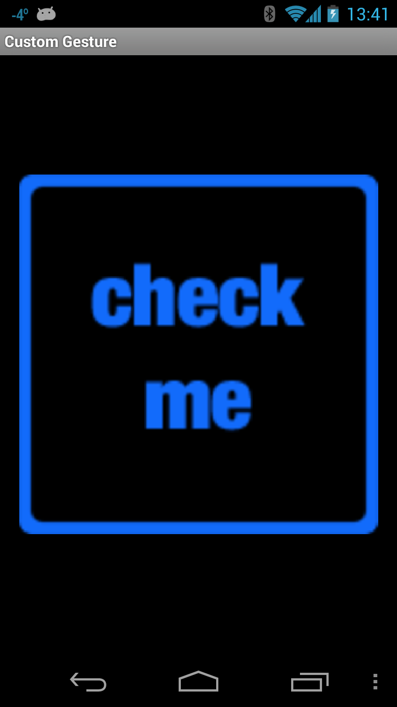
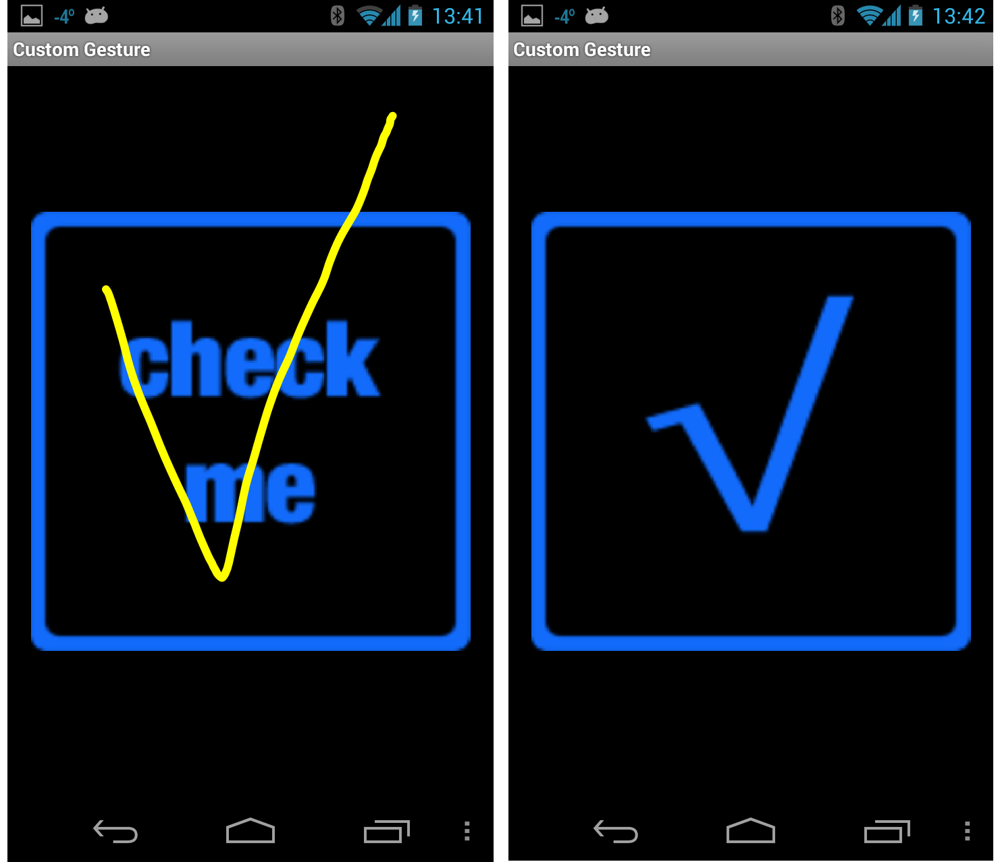
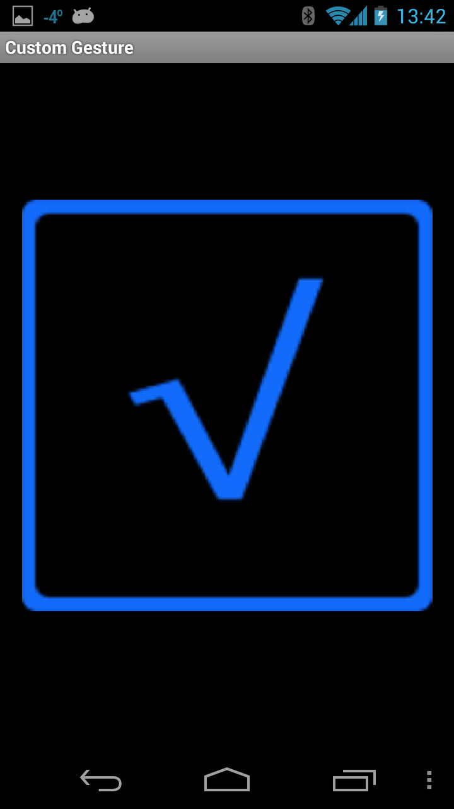

# Walkthrough - Using Touch in Android

Let us see how to use the concepts from the previous section in a
working application. We will create an application with four
activities. The first activity will be a menu or a switchboard that
will launch the other activities to demonstrate the various APIs. The
following screenshot shows the main activity:

[](android-touch-walkthrough-images/image14.png#lightbox)

The first Activity, Touch Sample, will show how to use event handlers
for touching the Views. The Gesture Recognizer activity will
demonstrate how to subclass `Android.View.Views` and handle events as
well as show how to handle pinch gestures. The third and final
activity, **Custom Gesture**, will show how use custom gestures. To
make things easier to follow and absorb, we'll break this walkthrough
up into sections, with each section focusing on one of the Activities.

## Touch Sample Activity

- Open the project **TouchWalkthrough\_Start**. The **MainActivity**
  is all set to go &ndash; it is up to us to implement the touch
  behaviour in the activity. If you run the application and click
  **Touch Sample**, the following activity should start up:

  [](android-touch-walkthrough-images/image15.png#lightbox)

- Now that we have confirmed that the Activity starts up, open the
  file **TouchActivity.cs** and add a handler for the `Touch` event
  of the `ImageView`:

  ```csharp
  _touchMeImageView.Touch += TouchMeImageViewOnTouch;
  ```

- Next, add the following method to **TouchActivity.cs**:

  ```csharp
  private void TouchMeImageViewOnTouch(object sender, View.TouchEventArgs touchEventArgs)
  {
      string message;
      switch (touchEventArgs.Event.Action & MotionEventActions.Mask)
      {
          case MotionEventActions.Down:
          case MotionEventActions.Move:
          message = "Touch Begins";
          break;

          case MotionEventActions.Up:
          message = "Touch Ends";
          break;

          default:
          message = string.Empty;
          break;
      }

      _touchInfoTextView.Text = message;
  }
  ```

Notice in the code above that we treat the `Move` and `Down` action as
the same. This is because even though the user may not lift their
finger off the `ImageView`, it may move around or the pressure exerted
by the user may change. These types of changes will generate a `Move`
action.

Each time the user touches the `ImageView`, the `Touch` event will be
raised and our handler will display the message **Touch Begins** on the
screen, as shown in the following screenshot:

[](android-touch-walkthrough-images/image15.png#lightbox)

As long as the user is touching the `ImageView`, **Touch Begins** will
be displayed in the `TextView`. When the user is no longer touching
the `ImageView`, the message **Touch Ends** will be displayed in the
`TextView`, as shown in the following screenshot:

[](android-touch-walkthrough-images/image16.png#lightbox)

## Gesture Recognizer Activity

Now lets implement the Gesture Recognizer activity. This activity will
demonstrate how to drag a view around the screen and illustrate one way
to implement pinch-to-zoom.

- Add a new Activity to the application called `GestureRecognizer`.
  Edit the code for this activity so that it resembles the following
  code:

  ```csharp
  public class GestureRecognizerActivity : Activity
  {
      protected override void OnCreate(Bundle bundle)
      {
          base.OnCreate(bundle);
          View v = new GestureRecognizerView(this);
          SetContentView(v);
      }
  }
  ```

- Add a new Android view to the project, and name it
  `GestureRecognizerView`. Add the following variables to this class:

  ```csharp
  private static readonly int InvalidPointerId = -1;

  private readonly Drawable _icon;
  private readonly ScaleGestureDetector _scaleDetector;

  private int _activePointerId = InvalidPointerId;
  private float _lastTouchX;
  private float _lastTouchY;
  private float _posX;
  private float _posY;
  private float _scaleFactor = 1.0f;
  ```

- Add the following constructor to `GestureRecognizerView`. This
  constructor will add an `ImageView` to our activity. At this point
  the code still will not compile &ndash; we need to create the class
  `MyScaleListener` that will help with resizing the `ImageView` when
  the user pinches it:

  ```csharp
  public GestureRecognizerView(Context context): base(context, null, 0)
  {
      _icon = context.Resources.GetDrawable(Resource.Drawable.Icon);
      _icon.SetBounds(0, 0, _icon.IntrinsicWidth, _icon.IntrinsicHeight);
      _scaleDetector = new ScaleGestureDetector(context, new MyScaleListener(this));
  }
  ```

- To draw the image on our activity, we need to override the `OnDraw`
  method of the View class as shown in the following snippet. This
  code will move the `ImageView` to the position specified by `_posX`
  and `_posY` as well as resize the image according to the scaling
  factor:

  ```csharp
  protected override void OnDraw(Canvas canvas)
  {
      base.OnDraw(canvas);
      canvas.Save();
      canvas.Translate(_posX, _posY);
      canvas.Scale(_scaleFactor, _scaleFactor);
      _icon.Draw(canvas);
      canvas.Restore();
  }
  ```

- Next we need to update the instance variable `_scaleFactor` as the
  user pinches the `ImageView`. We will add a class called
  `MyScaleListener`. This class will listen for the scale events that
  will be raised by Android when the user pinches the `ImageView`.
  Add the following inner class to `GestureRecognizerView`. This
  class is a `ScaleGesture.SimpleOnScaleGestureListener`. This class
  is a convenience class that listeners can subclass when you are
  interested in a subset of gestures:

  ```csharp
  private class MyScaleListener : ScaleGestureDetector.SimpleOnScaleGestureListener
  {
      private readonly GestureRecognizerView _view;

      public MyScaleListener(GestureRecognizerView view)
      {
          _view = view;
      }

      public override bool OnScale(ScaleGestureDetector detector)
      {
          _view._scaleFactor *= detector.ScaleFactor;

          // put a limit on how small or big the image can get.
          if (_view._scaleFactor > 5.0f)
          {
              _view._scaleFactor = 5.0f;
          }
          if (_view._scaleFactor < 0.1f)
          {
              _view._scaleFactor = 0.1f;
          }

          _view.Invalidate();
          return true;
      }
  }
  ```

- The next method we need to override in `GestureRecognizerView` is
  `OnTouchEvent`. The following code lists the full implementation of
  this method. There is a lot of code here, so lets take a minute and
  look what is going on here. The first thing this method does is
  scale the icon if necessary &ndash; this is handled by calling
  `_scaleDetector.OnTouchEvent`. Next we try to figure out what
  action called this method:

  - If the user touched the screen with, we record the X and Y
    positions and the ID of the first pointer that touched the
    screen.

  - If the user moved their touch on the screen, then we figure out
    how far the user moved the pointer.

  - If the user has lifted his finger off the screen, then we will
    stop tracking the gestures.

  ```csharp
  public override bool OnTouchEvent(MotionEvent ev)
  {
      _scaleDetector.OnTouchEvent(ev);

      MotionEventActions action = ev.Action & MotionEventActions.Mask;
      int pointerIndex;

      switch (action)
      {
          case MotionEventActions.Down:
          _lastTouchX = ev.GetX();
          _lastTouchY = ev.GetY();
          _activePointerId = ev.GetPointerId(0);
          break;

          case MotionEventActions.Move:
          pointerIndex = ev.FindPointerIndex(_activePointerId);
          float x = ev.GetX(pointerIndex);
          float y = ev.GetY(pointerIndex);
          if (!_scaleDetector.IsInProgress)
          {
              // Only move the ScaleGestureDetector isn't already processing a gesture.
              float deltaX = x - _lastTouchX;
              float deltaY = y - _lastTouchY;
              _posX += deltaX;
              _posY += deltaY;
              Invalidate();
          }

          _lastTouchX = x;
          _lastTouchY = y;
          break;

          case MotionEventActions.Up:
          case MotionEventActions.Cancel:
          // We no longer need to keep track of the active pointer.
          _activePointerId = InvalidPointerId;
          break;

          case MotionEventActions.PointerUp:
          // check to make sure that the pointer that went up is for the gesture we're tracking.
          pointerIndex = (int) (ev.Action & MotionEventActions.PointerIndexMask) >> (int) MotionEventActions.PointerIndexShift;
          int pointerId = ev.GetPointerId(pointerIndex);
          if (pointerId == _activePointerId)
          {
              // This was our active pointer going up. Choose a new
              // action pointer and adjust accordingly
              int newPointerIndex = pointerIndex == 0 ? 1 : 0;
              _lastTouchX = ev.GetX(newPointerIndex);
              _lastTouchY = ev.GetY(newPointerIndex);
              _activePointerId = ev.GetPointerId(newPointerIndex);
          }
          break;

      }
      return true;
  }
  ```

- Now run the application, and start the Gesture Recognizer activity.
  When it starts the screen should look something like the screenshot
  below:

  [](android-touch-walkthrough-images/image17.png#lightbox)

- Now touch the icon, and drag it around the screen. Try the
  pinch-to-zoom gesture. At some point your screen may look something
  like the following screen shot:

  [](android-touch-walkthrough-images/image18.png#lightbox)

At this point you should give yourself a pat on the back: you have just
implemented pinch-to-zoom in an Android application! Take a quick break
and lets move on to the third and final Activity in this walkthrough
&ndash; using custom gestures.

## Custom Gesture Activity

The final screen in this walkthrough will use custom gestures.

For the purposes of this Walkthrough, the gestures library has already
been created using Gesture Tool and added to the project in the file
**Resources/raw/gestures**. With this bit of housekeeping out of the way,
lets get on with the final Activity in the walkthrough.

- Add a layout file named **custom\_gesture\_layout.axml** to the
  project with the following contents. The project already has all
  the images in the **Resources** folder:

  ```xml
  <?xml version="1.0" encoding="utf-8"?>
  <LinearLayout xmlns:android="http://schemas.android.com/apk/res/android"
      android:orientation="vertical"
      android:layout_width="match_parent"
      android:layout_height="match_parent">
      <LinearLayout
          android:layout_width="match_parent"
          android:layout_height="0dp"
          android:layout_weight="1" />
      <ImageView
          android:src="@drawable/check_me"
          android:layout_width="match_parent"
          android:layout_height="0dp"
          android:layout_weight="3"
          android:id="@+id/imageView1"
          android:layout_gravity="center_vertical" />
      <LinearLayout
          android:layout_width="match_parent"
          android:layout_height="0dp"
          android:layout_weight="1" />
  </LinearLayout>
  ```

- Next add a new Activity to the project and name it
  `CustomGestureRecognizerActivity.cs`. Add two instance variables to
  the class, as showing in the following two lines of code:

  ```csharp
  private GestureLibrary _gestureLibrary;
  private ImageView _imageView;
  ```

- Edit the `OnCreate` method of the this Activity so that it
  resembles the following code. Lets take a minute to explain what is
  going on in this code. The first thing we do is instantiate a
  `GestureOverlayView` and set that as the root view of the Activity.
  We also assign an event handler to the `GesturePerformed` event of
  `GestureOverlayView`. Next we inflate the layout file that was
  created earlier, and add that as a child view of the
  `GestureOverlayView`. The final step is to initialize the variable
  `_gestureLibrary` and load the gestures file from the application
  resources. If the gestures file cannot be loaded for some reason,
  there is not much this Activity can do, so it is shutdown:

  ```csharp
  protected override void OnCreate(Bundle bundle)
  {
      base.OnCreate(bundle);

      GestureOverlayView gestureOverlayView = new GestureOverlayView(this);
      SetContentView(gestureOverlayView);
      gestureOverlayView.GesturePerformed += GestureOverlayViewOnGesturePerformed;

      View view = LayoutInflater.Inflate(Resource.Layout.custom_gesture_layout, null);
      _imageView = view.FindViewById<ImageView>(Resource.Id.imageView1);
      gestureOverlayView.AddView(view);

      _gestureLibrary = GestureLibraries.FromRawResource(this, Resource.Raw.gestures);
      if (!_gestureLibrary.Load())
      {
          Log.Wtf(GetType().FullName, "There was a problem loading the gesture library.");
          Finish();
      }
  }
  ```

- The final thing we need to do implement the method
  `GestureOverlayViewOnGesturePerformed` as shown in the following
  code snippet. When the `GestureOverlayView` detects a gesture, it
  calls back to this method. The first thing we try to get an
  `IList<Prediction>` objects that match the gesture by calling
  `_gestureLibrary.Recognize()`. We use a bit of LINQ to get the
  `Prediction` that has the highest score for the gesture.

  If there was no matching gesture with a high enough score, then the
  event handler exits without doing anything. Otherwise we check the
  name of the prediction and change the image being displayed based
  on the name of the gesture:

  ```csharp
  private void GestureOverlayViewOnGesturePerformed(object sender, GestureOverlayView.GesturePerformedEventArgs gesturePerformedEventArgs)
  {
      IEnumerable<Prediction> predictions = from p in _gestureLibrary.Recognize(gesturePerformedEventArgs.Gesture)
      orderby p.Score descending
      where p.Score > 1.0
      select p;
      Prediction prediction = predictions.FirstOrDefault();

      if (prediction == null)
      {
          Log.Debug(GetType().FullName, "Nothing seemed to match the user's gesture, so don't do anything.");
          return;
      }

      Log.Debug(GetType().FullName, "Using the prediction named {0} with a score of {1}.", prediction.Name, prediction.Score);

      if (prediction.Name.StartsWith("checkmark"))
      {
          _imageView.SetImageResource(Resource.Drawable.checked_me);
      }
      else if (prediction.Name.StartsWith("erase", StringComparison.OrdinalIgnoreCase))
      {
          // Match one of our "erase" gestures
          _imageView.SetImageResource(Resource.Drawable.check_me);
      }
  }
  ```

- Run the application and start up the Custom Gesture Recognizer
  activity. It should look something like the following screenshot:

  [](android-touch-walkthrough-images/image19.png#lightbox)

  Now draw a checkmark on the screen, and the bitmap being displayed
  should look something like that shown in the next screenshots:

  [](android-touch-walkthrough-images/image20.png#lightbox)

  Finally, draw a scribble on the screen. The checkbox should change
  back to its original image as shown in these screenshots:

  [](android-touch-walkthrough-images/image21.png#lightbox)

You now have an understanding of how to integrate touch and gestures in
an Android application using Xamarin.Android.

## Related Links

- [Android Touch Start (sample)](/samples/xamarin/monodroid-samples/applicationfundamentals-touch-start)
- [Android Touch Final (sample)](/samples/xamarin/monodroid-samples/applicationfundamentals-touch-final)