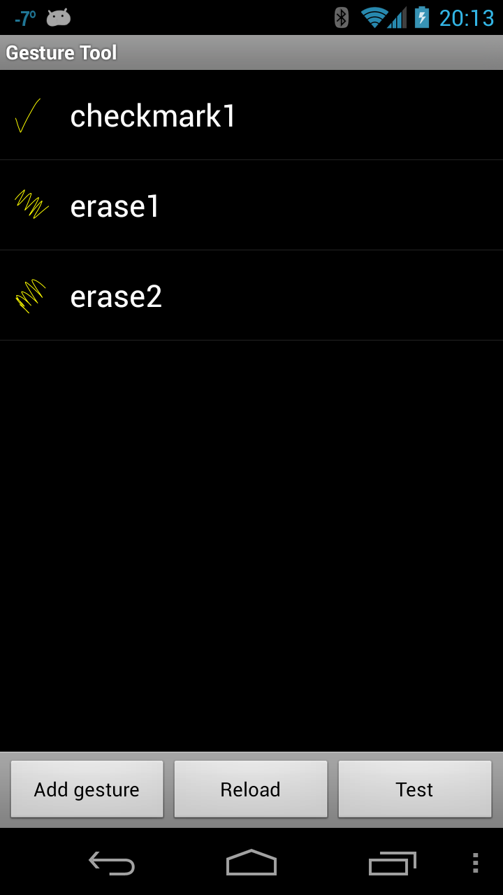

# Touch in Android

Much like iOS, Android creates an object that holds data about the
user's physical interaction with the screen &ndash; an
`Android.View.MotionEvent` object. This object holds data such as what
action is performed, where the touch took place, how much pressure was
applied, etc. A `MotionEvent` object breaks down the movement into to
the following values:

- An action code that describes the type of motion, such as the
   initial touch, the touch moving across the screen, or the touch
   ending.

- A set of axis values that describe the position of the `MotionEvent`
   and other movement properties such as where the touch is taking
   place, when the touch took place, and how much pressure was used.
   The axis values may be different depending on the device, so the
   previous list does not describe all axis values.

The `MotionEvent` object will be passed to an appropriate method in an
application. There are three ways for a Xamarin.Android application to
respond to a touch event:

- *Assign an event handler to `View.Touch`* - The `Android.Views.View`
   class has an `EventHandler<View.TouchEventArgs>` which applications
   can assign a handler to. This is typical .NET behavior.

- *Implementing `View.IOnTouchListener`* - Instances of this interface
   may be assigned to a view object using the View. `SetOnListener`
   method.This is functionally equivalent to assigning an event handler
   to the `View.Touch` event. If there is some common or shared logic
   that many different views may need when they are touched, it will be
   more efficient to create a class and implement this method than to
   assign each view its own event handler.

- *Override `View.OnTouchEvent`* - All views in Android subclass
   `Android.Views.View`. When a View is touched, Android will call the
   `OnTouchEvent` and pass it a `MotionEvent` object as a parameter.

> [!NOTE]
> Not all Android devices support touch screens. 

Adding the following tag to your manifest file causes Google Play to
only display your app to those devices that are touch enabled:

```xml
<uses-configuration android:reqTouchScreen="finger" />
```

## Gestures

A gesture is a hand-drawn shape on the touch screen. A gesture can have
one or more strokes to it, each stroke consisting of a sequence of
points created by a different point of contact with the screen. Android
can support many different types of gestures, from a simple fling
across the screen to complex gestures that involve multi-touch.

Android provides the `Android.Gestures` namespace specifically for
managing and responding to gestures. At the heart of all gestures is a
special class called `Android.Gestures.GestureDetector`. As the name
implies, this class will listen for gestures and events based on
`MotionEvents` supplied by the operating system.

To implement a gesture detector, an Activity must instantiate a
`GestureDetector` class and provide an instance of
`IOnGestureListener`, as illustrated by the following code snippet:

```csharp
GestureOverlayView.IOnGestureListener myListener = new MyGestureListener();
_gestureDetector = new GestureDetector(this, myListener);
```

An Activity must also implement the OnTouchEvent and pass the
MotionEvent to the gesture detector. The following code snippet shows
an example of this:

```csharp
public override bool OnTouchEvent(MotionEvent e)
{
    // This method is in an Activity
    return _gestureDetector.OnTouchEvent(e);
}
```

When an instance of `GestureDetector` identifies a gesture of interest,
it will notify the activity or application either by raising an event
or through a callback provided by `GestureDetector.IOnGestureListener`.
This interface provides six methods for the various gestures:

- *OnDown* - Called when a tap occurs but is not released.

- *OnFling* - Called when a fling occurs and provides data on the
   start and end touch that triggered the event.

- *OnLongPress* - Called when a long press occurs.

- *OnScroll* - Called when a scroll event occurs.

- *OnShowPress* - Called after an OnDown has occurred and a move or up
   event has not been performed.

- *OnSingleTapUp* - Called when a single tap occurs.

In many cases applications may only be interested in a subset of
gestures. In this case, applications should extend the class
GestureDetector.SimpleOnGestureListener and override the methods that
correspond to the events that they are interested in.

## Custom Gestures

Gestures are a great way for users to interact with an application. The
APIs we have seen so far would suffice for simple gestures, but might
prove a bit onerous for more complicated gestures. To help with more
complicated gestures, Android provides another set of API's in the
Android.Gestures namespace that will ease some of the burden associated
with custom gestures.

### Creating Custom Gestures

Since Android 1.6, the Android SDK comes with an application
pre-installed on the emulator called Gestures Builder. This application
allows a developer to create pre-defined gestures that can be embedded
in an application. The following screen shot shows an example of
Gestures Builder:

[](touch-in-android-images/image11.png#lightbox)

An improved version of this application called Gesture Tool can be
found Google Play. Gesture Tool is very much like Gestures Builder
except that it allows you to test gestures after they have been
created. This next screenshot shows Gestures Builder:

[](touch-in-android-images/image12.png#lightbox)

Gesture Tool is a bit more useful for creating custom gestures as it
allows the gestures to be tested as they are being created and is
easily available through Google Play.

Gesture Tool allows you create a gesture by drawing on the screen and
assigning a name. After the gestures are created they are saved in a
binary file on the SD card of your device. This file needs to be
retrieved from the device, and then packaged with an application in the
folder /Resources/raw. This file can be retrieved from the emulator using 
the Android Debug Bridge. The following example shows copying the
file from a Galaxy Nexus to the Resource directory of an application:

```shell
$ adb pull /storage/sdcard0/gestures <projectdirectory>/Resources/raw
```

Once you have retrieved the file it must be packaged with your
application inside the directory /Resources/raw. The easiest way to use
this gesture file is to load the file into a GestureLibrary, as shown
in the following snippet:

```csharp
GestureLibrary myGestures = GestureLibraries.FromRawResources(this, Resource.Raw.gestures);
if (!myGestures.Load())
{
    // The library didn't load, so close the activity.
    Finish();
}
```

### Using Custom Gestures

To recognize custom gestures in an Activity, it must have an
Android.Gesture.GestureOverlay object added to its layout. The
following code snippet shows how to programmatically add a
GestureOverlayView to an Activity:

```csharp
GestureOverlayView gestureOverlayView = new GestureOverlayView(this);
gestureOverlayView.AddOnGesturePerformedListener(this);
SetContentView(gestureOverlayView);
```

The following XML snippet shows how to add a GestureOverlayView declaratively:

```xml
<android.gesture.GestureOverlayView
    android:id="@+id/gestures"
    android:layout_width="match_parent "
    android:layout_height="match_parent" />
```

The `GestureOverlayView` has several events that will be raised during
the process of drawing a gesture. The most interesting event is
`GesturePerformed`. This event is raised when the user has completed
drawing their gesture.

When this event is raised, the Activity asks a `GestureLibrary` to try
and match the gesture that the user with one of the gestures created by
Gesture Tool. `GestureLibrary` will return a list of Prediction
objects.

Each Prediction object holds a score and name of one of the gestures in
the `GestureLibrary`. The higher the score, the more likely the gesture
named in the Prediction matches the gesture drawn by the user.
Generally speaking, scores lower than 1.0 are considered poor matches.

The following code shows an example of matching a gesture:

```csharp
private void GestureOverlayViewOnGesturePerformed(object sender, GestureOverlayView.GesturePerformedEventArgs gesturePerformedEventArgs)
{
    // In this example _gestureLibrary was instantiated in OnCreate
    IEnumerable<Prediction> predictions = from p in _gestureLibrary.Recognize(gesturePerformedEventArgs.Gesture)
    orderby p.Score descending
    where p.Score > 1.0
    select p;
    Prediction prediction = predictions.FirstOrDefault();

    if (prediction == null)
    {
        Log.Debug(GetType().FullName, "Nothing matched the user's gesture.");
        return;
    }

    Toast.MakeText(this, prediction.Name, ToastLength.Short).Show();
}
```

With this done, you should have an understanding of how to use touch
and gestures in a Xamarin.Android application. Let us now move on to a
walkthrough and see all of the concepts in a working sample
application.

## Related Links

- [Android Touch Start (sample)](/samples/xamarin/monodroid-samples/applicationfundamentals-touch-start)
- [Android Touch Final (sample)](/samples/xamarin/monodroid-samples/applicationfundamentals-touch-final)