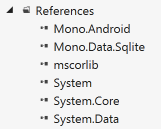
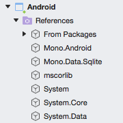
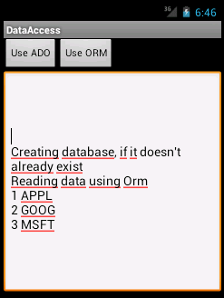

# Using ADO.NET with Android

Xamarin has built-in support for the SQLite database that is available
on Android and can be exposed using familiar ADO.NET-like syntax. Using
these APIs requires you to write SQL statements that are processed by
SQLite, such as `CREATE TABLE`, `INSERT` and `SELECT` statements.

## Assembly References

To use access SQLite via ADO.NET you must add `System.Data` and `Mono.Data.Sqlite`
references to your Android project, as shown here:

# [Visual Studio](#tab/windows) 

 

# [Visual Studio for Mac](#tab/macos) 

 

-----


Right-click **References > Edit References...** then click to select
the required assemblies.

## About Mono.Data.Sqlite

We will use the `Mono.Data.Sqlite.SqliteConnection` class to create a
blank database file and then to instantiate `SqliteCommand` objects
that we can use to execute SQL instructions against the database.

**Creating a Blank Database** &ndash; Call the `CreateFile` method
with a valid (i.e. writeable) file path. You should check whether
the file already exists before calling this method, otherwise a new
(blank) database will be created over the top of the old one, and
the data in the old file will be lost.
`Mono.Data.Sqlite.SqliteConnection.CreateFile (dbPath);` The `dbPath`
variable should be determined according the rules discussed earlier
in this document.

**Creating a Database Connection** &ndash; After the SQLite
database file has been created you can create a connection object
to access the data. The connection is constructed with a connection
string which takes the form of `Data Source=file_path`, as shown
here:

```csharp
var connection = new SqliteConnection ("Data Source=" + dbPath);
connection.Open();
// do stuff
connection.Close();
```

As mentioned earlier, a connection should never be re-used across
different threads. If in doubt, create the connection as required
and close it when you're done; but be mindful of doing this more
often than required too.

**Creating and Executing a Database Command** &ndash; Once we have
a connection we can execute arbitrary SQL commands against it. The
code below shows a `CREATE TABLE` statement being executed.

```csharp
using (var command = connection.CreateCommand ()) {
    command.CommandText = "CREATE TABLE [Items] ([_id] int, [Symbol] ntext, [Name] ntext);";
    var rowcount = command.ExecuteNonQuery ();
}
```

When executing SQL directly against the database you should take the
normal precautions not to make invalid requests, such as attempting to
create a table that already exists. Keep track of the structure of your
database so that you don't cause a `SqliteException` such as **SQLite
error table [Items] already exists**.

## Basic Data Access

The *DataAccess_Basic* sample code for this document looks like this
when running on Android:



The code below illustrates how to perform simple SQLite operations and
shows the results in as text in the application's main window.

You'll need to include these namespaces:

```csharp
using System;
using System.IO;
using Mono.Data.Sqlite;
```

The following code sample shows an entire database interaction:

1.  Creating the database file
2.  Inserting some data
3.  Querying the data

These operations would typically appear in multiple places throughout
your code, for example you may create the database file and tables when
your application first starts and perform data reads and writes in
individual screens in your app. In the example below have been grouped
into a single method for this example:

```csharp
public static SqliteConnection connection;
public static string DoSomeDataAccess ()
{
    // determine the path for the database file
    string dbPath = Path.Combine (
        Environment.GetFolderPath (Environment.SpecialFolder.Personal),
        "adodemo.db3");

    bool exists = File.Exists (dbPath);

    if (!exists) {
        Console.WriteLine("Creating database");
        // Need to create the database before seeding it with some data
        Mono.Data.Sqlite.SqliteConnection.CreateFile (dbPath);
        connection = new SqliteConnection ("Data Source=" + dbPath);

        var commands = new[] {
            "CREATE TABLE [Items] (_id ntext, Symbol ntext);",
            "INSERT INTO [Items] ([_id], [Symbol]) VALUES ('1', 'AAPL')",
            "INSERT INTO [Items] ([_id], [Symbol]) VALUES ('2', 'GOOG')",
            "INSERT INTO [Items] ([_id], [Symbol]) VALUES ('3', 'MSFT')"
        };
        // Open the database connection and create table with data
        connection.Open ();
        foreach (var command in commands) {
            using (var c = connection.CreateCommand ()) {
                c.CommandText = command;
                var rowcount = c.ExecuteNonQuery ();
                Console.WriteLine("\tExecuted " + command);
            }
        }
    } else {
        Console.WriteLine("Database already exists");
        // Open connection to existing database file
        connection = new SqliteConnection ("Data Source=" + dbPath);
        connection.Open ();
    }

    // query the database to prove data was inserted!
    using (var contents = connection.CreateCommand ()) {
        contents.CommandText = "SELECT [_id], [Symbol] from [Items]";
        var r = contents.ExecuteReader ();
        Console.WriteLine("Reading data");
        while (r.Read ())
            Console.WriteLine("\tKey={0}; Value={1}",
                              r ["_id"].ToString (),
                              r ["Symbol"].ToString ());
    }
    connection.Close ();
}

```

## More Complex Queries

Because SQLite allows arbitrary SQL commands to be run against the
data, you can perform whatever `CREATE`, `INSERT`, `UPDATE`, `DELETE`,
or `SELECT` statements you like. You can read about the SQL commands
supported by SQLite at the SQLite website. The SQL statements are 
run using one of three methods on an `SqliteCommand` object:

-   **ExecuteNonQuery** &ndash; Typically used for table creation or data
    insertion. The return value for some operations is the number of
    rows affected, otherwise it's -1.

-   **ExecuteReader** &ndash; Used when a collection of rows should be
    returned as a `SqlDataReader`.

-   **ExecuteScalar** &ndash; Retrieves a single value (for example an
    aggregate).


### EXECUTENONQUERY

`INSERT`, `UPDATE`, and `DELETE` statements will return the number of
rows affected. All other SQL statements will return -1.

```csharp
using (var c = connection.CreateCommand ()) {
    c.CommandText = "INSERT INTO [Items] ([_id], [Symbol]) VALUES ('1', 'APPL')";
    var rowcount = c.ExecuteNonQuery (); // rowcount will be 1
}
```

### EXECUTEREADER

The following method shows a `WHERE` clause in the `SELECT` statement.
Because the code is crafting a complete SQL statement it must take care
to escape reserved characters such as the quote (') around strings.

```csharp
public static string MoreComplexQuery ()
{
    var output = "";
    output += "\nComplex query example: ";
    string dbPath = Path.Combine (
        Environment.GetFolderPath (Environment.SpecialFolder.Personal), "ormdemo.db3");

    connection = new SqliteConnection ("Data Source=" + dbPath);
    connection.Open ();
    using (var contents = connection.CreateCommand ()) {
        contents.CommandText = "SELECT * FROM [Items] WHERE Symbol = 'MSFT'";
        var r = contents.ExecuteReader ();
        output += "\nReading data";
        while (r.Read ())
            output += String.Format ("\n\tKey={0}; Value={1}",
                    r ["_id"].ToString (),
                    r ["Symbol"].ToString ());
    }
    connection.Close ();

    return output;
}
```

The `ExecuteReader` method returns a `SqliteDataReader` object. In addition
to the `Read` method shown in the example, other useful properties
include:

-   **RowsAffected** &ndash; Count of the rows affected by the query.

-   **HasRows** &ndash; Whether any rows were returned.


### EXECUTESCALAR

Use this for `SELECT` statements that return a single value (such as an
aggregate).

```csharp
using (var contents = connection.CreateCommand ()) {
    contents.CommandText = "SELECT COUNT(*) FROM [Items] WHERE Symbol <> 'MSFT'";
    var i = contents.ExecuteScalar ();
}
```

The `ExecuteScalar` method's return type is `object` &ndash; you should
cast the result depending on the database query. The result could be an
integer from a `COUNT` query or a string from a single column `SELECT`
query. Note that this is different to other `Execute` methods that return
a reader object or a count of the number of rows affected.


## Related Links

- [DataAccess Basic (sample)](https://github.com/xamarin/mobile-samples/tree/master/DataAccess/Basic)
- [DataAccess Advanced (sample)](https://github.com/xamarin/mobile-samples/tree/master/DataAccess/Advanced)
- [Android Data Recipes](https://github.com/xamarin/recipes/tree/master/Recipes/android/data)
- [Xamarin.Forms data access](~/xamarin-forms/app-fundamentals/databases.md)
