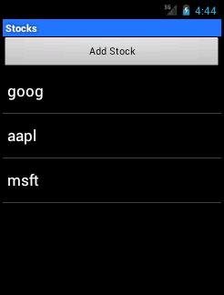
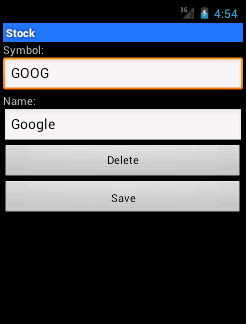
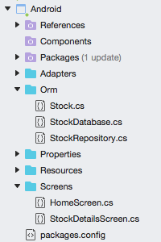

# Using Data in an App

The **DataAccess_Adv** sample shows a working application that allows
user-input and CRUD (Create, Read, Update and Delete) database
functionality. The application consists of two screens: a list and a
data entry form. All the data access code is re-usable in iOS and
Android without modification.

After adding some data the application screens look like this on Android:





The Android Project is shown below &ndash; the code shown in this section
is contained within the **Orm** directory:



The native UI code for the Activities in Android is out of scope for
this document. Refer to the
[Android ListViews and Adapters](~/android/user-interface/layouts/list-view/index.md)
guide for more information on the UI controls.

## Read

There are a couple of read operations in the sample:

-  Reading the list
-  Reading individual records

The two methods in the `StockDatabase` class are:

```csharp
public IEnumerable<Stock> GetStocks ()
{
    lock (locker) {
        return (from i in Table<Stock> () select i).ToList ();
    }
}
public Stock GetStock (int id)
{
    lock (locker) {
        return Table<Stock>().FirstOrDefault(x => x.Id == id);
    }
}
```

Android renders the data as a `ListView`.

## Create and Update

To simplify the application code, a single save method is provided that
does an Insert or Update depending on whether the PrimaryKey has been
set. Because the `Id` property is marked with a `[PrimaryKey]`
attribute you should not set it in your code. This method will detect
whether the value has been previous saved (by checking the primary key
property) and either insert or update the object accordingly:

```csharp
public int SaveStock (Stock item)
{
    lock (locker) {
        if (item.Id != 0) {
            Update (item);
            return item.Id;
    } else {
            return Insert (item);
        }
    }
}
```

Real world applications will usually require some validation (such as
required fields, minimum lengths or other business rules). Good
cross-platform applications implement as much of the validation logical
as possible in shared code, passing validation errors back up to the UI
for display according to the platform's capabilities.

## Delete

Unlike the `Insert` and `Update` methods, the `Delete<T>` method can
accept just the primary key value rather than a complete `Stock`
object. In this example a `Stock` object is passed into the method but
only the Id property is passed on to the `Delete<T>` method.

```csharp
public int DeleteStock(Stock stock)
{
    lock (locker) {
        return Delete<Stock> (stock.Id);
    }
}
```

## Using a pre-populated SQLite database file

Some applications are shipped with a database already populated with
data. You can easily accomplish this in your mobile application by
shipping an existing SQLite database file with your app and copying it
to a writable directory before accessing it. Because SQLite is a
standard file format that is used on many platforms, there are a number
of tools available to create an SQLite database file:

-   **SQLite Manager Firefox Extension** &ndash; Works on Mac and Windows
    and produces files that are compatible with iOS and Android.

-   **Command Line** &ndash; See
    [www.sqlite.org/sqlite.html](http://www.sqlite.org/sqlite.html) .

When creating a database file for distribution with your app, take care
with the naming of tables and columns to ensure they match what your
code expects, especially if you're using SQLite.NET which will expect
the names to match your C# classes and properties (or the associated
custom attributes).

To ensure that some code runs before anything else in your Android app,
you can place it in the first activity to load or you can create an
`Application` subclass that is loaded before any activities. The code
below shows an `Application` subclass that copies an existing database
file **data.sqlite** out of the **/Resources/Raw/** directory.

```csharp
[Application]
public class YourAndroidApp : Application {
    public override void OnCreate ()
    {
        base.OnCreate ();
        var docFolder = Environment.GetFolderPath(Environment.SpecialFolder.Personal);
        Console.WriteLine ("Data path:" + Database.DatabaseFilePath);
        var dbFile = Path.Combine(docFolder, "data.sqlite"); // FILE NAME TO USE WHEN COPIED
        if (!System.IO.File.Exists(dbFile)) {
            var s = Resources.OpenRawResource(Resource.Raw.data);  // DATA FILE RESOURCE ID
            FileStream writeStream = new FileStream(dbFile, FileMode.OpenOrCreate, FileAccess.Write);
            ReadWriteStream(s, writeStream);
        }
    }
    // readStream is the stream you need to read
    // writeStream is the stream you want to write to
    private void ReadWriteStream(Stream readStream, Stream writeStream)
    {
        int Length = 256;
        Byte[] buffer = new Byte[Length];
        int bytesRead = readStream.Read(buffer, 0, Length);
        // write the required bytes
        while (bytesRead > 0)
        {
            writeStream.Write(buffer, 0, bytesRead);
            bytesRead = readStream.Read(buffer, 0, Length);
        }
        readStream.Close();
        writeStream.Close();
    }
}
```


## Related Links

- [DataAccess Basic (sample)](https://github.com/xamarin/mobile-samples/tree/master/DataAccess/Basic)
- [DataAccess Advanced (sample)](https://github.com/xamarin/mobile-samples/tree/master/DataAccess/Advanced)
- [Android Data Recipes](https://github.com/xamarin/recipes/tree/master/Recipes/android/data)
- [Xamarin.Forms data access](~/xamarin-forms/app-fundamentals/databases.md)
