# Remote Notifications with Firebase Cloud Messaging

_This walkthrough provides a step-by-step explanation of how to use Firebase Cloud Messaging to implement remote notifications (also called push notifications) in a Xamarin.Android application. It illustrates how to implement the various classes that are needed for communications with Firebase Cloud Messaging (FCM), provides examples of how to configure the Android Manifest for access to FCM, and demonstrates downstream messaging using the Firebase Console._

## FCM notifications overview

In this walkthrough, a basic app called **FCMClient** will be created
to illustrate the essentials of FCM messaging. **FCMClient** checks for
the presence of Google Play Services, receives registration tokens
from FCM, displays remote notifications that you send from the
Firebase Console, and subscribes to topic messages:

[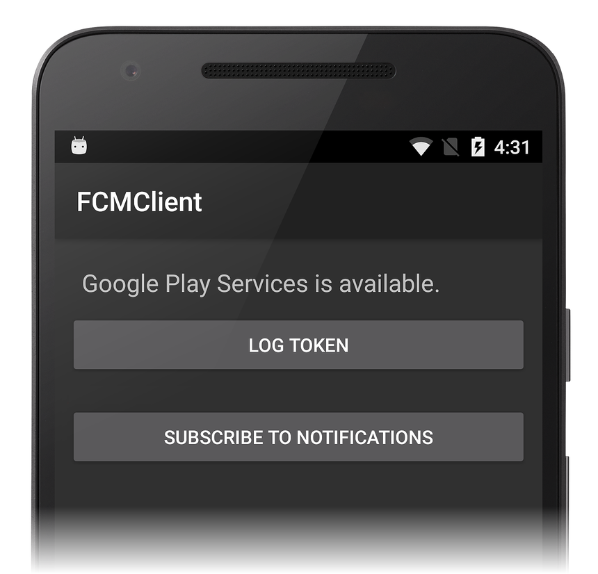](remote-notifications-with-fcm-images/00-app-example.png#lightbox)

The following topic areas will be explored:

1. Background Notifications

2. Topic Messages

3. Foreground Notifications

During this walkthrough, you will incrementally add functionality to
**FCMClient** and run it on a device or emulator to understand how it
interacts with FCM. You will use logging to witness live app
transactions with FCM servers, and you will observe how notifications
are generated from FCM messages that you enter into the Firebase
Console Notifications GUI.

## Requirements

It will be helpful to familiarize yourself with the [different types of messages](https://firebase.google.com/docs/cloud-messaging/concept-options#notifications_and_data_messages) that can be sent by Firebase Cloud Messaging. The payload of the message will determine how a client app will receive and process the message.

Before you can proceed with this walkthrough, you must acquire the
necessary credentials to use Google's FCM servers; this process is
explained in
[Firebase Cloud Messaging](~/android/data-cloud/google-messaging/firebase-cloud-messaging.md#setup_fcm).
In particular, you must download the **google-services.json** file to
use with the example code presented in this walkthrough. If you have
not yet created a project in the Firebase Console (or if you have not
yet downloaded the **google-services.json** file), see
[Firebase Cloud Messaging](~/android/data-cloud/google-messaging/firebase-cloud-messaging.md).

To run the example app, you will need an Android test device or
emulator that is compatibile with Firebase. Firebase Cloud Messaging
supports clients running on Android 4.0 or higher, and
these devices must also have the Google Play Store app installed
(Google Play Services 9.2.1 or later is required). If you do not yet
have the Google Play Store app installed on your device, visit the
[Google Play](https://support.google.com/googleplay) web site to
download and install it. Alternately, you can use the Android SDK
emulator with Google Play Services installed instead of a test device (you do
not have to install the Google Play Store if you are using the Android
SDK emulator).

## Start an app project

To begin, create a new empty Xamarin.Android project called
**FCMClient**. If you are not familiar with creating Xamarin.Android
projects, see
[Hello, Android](~/android/get-started/hello-android/hello-android-quickstart.md).
After the new app is created, the next step is to set the package name
and install several NuGet packages that will be used for communication
with FCM.

### Set the package name

In [Firebase Cloud Messaging](~/android/data-cloud/google-messaging/firebase-cloud-messaging.md),
you specified a package name for the FCM-enabled app. This package name
also serves as the [*application ID*](./firebase-cloud-messaging.md#fcm-in-action-app-id) that is associated with the [API
key](firebase-cloud-messaging.md#fcm-in-action-api-key). Configure the app to use this package name:

<!-- markdownlint-disable MD001 -->

# [Visual Studio](#tab/windows)

1. Open the properties for the **FCMClient** project.

2. In the **Android Manifest** page, set the package name.

In the following example, the package name is set to `com.xamarin.fcmexample`:

[](remote-notifications-with-fcm-images/01-package-name-vs.png#lightbox)

While you are updating the **Android Manifest**, also check to be sure that the
`Internet` permission is enabled.

# [Visual Studio for Mac](#tab/macos)

1. Open the properties for the **FCMClient** project.

2. In the **Android Application** page, set the package name.

In the following example, the package name is set to `com.xamarin.fcmexample`:

[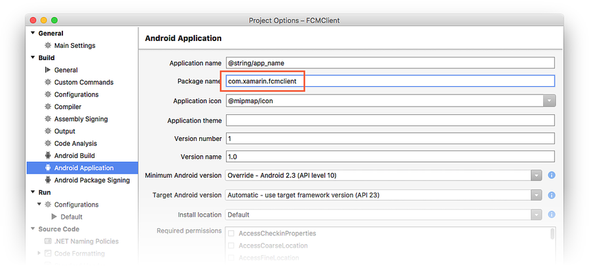](remote-notifications-with-fcm-images/01-package-name-xs.png#lightbox)

While you are updating the **Android Manifest**, also check to be sure that the
`INTERNET` permission is enabled (under **Required permissions**).

-----

> [!IMPORTANT]
> The client app will be unable to receive a registration token from FCM if this package name does not *exactly* match the package name that was entered into the Firebase Console.

### Add the Xamarin Google Play Services Base package

Because Firebase Cloud Messaging depends on Google Play Services, the
[Xamarin Google Play Services - Base](https://www.nuget.org/packages/Xamarin.GooglePlayServices.Base/)
NuGet package must be added to the Xamarin.Android project. You will need
version 29.0.0.2 or later.

# [Visual Studio](#tab/windows)

1. In Visual Studio, right-click **References > Manage NuGet Packages ...**.

2. Click the **Browse** tab and search for **Xamarin.GooglePlayServices.Base**.

3. Install this package into the **FCMClient** project:

    [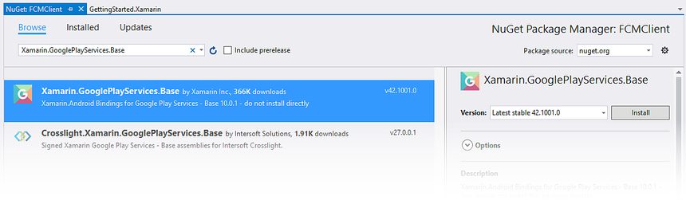](remote-notifications-with-fcm-images/02-google-play-services-vs.png#lightbox)

# [Visual Studio for Mac](#tab/macos)

1. In Visual Studio for Mac, right-click **Packages > Add Packages...**.

2. Search for **Xamarin.GooglePlayServices.Base**.

3. Install this package into the **FCMClient** project:

    [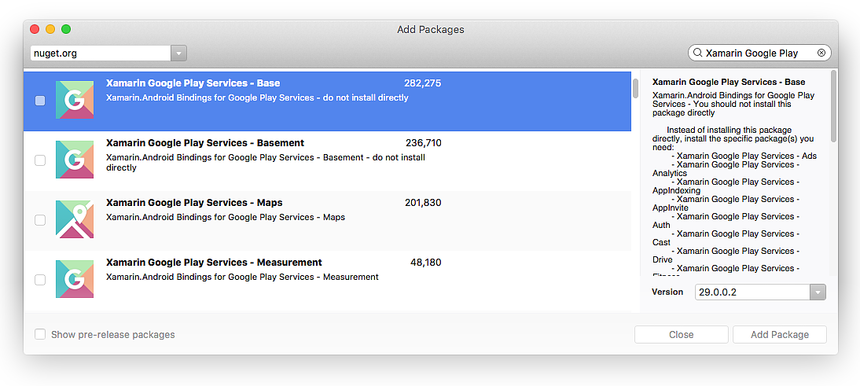](remote-notifications-with-fcm-images/02-google-play-services-xs.png#lightbox)

-----

If you get an error during installation of the NuGet, close the
**FCMClient** project, open it again, and retry the NuGet
installation.

When you install **Xamarin.GooglePlayServices.Base**, all of the
necessary dependencies are also installed. Edit **MainActivity.cs**
and add the following `using` statement:

```csharp
using Android.Gms.Common;
```

This statement makes the `GoogleApiAvailability` class in
**Xamarin.GooglePlayServices.Base** available to **FCMClient** code.
`GoogleApiAvailability` is used to check for the presence of Google
Play Services.

### Add the Xamarin Firebase Messaging package

To receive messages from FCM, the
[Xamarin Firebase - Messaging](https://www.nuget.org/packages/Xamarin.Firebase.Messaging/)
NuGet package must be added to the app project. Without this package, an Android
application cannot receive messages from FCM servers.

# [Visual Studio](#tab/windows)

1. In Visual Studio, right-click **References > Manage NuGet Packages ...**.

2. Search for **Xamarin.Firebase.Messaging**.

3. Install this package into the **FCMClient** project:

    [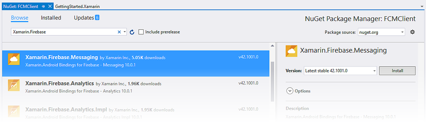](remote-notifications-with-fcm-images/03-firebase-messaging-vs.png#lightbox)

# [Visual Studio for Mac](#tab/macos)

1. In Visual Studio for Mac, right-click **Packages > Add Packages...**.

2. Search for **Xamarin.Firebase.Messaging**.

3. Install this package into the **FCMClient** project:

    [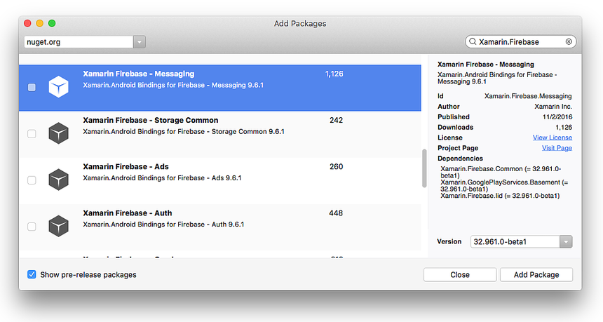](remote-notifications-with-fcm-images/03-firebase-messaging-xs.png#lightbox)

-----

When you install **Xamarin.Firebase.Messaging**, all of the
necessary dependencies are also installed.

Next, edit **MainActivity.cs** and add the following `using` statements:

```csharp
using Firebase.Messaging;
using Firebase.Iid;
using Android.Util;
```

The first two statements make types in the
**Xamarin.Firebase.Messaging** NuGet package available to **FCMClient**
code. **Android.Util** adds logging functionality that will be used to
observe transactions with FMS.

### <a name="add-googleplayservices-json"></a>Add the Google Services JSON file

The next step is to add the **google-services.json** file to the root
directory of your project:

# [Visual Studio](#tab/windows)

1. Copy **google-services.json** to the project folder.

2. Add **google-services.json** to the app project (click **Show All Files** in
    the **Solution Explorer**, right click **google-services.json**, then
    select **Include in Project**).

3. Select **google-services.json** in the **Solution Explorer** window.

4. In the **Properties** pane, set the **Build Action** to
    **GoogleServicesJson**:

    [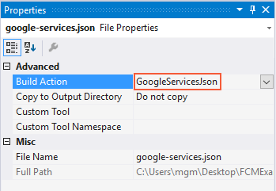](remote-notifications-with-fcm-images/04-google-services-json-vs.png#lightbox)

    > [!NOTE] 
    > If the **GoogleServicesJson** build action is not shown, save and close the solution, then reopen it.

# [Visual Studio for Mac](#tab/macos)

1. Copy **google-services.json** to the project folder.

2. Add **google-services.json** to the app project.

3. Right-click **google-services.json**.

4. Set the **Build Action** to **GoogleServicesJson**:

    [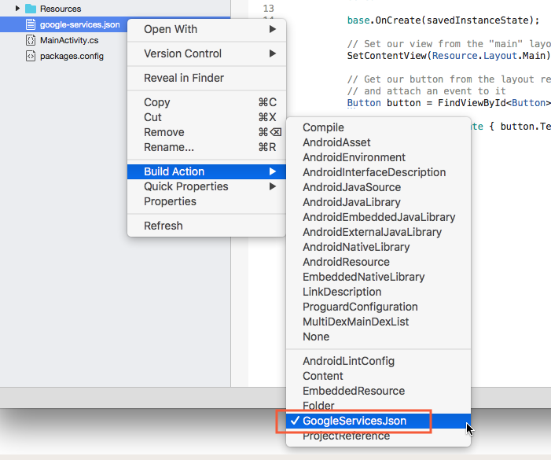](remote-notifications-with-fcm-images/04-google-services-json-xs.png#lightbox)

-----

When **google-services.json** is added to the project (and the
**GoogleServicesJson** build action is set), the build process extracts
the client ID and [API key](./firebase-cloud-messaging.md#fcm-in-action-api-key) and then adds these credentials to the
merged/generated **AndroidManifest.xml** that resides at
**obj/Debug/android/AndroidManifest.xml**. This merge process
automatically adds any permissions and other FCM elements that are
needed for connection to FCM servers.

## Check for Google Play Services and create a notification channel

Google recommends that Android apps check for the presence of the
Google Play Services APK before accessing Google Play Services features
(for more information, see
[Check for Google Play services](https://firebase.google.com/docs/cloud-messaging/android/client#sample-play)).

An initial layout for the app's UI will be created first. Edit
**Resources/layout/Main.axml** and replace its contents with the
following XML:

```xml
<?xml version="1.0" encoding="utf-8"?>
<LinearLayout xmlns:android="http://schemas.android.com/apk/res/android"
    android:orientation="vertical"
    android:layout_width="match_parent"
    android:layout_height="match_parent"
    android:padding="10dp">
    <TextView
        android:text=" "
        android:layout_width="wrap_content"
        android:layout_height="wrap_content"
        android:id="@+id/msgText"
        android:textAppearance="?android:attr/textAppearanceMedium"
        android:padding="10dp" />
</LinearLayout>
```

This `TextView` will be used to display messages that indicate whether
Google Play Services is installed. Save the changes to **Main.axml**.

Edit **MainActivity.cs** and add the following instance variables
 to the `MainActivity` class:

```csharp
public class MainActivity : AppCompatActivity
{
    static readonly string TAG = "MainActivity";

    internal static readonly string CHANNEL_ID = "my_notification_channel";
    internal static readonly int NOTIFICATION_ID = 100;

    TextView msgText;
```

The variables `CHANNEL_ID` and `NOTIFICATION_ID` will be used in the method [`CreateNotificationChannel`](#create-notification-channel-code) that will be added to `MainActivity` later on in this walkthrough.

In the following example, the `OnCreate` method will verify that Google
Play Services is available before the app attempts to use FCM services.
Add the following method to the `MainActivity` class:

```csharp
public bool IsPlayServicesAvailable ()
{
    int resultCode = GoogleApiAvailability.Instance.IsGooglePlayServicesAvailable (this);
    if (resultCode != ConnectionResult.Success)
    {
        if (GoogleApiAvailability.Instance.IsUserResolvableError (resultCode))
            msgText.Text = GoogleApiAvailability.Instance.GetErrorString (resultCode);
        else
        {
            msgText.Text = "This device is not supported";
            Finish ();
        }
        return false;
    }
    else
    {
        msgText.Text = "Google Play Services is available.";
        return true;
    }
}
```

This code checks the device to see if the Google Play Services APK is
installed. If it is not installed, a message is displayed in the
`TextBox` that instructs the user to download an APK from the Google
Play Store (or to enable it in the device's system settings).

<a name="create-notification-channel-code"></a>Apps that are running on Android 8.0 (API level 26) or higher must create a [_notification channel_](~/android/app-fundamentals/notifications/local-notifications.md) for publishing their notifications.  Add the following method to the `MainActivity` class which will create the notification channel (if necessary):

```csharp
void CreateNotificationChannel()
{
    if (Build.VERSION.SdkInt < BuildVersionCodes.O)
    {
        // Notification channels are new in API 26 (and not a part of the
        // support library). There is no need to create a notification
        // channel on older versions of Android.
        return;
    }

    var channel = new NotificationChannel(CHANNEL_ID,
                                          "FCM Notifications",
                                          NotificationImportance.Default)
                  {

                      Description = "Firebase Cloud Messages appear in this channel"
                  };

    var notificationManager = (NotificationManager)GetSystemService(Android.Content.Context.NotificationService);
    notificationManager.CreateNotificationChannel(channel);
}
```

Replace the `OnCreate` method with the following code:

```csharp
protected override void OnCreate (Bundle bundle)
{
    base.OnCreate (bundle);
    SetContentView (Resource.Layout.Main);
    msgText = FindViewById<TextView> (Resource.Id.msgText);

    IsPlayServicesAvailable ();

    CreateNotificationChannel();
}
```

`IsPlayServicesAvailable` is called at the end of `OnCreate` so that
the Google Play Services check runs each time the app starts. The method
 `CreateNotificationChannel` is called to ensure that a notification channel
 exists for devices running Android 8 or higher. If your
app has an `OnResume` method, it should call `IsPlayServicesAvailable`
from `OnResume` as well. Completely rebuild and run the app. If all
is configured properly, you should see a screen that looks like the
following screenshot:

[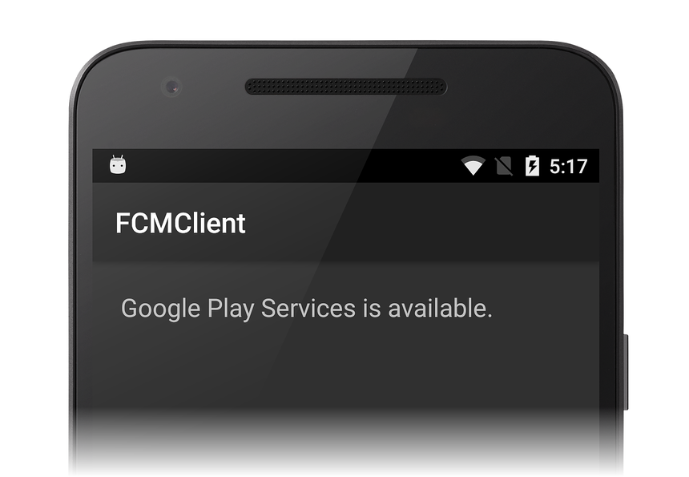](remote-notifications-with-fcm-images/05-gps-available.png#lightbox)

If you don't get this result, verify that the Google Play Services APK
is installed on your device (for more information, see
[Setting Up Google Play Services](https://developers.google.com/android/guides/setup)).
Also verify that you have added the
**Xamarin.Google.Play.Services.Base** package to your **FCMClient**
project as explained earlier.

## Add the instance ID receiver

The next step is to add a service that extends `FirebaseInstanceIdService` to handle the creation, rotation, and updating of [Firebase registration tokens](~/android/data-cloud/google-messaging/firebase-cloud-messaging.md#fcm-in-action-registration-token). The `FirebaseInstanceIdService` service is required for FCM to be able to send messages to the device. When the `FirebaseInstanceIdService` service is added to the client app, the app will automatically receive FCM messages and display them as notifications whenever the app is backgrounded.

### Declare the receiver in the Android Manifest

Edit **AndroidManifest.xml** and insert the following `<receiver>`
elements into the `<application>` section:

```xml
<receiver
    android:name="com.google.firebase.iid.FirebaseInstanceIdInternalReceiver"
    android:exported="false" />
<receiver
    android:name="com.google.firebase.iid.FirebaseInstanceIdReceiver"
    android:exported="true"
    android:permission="com.google.android.c2dm.permission.SEND">
    <intent-filter>
        <action android:name="com.google.android.c2dm.intent.RECEIVE" />
        <action android:name="com.google.android.c2dm.intent.REGISTRATION" />
        <category android:name="${applicationId}" />
    </intent-filter>
</receiver>
```

This XML does the following:

- Declares a `FirebaseInstanceIdReceiver` implementation that
    provides a [unique identifier](https://developers.google.com/instance-id/) for
    each app instance. This receiver also authenticates and authorizes
    actions.

- Declares an internal `FirebaseInstanceIdInternalReceiver`
    implementation that is used to start services securely.

- The [app ID](./firebase-cloud-messaging.md#fcm-in-action-app-id) is stored in the **google-services.json** file that was [added to the project](#add-googleplayservices-json). The Xamarin.Android Firebase bindings will replace the token `${applicationId}` with the app ID; no additional code is required by the client app to provide the app ID.

The `FirebaseInstanceIdReceiver` is a `WakefulBroadcastReceiver` that
receives `FirebaseInstanceId` and `FirebaseMessaging` events and delivers
them to the class that you derive from `FirebaseInstanceIdService`.

### Implement the Firebase Instance ID Service

The work of registering the application with FCM is handled by the custom
`FirebaseInstanceIdService` service that you provide.
`FirebaseInstanceIdService` performs the following steps:

1. Uses the [Instance ID API](https://developers.google.com/android/reference/com/google/android/gms/iid/InstanceID)
    to generate security tokens that authorize the client app to access
    FCM and the app server. In return, the app gets back a [registration token](~/android/data-cloud/google-messaging/firebase-cloud-messaging.md#fcm-in-action-registration-token) from FCM.

2. Forwards the registration token to the app server if the app
    server requires it.

Add a new file called **MyFirebaseIIDService.cs** and replace its
template code with the following:

```csharp
using System;
using Android.App;
using Firebase.Iid;
using Android.Util;

namespace FCMClient
{
    [Service]
    [IntentFilter(new[] { "com.google.firebase.INSTANCE_ID_EVENT" })]
    public class MyFirebaseIIDService : FirebaseInstanceIdService
    {
        const string TAG = "MyFirebaseIIDService";
        public override void OnTokenRefresh()
        {
            var refreshedToken = FirebaseInstanceId.Instance.Token;
            Log.Debug(TAG, "Refreshed token: " + refreshedToken);
            SendRegistrationToServer(refreshedToken);
        }
        void SendRegistrationToServer(string token)
        {
            // Add custom implementation, as needed.
        }
    }
}
```

This service implements an `OnTokenRefresh` method that is invoked when
the registration token is initially created or changed. When
`OnTokenRefresh` runs, it retrieves the latest token from the
`FirebaseInstanceId.Instance.Token` property (which is updated
asynchronously by FCM). In this example, the refreshed token is logged
so that it can be viewed in the output window:

```csharp
var refreshedToken = FirebaseInstanceId.Instance.Token;
Log.Debug(TAG, "Refreshed token: " + refreshedToken);
```

`OnTokenRefresh` is invoked infrequently: it is used to update the token
under the following circumstances:

- When the app is installed or uninstalled.

- When the user deletes app data.

- When the app erases the Instance ID.

- When the security of the token has been compromised.

According to Google's
[Instance ID](https://developers.google.com/instance-id/guides/android-implementation)
documentation, the FCM Instance ID service will request that the app
refresh its token periodically (typically, every 6 months).

`OnTokenRefresh` also calls `SendRegistrationToAppServer` to associate
the user's registration token with the server-side account (if any)
that is maintained by the application:

```csharp
void SendRegistrationToAppServer (string token)
{
    // Add custom implementation here as needed.
}
```

Because this implementation depends on the design of the app server, an
empty method body is provided in this example. If your app server
requires FCM registration information, modify
`SendRegistrationToAppServer` to associate the user's FCM instance ID
token with any server-side account maintained by your app. (Note that
the token is opaque to the client app.)

When a token is sent to the app server, `SendRegistrationToAppServer`
should maintain a boolean to indicate whether the token has been sent
to the server. If this boolean is false, `SendRegistrationToAppServer`
sends the token to the app server &ndash; otherwise, the token was
already sent to the app server in a previous call. In some cases (such
as this `FCMClient` example), the app server does not need the token;
therefore, this method is not required for this example.

## Implement client app code

Now that the receiver services are in place, client app code can be
written to take advantage of these services. In the following sections,
a button is added to the UI to log the registration token (also called
the *Instance ID token*), and more code is added to `MainActivity` to
view `Intent` information when the app is launched from a notification:

[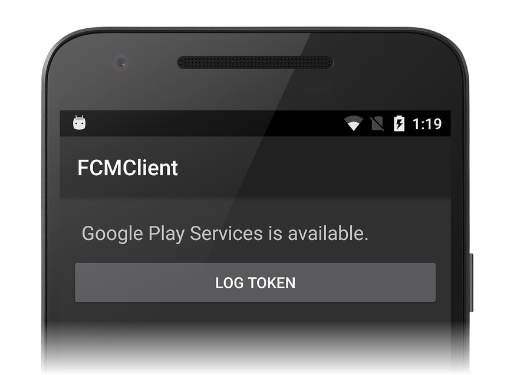](remote-notifications-with-fcm-images/06-log-token.png#lightbox)

### Log tokens

The code added in this step is intended only for demonstration purposes
&ndash; a production client app would have no need to log registration
tokens. Edit **Resources/layout/Main.axml** and add the following
`Button` declaration immediately after the `TextView` element:

```xml
<Button
  android:id="@+id/logTokenButton"
  android:layout_width="match_parent"
  android:layout_height="wrap_content"
  android:layout_gravity="center_horizontal"
  android:text="Log Token" />
```

Add the following code to the end of the `MainActivity.OnCreate` method:

```csharp
var logTokenButton = FindViewById<Button>(Resource.Id.logTokenButton);
logTokenButton.Click += delegate {
    Log.Debug(TAG, "InstanceID token: " + FirebaseInstanceId.Instance.Token);
};
```

This code logs the current token to the output window when the **Log Token**
button is tapped.

### Handle notification intents

When the user taps a notification issued from **FCMClient**, any data
accompanying that notification message is made available in `Intent`
extras. Edit **MainActivity.cs** and add the following code to the top
of the `OnCreate` method (before the call to
`IsPlayServicesAvailable`):

```csharp
if (Intent.Extras != null)
{
    foreach (var key in Intent.Extras.KeySet())
    {
        var value = Intent.Extras.GetString(key);
        Log.Debug(TAG, "Key: {0} Value: {1}", key, value);
    }
}
```

The app's launcher `Intent` is fired when the user taps its
notification message, so this code will log any accompanying data in
the `Intent` to the output window. If a different `Intent` must be
fired, the `click_action` field of the notification message must be set
to that `Intent` (the launcher `Intent` is used when no `click_action`
is specified).

## Background notifications

Build and run the **FCMClient** app. The **Log Token** button is displayed:

[](remote-notifications-with-fcm-images/06-log-token.png#lightbox)

Tap the **Log Token** button. A message like the following should be
displayed in the IDE output window:

[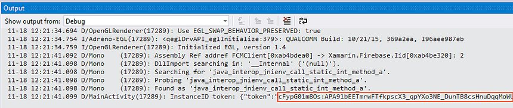](remote-notifications-with-fcm-images/07-token-received.png#lightbox)

The long string labeled with **token** is the instance ID token that
you will paste into the Firebase Console &ndash; select and copy this
string to the clipboard. If you do not see an instance ID token, add
the following line to the top of the `OnCreate` method to verify that
**google-services.json** was parsed correctly:

```csharp
Log.Debug(TAG, "google app id: " + GetString(Resource.String.google_app_id));
```

The `google_app_id` value logged to the output window should match the
`mobilesdk_app_id` value recorded in **google-services.json**. The `Resource.String.google_app_id` is generated by msbuild when processing **google-services.json**. 

### Send a message

Sign into the
[Firebase Console](https://console.firebase.google.com), select your
project, click **Notifications**, and click **SEND YOUR FIRST MESSAGE**:

[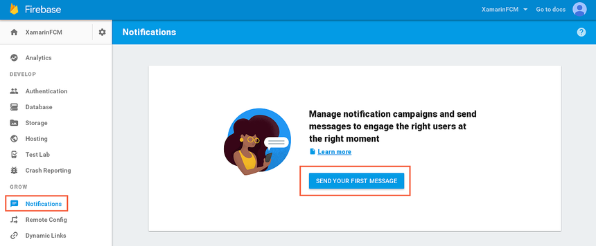](remote-notifications-with-fcm-images/08-first-notification.png#lightbox)

On the **Compose message** page, enter the message text and select
**Single device**. Copy the instance ID token from the IDE output
window and paste it into the **FCM registration token** field of the
Firebase Console:

[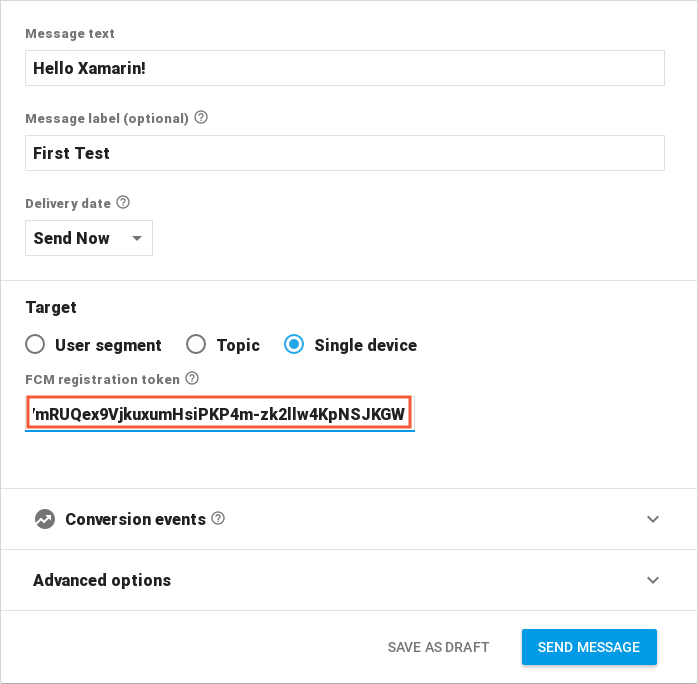](remote-notifications-with-fcm-images/09-compose-message.png#lightbox)

On the Android device (or emulator), background the app by tapping the
Android **Overview** button and touching the home screen. When the device is
ready, click **SEND MESSAGE** in the Firebase Console:

[](remote-notifications-with-fcm-images/10-send-message.png#lightbox)

When the **Review message** dialog is displayed, click **SEND**.
The notification icon should appear in the notification area of
the device (or emulator):

[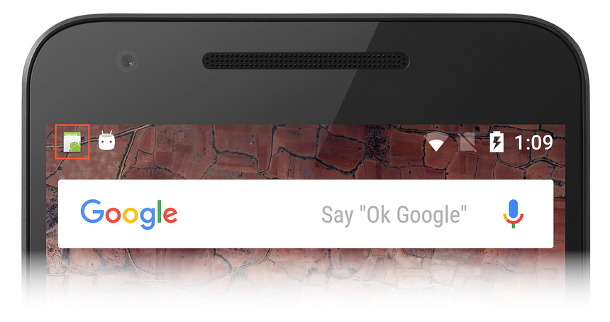](remote-notifications-with-fcm-images/11-notification-icon.png#lightbox)

Open the notification icon to view the message. The notification
message should be exactly what was typed into the **Message text**
field of the Firebase Console:

[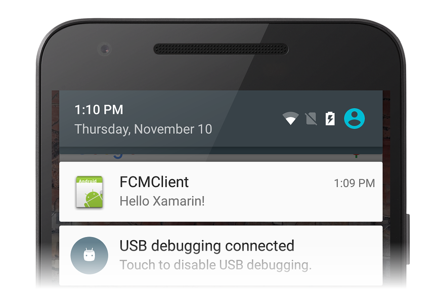](remote-notifications-with-fcm-images/12-notification.png#lightbox)

Tap the notification icon to launch the **FCMClient** app. The
`Intent` extras sent to **FCMClient** are listed in the IDE output
window:

[](remote-notifications-with-fcm-images/13-intent-extras.png#lightbox)

In this example, the **from** key is set to the Firebase project number
of the app (in this example, `41590732`), and the **collapse_key** is
set to its package name (**com.xamarin.fcmexample**).
If you do not receive a message, try deleting the **FCMClient** app on
the device (or emulator) and repeat the above steps.

> [!NOTE]
> If you force-close the app, FCM will stop delivering
> notifications. Android prevents background service broadcasts from
> inadvertently or unnecessarily launching components of stopped
> applications. (For more information about this behavior, see
> [Launch controls on stopped applications](https://developer.android.com/about/versions/android-3.1.html#launchcontrols).)
> For this reason, it is necessary to manually uninstall the app each
> time you run it and stop it from a debug session &ndash; this forces
> FCM to generate a new token so that messages will continue to be
> received.

### Add a custom default notification icon

In the previous example, the notification icon is set to the
application icon. The following XML configures a custom default icon
for notifications. Android displays this custom default icon for all
notification messages where the notification icon is not explicitly
set.

To add a custom default notification icon, add your icon to the
**Resources/drawable** directory, edit **AndroidManifest.xml**, and
insert the following `<meta-data>` element into the `<application>`
section:

```xml
<meta-data
    android:name="com.google.firebase.messaging.default_notification_icon"
    android:resource="@drawable/ic_stat_ic_notification" />
```

In this example, the notification icon that resides at
**Resources/drawable/ic\_stat\_ic\_notification.png** will be used as the
custom default notification icon. If a custom default icon is not
configured in **AndroidManifest.xml** and no icon is set in the
notification payload, Android uses the application icon as the
notification icon (as seen in the notification icon screenshot above).

## Handle topic messages

The code written thus far handles registration tokens and adds remote
notification functionality to the app. The next example adds code that
listens for *topic messages* and forwards them to the user as remote
notifications. Topic messages are FCM messages that are sent to one or
more devices that subscribe to a particular topic. For more information
about topic messages, see
[Topic Messaging](~/android/data-cloud/google-messaging/firebase-cloud-messaging.md).

### Subscribe to a topic

Edit **Resources/layout/Main.axml** and add the following `Button`
declaration immediately after the previous `Button` element:

```xml
<Button
  android:id="@+id/subscribeButton"
  android:layout_width="match_parent"
  android:layout_height="wrap_content"
  android:layout_gravity="center_horizontal"
  android:layout_marginTop="20dp"
  android:text="Subscribe to Notifications" />
```

This XML adds a **Subscribe to Notification** button to the layout.
Edit **MainActivity.cs** and add the following code to the end of the
`OnCreate` method:

```csharp
var subscribeButton = FindViewById<Button>(Resource.Id.subscribeButton);
subscribeButton.Click += delegate {
    FirebaseMessaging.Instance.SubscribeToTopic("news");
    Log.Debug(TAG, "Subscribed to remote notifications");
};
```

This code locates the **Subscribe to Notification** button in the
layout and assigns its click handler to code that calls
`FirebaseMessaging.Instance.SubscribeToTopic`, passing in the
subscribed topic, _news_. When the user taps the **Subscribe**
button, the app subscribes to the _news_ topic. In the following
section, a _news_ topic message will be sent from the Firebase
Console Notifications GUI.

### Send a topic message

Uninstall the app, rebuild it, and run it again. Click the **Subscribe
to Notifications** button:

[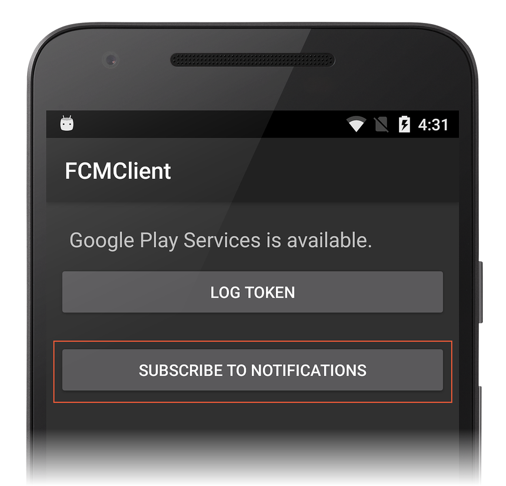](remote-notifications-with-fcm-images/14-subscribe.png#lightbox)

If the app has subscribed successfully, you should see **topic sync
succeeded** in the IDE output window:

[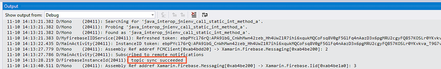](remote-notifications-with-fcm-images/15-topic-sync.png#lightbox)

Use the following steps to send a topic message:

1. In the Firebase Console, click **NEW MESSAGE**.

2. On the **Compose message** page, enter the message text and select
    **Topic**.

3. In the **Topic** pull-down menu, select the built-in topic,
    **news**:

    [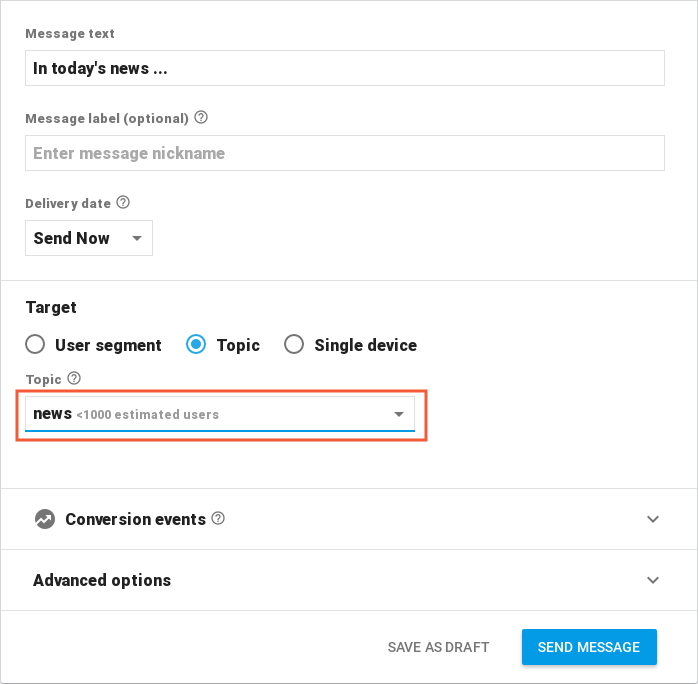](remote-notifications-with-fcm-images/16-topic-message.png#lightbox)

4. On the Android device (or emulator), background the app by tapping
    the Android **Overview** button and touching the home screen.

5. When the device is ready, click **SEND MESSAGE** in the Firebase
    Console.

6. Check the IDE output window to see **/topics/news** in the log output:

    [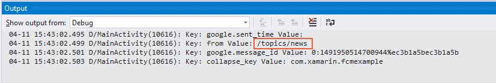](remote-notifications-with-fcm-images/17-message-arrived.png#lightbox)

When this message is seen in the output window, the notification icon
should also appear in the notification area on the Android device. Open
the notification icon to view the topic message:

[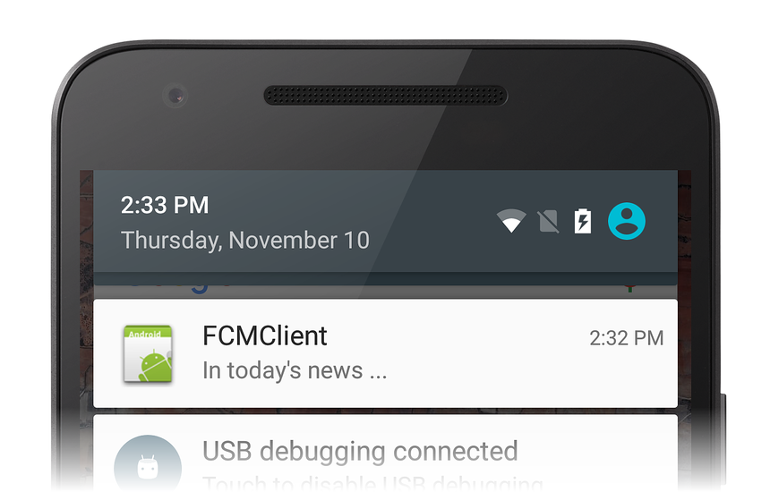](remote-notifications-with-fcm-images/18-other-news.png#lightbox)

If you do not receive a message, try deleting the **FCMClient** app on
the device (or emulator) and repeat the above steps.

## Foreground notifications

To receive notifications in foregrounded apps, you must implement
`FirebaseMessagingService`. This service is also required for receiving
data payloads and for sending upstream messages. The following examples
illustrate how to implement a service that extends
`FirebaseMessagingService` &ndash; the resulting app will be able to
handle remote notifications while it is running in the foreground.

### Implement FirebaseMessagingService

The `FirebaseMessagingService` service is responsible for receiving and processing the messages from Firebase. Each app must subclass this type and override the `OnMessageReceived` to process an incoming message. When an app is in the foreground, the `OnMessageReceived` callback will always handle the message.

> [!NOTE]
> Apps only have 10 seconds in which to handle an incoming Firebase Cloud Message. Any work that takes longer than this should be scheduled for background execution using a library such as the [Android Job Scheduler](~/android/platform/android-job-scheduler.md) or the [Firebase Job Dispatcher](~/android/platform/firebase-job-dispatcher.md).

Add a new file called **MyFirebaseMessagingService.cs** and replace its
template code with the following:

```csharp
using System;
using Android.App;
using Android.Content;
using Android.Media;
using Android.Util;
using Firebase.Messaging;

namespace FCMClient
{
    [Service]
    [IntentFilter(new[] { "com.google.firebase.MESSAGING_EVENT" })]
    public class MyFirebaseMessagingService : FirebaseMessagingService
    {
        const string TAG = "MyFirebaseMsgService";
        public override void OnMessageReceived(RemoteMessage message)
        {
            Log.Debug(TAG, "From: " + message.From);
            Log.Debug(TAG, "Notification Message Body: " + message.GetNotification().Body);
        }
    }
}
```

Note that the `MESSAGING_EVENT` intent filter must be declared so that
new FCM messages are directed to `MyFirebaseMessagingService`:

```csharp
[IntentFilter(new[] { "com.google.firebase.MESSAGING_EVENT" })]
```

When the client app receives a message from FCM, `OnMessageReceived`
extracts the message content from the passed-in `RemoteMessage` object
by calling its `GetNotification` method. Next, it logs the message
content so that it can be viewed in the IDE output window:

```csharp
var body = message.GetNotification().Body;
Log.Debug(TAG, "Notification Message Body: " + body);
```

> [!NOTE]
> If you set breakpoints in `FirebaseMessagingService`,
> your debugging session may or may not hit these breakpoints because of
> how FCM delivers messages.

### Send another message

Uninstall the app, rebuild it, run it again, and follow these steps to
send another message:

1. In the Firebase Console, click **NEW MESSAGE**.

2. On the **Compose message** page, enter the message text and select
    **Single device**.

3. Copy the token string from the IDE output window and paste it into
    the **FCM registration token** field of the Firebase Console as
    before.

4. Ensure that the app is running in the foreground, then click **SEND
    MESSAGE** in the Firebase Console:

    [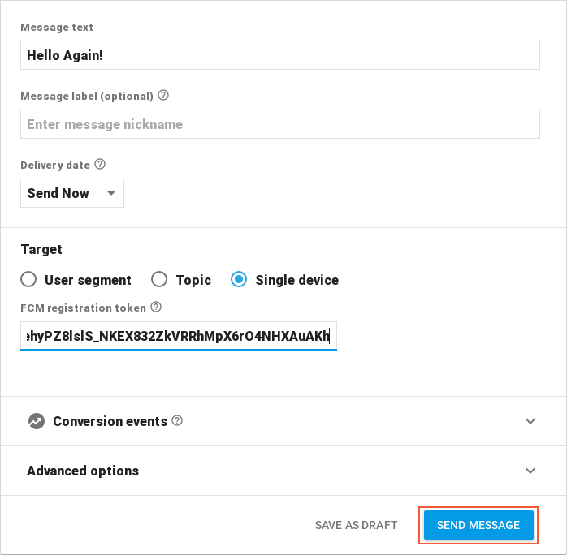](remote-notifications-with-fcm-images/19-hello-again.png#lightbox)

5. When the **Review message** dialog is displayed, click **SEND**.

6. The incoming message is logged to the IDE output window:

    [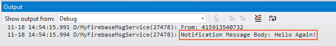](remote-notifications-with-fcm-images/20-logged-message.png#lightbox)

### Add a local notification sender

In this remaining example, the incoming FCM message will be converted
into a local notification that is launched while the app is running in
the foreground. Edit **MyFirebaseMessageService.cs** and add the
following `using` statements:

```csharp
using FCMClient;
using System.Collections.Generic;
```

Add the following method to `MyFirebaseMessagingService`:

<a name="sendnotification-method"></a>

```csharp
void SendNotification(string messageBody, IDictionary<string, string> data)
{
    var intent = new Intent(this, typeof(MainActivity));
    intent.AddFlags(ActivityFlags.ClearTop);
    foreach (var key in data.Keys)
    {
        intent.PutExtra(key, data[key]);
    }

    var pendingIntent = PendingIntent.GetActivity(this,
                                                  MainActivity.NOTIFICATION_ID,
                                                  intent,
                                                  PendingIntentFlags.OneShot);

    var notificationBuilder = new  NotificationCompat.Builder(this, MainActivity.CHANNEL_ID)
                              .SetSmallIcon(Resource.Drawable.ic_stat_ic_notification)
                              .SetContentTitle("FCM Message")
                              .SetContentText(messageBody)
                              .SetAutoCancel(true)
                              .SetContentIntent(pendingIntent);

    var notificationManager = NotificationManagerCompat.From(this);
    notificationManager.Notify(MainActivity.NOTIFICATION_ID, notificationBuilder.Build());
}
```

To distinguish this notification from background notifications, this
code marks notifications with an icon that differs from the
application icon. Add the file
[ic\_stat\_ic\_notification.png](remote-notifications-with-fcm-images/ic-stat-ic-notification.png) to
**Resources/drawable** and include it in the **FCMClient** project.

The `SendNotification` method uses `NotificationCompat.Builder` to create the
notification, and `NotificationManagerCompat` is used to launch the
notification. The notification holds a `PendingIntent` that will allow
the user to open the app and view the contents of the string passed
into `messageBody`. For more information about
`NotificationCompat.Builder`, see
[Local Notifications](~/android/app-fundamentals/notifications/local-notifications.md).

Call the `SendNotification` method at end of the `OnMessageReceived` method:

```csharp
public override void OnMessageReceived(RemoteMessage message)
{
    Log.Debug(TAG, "From: " + message.From);

    var body = message.GetNotification().Body;
    Log.Debug(TAG, "Notification Message Body: " + body);
    SendNotification(body, message.Data);
}
```

As a result of these changes, `SendNotification` will run whenever a
notification is received while the app is in the foreground, and the
notification will appear in the notification area.

When an app is in the background, the [payload of the message](https://firebase.google.com/docs/cloud-messaging/concept-options#notifications_and_data_messages) will determine how the message is handled:

- **Notification** &ndash; messages will be sent to the **system tray**. A local notification will appear there. When the user taps on the notification the app will launch.
- **Data** &ndash; messages will be handled by `OnMessageReceived`.
- **Both** &ndash; messages that have both a notification and data payload will be delivered to the system tray. When the app launches, the data payload will appear in the `Extras` of the `Intent` that was used to start the app.

In this example, if the app is backgrounded, `SendNotification` will run if the message has a data payload. Otherwise, a background notification (illustrated earlier in this walkthrough) will be launched.

### Send the last message

Uninstall the app, rebuild it, run it again, then use the following
steps to send the last message:

1. In the Firebase Console, click **NEW MESSAGE**.

2. On the **Compose message** page, enter the message text and
    select **Single device**.

3. Copy the token string from the IDE output window and paste
    it into the **FCM registration token** field of the Firebase
    Console as before.

4. Ensure that the app is running in the foreground, then click **SEND
    MESSAGE** in the Firebase Console:

    [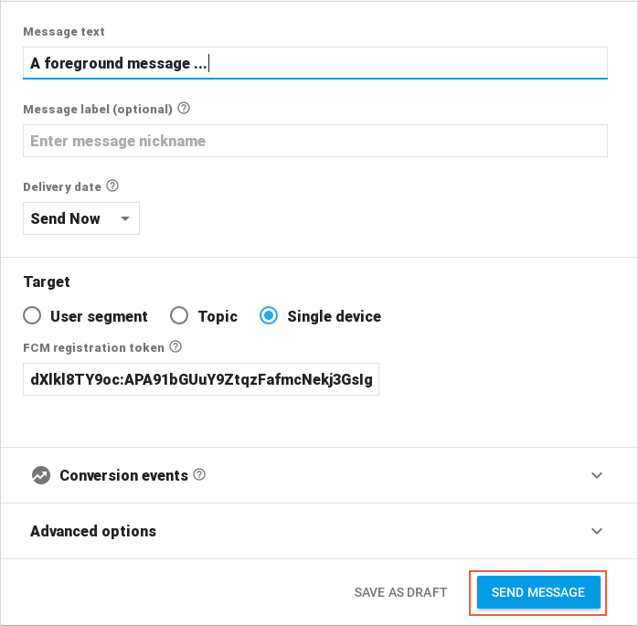](remote-notifications-with-fcm-images/21-console-fg-msg.png#lightbox)

This time, the message that was logged in the output window is also
packaged in a new notification &ndash; the notification icon appears in
the notification tray while the app is running in the foreground:

[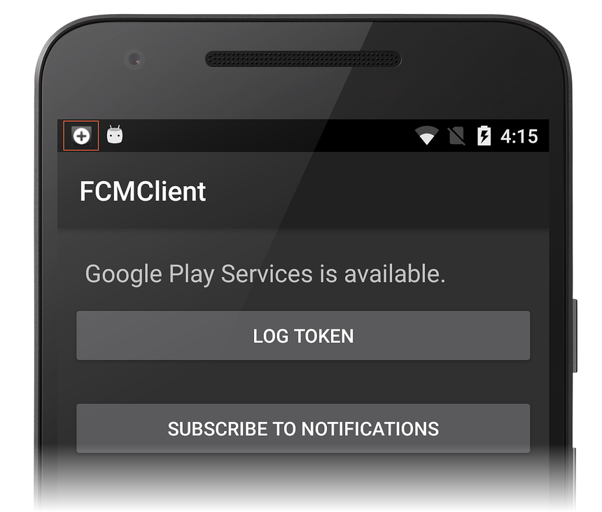](remote-notifications-with-fcm-images/22-foreground-icon.png#lightbox)

When you open the notification, you should see the last message that
was sent from the Firebase Console Notifications GUI:

[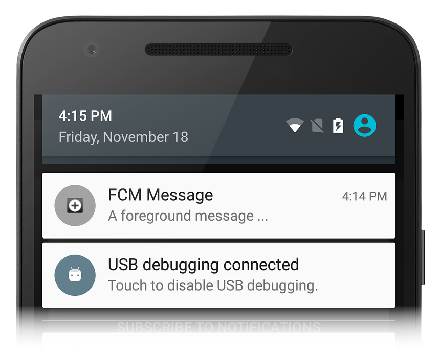](remote-notifications-with-fcm-images/23-foreground-msg.png#lightbox)

## Disconnecting from FCM

To unsubscribe from a topic, call the
[UnsubscribeFromTopic](https://firebase.google.com/docs/reference/android/com/google/firebase/messaging/FirebaseMessaging.html#unsubscribeFromTopic%28java.lang.String%29)
method on the
[FirebaseMessaging](https://firebase.google.com/docs/reference/android/com/google/firebase/messaging/FirebaseMessaging)
class. For example, to unsubscribe from the _news_ topic subscribed to
earlier, an **Unsubscribe** button could be added to the layout with
the following handler code:

```csharp
var unSubscribeButton = FindViewById<Button>(Resource.Id.unsubscribeButton);
unSubscribeButton.Click += delegate {
    FirebaseMessaging.Instance.UnsubscribeFromTopic("news");
    Log.Debug(TAG, "Unsubscribed from remote notifications");
};
```

To unregister the device from FCM altogether, delete the instance ID by
calling the
[DeleteInstanceId](https://firebase.google.com/docs/reference/android/com/google/firebase/iid/FirebaseInstanceId.html#deleteInstanceId%28%29)
method on the
[FirebaseInstanceId](https://firebase.google.com/docs/reference/android/com/google/firebase/iid/FirebaseInstanceId)
class. For example:

```csharp
FirebaseInstanceId.Instance.DeleteInstanceId();
```

This method call deletes the instance ID and the data associated
with it. As a result, the periodic sending of FCM data to the device is
halted.

## Troubleshooting

The following describe issues and workarounds that may arise when using
Firebase Cloud Messaging with Xamarin.Android.

### FirebaseApp is not Initialized

In some cases, you may see this error message:

```shell
Java.Lang.IllegalStateException: Default FirebaseApp is not initialized in this process
Make sure to call FirebaseApp.initializeApp(Context) first.
```

This is a known problem that you can work around by cleaning the
solution and rebuilding the project (**Build > Clean Solution**,
**Build > Rebuild Solution**).

## Summary

This walkthrough detailed the steps for implementing Firebase Cloud
Messaging remote notifications in a Xamarin.Android application. It
described how to install the required packages needed for FCM
communications, and it explained how to configure the Android Manifest
for access to FCM servers. It provided example code that illustrates
how to check for the presence of Google Play Services. It demonstrated
how to implement an instance ID listener service that negotiates with
FCM for a registration token, and it explained how this code creates
background notifications while the app is backgrounded. It explained
how to subscribe to topic messages, and it provided an example
implementation of a message listener service that is used to receive
and display remote notifications while the app is running in the
foreground.

## Related links

- [FCMNotifications (sample)](/samples/xamarin/monodroid-samples/firebase-fcmnotifications)
- [Firebase Cloud Messaging](~/android/data-cloud/google-messaging/firebase-cloud-messaging.md)
- [About FCM Messages](https://firebase.google.com/docs/cloud-messaging/concept-options)
