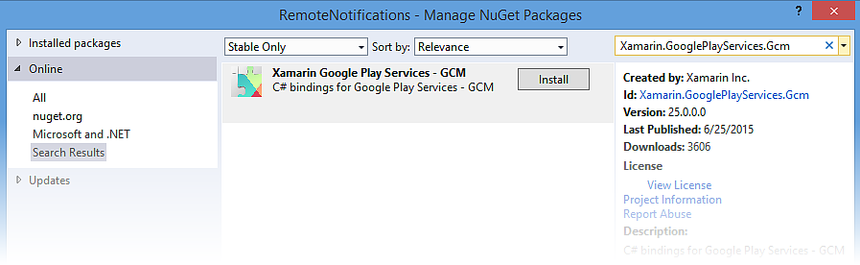
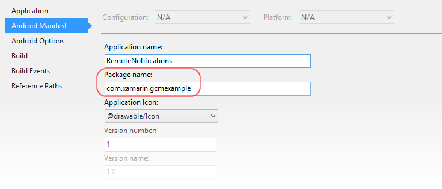
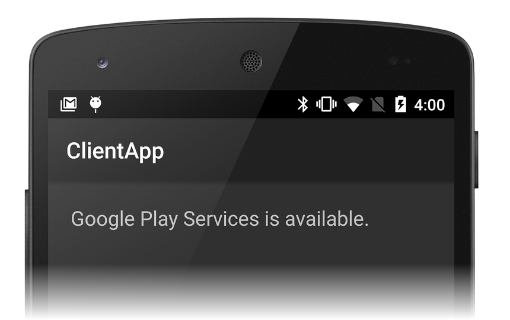
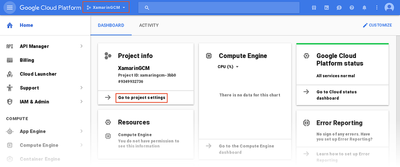
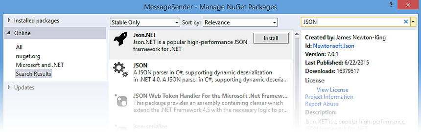
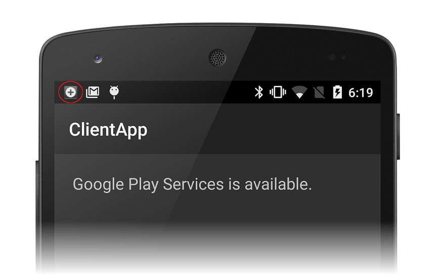
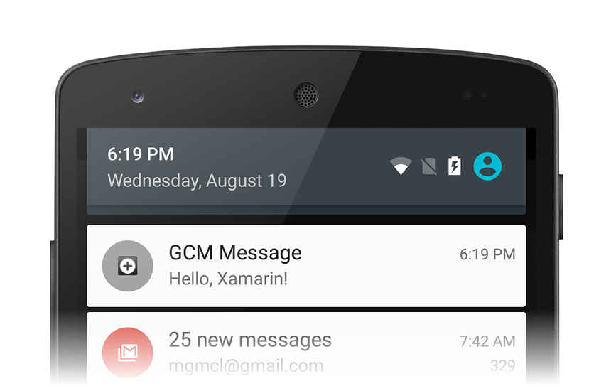

# Remote Notifications With Google Cloud Messaging

> [!WARNING]
> Google deprecated GCM as of April 10, 2018. The following docs and sample projects may no longer be maintained. Google's GCM server and client APIs will be removed as soon as May 29, 2019. Google recommends migrating GCM apps to Firebase Cloud Messaging (FCM). For more information about GCM deprecation and migration, see [Google Cloud Messaging - DEPRECATED](https://developers.google.com/cloud-messaging/).
>
> To get started with Remote Notifications using Firebase Cloud Messaging with Xamarin, see [Remote Notifications with FCM](remote-notifications-with-fcm.md).

_This walkthrough provides a step-by-step explanation of how to use Google Cloud Messaging to implement remote notifications (also called push notifications) in a Xamarin.Android application. It describes the various classes that you must implement to communicate with Google Cloud Messaging (GCM), it explains how to set permissions in the Android Manifest for access to GCM, and it demonstrates end-to-end messaging with a sample test program._

## GCM Notifications Overview

In this walkthrough, we'll create a Xamarin.Android application that
uses Google Cloud Messaging (GCM) to implement remote notifications
(also known as *push notifications*). We'll implement the various
intent and listener services that use GCM for remote messaging, and
we'll test our implementation with a command-line program that
simulates an application server.

Before you can proceed with this walkthrough, you must acquire
the necessary credentials to use Google's GCM servers; this process is explained in
[Google Cloud Messaging](~/android/data-cloud/google-messaging/google-cloud-messaging.md).
In particular, you will need an *API Key* and a *Sender ID* to insert
into the example code presented in this walkthrough.

We'll use the following steps to create a GCM-enabled Xamarin.Android
client app:

1. Install additional packages required for communications
    with GCM servers.
2. Configure app permissions for access to GCM servers.
3. Implement code to check for the presence of Google Play Services.
4. Implement a registration intent service that negotiates with GCM for
    a registration token.
5. Implement an instance ID listener service that listens for
    registration token updates from GCM.
6. Implement a GCM listener service that receives remote
    messages from the app server through GCM.

This app will use a new GCM feature known as *topic messaging*. In
topic messaging, the app server sends a message to a topic, rather than
to a list of individual devices. Devices that subscribe to that topic
can receive topic messages as push notifications.

When the client app is ready, we'll implement a command-line C#
application that sends a push notification to our client app via GCM.

## Walkthrough

To begin, let's create a new empty Solution called
**RemoteNotifications**. Next, let's add a new Android project to this
Solution that is based on the **Android App** template. Let's call this
project **ClientApp**. (If you're not familiar with creating
Xamarin.Android projects, see
[Hello, Android](~/android/get-started/hello-android/hello-android-quickstart.md).)
The **ClientApp** project will contain the code for the Xamarin.Android
client application that receives remote notifications via GCM.

### Add Required Packages

Before we can implement our client app code, we must install several packages
that we'll use for communication with GCM. Also, we must add the Google Play
Store application to our device if it is not already installed.

#### Add the Xamarin Google Play Services GCM Package

To receive messages from Google Cloud Messaging, the
[Google Play Services](https://www.nuget.org/packages/Xamarin.GooglePlayServices.Gcm/)
framework must be present on the device. Without this framework, an
Android application cannot receive messages from GCM servers. Google
Play Services runs in the background while the Android device is
powered on, quietly listening for messages from GCM. When these
messages arrive, Google Play Services converts the messages into
intents and then broadcasts these intents to applications that have
registered for them.

In Visual Studio, right-click **References > Manage NuGet Packages
...**; in Visual Studio for Mac, right-click **Packages > Add Packages...**.
Search for **Xamarin Google Play Services - GCM** and install
this package into the **ClientApp** project:

[](remote-notifications-with-gcm-images/1-google-play-services.png#lightbox)

When you install **Xamarin Google Play Services - GCM**, **Xamarin
Google Play Services - Base** is automatically installed. If you get an
error, change the project's *Minimum Android to target* setting to a
value other than **Compile using SDK version** and try the NuGet
install again.

Next, edit **MainActivity.cs** and add the following `using` statements:

```csharp
using Android.Gms.Common;
using Android.Util;
```

This makes types in the Google Play Services GMS package available to
our code, and it adds logging functionality that we will use to track our
transactions with GMS.

#### Google Play Store

To receive messages from GCM, the Google Play Store application must be
installed on the device. (Whenever a Google Play application is
installed on a device, Google Play Store is also installed, so it's
likely that it is already installed on your test device.) Without
Google Play, an Android application cannot receive messages from GCM.
If you do not yet have the Google Play Store app installed on your
device, visit the
[Google Play](https://support.google.com/googleplay) web site to
download and install Google Play.

Alternately, you can use an Android emulator running Android 2.2 or
later instead of a test device (you do not have to install Google Play
Store on an Android emulator). However, if you use an emulator, you
must use Wi-Fi to connect to GCM and you must open several ports in
your Wi-Fi firewall as explained later in this walkthrough.

### Set the Package Name

In [Google Cloud Messaging](~/android/data-cloud/google-messaging/google-cloud-messaging.md),
we specified a package name for our GCM-enabled app (this package name
also serves as the *application ID* that is associated with our API key and
Sender ID). Let's open the properties for the **ClientApp** project and set the package
name to this string. In this example, we set the package name to `com.xamarin.gcmexample`:

[](remote-notifications-with-gcm-images/2-package-name.png#lightbox)

Note that the client app will be unable to receive a registration token
from GCM if this package name does not *exactly* match the package name
that we entered into the Google Developer console.

### Add Permissions to the Android Manifest

An Android application must have the following permissions configured
before it can receive notifications from Google Cloud Messaging:

- `com.google.android.c2dm.permission.RECEIVE` &ndash; Grants
    permission to our app to register and receive messages from Google
    Cloud Messaging. (What does `c2dm` mean? This stands for _Cloud to
    Device Messaging_, which is the now-deprecated predecessor to GCM.
    GCM still uses `c2dm` in many of its permission strings.)

- `android.permission.WAKE_LOCK` &ndash; (Optional) Prevents the
    device CPU from going to sleep while listening for a message.

- `android.permission.INTERNET` &ndash; Grants internet access so the
    client app can communicate with GCM.

- *package_name*`.permission.C2D_MESSAGE` &ndash; Registers the
    application with Android and requests permission to exclusively
    receive all C2D (cloud to device) messages. The *package_name*
    prefix is the same as your application ID.

We'll set these permissions in the Android manifest. Let's edit
**AndroidManifest.xml** and replace the contents with the following
XML:

```xml
<?xml version="1.0" encoding="utf-8"?>
<manifest xmlns:android="http://schemas.android.com/apk/res/android"
    package="YOUR_PACKAGE_NAME"
    android:versionCode="1"
    android:versionName="1.0"
    android:installLocation="auto">
    <uses-permission android:name="com.google.android.c2dm.permission.RECEIVE" />
    <uses-permission android:name="android.permission.WAKE_LOCK" />
    <uses-permission android:name="android.permission.INTERNET" />
    <uses-permission android:name="YOUR_PACKAGE_NAME.permission.C2D_MESSAGE" />
    <permission android:name="YOUR_PACKAGE_NAME.permission.C2D_MESSAGE"
                android:protectionLevel="signature" />
    <application android:label="ClientApp" android:icon="@drawable/Icon">
    </application>
</manifest>
```

In the above XML, change *YOUR_PACKAGE_NAME* to the package name for
your client app project. For example, `com.xamarin.gcmexample`.

### Check for Google Play Services

For this walkthrough, we're creating a bare-bones app with a single
`TextView` in the UI. This app doesn't directly indicate interaction
with GCM. Instead, we'll watch the output window to see how our app
handshakes with GCM, and we'll check the notification tray for new
notifications as they arrive.

First, let's create a layout for the message area. Edit
**Resources.layout.Main.axml** and replace the contents with the
following XML:

```xml
<?xml version="1.0" encoding="utf-8"?>
<LinearLayout xmlns:android="http://schemas.android.com/apk/res/android"
    android:orientation="vertical"
    android:layout_width="match_parent"
    android:layout_height="match_parent"
    android:padding="10dp">
    <TextView
        android:text=" "
        android:layout_width="wrap_content"
        android:layout_height="wrap_content"
        android:id="@+id/msgText"
        android:textAppearance="?android:attr/textAppearanceMedium"
        android:padding="10dp" />
</LinearLayout>
```

Save **Main.axml** and close it.

When the client app starts, we want it to verify that Google Play
Services is available before we attempt to contact GCM. Edit
**MainActivity.cs** and replace the ``count`` instance variable
declaration with the following instance variable declaration:

```csharp
TextView msgText;
```

Next, add the following method to the **MainActivity** class:

```csharp
public bool IsPlayServicesAvailable ()
{
    int resultCode = GoogleApiAvailability.Instance.IsGooglePlayServicesAvailable (this);
    if (resultCode != ConnectionResult.Success)
    {
        if (GoogleApiAvailability.Instance.IsUserResolvableError (resultCode))
            msgText.Text = GoogleApiAvailability.Instance.GetErrorString (resultCode);
        else
        {
            msgText.Text = "Sorry, this device is not supported";
            Finish ();
        }
        return false;
    }
    else
    {
        msgText.Text = "Google Play Services is available.";
        return true;
    }
}
```

This code checks the device to see if the Google Play Services APK is
installed. If it is not installed, a message is displayed in the
message area that instructs the user to download an APK from the Google
Play Store (or enable it in the device's system settings). Because we
want to run this check when the client app starts, we'll add a call to
this method at the end of `OnCreate`.

Next, replace the `OnCreate` method with the following code:

```csharp
protected override void OnCreate (Bundle bundle)
{
    base.OnCreate (bundle);

    SetContentView (Resource.Layout.Main);
    msgText = FindViewById<TextView> (Resource.Id.msgText);

    IsPlayServicesAvailable ();
}
```

This code checks for the presence of the Google Play Services APK and
writes the result to the message area.

Let's completely rebuild and run the app. You should see a screen
that looks like the following screenshot:

[](remote-notifications-with-gcm-images/3-first-screen.png#lightbox)

If you don't get this result, verify that the Google Play Services APK
is installed on your device and that the **Xamarin Google Play Services - GCM**
package is added to your **ClientApp** project as explained
earlier. If you get a build error, try cleaning the Solution and
building the project again.

Next, we'll write code to contact GCM and get back a registration
token.

### Register with GCM

Before the app can receive remote notifications from the app server, it
must register with GCM and get back a registration token. The work of
registering our application with GCM is handled by an `IntentService`
that we create. Our `IntentService` performs the following steps:

1. Uses the [InstanceID](https://developers.google.com/instance-id/) API to
    generate security tokens that authorize our client app to access the
    app server. In return, we get back a registration token from GCM.

2. Forwards the registration token to the app server (if the app
    server requires it).

3. Subscribes to one or more notification topic channels.

After we implement this `IntentService`, we'll test it to see if we
get back a registration token from GCM.

Add a new file called **RegistrationIntentService.cs** and replace the
template code with the following:

```csharp
using System;
using Android.App;
using Android.Content;
using Android.Util;
using Android.Gms.Gcm;
using Android.Gms.Gcm.Iid;

namespace ClientApp
{
    [Service(Exported = false)]
    class RegistrationIntentService : IntentService
    {
        static object locker = new object();

        public RegistrationIntentService() : base("RegistrationIntentService") { }

        protected override void OnHandleIntent (Intent intent)
        {
            try
            {
                Log.Info ("RegistrationIntentService", "Calling InstanceID.GetToken");
                lock (locker)
                {
                    var instanceID = InstanceID.GetInstance (this);
                    var token = instanceID.GetToken (
                        "YOUR_SENDER_ID", GoogleCloudMessaging.InstanceIdScope, null);

                    Log.Info ("RegistrationIntentService", "GCM Registration Token: " + token);
                    SendRegistrationToAppServer (token);
                    Subscribe (token);
                }
            }
            catch (Exception e)
            {
                Log.Debug("RegistrationIntentService", "Failed to get a registration token");
                return;
            }
        }

        void SendRegistrationToAppServer (string token)
        {
            // Add custom implementation here as needed.
        }

        void Subscribe (string token)
        {
            var pubSub = GcmPubSub.GetInstance(this);
            pubSub.Subscribe(token, "/topics/global", null);
        }
    }
}
```

In the above sample code, change *YOUR_SENDER_ID* to the Sender ID number for
your client app project. To get the Sender ID for your project:

1. Log into the [Google Cloud Console](https://console.cloud.google.com/) and
    select your project name from the pull down menu. In the **Project info**
    pane that is displayed for your project, click **Go to project settings**:

    [](remote-notifications-with-gcm-images/7-choose-project.png#lightbox)

2. On the **Settings** page, locate the **Project number** &ndash;
    this is the Sender ID for your project:

    [](remote-notifications-with-gcm-images/9-project-number.png#lightbox)

We want to start our `RegistrationIntentService` when our app starts
running. Edit **MainActivity.cs** and modify the `OnCreate` method so
that our `RegistrationIntentService` is started after we check for the
presence of Google Play Services:

```csharp
protected override void OnCreate (Bundle bundle)
{
    base.OnCreate (bundle);

    SetContentView(Resource.Layout.Main);
    msgText = FindViewById<TextView> (Resource.Id.msgText);

    if (IsPlayServicesAvailable ())
    {
        var intent = new Intent (this, typeof (RegistrationIntentService));
        StartService (intent);
    }
}
```

Now let's take a look at each section of `RegistrationIntentService` to
understand how it works.

First, we annotate our `RegistrationIntentService` with the following
attribute to indicate that our service is not to be instantiated by the
system:

```csharp
[Service (Exported = false)]
```

The `RegistrationIntentService` constructor
names the worker thread *RegistrationIntentService* to make debugging easier.

```csharp
public RegistrationIntentService() : base ("RegistrationIntentService") { }
```

The core functionality of `RegistrationIntentService` resides in the
`OnHandleIntent` method. Let's walk through this code to see how
it registers our app with GCM.

#### Request a Registration Token

`OnHandleIntent` first calls Google's
[InstanceID.GetToken](https://developers.google.com/android/reference/com/google/android/gms/iid/InstanceID.html#getToken&#40;java.lang.String,%20java.lang.String&#41;)
method to request a registration token from GCM. We wrap this code in
a `lock` to guard against the possibility of multiple registration
intents occurring simultaneously &ndash; the `lock` ensures that these
intents are processed sequentially. If we fail to get a registration
token, an exception is thrown and we log an error. If the registration
succeeds, `token` is set to the registration token we got back from GCM:

```csharp
static object locker = new object ();
...
try
{
    lock (locker)
    {
        var instanceID = InstanceID.GetInstance (this);
        var token = instanceID.GetToken (
            "YOUR_SENDER_ID", GoogleCloudMessaging.InstanceIdScope, null);
        ...
    }
}
catch (Exception e)
{
    Log.Debug ...
```

#### Forward the Registration Token to the App Server

If we get a registration token (that is, no exception was thrown), we
call `SendRegistrationToAppServer` to associate the user's registration
token with the server-side account (if any) that is maintained by our
application. Because this implementation depends on the design of the
app server, an empty method is provided here:

```csharp
void SendRegistrationToAppServer (string token)
{
    // Add custom implementation here as needed.
}
```

In some cases, the app server does not need the user's registration
token; in that case, this method can be omitted. When a registration
token is sent to the app server, `SendRegistrationToAppServer` should
maintain a boolean to indicate whether the token has been sent to the
server. If this boolean is false, `SendRegistrationToAppServer` sends
the token to the app server &ndash; otherwise, the token was already
sent to the app server in a previous call.

#### Subscribe to the Notification Topic

Next, we call our `Subscribe` method to indicate to GCM that
we want to subscribe to a notification topic. In `Subscribe`, we
call the GcmPubSub.Subscribe API to subscribe our client app to all messages under
`/topics/global`:

```csharp
void Subscribe (string token)
{
    var pubSub = GcmPubSub.GetInstance(this);
    pubSub.Subscribe(token, "/topics/global", null);
}
```

The app server must send notification messages to `/topics/global` if
we are to receive them. Note that the topic name under `/topics` can be
anything you want, as long as the app server and the client app both
agree on these names. (Here, we chose the name `global` to indicate
that we want to receive messages on all topics supported by the app
server.)

#### Implement an Instance ID Listener Service

Registration tokens are unique and secure; however, the client app
(or GCM) may need to refresh the registration token in the event
of app reinstallation or a security issue. For this reason,
we must implement an `InstanceIdListenerService` that responds
to token refresh requests from GCM.

Add a new file called **InstanceIdListenerService.cs** and
replace the template code with the following:

```csharp
using Android.App;
using Android.Content;
using Android.Gms.Gcm.Iid;

namespace ClientApp
{
    [Service(Exported = false), IntentFilter(new[] { "com.google.android.gms.iid.InstanceID" })]
    class MyInstanceIDListenerService : InstanceIDListenerService
    {
        public override void OnTokenRefresh()
        {
            var intent = new Intent (this, typeof (RegistrationIntentService));
            StartService (intent);
        }
    }
}
```

Annotate `InstanceIdListenerService` with the following
attribute to indicate that the service is not to be instantiated by the
system and that it can receive GCM registration token (also called
*instance ID*) refresh requests:

```csharp
[Service(Exported = false), IntentFilter(new[] { "com.google.android.gms.iid.InstanceID" })]
```

The `OnTokenRefresh` method in our service starts the `RegistrationIntentService`
so that it can intercept the new registration token.

#### Test Registration with GCM

Let's completely rebuild and run the app. If you successfully receive a
registration token from GCM, the registration token should be displayed
in the output window. For example:

```shell
D/Mono    ( 1934): Assembly Ref addref ClientApp[0xb4ac2400] -> Xamarin.GooglePlayServices.Gcm[0xb4ac2640]: 2
I/RegistrationIntentService( 1934): Calling InstanceID.GetToken
I/RegistrationIntentService( 1934): GCM Registration Token: f8LdveCvXig:APA91bFIsjUAbP-V8TPQdLR89qQbEJh1SYG38AcCbBUf34z5gSdUc5OsXrgs93YFiGcRSRafPfzkz23lf3-LvYV1CwrFheMjHgwPeFSh12MywnRIhz

```

### Handle Downstream Messages

The code we have implemented thus far is only "set-up" code; it checks
to see if Google Play Services is installed and negotiates with GCM and
the app server to prepare our client app for receiving remote
notifications. However, we have yet to implement code that actually
receives and processes downstream notification messages. To do this, we
must implement a *GCM Listener Service*. This service receives topic
messages from the app server and locally broadcasts them as
notifications. After we implement this service, we'll create a test
program to send messages to GCM so that we can see if our implementation
works correctly.

#### Add a Notification Icon

Let's first add a small icon that will appear in the notification
area when our notification is launched. You can copy
[this icon](remote-notifications-with-gcm-images/ic-stat-ic-notification.png) to your project or
create your own custom icon. We'll name the icon file
**ic_stat_button_click.png** and copy it to the **Resources/drawable**
folder. Remember to use **Add > Existing Item ...** to include this
icon file in your project.

#### Implement a GCM Listener Service

Add a new file called **GcmListenerService.cs** and replace the
template code with the following:

```csharp
using Android.App;
using Android.Content;
using Android.OS;
using Android.Gms.Gcm;
using Android.Util;

namespace ClientApp
{
    [Service (Exported = false), IntentFilter (new [] { "com.google.android.c2dm.intent.RECEIVE" })]
    public class MyGcmListenerService : GcmListenerService
    {
        public override void OnMessageReceived (string from, Bundle data)
        {
            var message = data.GetString ("message");
            Log.Debug ("MyGcmListenerService", "From:    " + from);
            Log.Debug ("MyGcmListenerService", "Message: " + message);
            SendNotification (message);
        }

        void SendNotification (string message)
        {
            var intent = new Intent (this, typeof(MainActivity));
            intent.AddFlags (ActivityFlags.ClearTop);
            var pendingIntent = PendingIntent.GetActivity (this, 0, intent, PendingIntentFlags.OneShot);

            var notificationBuilder = new Notification.Builder(this)
                .SetSmallIcon (Resource.Drawable.ic_stat_ic_notification)
                .SetContentTitle ("GCM Message")
                .SetContentText (message)
                .SetAutoCancel (true)
                .SetContentIntent (pendingIntent);

            var notificationManager = (NotificationManager)GetSystemService(Context.NotificationService);
            notificationManager.Notify (0, notificationBuilder.Build());
        }
    }
}
```

Let's take a look at each section of our `GcmListenerService` to
understand how it works.

First, we annotate `GcmListenerService` with an attribute to
indicate that this service is not to be instantiated by the system, and
we include an intent filter to indicate that it receives GCM messages:

```csharp
[Service (Exported = false), IntentFilter (new [] { "com.google.android.c2dm.intent.RECEIVE" })]
```

When `GcmListenerService` receives a message from GCM, the
`OnMessageReceived` method is invoked. This method extracts the message
content from the passed-in `Bundle`, logs the message content (so we
can view it in the output window), and calls `SendNotification` to
launch a local notification with the received message content:

```csharp
var message = data.GetString ("message");
Log.Debug ("MyGcmListenerService", "From:    " + from);
Log.Debug ("MyGcmListenerService", "Message: " + message);
SendNotification (message);
```

The `SendNotification` method uses `Notification.Builder` to create
the notification, and then it uses the `NotificationManager` to launch
the notification. Effectively, this converts the remote notification message
into a local notification to be presented to the user.
For more information about using `Notification.Builder`
and `NotificationManager`, see
[Local Notifications](~/android/app-fundamentals/notifications/local-notifications.md).

#### Declare the Receiver in the Manifest

Before we can receive messages from GCM, we must declare the GCM listener in the
Android manifest. Let's edit **AndroidManifest.xml** and replace the
`<application>` section with the following XML:

```xml
<application android:label="RemoteNotifications" android:icon="@drawable/Icon">
    <receiver android:name="com.google.android.gms.gcm.GcmReceiver"
              android:exported="true"
              android:permission="com.google.android.c2dm.permission.SEND">
        <intent-filter>
            <action android:name="com.google.android.c2dm.intent.RECEIVE" />
            <action android:name="com.google.android.c2dm.intent.REGISTRATION" />
            <category android:name="YOUR_PACKAGE_NAME" />
        </intent-filter>
    </receiver>
</application>
```

In the above XML, change *YOUR_PACKAGE_NAME* to the package name for
your client app project. In our walkthrough example, the package name
is `com.xamarin.gcmexample`.

Let's look at what each setting in this XML does:

|Setting|Description|
|---|---|
|`com.google.android.gms.gcm.GcmReceiver`|Declares that our app implements a GCM receiver that captures and processes incoming push notification messages.|
|`com.google.android.c2dm.permission.SEND`|Declares that only GCM servers can send messages directly to the app.|
|`com.google.android.c2dm.intent.RECEIVE`|Intent filter advertising that our app handles broadcast messages from GCM.|
|`com.google.android.c2dm.intent.REGISTRATION`|Intent filter advertising that our app handles new registration intents (that is, we have implemented an Instance ID Listener Service).|

Alternatively, you can decorate `GcmListenerService` with these
attributes rather than specifying them in XML; here we specify them in
**AndroidManifest.xml** so that the code samples are easier to follow.

### Create a Message Sender to Test the App

Let's add a C# desktop console application project to the Solution and
call it **MessageSender**. We'll use this console application to
simulate an application server &ndash; it will send notification
messages to **ClientApp** via GCM.

#### Add the Json.NET Package

In this console app, we're building a JSON payload that contains the
notification message we want to send to the client app. We'll use
the **Json.NET** package in **MessageSender** to make it easier to
build the JSON object required by GCM. In Visual Studio, right-click
**References > Manage NuGet Packages ...**; in Visual Studio for Mac,
right-click **Packages > Add Packages...**.

Let's search for the **Json.NET** package and install
it in the project:

[](remote-notifications-with-gcm-images/4-add-json.net.png#lightbox)

#### Add a Reference to System.Net.Http

We'll also need to add a reference to `System.Net.Http` so that we can
instantiate an `HttpClient` for sending our test message to GCM. In the
**MessageSender** project, Right-click **References > Add Reference**
and scroll down until you see **System.Net.Http**. Put a check mark
next to **System.Net.Http** and click **OK**.

#### Implement Code that Sends a Test Message

In **MessageSender**, edit **Program.cs** and replace the contents
with the following code:

```csharp
using System;
using System.Net.Http;
using System.Net.Http.Headers;
using System.Text;
using System.Threading.Tasks;
using Newtonsoft.Json.Linq;

namespace MessageSender
{
    class MessageSender
    {
        public const string API_KEY = "YOUR_API_KEY";
        public const string MESSAGE = "Hello, Xamarin!";

        static void Main (string[] args)
        {
            var jGcmData = new JObject();
            var jData = new JObject();

            jData.Add ("message", MESSAGE);
            jGcmData.Add ("to", "/topics/global");
            jGcmData.Add ("data", jData);

            var url = new Uri ("https://gcm-http.googleapis.com/gcm/send");
            try
            {
                using (var client = new HttpClient())
                {
                    client.DefaultRequestHeaders.Accept.Add(
                        new MediaTypeWithQualityHeaderValue("application/json"));

                    client.DefaultRequestHeaders.TryAddWithoutValidation (
                        "Authorization", "key=" + API_KEY);

                    Task.WaitAll(client.PostAsync (url,
                        new StringContent(jGcmData.ToString(), Encoding.Default, "application/json"))
                            .ContinueWith(response =>
                            {
                                Console.WriteLine(response);
                                Console.WriteLine("Message sent: check the client device notification tray.");
                            }));
                }
            }
            catch (Exception e)
            {
                Console.WriteLine("Unable to send GCM message:");
                Console.Error.WriteLine(e.StackTrace);
            }
        }
    }
}
```

In the above code, change *YOUR_API_KEY* to the API Key for your
client app project.

This test app server sends the following JSON-formatted message to GCM:

```csharp
{
  "to": "/topics/global",
  "data": {
    "message": "Hello, Xamarin!"
  }
}
```

GCM, in turn, forwards this message to your client app. Let's
build **MessageSender** and open a console window where we can
run it from the command line.

### Try It!

Now we're ready to test our client app. If you're using an emulator or
if your device is communicating with GCM over Wi-Fi, you must open the
following TCP ports on your firewall for GCM messages to get through:
5228, 5229, and 5230.

Start your client app and watch the output window. After the
`RegistrationIntentService` successfully receives a registration token
from GCM, the output window should display the token with log
output resembling the following:

```shell
I/RegistrationIntentService(16103): GCM Registration Token: eX9ggabZV1Q:APA91bHjBnQXMUeBOT6JDiLpRt8m2YWtY ...
```

At this point the client app is ready to receive a remote notification
message. From the command line, run the **MessageSender.exe** program to
send a "Hello, Xamarin" notification message to the client app.
If you have not yet built the **MessageSender** project, do so now.

To run **MessageSender.exe** under Visual Studio, open a command
prompt, change to the **MessageSender/bin/Debug** directory, and run
the command directly:

```cmd
MessageSender.exe
```

To run **MessageSender.exe** under Visual Studio for Mac, open a
Terminal session, change to **MessageSender/bin/Debug** the directory,
and use mono to run **MessageSender.exe**

```bash
mono MessageSender.exe
```

It may take up to a minute for the message to propagate through GCM
and back down to your client app. If the message is received
successfully, we should see output resembling the following in the
output window:

```shell
D/MyGcmListenerService(16103): From:    /topics/global
D/MyGcmListenerService(16103): Message: Hello, Xamarin!
```

In addition, you should notice that a new notification icon has
appeared in the notification tray:

[](remote-notifications-with-gcm-images/5-icon-appears.png#lightbox)

When you open the notification tray to view notifications, you should see our
remote notification:

[](remote-notifications-with-gcm-images/6-notification-in-tray.png#lightbox)

Congratulations, your app has received its first remote notification!

Note that GCM messages will no longer be received if the app is
force-stopped. To resume notifications after a force-stop, the app must
be manually restarted. For more information about this Android policy, see
[Launch controls on stopped applications](https://developer.android.com/about/versions/android-3.1.html#launchcontrols)
and this
[stack overflow post](https://stackoverflow.com/questions/5051687/broadcastreceiver-not-receiving-boot-completed/19856267#19856267).

## Summary

This walkthrough detailed the steps for implementing remote
notifications in a Xamarin.Android application. It described how to
install additional packages needed for GCM communications, and it
explained how to configure app permissions for access to GCM servers.
It provided example code that illustrates how to check for the presence
of Google Play Services, how to implement a registration intent service
and instance ID listener service that negotiates with GCM for a
registration token, and how to implement a GCM listener service that
receives and processes remote notification messages. Finally, we
implemented a command-line test program to send test notifications to
our client app through GCM.

## Related Links

- [Google Cloud Messaging](~/android/data-cloud/google-messaging/google-cloud-messaging.md)
