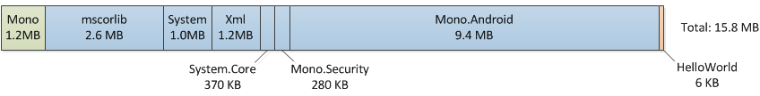
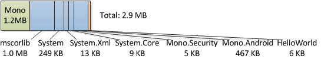
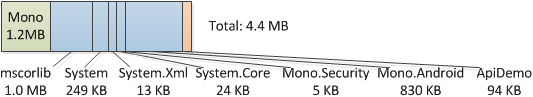
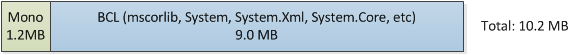
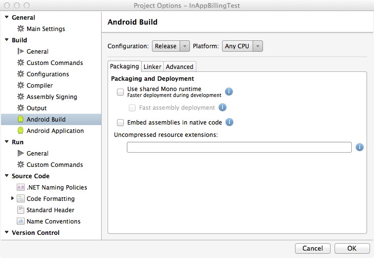
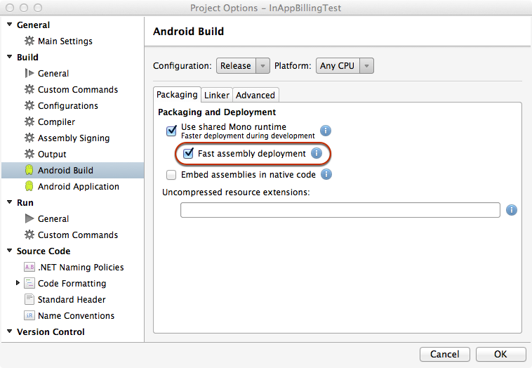

# Application Package Size

_This article examines the constituent parts of a Xamarin.Android application package and the associated strategies that can be used for efficient package deployment during debug and release stages of development._

## Overview

Xamarin.Android uses a variety of mechanisms to minimize package size while
maintaining an efficient debug and release deploy process. In this article, we
look at the Xamarin.Android release and debug deployment workflow and how the
Xamarin.Android platform ensures that we build and release small application
packages.

## Release Packages

To ship a fully contained application, the package must include the
application, the associated libraries, the content, the Mono runtime, and the
required Base Class Library (BCL) assemblies. For example, if we take the
default “Hello World” template, the contents of a complete package build
would look like this:

15.8 MB is a larger download size than we’d like. The problem is the BCL
libraries, as they include mscorlib, System, and Mono.Android, which provide a
lot of the necessary components to run your application. However, they also
provide functionality that you may not be using in your application, so it may
be preferable to exclude these components.

When we build an application for distribution, we execute a process, known as
Linking, that examines the application and removes any code that is not directly
used. This process is similar to the functionality that [Garbage Collection](~/android/internals/garbage-collection.md)
provides for heap-allocated memory. But instead of operating over objects,
linking operates over your code. For example, there is a whole namespace in
System.dll for sending and receiving email, but if your application does not
make use of this functionality, that code is just wasting space. After running
the linker on the Hello World application, our package now looks like this:

As we can see, this removes a significant amount of the BCL that was not
being used. Note that the final BCL size is dependent on what the application
actually uses. For example, if we take a look at a more substantial sample
application called ApiDemo, we can see that the BCL component has increased in
size because ApiDemo uses more of the BCL than Hello, World does:

As illustrated here, your application package size will generally be about
2.9 MB larger than your application and its dependencies.

## Debug Packages

Things are handled slightly differently for debug builds. When redeploying
repeatedly to a device, an application needs to be as fast as possible, so we
optimize debug packages for speed of deployment rather than size.

Android is relatively slow to copy and install a package, so we want 
the package size to be as small as possible. As we discussed above, one possible 
way to minimize package size is via the linker. However, linking is slow and we
generally want to deploy only the parts of the application that have changed
since the last deployment. To accomplish this, we separate our application from
the core Xamarin.Android components.

The first time we debug on device, we copy two large packages called
*Shared Runtime* and *Shared Platform*. Shared Runtime contains the
Mono Runtime and BCL, while Shared Platform contains Android API level
specific assemblies:

Copying these core components is only done once as it takes quite a bit of
time, but allows any subsequent applications running in debug mode to utilize
them. Finally, we copy the actual application, which is small and quick:

### Fast Assembly Deployment

The *Fast Assembly Deployment* build option can be used to further decrease
the size of the debug install package by not including the assemblies in the application's package, installing
the assemblies directly on the device only once and only copying over files that have been
modified since the last deployment.

To enable *Fast Assembly Deployment*, do the following:

1.  Right click on the Android Project in the Solution Explorer and select **Options**.

2.  From the Project Options dialog select **Android Build** :  

    

3.  Check the  **Use shared Mono runtime checkbox** and the  **Fast assembly deployment** checkboxes:  

    

4.  Click the  **OK** button to save the changes and close the Project Options dialog.

The next time the application is built for debug, the assemblies will be installed directly on the device (if they haven't already been) and a
smaller application package (that does not include the assemblies) will be installed on the device. This will shorten the time it takes to get changes
to the application up and running for testing.

By enduring the long first deploy of the shared runtime and shared platform,
every time we make a change to the application, we can deploy the new version
quickly and painlessly, so we can have a fast change/deploy/run cycle.

## Summary

In this article we examined the facets of Xamarin.Android Release and Debug
profile packaging. Additionally, we looked at the strategies that the Mono for
Android platform uses to facilitate efficient package deployment during debug
and release stages of development.
