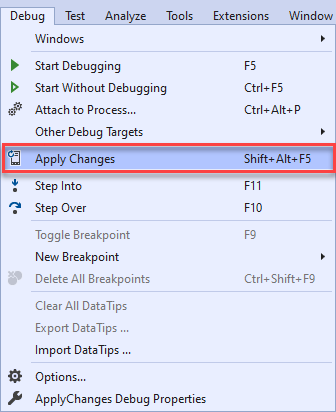
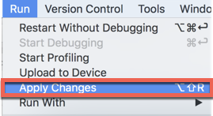

# Apply Changes

Apply Changes lets you push resource changes to your running app without restarting your app. This helps you control how much of your app is restarted when you want to deploy and test small, incremental changes while preserving your device or emulator's current state.

Apply Changes uses capabilities in the [Android JVMTI implementation](https://docs.oracle.com/javase/8/docs/platform/jvmti/jvmti.html#bci) which is supported on devices or emulators running Android 8.0 (API level 26) or higher.

## Requirements

The following list shows the requirements for using Apply Changes:

- **Visual Studio** - On Windows, update to Visual Studio 2019 version 16.5 or later. On macOS, update to Visual Studio 2019 for Mac version 8.5 or later.
- **Xamarin.Android** - Xamarin.Android 10.2 or later must be installed with Visual Studio (Xamarin.Android is automatically installed as part of the **Mobile Development With .NET** workload on Windows and installed as part of the **Visual Studio for Mac Installer**).
- **Android SDK** - Android API 28 or higher must be installed via the Android SDK Manager.
- **Target Device or Emulator** - Your device or emulator must run Android 8.0 (API level 26) or higher.

# [Visual Studio](#tab/windows)

## Get started

To get started with Apply Changes, you will need to ensure a device or emulator is running Android 8.0 (API level 26) or higher. Then run your Android application with or without debugging.

You can then interact with Apply Changes with the following approaches:

1. **Toolbar icon.** You can click on the Apply Changes toolbar icon to apply changes to your target device or emulator.

    

2. **Keyboard shortcut.** You can use the **Shift + Alt + F5** keyboard shortcut to apply changes to your target device or emulator.
3. **Debug menu.** You can use the **Debug > Apply Changes** menu item to apply changes to your target device or emulator.

    

# [Visual Studio for Mac](#tab/macos)

## Get started

To get started with Apply Changes, you will need to ensure a device or emulator is running Android 8.0 (API level 26) or higher. Then run your Android application with or without debugging.

You can then interact with Apply Changes with the following approaches:

1. **Keyboard shortcut.** You can use the **⌥ + ⇧ + R** keyboard shortcut to apply changes to your target device or emulator.
2. **Run menu.** You can use the **Run > Apply Changes** menu item to apply changes to your target device or emulator.

    

-----

## Limitations

The following changes require an application restart:

- Changing C# code.
- Adding or removing a resource.
- Changing the AndroidManifest.xml.
- Changing native libraries (.so files).

## Related links

- [Apply Changes](https://developer.android.com/studio/run#apply-changes)
