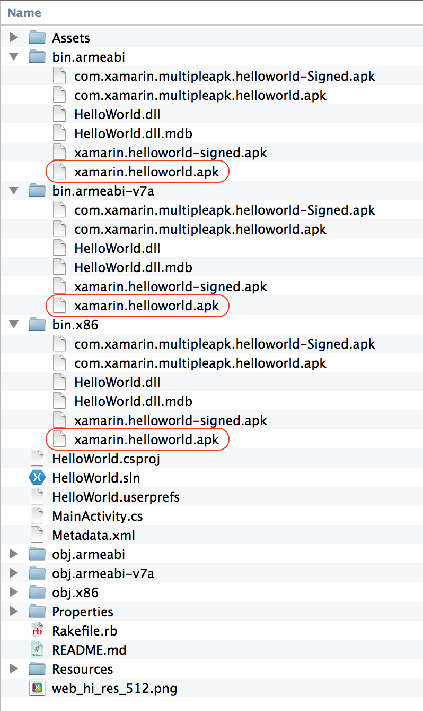

# Building ABI-Specific APKs

_This document will discuss how to build an APK that will target a single ABI using Xamarin.Android._

## Overview

In some situations it may be advantageous for an application to have
multiple APKs - each APK is signed with the same keystore and shares
the same package name but it is compiled for a specific device or
Android configuration. This is not the recommended approach - it is
much simpler to have one APK that can support multiple devices and
configurations. There are some situations where creating multiple APKs
can be useful, such as:

- **Reduce the size of the APK** - Google Play imposes a 100MB size
  limit on APK files. Creating device specific APK's can reduce the
  size of the APK as you only need to supply a subset of assets and
  resources for the application.

- **Support different CPU architectures** - If your application has
  shared libraries for specific CPU's, you can distribute only the
  shared libraries for that CPU.

Multiple APKs can complicate distribution - a problem that is addressed
by Google Play. Google Play will ensure that the correct APK is
delivered to a device based on the application's version code and other
metadata contained with **AndroidManifest.XML**. For specific details and
restrictions on how Google Play supports multiple APKs for an
application, consult
[Google's documentation on multiple APK support](https://developer.android.com/google/play/publishing/multiple-apks.html).

This guide will address how to script the building multiple APKs for a
Xamarin.Android application, each APK targeting a specific ABI. It will
cover the following topics:

1. Create a unique  *version code* for the APK.
1. Create a temporary version of  **AndroidManifest.XML** that will be used for this APK.
1. Build the application using the  **AndroidManifest.XML** from the previous step.
1. Prepare the APK for release by signing and zip-aligning it.

At the end of this guide is a walkthrough that will demonstrate how to
script these steps using
[Rake](https://martinfowler.com/articles/rake.html).

### Creating the Version Code for the APK

Google recommends a particular algorithm for the version code that uses
a seven digit version code (please see the section *Using a version
code scheme* in the
[Multiple APK support document](https://developer.android.com/google/play/publishing/multiple-apks.html)).
By expanding this version code scheme to eight digits, it is possible
to include some ABI information into the version code that will ensure
that Google Play will distribute the correct APK to a device. The
following list explains this eight digit version code format 
(indexed from left to right):

- **Index 0** (red in diagram below) &ndash; An integer for the ABI:
  - 1 &ndash; `armeabi`
  - 2 &ndash; `armeabi-v7a`
  - 6 &ndash; `x86`

- **Index 1-2** (orange in diagram below) &ndash; The minimum API level supported by the application.

- **Index 3-4** (blue in diagram below) &ndash; The screen sizes supported:
  - 1 &ndash; small
  - 2 &ndash; normal
  - 3 &ndash; large
  - 4 &ndash; xlarge

- **Index 5-7** (green in diagram below) &ndash; A unique number for the version code. 
    This is set by the developer. It should increase for each public release of the application.

The following diagram illustrates the position of each code described
in the above list:

[](abi-specific-apks-images/image00.png#lightbox)

Google Play will ensure that the correct APK is delivered to the device
based on the `versionCode` and APK configuration. The APK with the
highest version code will be delivered to the device. As an example, an
application could have three APKs with the following version codes:

- 11413456 - The ABI is  `armeabi` ; targeting API level 14; small to large screens; with a version number of 456.
- 21423456 - The ABI is  `armeabi-v7a` ; targeting API level 14; normal &amp; large screens; with a version number of 456.
- 61423456 - The ABI is  `x86` ; targeting API level 14; normal &amp; large screens; with a version number of 456.

To continue on with this example, imagine that a bug was fixed which
was specific to `armeabi-v7a`. The app version increases to 457, and an
new APK is built with the `android:versionCode` set to 21423457. The
versionCodes for the `armeabi` and `x86` versions would remain the
same.

Now imagine that the x86 version receives some updates or bug fixes
that target a newer API (API level 19), making this version 500 of the
app. The new `versionCode` would change to 61923500 while the
armeabi/armeabi-v7a remain unchanged. At this point in time, the
version codes would be:

- 11413456 - The ABI is  `armeabi` ; targeting API level 14; small to large screens; with a version name of 456.
- 21423457 - The ABI is  `armeabi-v7a` ; targeting API level 14; normal &amp; large screens; with a version name of 457.
- 61923500 - The ABI is  `x86` ; targeting API level 19; normal &amp; large screens; with a version name of 500.

Maintaining these version codes manually can be a significant burden on
the developer. The process of calculating the correct
`android:versionCode` and then building the APK's should be automated.
An example of how to do so will be covered in the walkthrough at the
end of this document.

### Create A Temporary AndroidManifest.XML

Although not strictly necessary, creating an temporary
**AndroidManifest.XML** for each ABI can help prevent issues that might
arise with information leaking from one APK to the other. For example,
it is crucial that the `android:versionCode` attribute is unique for
each APK.

How this is done depends on the scripting system involved, but
typically involves taking a copy of the Android manifest used during
development, modifying it, and then using that modify manifest during
the build process.

### Compiling the APK

Building the APK per ABI is best accomplished by using either `xbuild` or `msbuild` as shown in the following sample command line:

```bash
/Library/Frameworks/Mono.framework/Commands/xbuild /t:Package /p:AndroidSupportedAbis=<TARGET_ABI> /p:IntermediateOutputPath=obj.<TARGET_ABI>/ /p:AndroidManifest=<PATH_TO_ANDROIDMANIFEST.XML> /p:OutputPath=bin.<TARGET_ABI> /p:Configuration=Release <CSPROJ FILE>
```

The following list explains each command line parameter:

- `/t:Package` &ndash; Creates an Android APK that is signed using
  the debug keystore

- `/p:AndroidSupportedAbis=<TARGET_ABI>` &ndash; This the ABI to
  target. Must one of `armeabi`, `armeabi-v7a`, or `x86`

- `/p:IntermediateOutputPath=obj.<TARGET_ABI>/` &ndash; This is the
  directory that will hold the intermediate files that are created as
  a part of the build. If necessary, Xamarin.Android will create a
  directory named after the ABI, such as `obj.armeabi-v7a`. It is
  recommended to use one folder for each ABI as this will prevent
  issues that make result with files "leaking" from one
  build to another. Notice that this value is terminated with a
  directory separator (a `/` in the case of OS X).

- `/p:AndroidManifest` &ndash; This property specifies the path to
  the **AndroidManifest.XML** file that will be used during the build.

- `/p:OutputPath=bin.<TARGET_ABI>` &ndash; This is the directory that
  will house the final APK. Xamarin.Android will create a directory
  named after the ABI, for example `bin.armeabi-v7a`.

- `/p:Configuration=Release` &ndash; Perform a Release build of the
  APK. Debug builds may not be uploaded to Google Play.

- `<CS_PROJ FILE>` &ndash; This is the path to the `.csproj` file for
  the Xamarin.Android project.

### Sign and Zipalign The APK

It is necessary to sign the APK before it can be distributed via Google
Play. This can be performed by using the `jarsigner` application that
is a part of the Java Developer's Kit. The following command line
demonstrats how to use `jarsigner` at the command line:

```shell
jarsigner -verbose -sigalg SHA1withRSA -digestalg SHA1 -keystore <PATH/TO/KEYSTORE> -storepass <PASSWORD> -signedjar <PATH/FOR/SIGNED_JAR> <PATH/FOR/JAR/TO/SIGN> <NAME_OF_KEY_IN_KEYSTORE>
```

All Xamarin.Android applications must be zip-aligned before they can be
run on a device. This is the format of the command line to use:

```shell
zipalign -f -v 4 <SIGNED_APK_TO_ZIPALIGN> <PATH/TO/ZIP_ALIGNED.APK>
```

## Automating APK Creation With Rake

The sample project
[OneABIPerAPK](https://github.com/xamarin/monodroid-samples/tree/master/OneABIPerAPK)
is a simple Android project that will demonstrate how to calculate an
ABI specific version number and build three separate APK's for each of
the following ABI's:

- armeabi
- armeabi-v7a
- x86

The [rakefile](https://github.com/xamarin/monodroid-samples/blob/master/OneABIPerAPK/Rakefile.rb)
in the sample project performs each of the steps that were described in
the previous sections:

1. [Create an android:versionCode](https://github.com/xamarin/monodroid-samples/blob/master/OneABIPerAPK/Rakefile.rb#L30)
   for the APK.

1. [Write the android:versionCode](https://github.com/xamarin/monodroid-samples/blob/master/OneABIPerAPK/Rakefile.rb#L55)
   to a custom **AndroidManifest.XML** for that APK.

1. [Compile a release build](https://github.com/xamarin/monodroid-samples/blob/master/OneABIPerAPK/Rakefile.rb#L63)
   of the Xamarin.Android project that will singularly target the ABI
   and using the **AndroidManifest.XML** that was created in the previous
   step.

1. [Sign the APK](https://github.com/xamarin/monodroid-samples/blob/master/OneABIPerAPK/Rakefile.rb#L66)
   with a production keystore.

1. [Zipalign](https://github.com/xamarin/monodroid-samples/blob/master/OneABIPerAPK/Rakefile.rb#L67)
   the APK.

To build all of the APKs for the application, run the `build` Rake task
from the command line:

```shell
$ rake build
==> Building an APK for ABI armeabi with ./Properties/AndroidManifest.xml.armeabi, android:versionCode = 10814120.
==> Building an APK for ABI x86 with ./Properties/AndroidManifest.xml.x86, android:versionCode = 60814120.
==> Building an APK for ABI armeabi-v7a with ./Properties/AndroidManifest.xml.armeabi-v7a, android:versionCode = 20814120.
```

Once the rake task has completed, there will be three `bin` folders
with the file `xamarin.helloworld.apk`. The next screenshot shows each
of these folders with their contents:

[](abi-specific-apks-images/image01.png#lightbox)

> [!NOTE]
> The build process outlined in this guide may be
implemented in one of many different build systems. Although we don't
have a pre-written example, it should also be possible with
[Powershell](/powershell/) / [psake](https://github.com/psake/psake) or
[Fake](https://fsharp.github.io/).

## Summary

This guide provided some suggestions with how to create Android APK's
that target a specify ABI. It also discussed one possible scheme for
creating `android:versionCodes` that will identify the CPU architecture
that the APK is intended for. The walkthrough included a sample project
that has it's build scripted using Rake.

## Related Links

- [OneABIPerAPK (sample)](/samples/xamarin/monodroid-samples/oneabiperapk)
- [Publishing an Application](~/android/deploy-test/publishing/index.md)
- [Multiple APK Support for Google Play](https://developer.android.com/google/play/publishing/multiple-apks.html)