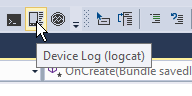
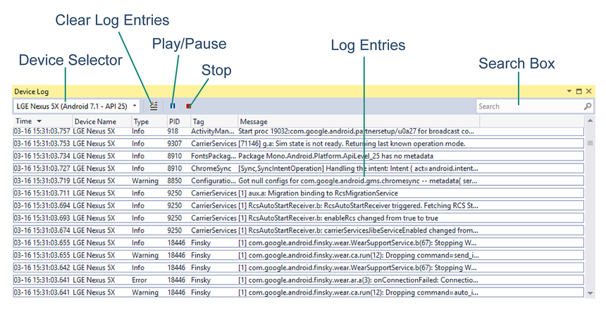
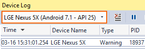
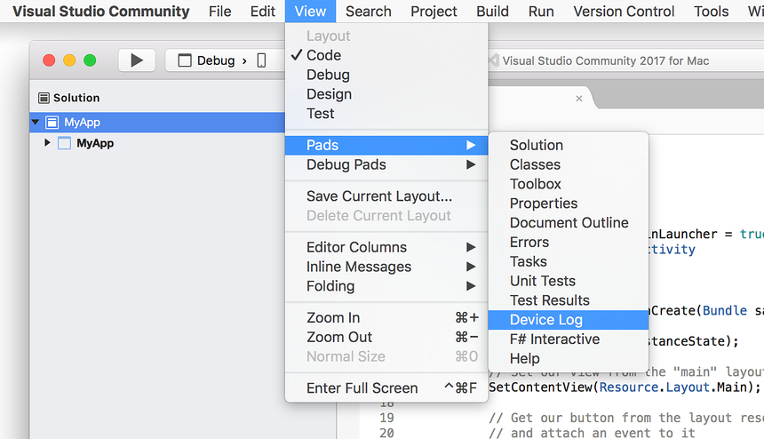
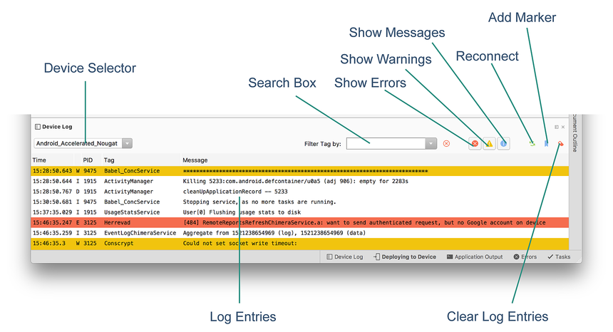
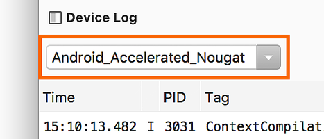

# Android Debug Log

One very common trick developers use to debug their applications is to
make calls to `Console.WriteLine`. However, on a mobile platform like
Android there is no console. Android devices provides a log that you
can use while writing apps. This is sometimes referred to as _logcat_
due to the command that you type to retrieve it. Use the **Debug Log**
tool to view the logged data.

## Android Debug Log Overview

The **Debug Log** tool provides a way to view log output while debugging an
app through Visual Studio. The debug log supports the following devices:

-   Physical Android phones, tablets, and wearables.
-   An Android Virtual device running on the Android Emulator. 

> [!NOTE]
> The **Debug Log** tool does not work with Xamarin Live Player.

The **Debug Log** does not display log messages that are generated
while the app is running standalone on the device (i.e., while it is
disconnected from Visual Studio).


## Accessing the Debug Log from Visual Studio

# [Visual Studio](#tab/windows)

To open the **Device Log** tool, click **Device Log (logcat)** icon on the
toolbar:

[](android-debug-log-images/vswin-01-logcat.png#lightbox)

Alternately, launch the **Device Log** tool from one of the following
menu selections:

-   **View > Other Windows > Device Log**
-   **Tools > Android > Device Log**

The following screenshot illustrates the various parts of the **Debug
Tool** window:

[](android-debug-log-images/vswin-03-features.png#lightbox)

-   **Device Selector** &ndash; Selects which physical device or
    running emulator to monitor.

-   **Log Entries** &ndash; A table of log messages from logcat.

-   **Clear Log Entries** &ndash; Clears all current log entries from the table.

-   **Play/Pause** &ndash; Toggles between updating or pausing the
    display of new log entries.

-   **Stop** &ndash; Halts the display of new log entries.

-   **Search Box** &ndash; Enter search strings in this box to filter for a subset
    of log entries.


When the **Debug Log** tool window is displayed, use the device pull-down
menu to choose the Android device to monitor:

[](android-debug-log-images/vswin-02-devices-combo.png#lightbox)

After the device is selected, the **Device Log** tool automatically adds
log entries from a running app &ndash; these log entries are shown in
the table of log entries. Switching between devices stops and
starts device logging. Note that an Android project must be loaded
before any devices will appear in the device selector. If the device
does not appear in the device selector, verify that it is available in
the Visual Studio device drop-down menu next to the **Start** button.


# [Visual Studio for Mac](#tab/macos)

To open the **Device Log**, click **View > Pads > Device Log**:

[](android-debug-log-images/vsmac-01-logcat.png#lightbox)

The following screenshot illustrates the various parts of the **Debug Tool** window:

[](android-debug-log-images/vsmac-03-features.png#lightbox)

-   **Device Selector** &ndash; Selects which physical device or
    running emulator to monitor.

-   **Log Entries** &ndash; A table of log messages from logcat.

-   **Clear Log Entries** &ndash; Clears all current log entries from the table.

-   **Search Box** &ndash; Enter search strings in this box to filter for a subset
    of log entries.

-   **Show Messages** &ndash; Toggles the display of informational messages.

-   **Show Warnings** &ndash; Toggles the display of warning messages (warning messages are shown in yellow).

-   **Show Errors** &ndash; Toggles the display of error messages (warning messages are shown in red).

-   **Reconnect** &ndash; Reconnects to the device and refreshes the log entry display.

-   **Add Marker** &ndash; Inserts a marker message (such as `--- Marker N ---`) 
    after the latest log entry, where _N_ is a counter that starts from 1 and 
    increments by 1 as new markers are added.

When the Debug Log tool window is displayed, use the device pull-down
menu to choose the Android device to monitor:

[](android-debug-log-images/vsmac-02-devices-combo.png#lightbox)

After the device is selected, the **Device Log** tool automatically adds
log entries from a running app &ndash; these log entries are shown in
the table of log entries. Switching between devices stops and
starts device logging. Note that an Android project must be loaded
before any devices will appear in the device selector. If the device
does not appear in the device selector, verify that it is available in
the Visual Studio device drop-down menu next to the **Start** button.

-----


## Accessing from the Command Line

# [Visual Studio](#tab/windows)

Another option is to view the debug log via the command line. Open a
command prompt window and navigate to the Android SDK platform-tools
folder (typically, the SDK platform-tools folder is located at
**C:\\Program Files (x86)\\Android\\android-sdk\\platform-tools**).

If only a single device (physical device or emulator) is attached, the
log can be viewed by entering the following command:

```shell
$ adb logcat
```

# [Visual Studio for Mac](#tab/macos)

Another option is to view the debug log via the command line. Open a 
Terminal window and navigate to the Android SDK platform-tools folder 
(typically, the SDK platform-tools folder is located at
**/Users/username/Library/Developer/Xamarin/android-sdk-macosx/platform-tools**).

If only a single device (physical device or emulator) is attached, the
log can be viewed by entering the following command:

```shell
$ ./adb logcat
```

-----


If more than one device is attached, the device must be explicitly
identified. For example **adb -d logcat** displays the log of the only
physical device connected, while **adb -e logcat** shows the log of the
only emulator running.

More commands can be found by entering **adb** and reading the help
messages.


## Writing to the Debug Log

Messages can be written to the **Debug Log** by using the methods of the 
[Android.Util.Log](https://developer.xamarin.com/api/type/Android.Util.Log/) class.
For example: 

```csharp
string tag = "myapp";

Log.Info (tag, "this is an info message");
Log.Warn (tag, "this is a warning message");
Log.Error (tag, "this is an error message");
```

This produces output similar to the following:

```shell
I/myapp   (11103): this is an info message
W/myapp   (11103): this is a warning message
E/myapp   (11103): this is an error message
```

It is also possible to use `Console.WriteLine` to write to the **Debug
Log** &ndash; these messages appear in logcat with a slightly different
output format (this technique is particularly useful when debugging
Xamarin.Forms apps on Android):

```csharp
System.Console.WriteLine ("DEBUG - Button Clicked!");
```

This produces output similar to the following in logcat:

```
Info (19543) / mono-stdout: DEBUG - Button Clicked!
```

## Interesting Messages

When reading the log (and especially when providing log snippets to
others), perusing the log file in its entirety is often too cumbersome.
To make it easier to navigate through log messages, start by looking
for a log entry that resembles the following:

```shell
I/ActivityManager(12944): Starting: Intent { act=android.intent.action.MAIN cat=[android.intent.category.LAUNCHER] flg=0x10200000 cmp=GcTest.GcTest/gctest.Activity1 } from pid 24175
```

In particular, look for a line matching the regular expression that
also contains the name of the application package:

```shell
^I.*ActivityManager.*Starting: Intent
```

This is the line which corresponds to the start of an activity, and *most* 
(but not all) of the following messages should relate to the application.

Notice that every message contains the process identifier (pid) of 
the process generating the message. In the above `ActivityManager` 
message, process `12944` generated the message. To determine which 
process is the process of the application being debugged, look for the 
**mono.MonoRuntimeProvider** message: 

```shell
I/ActivityThread(  602): Pub TouchTest.TouchTest.__mono_init__: mono.MonoRuntimeProvider
```

This message comes from the process that was started. All subsequent
messages that contain this pid come from the same process.
