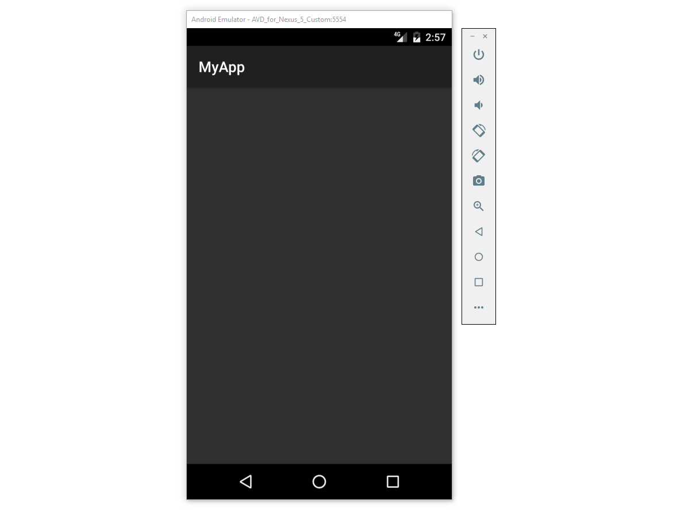

# Running the Android SDK Emulator

In this guide, you will learn how to launch a virtual device in the
Android SDK Emulator for debugging and testing your app.

## Using a Pre-Configured Virtual Device

# [Visual Studio](#tab/vswin)

Visual Studio includes pre-configured virtual devices that appear in
the device drop-down menu. For example, in the following Visual Studio
2017 screenshot, several pre-configured virtual devices are available:

-   **VisualStudio\_android-23\_arm\_phone**

-   **VisualStudio\_android-23\_arm\_tablet**

-   **VisualStudio\_android-23\_x86\_phone** 

-   **VisualStudio\_android-23\_x86\_tablet** 

Typically, you would select the **VisualStudio\_android-23\_x86\_phone**
virtual device to test and debug a phone app. If one of these
pre-configured virtual devices meets your requirements (i.e., matches
your app's target API level), skip to
[Launching the Emulator](#launching) to begin running your app in the
emulator. (If you are not yet familiar with Android API levels, see
[Understanding Android API Levels](~/android/app-fundamentals/android-api-levels.md).)

If your Xamarin.Android project is using a Target Framework level
that is incompatible with the available virtual devices, the drop-down
menu will list the unusable virtual devices under **Unsupported
Devices**. 
For example, the following project has a Target Framework set to
**Android 7.1 Nougat (API 25)**, which is incompatible with the
**Android 6.0** virtual devices that are provided by default:

You can click **Change Minimum Android Target** to change the project's
Minimum Android Version so that it matches the API level of the
available virtual devices. Alternately, you can use the **Android
Emulator Manager** to create new virtual devices that support your
target API level as explained later in
[Configuring Virtual Devices](#virtualdevice). Before you can configure
virtual devices for a new API level, you must first install the
corresponding system images for that API level &ndash; this is
explained in the next section.

# [Visual Studio for Mac](#tab/vsmac)

Visual Studio for Mac includes pre-configured virtual devices that
appear in the device drop-down menu. For example, in the following
screenshot, two pre-configured virtual devices are available:

-   **Android\_Accelerated\_x86**

-   **Android\_ARMv7a**

Typically, you would select the **Android\_Accelerated\_x86**
virtual device to test and debug a phone app. If this
pre-configured virtual device meets your requirements (i.e., matches
your app's target API level), skip to
[Launching the Emulator](#launching) to begin running your app in the
emulator. (If you are not yet familiar with Android API levels, see
[Understanding Android API Levels](~/android/app-fundamentals/android-api-levels.md).)

-----

## Creating Custom Virtual Devices

To create custom virtual devices, you must use either the Xamarin
Android Device Manager or the legacy Google Emulator Manager that is
part of the Android SDK. For more information about creating and
customizing virtual devices, see
[Xamarin Android Device Manager](~/android/get-started/installation/android-emulator/xamarin-device-manager.md).
If you prefer to use the legacy Google Emulator Manager, see
[Google Emulator Manager](~/android/get-started/installation/android-emulator/google-emulator-manager.md).

Note that if you are developing for Android 8.0 Oreo, you must use the
Xamarin Android Device Manager.

<a name="launching" />

## Launching the Emulator

Near the top of the IDE, there is a drop-down menu that can be used to
select **Debug** or **Release** mode. Choosing **Debug** attaches the
debugger to the application process running inside the emulator. 

After you have chosen a virtual device from the device drop-down menu,
select either **Debug** or **Release** mode, then click the **Play**
button to run the application:

# [Visual Studio](#tab/vswin)

# [Visual Studio for Mac](#tab/vsmac)

-----

After the Android emulator starts, Xamarin.Android will deploy the app
to the emulator. The emulator runs the app with the configured virtual
device image. An example screenshot of the Android SDK Emulator is
displayed below (the emulator is running a blank app called **MyApp**):

The emulator may be left running; it is not necessary to shut it down
and restart it each time the app is run. The first time a
Xamarin.Android app is run in the emulator, the Xamarin.Android shared
runtime for the targetted API level is installed, followed by the
application. The runtime installation may take a few moments, so please
be patient. Installation of the runtime takes place only when the first
Xamarin.Android app is deployed to the emulator &ndash; subsequent
deployments are faster because only the app is copied to the emulator.

For more information about using the Android SDK Emulator, see
the following Android Developer topics:

-   [Navigating on the Screen](https://developer.android.com/studio/run/emulator.html#navigate)

-   [Performing Basic Tasks in the Emulator](https://developer.android.com/studio/run/emulator.html#tasks)

-   [Working with Extended Controls, Settings, and Help](https://developer.android.com/studio/run/emulator.html#extended)

