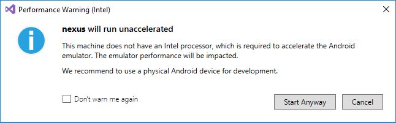
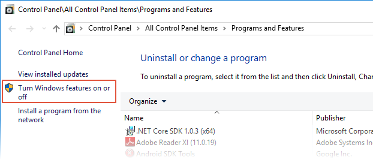

# Google Android Emulator Troubleshooting

_In this article, the most common warning messages and issues that
occur while running the Google Android Emulator are described, along
with workarounds and tips. For information about resolving problems
during emulator setup, see
[Troubleshooting Emulator Setup Problems](~/android/get-started/installation/android-emulator/troubleshooting.md)._

<a name="perfwarn" />

## Performance Warnings

# [Visual Studio](#tab/vswin)

Beginning with Visual Studio 2017 version 15.4, a performance warning
dialog may be displayed when you first deploy your app to the Google
Android Emulator. These warning dialogs are explained below.

### Computer Does Not Contain an Intel Procesor



When this dialog is displayed, your computer does not have an Intel
processor, which is required for acceleration of the Android SDK
Emulator. If your computer does not have an Intel processor, we
recommend using a physical Android device for development.

### Hyper-V Is Installed or Active


When this dialog is displayed, Hyper-V is installed or active and
must be disabled. [Disabling Hyper-V](#disable-hyperv) explains how to resolve this issue.

### HAXM is Not Installed


This dialog indicates that your computer has an Intel processor,
Hyper-V is disabled, but HAXM is not installed.
[Installing HAXM](~/android/get-started/installation/android-emulator/hardware-acceleration.md#install-haxm)
describes the steps for installing HAXM.

### HAXM Process Not Running


This dialog is displayed if your computer has an Intel processor,
Hyper-V is disabled, Intel HAXM is installed, but the HAXM process is
not running. To resolve this issue, open a Command Prompt window and
enter the following command:

```cmd
sc query intelhaxm
```

If the HAXM process is running, you should see output similar
to the following:

```cmd
SERVICE_NAME: intelhaxm
    TYPE               : 1  KERNEL_DRIVER
    STATE              : 4  RUNNING
                            (STOPPABLE, NOT_PAUSABLE, IGNORES_SHUTDOWN)
    WIN32_EXIT_CODE    : 0  (0x0)
    SERVICE_EXIT_CODE  : 0  (0x0)
    CHECKPOINT         : 0x0
    WAIT_HINT          : 0x0
```


If `STATE` is not set to `RUNNING`, see
[How to Use the Intel Hardware Accelerated Execution Manager](https://software.intel.com/en-us/android/articles/how-to-use-the-intel-hardware-accelerated-execution-manager-intel-haxm-android-emulator) to resolve the problem.


### Other Failures


This dialog is displayed if your computer has an Intel processor,
Hyper-V is disabled, Intel HAXM is installed, the HAXM process is
running, but the emulator fails to start for some unknown reason.
To help resolve this error, see
[How to Use the Intel Hardware Accelerated Execution Manager](https://software.intel.com/en-us/android/articles/how-to-use-the-intel-hardware-accelerated-execution-manager-intel-haxm-android-emulator).

### Disabling Performance Warnings

If you would rather not see performance warnings, you can
disable them. In Visual Studio, click **Tools > Options > Xamarin >
Android Settings** and disable the **Warn if AVD acceleration is not
supported (HAXM)** option:

[](troubleshooting-images/win/06-disable-perf-warnings.png#lightbox)


# [Visual Studio for Mac](#tab/vsmac)

Beginning with Visual Studio for Mac build 7.2 (build 559) , a
performance warning dialog may be displayed when you first deploy your
app to the Google Android Emulator. These warning dialogs are explained
below.

### HAXM is Not Installed


This dialog indicates that HAXM is not installed.
[Installing HAXM](~/android/get-started/installation/android-emulator/hardware-acceleration.md#install-haxm)
describes the steps for installing HAXM.

### HAXM Process Not Running


This dialog is displayed if the HAXM process is not running. For
detailed information to help you resolve this issue, see
[How to Use the Intel Hardware Accelerated Execution Manager](https://software.intel.com/en-us/android/articles/how-to-use-the-intel-hardware-accelerated-execution-manager-intel-haxm-android-emulator) to resolve the problem.

### Other Failures


This dialog is displayed if the emulator fails to start for some
unknown reason. To help resolve this error, see
[How to Use the Intel Hardware Accelerated Execution Manager](https://software.intel.com/en-us/android/articles/how-to-use-the-intel-hardware-accelerated-execution-manager-intel-haxm-android-emulator) to resolve the problem.

-----


## Deployment Issues

If you get an error about a failure to install the APK on the emulator or
a failure to run the Android Debug Bridge (**adb**), verify that the
Android SDK can connect to your emulator. To do this, use the following
steps:

1. Launch the emulator from the **Android Device Manager** (select
   your virtual device and click **Start**).

2. Open a Command Prompt and go to the folder where **adb** is
   installed. For example, on Windows, this might be at: **C:\\Program
   Files (x86)\\Android\\android-sdk\\platform-tools\\adb.exe**.

3. Type the following command:

   ```shell
   adb devices
   ```

4. If the emulator is accessible from the Android SDK, the emulator
   should appear in the list of attached devices. For example:

   ```shell
   List of devices attached
   emulator-5554   device
   ```

5. If the emulator does not appear in this list, start the **Android
   SDK Manager**, apply all updates, then try launching the
   emulator again.


## HAXM Issues

# [Visual Studio](#tab/vswin)

If the Google Android Emulator does not start properly, this is often
caused by problems with HAXM. HAXM issues are often the result of
conflicts with other virtualization technologies, incorrect settings,
or an out of date HAXM driver.

<a name="virt-conflicts" />

### HAXM Virtualization Conflicts

HAXM can conflict with other technologies that use virtualization,
such as Hyper-V, Windows Device Guard, and some antivirus software:

- **Hyper-V** &ndash; If you are using a version of Windows before the
  **Windows 10 April 2018 update (build 1803)** and Hyper-V is enabled, 
  follow the steps in [Disabling Hyper-V](#disable-hyperv).

- **Device Guard** &ndash; Device Guard and Credential Guard can
  prevent Hyper-V from being disabled on Windows machines. To disable
  Device Guard and Credential Guard, see
  [Disabling Device Guard](#disable-devguard).

- **Antivirus Software** &ndash; If you are running antivirus software
  that uses hardware-assisted virtualization (such as Avast), disable
  or uninstall this software, reboot, and retry the Android SDK
  Emulator.


### Incorrect BIOS Settings

If you are using HAXM on a Windows PC, HAXM will not work unless
virtualization technology (Intel VT-x) is enabled in the BIOS. If VT-x
is disabled, you will get an error similiar to the following when you
attempt to start the Google Android Emulator:

**This computer meets the requirements for HAXM, but Intel
Virtualization Technology (VT-x) is not turned on.**

To correct this error, boot the computer into the BIOS, enable both
VT-x and SLAT (Second Level Address Translation), then restart the
computer back into Windows.

<a name="disable-hyperv" />

### Disabling Hyper-V

If you are using a version of Windows before the **Windows 10 April
2018 Update (build 1803)** and Hyper-V is enabled, you must disable
Hyper-V and reboot your computer to install and use HAXM. If you are
using **Windows 10 April 2018 Update (build 1803)** or later, Google
Android Emulator version 27.2.7 or later can use Hyper-V (instead of
HAXM) for hardware acceleration, so it is not necessary to disable
Hyper-V.

You can disable Hyper-V from the Control Panel by following these
steps:

1. In the Windows search box, enter **Programs and** then click the
   **Programs and Features** search result.

2. In the Control Panel **Programs and Features** dialog, click
   **Turn Windows features on or off**:

    

3. Uncheck **Hyper-V** and restart the computer:

    

Alternately, you can use the following Powershell cmdlet to disable Hyper-V:

`Disable-WindowsOptionalFeature -Online -FeatureName Microsoft-Hyper-V-Hypervisor`

Intel HAXM and Microsoft Hyper-V cannot both be active at the same
time. Unfortunately, there is no way to switch between between Hyper-V
and HAXM without restarting your computer. If you want to use the
Visual Studio 2015
[Visual Studio Emulator for Android](~/android/deploy-test/debugging/visual-studio-android-emulator.md)
(which depends on Hyper-V), you will be unable to use the Google
Android Emulator without rebooting. One way to resolve this problem is
to upgrade Windows to the **Windows 10 April 2018 Update (build 1803)**
or later and use Hyper-V for both emulators (see
[Hardware Acceleration for Emulator Performance](~/android/get-started/installation/android-emulator/hardware-acceleration.md)).
Another way is to use both Hyper-V and HAXM by creating a multi-boot
setup as explained in
[Creating a no hypervisor boot entry](https://blogs.msdn.microsoft.com/virtual_pc_guy/2008/04/14/creating-a-no-hypervisor-boot-entry/).

In some cases, using the above steps will not succeed in disabling
Hyper-V if Device Guard and Credential Guard are enabled. If you are
unable to disable Hyper-V (or it seems to be disabled but HAXM
installation still fails), use the steps in the next section to disable
Device Guard and Credential Guard.

<a name="disable-devguard" />

### Disabling Device Guard

Device Guard and Credential Guard can prevent Hyper-V from being
disabled on Windows machines. This is often a problem for domain-joined
machines that are configured and controlled by an owning organization.
On Windows 10, use the following steps to see if **Device Guard** is
running:

1. In **Windows Search**, type **System info** to start the **System
   Information** app.

2. In the **System Summary**, look to see if **Device Guard
   Virtualization based security** is present and is in the **Running**
   state:

   [](troubleshooting-images/win/09-device-guard.png#lightbox)

If Device Guard is enabled, use the following steps to disable it:

1. Ensure that **Hyper-V** is disabled (under **Turn Windows Features
   on or off**) as described in the previous section.

2. In the Windows Search Box, type **gpedit** and select the **Edit
   group policy** search result. This launches the **Local Group
   Policy Editor**.

3. In the **Local Group Policy Editor**, navigate to **Computer
   Configuration > Administrative Templates > System > Device Guard**:

   [](troubleshooting-images/win/10-group-policy-editor.png#lightbox)

4. Change **Turn On Virtualization Based Security** to **Disabled** (as
   shown above) and exit the **Local Group Policy Editor**.

5. In the Windows Search Box, type **cmd**. When **Command Prompt** appears
   in the search results, right-click **Command Prompt** and select
   **Run as Administrator**.

6. Copy and paste the following commands into the command prompt window
   (if drive **Z:** is in use, pick an unused drive letter to use
   instead):

        mountvol Z: /s
        copy %WINDIR%\System32\SecConfig.efi Z:\EFI\Microsoft\Boot\SecConfig.efi /Y
        bcdedit /create {0cb3b571-2f2e-4343-a879-d86a476d7215} /d "DebugTool" /application osloader
        bcdedit /set {0cb3b571-2f2e-4343-a879-d86a476d7215} path "\EFI\Microsoft\Boot\SecConfig.efi"
        bcdedit /set {bootmgr} bootsequence {0cb3b571-2f2e-4343-a879-d86a476d7215}
        bcdedit /set {0cb3b571-2f2e-4343-a879-d86a476d7215} loadoptions DISABLE-LSA-ISO,DISABLE-VBS
        bcdedit /set {0cb3b571-2f2e-4343-a879-d86a476d7215} device partition=Z:
        mountvol Z: /d

7. Restart your computer. On the boot screen, you should see a prompt like the following:

   **Do you want to disable Credential Guard?**

   Press the indicated key to disable Credential Guard as prompted.

8. After the computer reboots, check again to ensure that Hyper-V is
   disabled (as described in the previous steps).

If Hyper-V is still not disabled, the policies of your domain-joined
computer may prevent you from disabling Device Guard or Credential
Guard. In this case, you can request an exemption from your domain
adminstrator to allow you to opt out of Credential Guard. Alternately,
you can use a computer that is not domain-joined to use HAXM.


# [Visual Studio for Mac](#tab/vsmac)

If the Google Android Emulator does not start properly, this is often
caused by problems with HAXM. HAXM issues are often the result of
conflicts with other virtualization technologies, incorrect settings,
or an out of date HAXM driver. Try reinstalling the HAXM driver, using
the steps detailed in
[Installing HAXM](~/android/get-started/installation/android-emulator/hardware-acceleration.md#install-haxm).

-----

