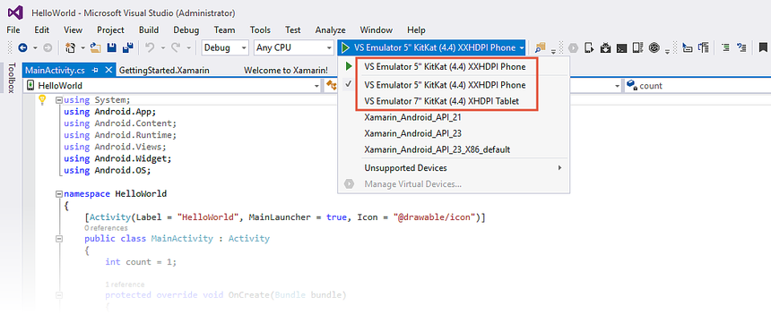
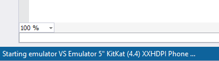
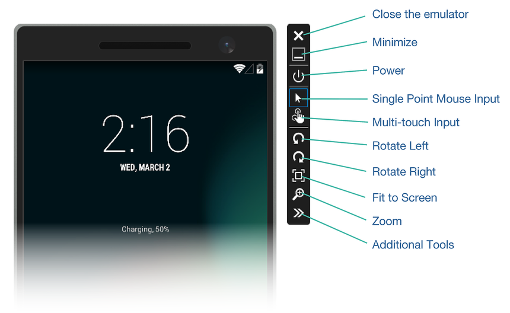
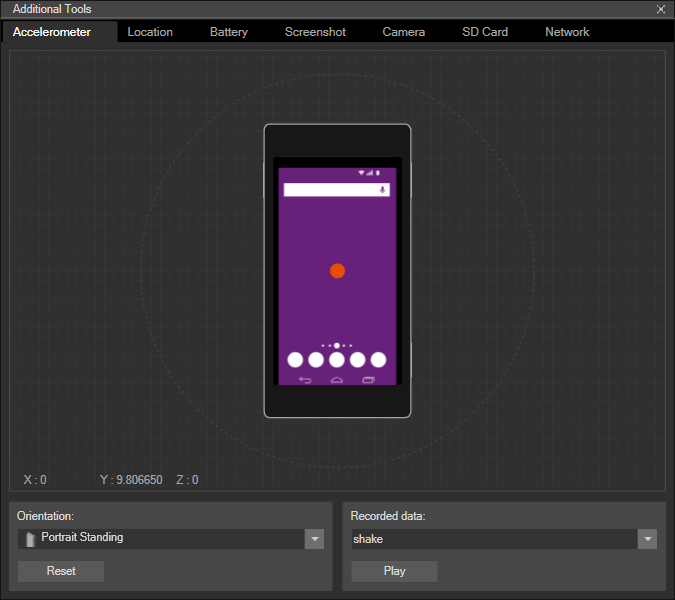
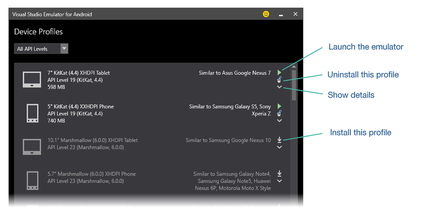
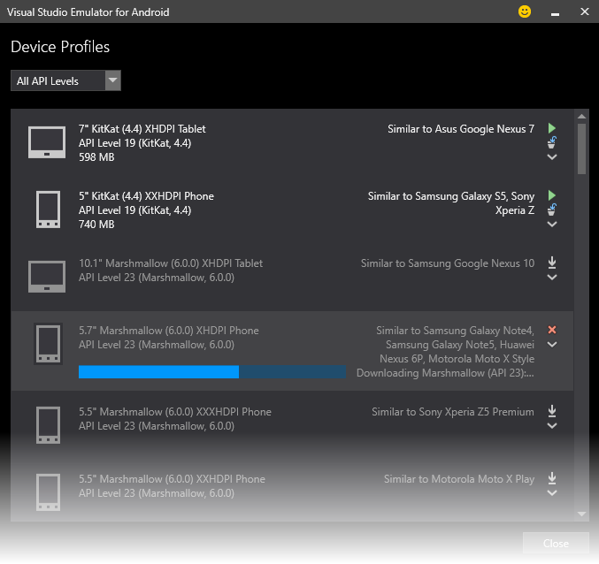
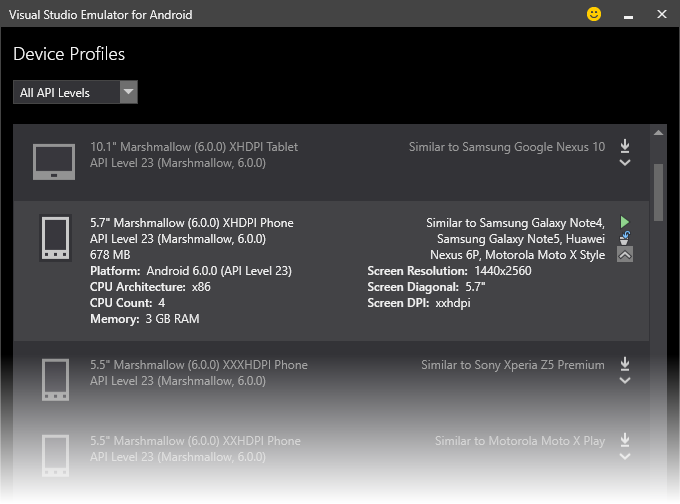
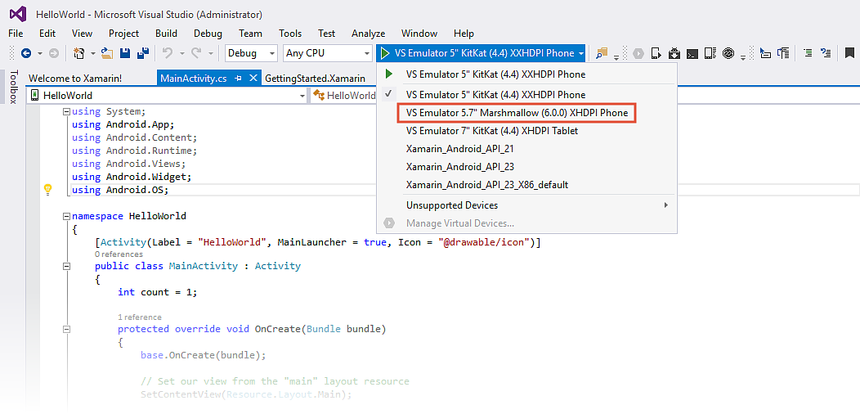
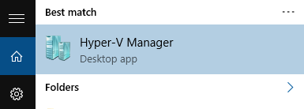
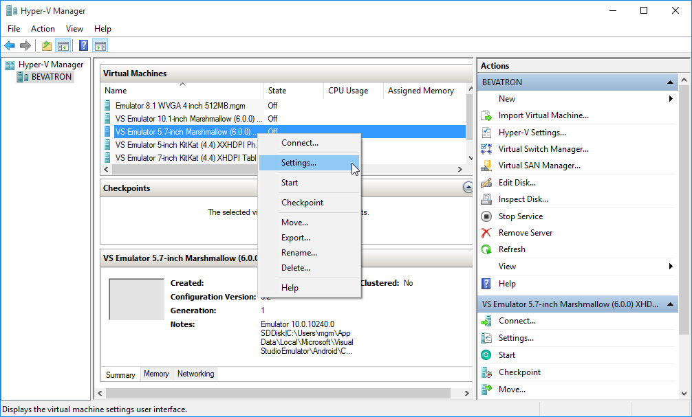

# Visual Studio Android Emulator

_This guide explains how to configure and use the Visual Studio Android Emulator to develop Xamarin.Android apps in Visual Studio 2015._

## Visual Studio Android Emulator Overview

Microsoft Visual Studio 2015 includes an Android emulator that can be
used as a target for debugging an Xamarin.Android app: *Visual Studio
Emulator for Android*. This emulator uses the Hyper-V capabilities of
your development computer, resulting in faster launch and execution
times than the default emulator that comes with the Android SDK. The
Visual Studio Emulator for Android can be used as an alternative to the
default Android SDK emulator when developing a Xamarin.Android
application.

> [!NOTE]
> The Visual Studio Android Emulator is compatible only with Visual 
> Studio 2015 &ndash; it does not work with Visual Studio 2017.

This guide explains how to launch the Microsoft Android emulator from
Visual Studio to test your app, and it describes the various features
available in the emulator. You will learn how to select *device
profiles* (similar to device definitions in the default Android SDK
emulator) to simulate different types of Android devices. Finally, a
troubleshooting section explains common pitfalls and workarounds.

## Requirements

To run the emulator, the computer must meet the requirements to run
Hyper-V. Hyper-V requires a 64-bit version of the Pro edition of
Windows 8, Windows 8.1, Windows 10, or higher. For more information
about requirements, see
[System Requirements for the Visual Studio Emulator for Android](https://msdn.microsoft.com/en-us/library/mt228280.aspx).

> [!NOTE]
> You cannot use HAXM (used by the Android SDK
Emulator) while Hyper-V is enabled. For more about the limitations and
potential problems with HAXM, see
[HAXM Virtualization Conflicts](~/android/deploy-test/debugging/android-sdk-emulator/troubleshooting.md#virt-conflicts).

## Running the Emulator

Visual Studio makes several
pre-configured target-device profiles available
in the **Debug Target** drop-down menu (as seen in the following screen
shot). The Microsoft Android Emulator targets are prefaced with **VS
Emulator**:

When Visual Studio starts a Xamarin.Android application, the emulator is
launched with the chosen device target and the app is deployed to
the emulator. A message will appear in the bottom left corner of
Visual Studio indicating that the emulator is starting:

After a startup delay, the emulator screen appears as shown on the left
below. Drag the lock icon on the screen upwards to unlock the device.
The Xamarin.Android app should then be running in the emulator as
shown on the right:

As with the default Android SDK emulator, it is possible to set breakpoints in
the code, inspect variables, and view the call stack. The vertical
toolbar to the right of the emulator provides access to emulator
features:

The following list summarizes the function of each button on the
vertical toolbar:

-   **Close** &ndash; Shuts down the emulator application. This button
    is not used often &ndash; typically, the emulator is left running
    after first launch (to avoid the emulator restart delay) and closed only when it is no longer needed.

-   **Minimize** &ndash; Leaves the emulator running but minimizes
    it to the taskbar.

-   **Power** &ndash; Simulates turning the device on and off. (The
    emulator remains running.)

-   **Multi-touch** &ndash; Overlays several dots on the
    device display that act as touch points for pinching and zooming.
    Dragging one dot causes the other dot to move in the opposite
    direction, simulating two-finger movement.

-   **Single Point Mouse Input** &ndash; Returns the device to single
    point input (after using Multi-touch input).

-   **Rotate Left/Rotate Right** &ndash; Helps test how the app
    responds to orientation changes. For example, the first time the
    *Rotate Left* button is clicked, the emulator will switch to landscape mode. When the
    the *Rotate Right* button is pressed the emulator will  to return to portrait mode.

-   **Fit to Screen** &ndash; Zooms the size of the emulator screen so
    that it fits on the desktop screen.

-   **Zoom** &ndash; Scales the emulator screen
    by 33%, 50%, 66%, 100%, or by some custom percentage.

The *Additional Tools* button will display a dialog opens that
displays the extra features of the emulator:

Each additional feature is available from a row of tabs at the top of
the dialog:

-   **Accelerometer** &ndash; Simulates device movement in a 3D space.

-   **Location** &ndash; Presents a map that can be used to select and simulate a GPS location. On this map,
    *map points* can be created for simulating movement between locations.

-   **Battery** &ndash; Provides a slider to simulate
    the amount of charge left in the battery.

-   **Screenshot** &ndash; In this tab, the **Capture** button that
    takes a screenshot and displays an instant preview. The
    *Save* button will save the screenshot.

-   **Camera** &ndash; Simulates taking a picture via
    a fixed animated image, a picture from a file, or from an attached
    webcam on your host computer. It is possible to select either the front or rear cameras.

-   **SD Card** &ndash; The emulator can make a folder on your
    host computer available to the device as an SD card.
    When the app reads and writes files to the simulated SD card,
    they can be accessed directly from the desktop 
    without using the `adb` command.

-   **Network** &ndash; Displays a summary of the emulator's
    network settings (the emulator reuses the network connection
    of the host computer).

For more information about how to use these features, see
[Introducing Visual Studio's Emulator for Android](https://blogs.msdn.microsoft.com/visualstudioalm/2014/11/12/introducing-visual-studios-emulator-for-android/).

## Configuring Device Profiles

The Microsoft Android emulator includes a set of device profiles that
represent the most popular Android versions, screen sizes, and hardware
properties of Android devices on the market. In addition, these device
profiles are already configured for various Android versions such as
KitKat, Lollipop, and Marshmallow.

The *Emulator Manager* is used to install, uninstall, and start device profiles. From the **Tools** menu, select **Visual Studio Emulator for
Android...** as indicated in this screenshot:

This opens the **Device Profiles** dialog. The installed profiles are
highlighted at the top of the device profile list. Profiles that are
not installed (but are available for installation) are grayed out:

To install a new profile, click the profile installation icon (a
downward pointed arrow as shown in the above screenshot). For example,
when you click the profile installation icon for the **5.7" Marshmallow
(6.0.0) XHDPI Phone**, the Emulator Manager downloads the profile as
shown here:

After the device profile is downloaded, it is highlighted to indicate
that the profile was installed successfully. Clicking the *Show
details* icon to will display the platform type, cpu architecture, screen
size/resolution, and memory available to the device:

When the Visual Studio **Debug Target** drop-down menu is opened, the
newly-installed device profile is now available as a target:

This list can be shortened by clicking **Uninstall this profile** in the
*Emulator Manager* to remove unused device profiles. Note that there is
currently no way to create a customized device profile in this emulator.

## Troubleshooting

This section describes some common errors and workarounds when using the
*Visual Studio Emulator for Android* with Xamarin.Android.

<a name="cant_connect" />

### Emulator will not start

In some cases, the emulator will not start if there are incompabilities
between the host processor and the Hyper-V virtual machine. To work
around this issue,  configure Hyper-V to limit the processor
features that a virtual machine can have &ndash; this improves the virtual
machine's compatibility with different host processor versions.
Use the following steps to make this change:

1.  Click the **Start** button, type in **MMC**, and press **Enter**. Click
    **Hyper-V Manager** as illustrated here:

    

2.  In the Hyper-V Manager **Virtual Machines** pane, right click the emulator that
    to edit to use and click **Settings...**":

    

3.  In the settings window, locate the **Compatibility** section (under **Hardware > Processor**)
    and enable **Migrate to a physical computer with a different processor version**:

    

4.  Click **OK** and close the Hyper-V Manager window.

### App deploys and starts but fails immediately

In this situation, the emulator starts, the app successfully deploys to
the emulator, and the app starts. However, the app fails immediately.
In many cases, this is also caused by incompabilities between the host
processor and the Hyper-V virtual machine. To resolve this error,
follow the instructions in
[The Emulator will not start](#cant_connect) (above).

### Emulator stops with the diagnostic message: **libaot-mscorlib.dll.so not found**

To resolve this error, use the following steps to disable fast deployment:

1.  Follow the instructions in [The Emulator will not start](#cant_connect) (above).

2.  Double-click project **Properties**.

3.  Click **Android Options** and unselect **Use Fast Deployment (debug mode only)**:

    

### Drag and Drop does not work

If the *Visual Studio Emulator for Android* is started as an Administrator (or
if you launch it from from Visual Studio while Visual Studio is running
with Administrator privilege), drag and drop of .APK or .ZIP files may
not work. To work around this problem, run *Visual Studio Emulator for
Android* without elevated permissions (i.e., not as Administrator).

### Other errors

The above troubleshooting tips cover the most common problems 
when using the Visual Studio Android Emulator with Xamarin.Android. For a more
complete guide to Visual Studio Android Emulator troubleshooting, see
[Troubleshooting the Visual Studio Emulator for Android](https://msdn.microsoft.com/en-us/library/mt228282.aspx).

## Summary

This article introduced *Visual Studio Emulator for Android*; it
explained how to use the emulator to debug Xamarin.Android apps in
Visual Studio, it described the functions of the buttons on the
vertical toolbar, and it provided a brief overview of the features
available in the **Additional Tools** dialog. It explained how to use
the *Emulator Manager* to install, uninstall, and start device
profiles. A *Troubleshooting* section explained common problems and
workarounds when using the emulator.

## Related Links

- [Visual Studio Emulator for Android](https://www.visualstudio.com/vs/msft-android-emulator/)
- [Introducing Visual Studio's Emulator for Android](https://blogs.msdn.microsoft.com/visualstudioalm/2014/11/12/introducing-visual-studios-emulator-for-android/)
