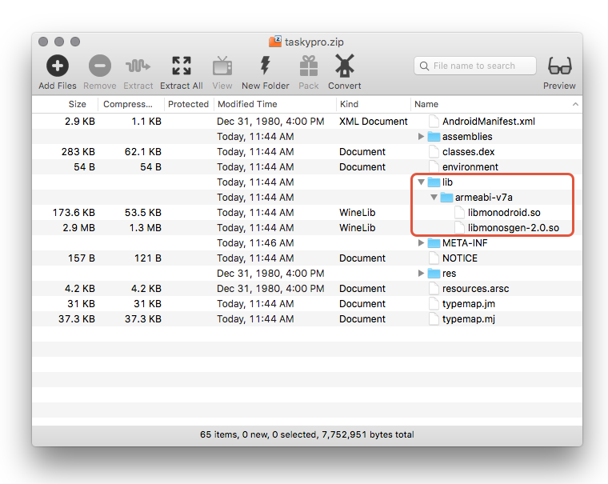

# Installing Xamarin.Android as a System App

_This guide will discuss the differences between a system app and a user app, and how to install a Xamarin.Android application as a system application. This guide applies to authors of custom Android ROM images. It will not explain how to create a custom ROM._

## System App

Authors of custom Android ROM images or manufacturers of Android
devices may wish to include a Xamarin.Android application as a _system
app_ when distributing a ROM or a device. A system app is an app that
is considered to be important to the functioning of the device or
provide functionality that the custom ROM author always wants to be
available.

System apps are installed in the folder **/system/app/** (a read-only
directory on the file system) and cannot be deleted or moved by the
user unless that user has root access. In contrast, an application that
is installed by the user (typically from Google Play or by sideloading
the app) is known as a _user app_. User apps can be deleted by the user
and in many cases can be moved to a different location on the device
(such as some kind of external storage).

System apps behave exactly like user apps, but have the following notable exceptions:

- System apps are upgradable just like a normal _user app_. However,
  because a copy of the app always exists in **/system/app/**, it is
  always possible to roll back the application to the original version.

- System apps may be granted certain system-only permissions that are
  not available to a user app. An example of a system-only permission
  is
  [`BLUETOOTH_PRIVILEGED`](https://developer.android.com/reference/android/Manifest.permission.html#BLUETOOTH_PRIVILEGED),
  which allows applications to pair with Bluetooth devices without any
  user interaction.

It is possible to distribute a Xamarin.Android app as a system
application. In addition to providing an APK to the custom ROM, there
are two shared libraries, **libmonodroid.so** and
**libmonosgen-2.0.so** that must be manually copied from the APK to the
filesytem of the ROM image. This guide will explain the steps involved.

## Restrictions

This guide applies to authors of custom Android ROM images. It will not
explain how to create a custom ROM.

This guide assumes familiarity with
[packaging a release APK for a Xamarin.Android](~/android/deploy-test/publishing/index.md)
and an understanding of
[CPU Architectures](~/android/app-fundamentals/cpu-architectures.md)
for Android applications.

## Install a Xamarin.Android App as a System App

The following steps describe how to install a Xamarin.Android app as a
system app.

1. **Package a release APK of the Xamarin.Android app** &ndash; This is
   described in more detail by the
   [Publishing an Application](~/android/deploy-test/publishing/index.md)
   guide.

2. **Extract shared libraries from the APK** &ndash; Using any ZIP
   utility program, open up the APK file and examine the contents of
   the **/lib/** folder. This folder will have a subdirectory for each
   _application binary interface_ (ABI)that is supported by the
   application; the contents of this folder will include all of the
   shared libraries that are required by the app on that particular
   ABI:

    

   In the previous screenshot, there is only one supported ABI
   (**armeabi-v7a**) holding the two **.so** files that are required by
   the app. Note that it is only necessary to extract the ABI files
   that are appropriate for the device or the target architecture of
   the device ROM, i.e. do not copy **.so** files from the **x86**
   folder to an **armeabi-v7a** device or ROM.

3. **Copy .so files to /system/lib** &ndash; Copy the **.so** files
   that were extracted from the APK in the previous step to the
   **/system/lib/** folder on the custom ROM.

4. **Copy the APK file to /system/app** &ndash; The final step is
   to copy the APK file to the **/system/app** folder on the ROM.

## Summary

This guide discussed the difference between a _system app_ and a _user
app_, and explained how to install a Xamarin.Android application as a
system app.

## Related Links

- [Publishing an Application](~/android/deploy-test/publishing/index.md)
- [CPU Architectures](~/android/app-fundamentals/cpu-architectures.md)
- [BLUETOOTH_PRIVILEGED](https://developer.android.com/reference/android/Manifest.permission.html#BLUETOOTH_PRIVILEGED)
- [ABI Management](https://developer.android.com/ndk/guides/abis)
