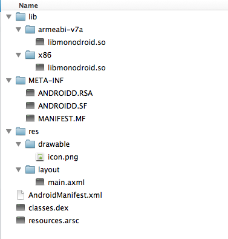
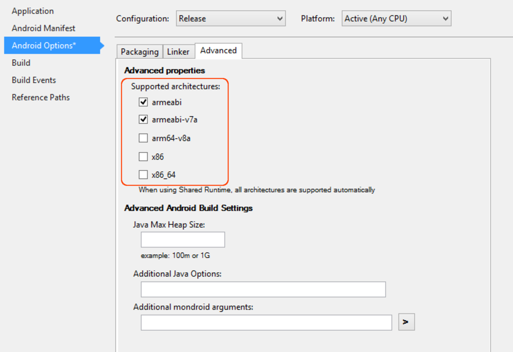
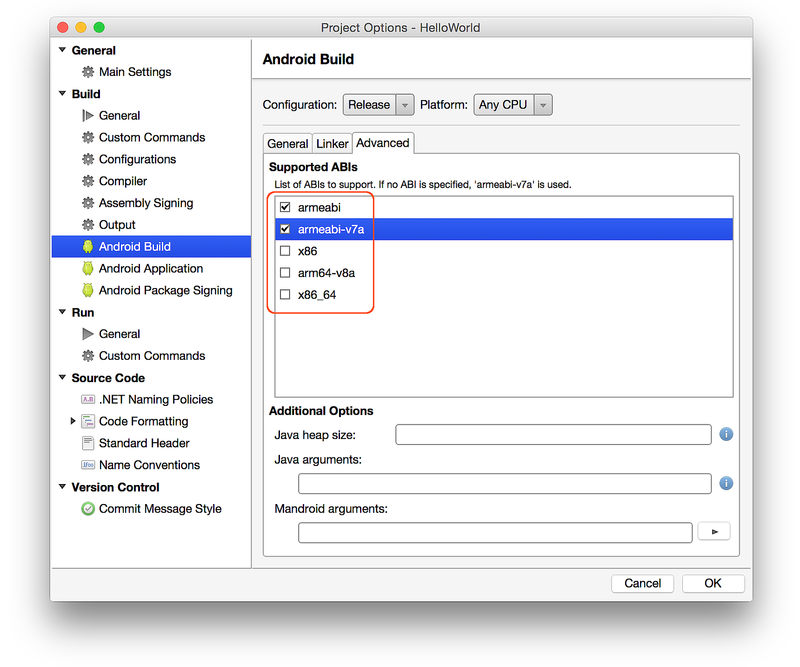

# Multi-Core Devices & Xamarin.Android

_Android can run on several different computer architectures. This document discusses the different CPU architectures that may be employed for a Xamarin.Android application. This document will also explain how Android applications are packaged to support different CPU architectures. The Application Binary Interface (ABI) will be introduced, and guidance will be provided regarding which ABIs to use in a Xamarin.Android application._

## Overview

Android allows for the creation of "fat binaries," a single `.apk`
file that contains machine code that will support multiple, different
CPU architectures. This is accomplished by associating each piece of
machine code with an *Application Binary Interface*. The ABI is used to
control which machine code will run on a given hardware device. For
example, for an Android application to run on an x86 device, it is
necessary to include x86 ABI support when compiling the application.

Specifically, each Android application will support at least one
*embedded-application binary interface* (EABI). EABI are conventions
specific to embedded software programs. A typical EABI will describe
things such as:

- The CPU instruction set.

- The endianness of memory stores and loads at run time.

- The binary format of object files and program libraries, as well as
    which type of content is allowed or supported in these files and
    libraries.

- The various conventions used to pass data between application code
    and the system (for example: how registers and/or the stack are
    used when functions are called, alignment constraints, etc.)

- Alignment and size constraints for enum types, structures, fields,
    and arrays.

- The list of function symbols available to your machine code at run
    time, generally from a very specific selected set of libraries.

### armeabi and Thread Safety

The Application Binary Interface will be discussed in detail below, but
it is important to remember that the `armeabi` runtime used by
Xamarin.Android is *not thread safe*. If an application that has
`armeabi` support is deployed to an `armeabi-v7a` device, many strange
and unexplainable exceptions will occur.

Due to a bug in Android 4.0.0, 4.0.1, 4.0.2, and 4.0.3, the native
libraries will be picked up from the `armeabi` directory even though
there is an `armeabi-v7a` directory present and the device is an
`armeabi-v7a` device.

> [!NOTE]
> Xamarin.Android will ensure that `.so` are added to the APK in the correct order. This bug should not be an issue for users of Xamarin.Android.

### ABI Descriptions

Each ABI supported by Android is identified by a unique name.

#### armeabi

This is the name of an EABI for ARM-based CPUs that support at least
the ARMv5TE instruction set. Android follows the little-endian ARM
GNU/Linux ABI. This ABI does not support hardware-assisted
floating-point computations. All FP operations are performed by
software helper functions that come from the compiler's `libgcc.a`
static library. SMP devices are not supported by `armeabi`.

> [!IMPORTANT]
> Xamarin.Android's `armeabi` code is not thread safe and
> should not be used on multi-CPU `armeabi-v7a` devices (described
> below). Using `armeabi` code on a single-core `armeabi-v7a` device is
> safe.

#### armeabi-v7a

This is another ARM-based CPU instruction set that extends the
`armeabi` EABI described above. The `armeabi-v7a` EABI has support for
hardware floating-point operations and multiple CPU (SMP) devices. An
application that uses the `armeabi-v7a` EABI can expect substantial
performance improvements over an application that uses `armeabi`.

> [!NOTE]
> `armeabi-v7a` machine code will not run on ARMv5 devices.

#### arm64-v8a

This is a 64-bit instruction set that is based on the ARMv8 CPU
architecture. This architecture is used in the *Nexus 9*.
Xamarin.Android 5.1 introduced support for
this architecture (for more information, see
[64-bit runtime support](https://github.com/xamarin/release-notes-archive/blob/master/release-notes/android/xamarin.android_5/xamarin.android_5.1/index.md#64-bit-runtime-support)).

#### x86

This is the name of an ABI for CPUs that support the instruction set commonly
named *x86* or *IA-32*. This ABI corresponds to instructions for
the Pentium Pro instruction set, including the MMX, SSE, SSE2, and SSE3
instruction sets. It does not include any other optional IA-32 instruction set
extensions such as:

- the MOVBE instruction.
- Supplemental SSE3 extension (SSSE3).
- any variant of SSE4.

> [!NOTE]
> Google TV, although it runs on x86, is not supported by Android's NDK.

#### x86_64

This is the name of an ABI for CPUs that support the 64-bit x86
instruction set (also referred to as *x64* or *AMD64*). Xamarin.Android
5.1 introduced support for this architecture (for more
information, see [64-bit runtime support](https://github.com/xamarin/release-notes-archive/blob/master/release-notes/android/xamarin.android_5/xamarin.android_5.1/index.md#64-bit-runtime-support)).

#### APK File Format

The Android Application Package is the file format that holds all of
the code, assets, resources, and certificates necessary for an Android
application. It is a `.zip` file, but uses the `.apk` file name
extension. When expanded, the contents of an `.apk` created by
Xamarin.Android can be seen in the screenshot below:

[](multicore-devices-images/00.png#lightbox)

A quick description of the contents of the `.apk` file:

- **AndroidManifest.xml** &ndash; This is the `AndroidManifest.xml` file,
    in binary XML format.

- **classes.dex** &ndash; This contains the application code, compiled
    into the `dex` file format that is used by the Android runtime VM.

- **resources.arsc** &ndash; This file contains all of the precompiled
    resources for the application.

- **lib** &ndash; This directory holds the compiled code for each ABI. It
    will contain one subfolder for each ABI that was described in the
    previous section. In the screenshot above, the `.apk` in question
    has native libraries for both `armeabi-v7a` and for `x86` .

- **META-INF** &ndash; This directory (if present) is used to store
    signing information, package, and extension configuration data.

- **res** &ndash; This directory holds the resources that were not
    compiled into `resources.arsc` .

> [!NOTE]
> The file `libmonodroid.so` is the native library required by all Xamarin.Android applications.

#### Android Device ABI Support

Each Android device supports executing native code in up to two ABIs:

- **The "primary" ABI** &ndash; This corresponds to the machine code
    used in the system image.

- **A "secondary" ABI** &ndash; This is an optional ABI that is also
    supported by the system image.

For example, a typical ARMv5TE device will only have a primary ABI of
`armeabi`, while an ARMv7 device would specify a primary ABI of
`armeabi-v7a` and a secondary ABI of `armeabi`. A typical x86 device
would only specify a primary ABI of `x86`.

### Android Native Library Installation

At package installation time, native libraries within the `.apk` are
extracted into the app's native library directory, typically
`/data/data/<package-name>/lib`, and are thereafter referred to as
`$APP/lib`.

Android's native library installation behavior varies dramatically between
Android versions.

#### Installing Native Libraries: Pre-Android 4.0

Android prior to 4.0 Ice Cream Sandwich will only extract native libraries
from a *single ABI* within the `.apk`. Android apps of this
vintage will first try to extract all native libraries for the primary ABI, and
if no such libraries exist, Android will then extract all native libraries for
the secondary ABI. No "merging" is done.

For example, consider a situation where an application is installed on
an `armeabi-v7a` device. The `.apk,` which supports both `armeabi` and
`armeabi-v7a`, has the following ABI `lib` directories and files in it:

```shell
lib/armeabi/libone.so
lib/armeabi/libtwo.so
lib/armeabi-v7a/libtwo.so
```

After installation, the native library directory will contain:

```shell
$APP/lib/libtwo.so # from the armeabi-v7a directory in the apk
```

In other words, no `libone.so` is installed. This will cause
problems, as `libone.so` is not present for the application to load
at run time. This behavior, while unexpected, has been logged as a bug and
reclassified as "[working as intended](https://code.google.com/p/android/issues/detail?id=9089)."

Consequently, when targeting Android versions prior to 4.0, it is necessary
to provide *all* native libraries for *each* ABI that the
application will support, that is, the `.apk` should contain:

```shell
lib/armeabi/libone.so
lib/armeabi/libtwo.so
lib/armeabi-v7a/libone.so
lib/armeabi-v7a/libtwo.so
```

#### Installing Native Libraries: Android 4.0 &ndash; Android 4.0.3

Android 4.0 Ice Cream Sandwich changes the extraction logic. It will
enumerate all native libraries, see if the file's basename has already been
extracted, and if both of the following conditions are met, then the library
will be extracted:

- It hasn't already been extracted.

- The native library's ABI matches the target's primary or
    secondary ABI.

Meeting these conditions allows "merging" behavior; that is, if we have
an `.apk` with the following contents:

```shell
lib/armeabi/libone.so
lib/armeabi/libtwo.so
lib/armeabi-v7a/libtwo.so
```

Then after installation, the native library directory will contain:

```shell
$APP/lib/libone.so
$APP/lib/libtwo.so
```

Unfortunately, this behavior is order dependent, as described in the
following document -
[Issue 24321: Galaxy Nexus 4.0.2 uses armeabi native code when both
armeabi and armeabi-v7a is included in
apk](https://code.google.com/p/android/issues/detail?id=25321).

The native libraries are processed "in order" (as listed by, for
example, unzip), and the *first match* is extracted. Since the `.apk`
contains `armeabi` and `armeabi-v7a` versions of `libtwo.so`, and the
`armeabi` is listed first, it's the `armeabi` version that is
extracted, *not* the `armeabi-v7a` version:

```shell
$APP/lib/libone.so # armeabi
$APP/lib/libtwo.so # armeabi, NOT armeabi-v7a!
```

Furthermore, even if both `armeabi` and `armeabi-v7a` ABIs are
specified (as described below in the section *Declaring Supported
ABIs*), Xamarin.Android will create the following element in the .
`csproj`:

```xml
<AndroidSupportedAbis>armeabi,armeabi-v7a</AndroidSupportedAbis>
```

Consequently, the `armeabi` `libmonodroid.so` will be found first
within the `.apk`, and the `armeabi` `libmonodroid.so` will be the one
that is extracted, even though the `armeabi-v7a` `libmonodroid.so` is
present and optimized for the target. This can also result in obscure
run-time errors, as `armeabi` is not SMP safe.

##### Installing Native Libraries: Android 4.0.4 and later

Android 4.0.4 changes the extraction logic: it will enumerate all native
libraries, read the file's basename, then extract the primary ABI version (if
present), or the secondary ABI (if present). This allows "merging" behavior;
that is, if we have an `.apk` with the following contents:

```shell
lib/armeabi/libone.so
lib/armeabi/libtwo.so
lib/armeabi-v7a/libtwo.so
```

Then after installation, the native library directory will contain:

```shell
$APP/lib/libone.so # from armeabi
$APP/lib/libtwo.so # from armeabi-v7a
```

### Xamarin.Android and ABIs

Xamarin.Android supports the following _64-bit_ architectures:

- `arm64-v8a`
- `x86_64`

> [!NOTE]
> From August 2018 new apps will be required to target API level 26, and from August 2019 apps will be [required to provide 64-bit versions](https://android-developers.googleblog.com/2017/12/improving-app-security-and-performance.html) in addition to the 32-bit version.

Xamarin.Android supports these 32-bit architectures:

- `armeabi` ^
- `armeabi-v7a`
- `x86`

> [!NOTE]
> **^** As of [Xamarin.Android 9.2](/xamarin/android/release-notes/9/9.2#removal-of-support-for-armeabi-cpu-architecture), `armeabi` is no longer supported.

Xamarin.Android does not currently provide support for `mips`.

### Declaring Supported ABI's

By default, Xamarin.Android will default to `armeabi-v7a` for
**Release** builds, and to `armeabi-v7a` and `x86` for **Debug**
builds. Support for different ABIs can be set through the Project
Options for a Xamarin.Android project. In Visual Studio, this can be
set in the **Android Options** page of project **Properties**, under
the **Advanced** tab, as shown in the following screenshot:



In Visual Studio for Mac, the supported architectures may be selected on the
**Android Build** page of **Project Options**, under the **Advanced**
tab, as shown in the following screenshot:

[](multicore-devices-images/xs-abi-selections.png#lightbox)

There are some situations when it may be necessary to declare
additional ABI support such as when:

- Deploying the application to an `x86` device.

- Deploying the application to an `armeabi-v7a` device to
    ensure thread safety.

## Summary

This document discussed the different CPU architectures that an Android
application may run on. It introduced the Application Binary Interface
and how it is used by Android to support disparate CPU architectures.
It then went on to discuss how to specify ABI support in a
Xamarin.Android application and highlighted the issues that arise
when using Xamarin.Android applications on an `armeabi-v7a` device that
are intended only for `armeabi`.

## Related Links

- [Android NDK](https://developer.android.com/tools/sdk/ndk/index.html)
- [Issue 9089:Nexus One - Won't load ANY native libraries from armeabi if there's at least one library at armeabi-v7a](https://code.google.com/p/android/issues/detail?id=9089)
- [Issue 24321: Galaxy Nexus 4.0.2 uses armeabi native code when both armeabi and armeabi-v7a is included in apk](https://code.google.com/p/android/issues/detail?id=25321)