# Profiling Android Apps

Before deploying your app to an app store, it's important to identify
and fix any performance bottlenecks, excessive memory usage issues, or
inefficient use of network resources. Two profiler tools are available
to serve this purpose:

- Xamarin Profiler 
- Android Profiler in Android Studio

This guide introduces the Xamarin Profiler and provides detailed
information for getting started with using the Android Profiler.

## Xamarin Profiler

The Xamarin Profiler is a standalone application that is integrated
with Visual Studio and Visual Studio for Mac for profiling Xamarin apps
from within the IDE. For more information about using the Xamarin
Profiler, see [Xamarin Profiler](~/tools/profiler/index.md).

> [!NOTE]
> You must be a [Visual Studio Enterprise](https://visualstudio.microsoft.com/vs/compare/) 
> subscriber to unlock the Xamarin Profiler feature in either Visual Studio Enterprise 
> on Windows or Visual Studio for Mac.

## Android Studio Profiler

Android Studio 3.0 and later includes an Android Profiler tool. You can 
use the Android Profiler to measure the performance of a Xamarin Android
app built with Visual Studio &ndash; without the need for a Visual 
Studio Enterprise license. However, unlike the Xamarin Profiler, the
Android Profiler is not integrated with Visual Studio and can only be
used to profile an Android application package (APK) that has been built
in advance and imported into the Android Profiler.

### Launching a Xamarin Android app in Android Profiler

The following steps explain how to launch an Xamarin Android
application in Android Studio's Android Profiler tool. In the example
screenshots below, the Xamarin Forms
[XamagonXuzzle](/samples/xamarin/mobile-samples/liveplayer-xamagonxuzzlelp/)
app is built and profiled using Android Profiler:

1. In the Android project build options, disable **Use Shared
    Runtime**. This ensures that the Android application package (APK)
    is built without a dependency on the shared development-time Mono
    runtime.

    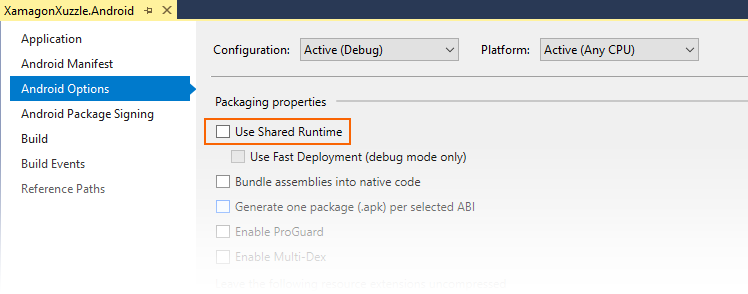

2. Build the app for **Debug** and deploy it to a physical device or
    emulator. This causes a signed **Debug** version of the APK to be built.
    For the **XamagonXuzzle** example, the resulting APK is named
    **com.companyname.XamagonXuzzle-Signed.apk**.

3. Open the project folder and navigate to **bin/Debug**. In this
    folder, locate the **Signed.apk** version of the app and copy it
    to a conveniently-accessible place (such as the desktop). In the following
    screenshot, the APK **com.companyname.XamagonXuzzle-Signed.apk** is located
    and copied to the desktop:

    [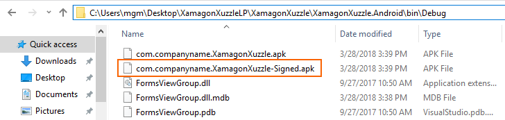](profiling-images/vswin/02-locating-the-debug-apk.png#lightbox)

4. Launch Android Studio and select **Profile or debug APK**:

    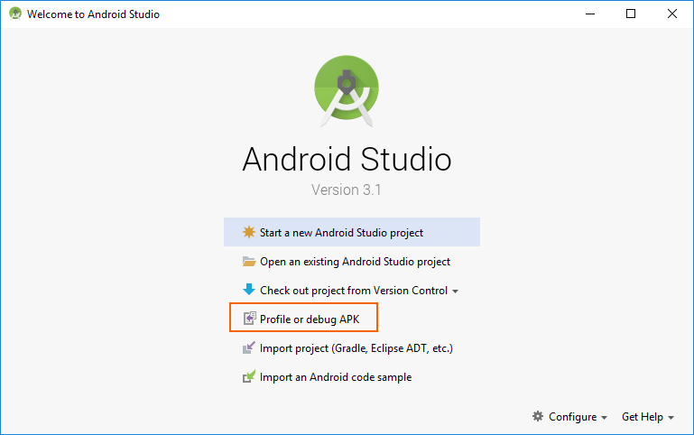

5. In the **Select APK File** dialog, navigate to the APK that you
    built and copied earlier. Select the APK and click **OK**: 
    
    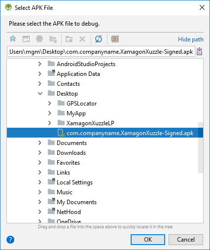

6. Android Studio will load the APK and dissassembles **classes.dex**:

    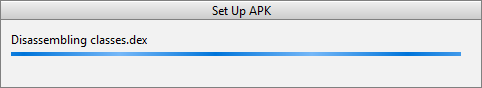

7. After the APK is loaded, Android Studio displays the following
    project screen for the APK. Right-click the app name in the tree
    view on the left and select **Open Module Settings**:

    [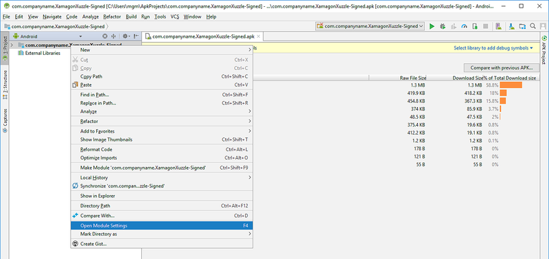](profiling-images/vswin/06-open-module-settings.png#lightbox)

8. Navigate to **Project Settings > Modules**, select the **-Signed** node
    of the app, then click **&lt;No SDK&gt;**:

    [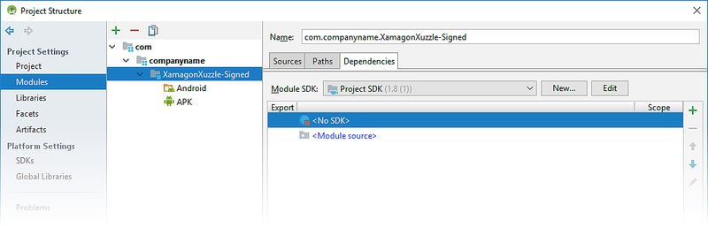](profiling-images/vswin/07-project-settings-modules.png#lightbox)

9. In the **Module SDK** pull-down menu, select the Android SDK level
    that was used to build the app (in this example, API level 26 was
    used to build **XamagonXuzzle**):

    [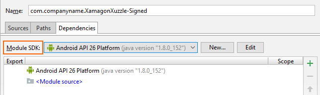](profiling-images/vswin/08-project-sdk-level.png#lightbox)

    Click **Apply** and **OK** to save this setting.

10. Launch the profiler from the toolbar icon:

    [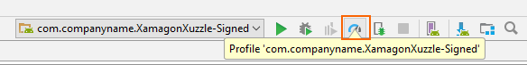](profiling-images/vswin/09-launch-profiler.png#lightbox)

11. Select the deployment target for running/profiling the app and
    click **OK**. The deployment target can be a physical device or a virtual device
    running in an emulator. In this example, a Nexus 5X device is used:

    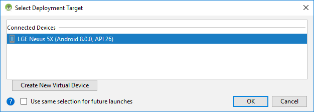

12. After the profiler starts, it will take a few seconds for it to
    connect to the deployment device and the app process. While it is
    installing the APK, Android Profiler will report **No connected
    devices** and **No debuggable processes**.

    [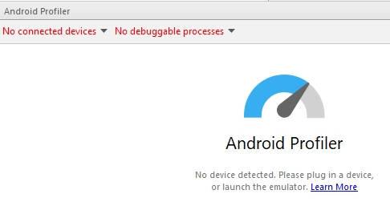](profiling-images/vswin/11-no-connected-devices.png#lightbox)

13. After several seconds, Android Profiler will complete APK
    installation and launch the APK, reporting the device name and the
    name of the app process being profiled (in this example, **LGE
    Nexus 5X** and **com.companyname.XamagonXuzzle**, respectively):

    [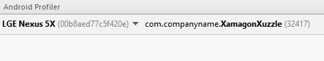](profiling-images/vswin/12-profiler-starts.png#lightbox)

14. After the device and debuggable process are identified, Android
    Profiler begins profiling the app:

    [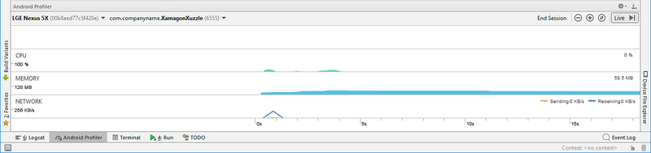](profiling-images/vswin/13-profiler-running.png#lightbox)

15. If you tap the **RANDOMIZE** button on **XamagonXuzzle** (which
    causes it to shift and randomize tiles), you will see the CPU usage
    increase during the app's randomization interval:

    [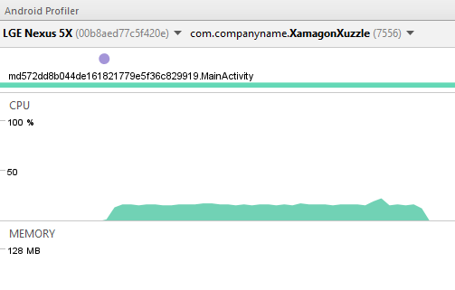](profiling-images/vswin/14-tap-randomize.png#lightbox)

### Using the Android Profiler

Detailed information for using the Android Profiler is included in 
the [Android Studio documentation](https://developer.android.com/studio/profile/android-profiler.html).
The following topics will be of interest to Xamarin Android developers:

- [CPU Profiler](https://developer.android.com/studio/profile/cpu-profiler.html)
    &ndash; Explains how to inspect the app's CPU usage and thread activity in real-time.

- [Memory Profiler](https://developer.android.com/studio/profile/memory-profiler.html)
    &ndash; Displays a real-time graph of the app's memory usage, and
    includes a button to record memory allocations for analysis.

- [Network Profiler](https://developer.android.com/studio/debug/network-profiler)
    &ndash; Displays real-time network activity of data sent and
    received by the app.