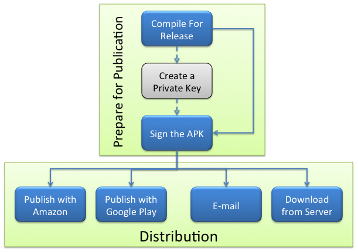
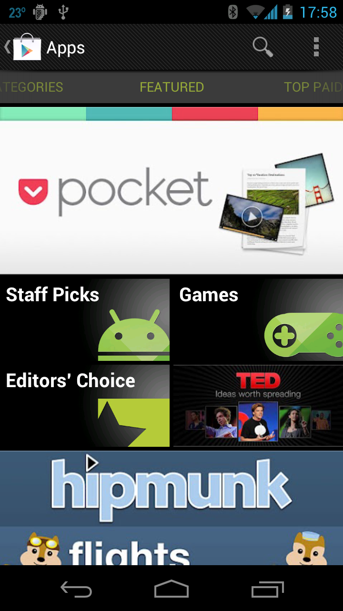

# Publishing an Application

After a great application has been created, people will want to use it. This
section covers the steps involved with the public distribution of an application
created with Xamarin.Android via channels such as e-mail, a private web server,
Google Play, or the Amazon App Store for Android.

## Overview

The final step in the development of a Xamarin.Android application is
to publish the application. Publishing is the process of compiling a
Xamarin.Android application so that it is ready for users to install on
their devices, and it involves two essential tasks:

- **Preparing for Publication** &ndash; A release version of the
    application is created that can be deployed to Android-powered
    devices (see [Preparing an Application for Release](~/android/deploy-test/release-prep/index.md)
    for more information about release preparation).

- **Distribution** &ndash; The release version of an application is made
    available through one or more of the various distribution channels.

The following diagram illustrates the steps involved with publishing a Xamarin.Android application:

As can be seen by the diagram above, the preparation is the same regardless
of the distribution method that is used. There are several ways that an Android
application may be released to users:

- **Via a Website** &ndash; A Xamarin.Android application can be made available for download on a website, from which users may then install the application by clicking on a link.
- **By e-mail** &ndash; It is possible for users to install a Xamarin.Android application from their e-mail. The application will be installed when the attachment is opened with an Android-powered device.
- **Through a Market** &ndash; There are several application marketplaces that exist for distribution, such as  [Google Play](https://play.google.com/) or  [Amazon App Store for Android](https://www.amazon.com/mobile-apps/b?ie=UTF8&node=2350149011) .

Using an established marketplace is the most common way to publish an
application as it provides the broadest market reach and the greatest control
over distribution. However, publishing an application through a marketplace
requires additional effort.

Multiple channels can distribute a Xamarin.Android application
simultaneously. For example, an application could be published on Google Play,
the Amazon App Store for Android, and also be downloaded from a web server.

The other two methods of distribution (downloading or e-mail) are most useful
for a controlled subset of users, such as an enterprise environment or an
application that is only meant for a small or well-specified set of users.
Server and e-mail distribution are also simpler publishing models, requiring
less preparation to publish an application.

The Amazon Mobile App Distribution Program enables mobile app developers to
distribute and sell their applications on Amazon. Users can discover and shop
for apps on their Android-powered devices by using the Amazon App Store
application. A screenshot of the Amazon App Store running on an Android device
appears below:

Google Play is arguably the most comprehensive and popular marketplace for
Android applications. Google Play allows users to discover, download, rate, and
pay for applications by clicking a single icon either on their device or on
their computer. Google Play also provides tools to assist in the analysis of
sales and market trends and to control which devices and users may download an
application. A screenshot of Google Play running on an Android device appears
below:

This section shows how to upload the application to a store such as
Google Play, along with the appropriate promotional materials. APK
expansion files are explained, providing a conceptual overview of what
they are and how they work. Google Licensing services are also
described. Finally, alternate means of distribution are introduced,
including the use of an HTTP web server, simple e-mail distribution,
and the Amazon App Store for Android.

## Related Links

- [HelloWorldPublishing (sample)](/samples/xamarin/monodroid-samples/helloworldpublishing)
- [Build Process](~/android/deploy-test/building-apps/build-process.md)
- [Linking](~/android/deploy-test/linker.md)
- [Obtaining A Google Maps API Key](~/android/platform/maps-and-location/maps/obtaining-a-google-maps-api-key.md)
- [Deploy via Visual Studio App Center](/appcenter/distribution/stores/googleplay)
- [Application Signing](https://source.android.com/security/apksigning/)
- [Publishing on Google Play](https://developer.android.com/distribute/googleplay/publish/index.html)
- [Google Application Licensing](https://developer.android.com/guide/google/play/licensing/index.html)
- [Android.Play.ExpansionLibrary](https://github.com/mattleibow/Android.Play.ExpansionLibrary)
- [Mobile App Distribution Portal](https://developer.amazon.com/welcome.html)
- [Amazon Mobile App Distribution FAQ](https://developer.amazon.com/help/faq.html)