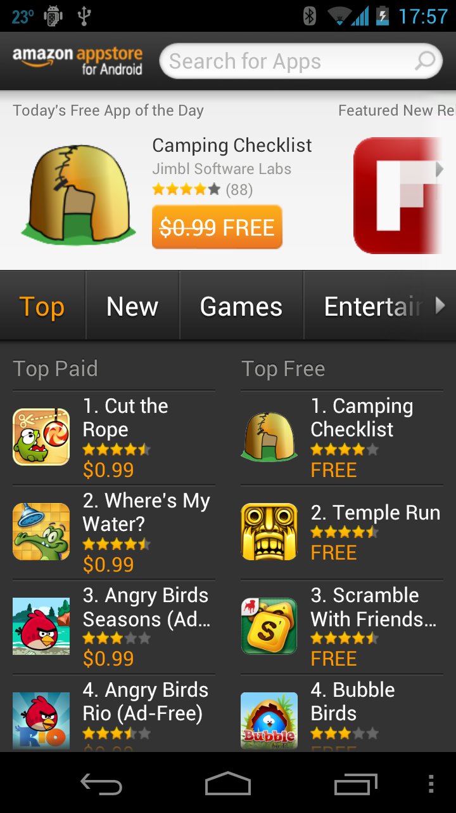

# Publishing to the Amazon App Store

The Amazon Mobile App Distribution Program enables mobile app 
developers to publish their applications on Amazon. This section 
briefly covers the Amazon App Store for Android. 

Amazon does not limit the size of APKs. However, if an APK is larger than
30MB, then it will use FTP for distribution rather than the Amazon Mobile App
Distribution Portal.

## Submitting Apps: Binary Info

Submitting an application to the Amazon App Store is a similar process 
to submitting an application to Google Play. Applications distributed 
by Amazon require the following assets: 

-   **Icon** &ndash;   This is a 114 x 114 .png file with a transparent background. It is required.
-   **Thumbnail** &ndash;   This is a larger version of the icon above. It is 512 x 512 pixels with a transparent background. This icon is also mandatory.
-   **Screenshots** &ndash;   Amazon requires a minimum of three and a maximum of 10 screenshots. The screenshots must be 1024w x 600h pixels or 800w x 480h pixels. Both .png and .jpg formats are acceptable.
-   **Promotional Image** &ndash;   In order for an application to be featured in promotional placements such as the home page, a promotional image may be optionally submitted. It should be a 1024w x 500h pixel .png or .jpg file, in landscape orientation. It may not have any animation.
-  Updates to five videos may be provided.

## Approval Process

Once an application has been submitted, it goes through an approval process.
Amazon will review your application to ensure that it works as outlined in the
product description, does not put customer data at risk, and will not impair the
operation of the device. Once the approval process is complete, Amazon will send
out a notification and distribute the application.
