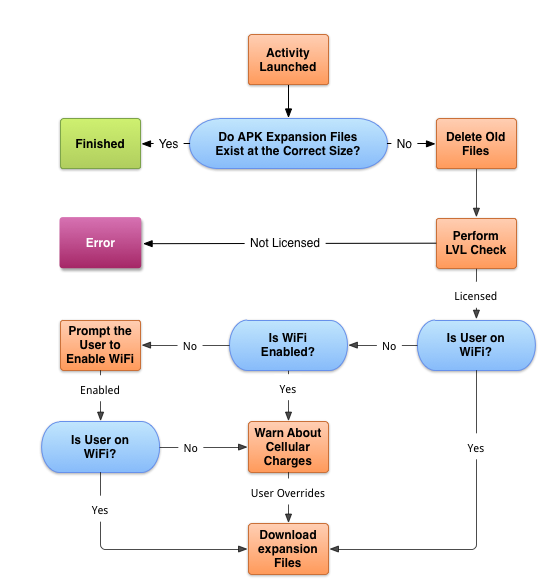

# APK Expansion Files

Some applications (some games, for instance) require more resources and
assets than can be provided in the maximum Android app size limit imposed by Google
Play. This limit depends on the version of Android that your APK is targeted for:

-  100MB for APKs that target Android 4.0 or higher (API level 14 or higher).
-  50MB for APKs that target Android 3.2 or lower (API level 13 or higher).

To overcome this limitation, Google Play will host and distribute two 
*expansion files* to go along with an APK, allowing an application to 
indirectly exceed this limit. 

On most devices, when an application is installed, expansion files will be
downloaded along with the APK and will be saved to the shared storage location
(the SD card or the USB-mountable partition) on the device. On a few older
devices, the expansion files may not automatically install with the APK. In
these situations, it is necessary for the application to contain code that will
download the expansion files when the user first runs the applications.

Expansion files are treated as  *opaque binary blobs (obb)* and may be up to 2GB
in size. Android does not perform any special processing on these files after
they are downloaded &ndash; the files can be in any format that is appropriate for the
application. Conceptually, the recommended approach to expansion files is as
follows:

-   **Main expansion**  &ndash; This file is the primary expansion file for resources and assets that will not fit in the APK size limit. The main expansion file should contain the primary assets that an application needs and should rarely be updated.
-   **Patch expansion**  &ndash; This is intended for small updates to the main expansion file. This file can be updated. It is the responsibility of the application to perform any necessary patches or updates from this file.

The expansion files must be uploaded at the same time as the APK is uploaded.
Google play does not allow an expansion file to be uploaded to an existing APK
or for existing APKs to be updated. If it is necessary to update an expansion
file, then a new APK must be uploaded with the  `versionCode` updated.

## Expansion File Storage

When the files are downloaded to a device, they will be stored in 
**_shared-store_/Android/obb/_package-name_**:

-   **_shared-store_** &ndash; This is the directory specified by `Android.OS.Environment.ExternalStorageDirectory` .
-   **_package-name_** &ndash; This is the application's Java-style package name.

Once downloaded, expansion files should not be moved, altered, renamed, or
deleted from their location on the device. To do so will cause the expansion
files to be downloaded again, and the old file(s) will be deleted. Additionally,
the expansion file directory should contain only the expansion pack files.

Expansion files offer no security or protection around their content &ndash; other
applications or users may access any files saved on the shared storage.

If it is necessary to unpack an expansion file, the unpacked files should be
stored in a separate directory, such as one
in `Android.OS.Environment.ExternalStorageDirectory`.

An alternative to extracting files from an expansion file is to read 
the assets or resources directly from the expansion file. The expansion 
file is nothing more than a zip file that can be used with an 
appropriate `ContentProvider`. The 
[Android.Play.ExpansionLibrary](https://github.com/mattleibow/Android.Play.ExpansionLibrary) 
contains an assembly, 
[System.IO.Compression.Zip](https://github.com/mattleibow/Android.Play.ExpansionLibrary/tree/master/System.IO.Compression.Zip), 
which includes a `ContentProvider` that will allow for direct file 
access to some media files. If media files are being packaged into a 
zip file, media playback calls may directly use files in the zip 
without having to unpack the zip file. The media files should not be 
compressed when added to the zip file. 

### FileName Format

When the expansion files are downloaded, Google Play will use the following
scheme to name the expansion:

    [main|patch].<expansion-version>.<package-name>.obb

The three components of this scheme are:

-   `main` or `patch` &ndash; This specifies whether this is the main or patch expansion file. There can be only one of each.
-   `<expansion-version>` &ndash; This is an integer that matches the  `versionCode`  of the APK that the file was first associated with.
-   `<package-name>` &ndash; This is the application's Java-style package name.

For example, if the APK version is 21, and the package name is `mono.samples.helloworld`, the
main expansion file will be named **main.21.mono.samples.helloworld**.

## Download Process

When an application is installed from Google Play, the expansion files should
be downloaded and saved along with the APK. In certain situations this may not
happen, or expansion files may be deleted. To handle this condition, an app
needs to check to see whether the expansion files exist and then download them,
if necessary. The following flowchart displays the recommended workflow of this
process:

When an application starts up, it should check to see if the 
appropriate expansion files exist on the current device. If they do 
not, then the application must make a request from Google Play’s 
[Application Licensing](http://developer.android.com/google/play/licensing/index.html). 
This check is made by using the *License Verification Library (LVL)*, 
and must be made for both free and licensed applications. The LVL is 
primarily used by paid applications to enforce license restrictions. 
However, Google has extended the LVL so that it can be used with 
expansion libraries as well. Free applications have to perform the LVL 
check, but can ignore the license restrictions. The LVL request is 
responsible for providing the following information about the expansion 
files that the application requires: 

-   **File Size**  &ndash; The file sizes of the expansion files are used as part of the check that determines whether or not the correct expansion files have already been downloaded.
-   **Filenames**  &ndash; This is the file name (on the current device) to which the expansion packs must be saved.
-   **URL for Download**  &ndash; The URL that should be used to download the expansion packs. This is unique for every download and will expire shortly after it is provided.

After the LVL check has been performed, the application should download the
expansion files, taking into consideration the following points as part of the
download:

-  The device may not have enough space to store the expansion files.
-  If Wi-Fi is not available, then the user should be allowed to pause or cancel the download to prevent unwanted data charges.
-  The expansion files are downloaded in the background to avoid blocking user interactions.
-  While the download is occurring in the background, a progress indicator should be displayed.
-  Errors that occur during the download are gracefully handled and recoverable.

## Architectural Overview

When the main activity starts, it checks to see if the expansion files are
downloaded. If the files are downloaded, they must be checked for validity.

If the expansion files have not been downloaded or if the current files are
invalid, then new expansion files must be downloaded. A bounded service is
created as part of the application. When the main activity of the application is
started, it uses the bounded service to perform a check against the Google
Licensing services to find out the expansion file names and the URL of the files
to download. The bounded service will then download the files on a background
thread.

To ease the effort required to integrate expansion files into an application,
Google created several libraries in Java. The libraries in question are:

-   **Downloader Library**  &ndash; This is a library that reduces the effort required to integrate expansion files in an application. The library will download the expansion files in a background service, display user notifications, handle network connectivity issues, resume downloads, etc.
-   **License Verification Library (LVL)**  &ndash; A library for making and processing the calls to the Application Licensing services. It can also be used to perform licensing checks, to see if the application is authorized for use on the device.
-   **APK Expansion Zip Library (optional)**  &ndash; If the expansion files are in a zip file, this library will act as a content provider and allow an application to read resources and assets directly from the zip file without having to expand the zip file.

These libraries have been ported to C# and are available under the Apache 2.0
license. To quickly integrate expansion files into an existing application,
these libraries can be added to an existing Xamarin.Android application. The
code is available at the  [Android.Play.ExpansionLibrary](https://github.com/mattleibow/Android.Play.ExpansionLibrary) on GitHub.
