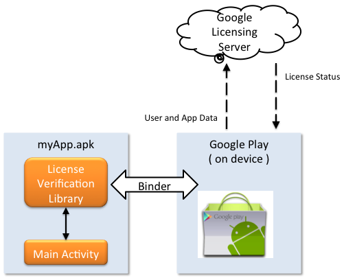

# Google Licensing Services

Prior to Google Play, Android applications relied on the legacy Copy
Protection provided by Google Market to ensure that only authorized users could
run applications on their devices. The limitations of the Copy Protection
mechanism made it a less-than-ideal solution for application protection.

Google Licensing is a replacement for this legacy Copy Protection mechanism.
Google Licensing is a flexible, secure, network-based service that Android
applications may query to determine if an application is licensed to run on a
given device.

Google Licensing is flexible in that Android applications have full control
over when to check the license, how often to check the license, and how to
handle the response from the licensing server.

Google Licensing is secure in that each response is signed using an RSA key
pair that is shared exclusively between the Google Play server and the
application. Google Play provides a public key for developers that is embedded
within the Android application and is used to authenticate the responses. The
Google Play server keeps the private key internally.

An application that has implemented Google Licensing makes a request to a
service hosted by the Google Play application on the device. Google Play then
sends this request on to the Google Licensing server, which responds with the
license status: 

The above diagram illustrates this workflow: 

-   The application provides the package name, a *nonce* (a 
    cryptographic authenticator) that is used to validate server 
    response, and a callback that can handle the response 
    asynchronously. 

-   Google Play provides information such as the Google account and the 
    device itself, such as the IMSI number. 

Google Licensing service is also a key component of APK expansion files
(which are discussed later in this document). APK expansion files utilize Google
Licensing services to obtain the URLs of the expansion files that will be
downloaded.

## Requirements

Applications that are not purchased through Google Play will receive no
benefit from the Google Licensing services. If Google Play is not installed on a
device, then applications that use Licensing Services will still operate
normally on that device.

Google Play requires Internet access for functionality. An application can
cache the license to accommodate scenarios where the device does not have access
to the Google Play Licensing servers.

Free applications only require Google Licensing when the application uses APK
expansion files.
