# Publishing to Google Play

Although there are many app markets for distributing an application, Google
Play is arguably the largest and most visited store in the world for Android
apps. Google Play provides a single platform for distributing, advertising,
selling, and analyzing the sales of an Android application.

This section will cover topics that are specific to Google Play, such as
registering to become a publisher, gathering assets to help Google Play promote
and advertise your application, guidelines for rating your application on Google
Play, and using filters to restrict the deployment of an application to certain
devices.

## Requirements

To distribute an application through Google Play, a developer account must be
created. This only needs to be performed once, and does involve a one time fee
of $25 USD.

All applications need to be signed with a cryptographic key that expires
after October 22, 2033.

The maximum size for an APK published on Google Play is 100MB. If an
application exceeds that size, Google Play will allow extra assets to be
delivered through *APK Expansion Files*. Android Expansion files permit
the APK to have 2 additional files, each of them up to 2GB in size. Google Play
will host and distribute these files at no cost. Expansion files will be
discussed in another section.

Google Play is not globally available. Some locations may not be supported
for the distribution of applications.

## Becoming a Publisher

To publish applications on Google play, it is necessary to have a
publisher account. To sign up for a publisher account follow these steps:

1. Visit the [Google Play Developer Console](https://play.google.com/apps/publish).
1. Enter basic information about your developer identity.
1. Read and accept the Developer Distribution Agreement for your locale.
1. Pay the $25 USD registration fee.
1. Confirm verification by e-mail.
1. After the account has been created, it is possible to publish applications using Google Play.

Google Play does not support all countries in the world. The most up-to-date
lists of countries can be found in the following links:

1. [Supported Locations for Developer &amp; Merchant Registration](https://support.google.com/googleplay/android-developer/bin/answer.py?hl=en&amp;answer=150324) &ndash; This is a list of all countries where developers may register as merchants and sell paid applications.

1. [Supported Locations for distribution to Google Play users](https://support.google.com/googleplay/android-developer/bin/answer.py?hl=en&amp;answer=138294) &ndash; This is a list of all countries where applications may be distributed.

### Preparing Promotional Assets

To effectively promote and advertise an application on Google Play,
Google allows developers to submit promotional assets such as screenshots,
graphics, and video to be submitted. Google Play will then use those assets to
advertise and promote the application.

#### Launcher Icons

A *launcher icon* is a graphic that represents an application. Each launcher icon
should be a 32-bit PNG with an alpha channel for transparency. An application
should have icons for all of the generalized screen densities as outlined in the
list below:

- **ldpi** (120dpi) &ndash; 36 x 36 px
- **mdpi** (160dpi) &ndash; 48 x 48 px
- **hdpi** (240dpi) &ndash; 72 x 72 px
- **xhdpi** (320dpi) &ndash; 96 x 96 px

Launcher icons are the first things that a user will see of applications
on Google Play, so care should be taken to make the launcher icons visually
appealing and meaningful.

Tips for Launcher Icons:

1. **Simple and uncluttered**&ndash; Launcher icons should be kept
    simple and uncluttered. This means excluding the name of the
    application from the icon. Simpler icons will be more memorable,
    and will be easier to distinguish at the smaller sizes.

1. **Icons should not be thin**&ndash; Overly thin icons will not
    stand out well on all backgrounds.

1. **Use the alpha channel**&ndash; Icons should make use of the
    alpha channel, and should not be full-framed images.

#### High Resolution Application Icons

Applications on Google Play require a high fidelity version of the
application icon. It is only used by Google Play, and does not replace the
application launcher icon. The specifications for the high-resolution icon
are:

1. 32-bit PNG with an alpha channel
1. 512 x 512 pixels
1. Maximum size of 1024KB

The [Android Asset Studio](https://romannurik.github.io/AndroidAssetStudio/)
is a helpful tool for creating suitable launcher icons and the
high-resolution application icon.

#### Screenshots

Google play requires a minimum of two and a maximum of eight screenshots for
an application. They will be displayed on an application's details page in
Google Play.

The specs for screenshots are:

1. 24 bit PNG or JPG with no alpha channel
1. 320w x 480h or 480w x 800h or 480w x 854h. Landscaped images will be cropped.

#### Promotional Graphic

This is an optional image used by Google Play:

1. It is a 180w x 120h 24 bit PNG or JPG with no alpha channel.
1. No border in art.

#### Feature Graphic

Used by the featured section of Google Play. This graphic may be displayed
alone without an application icon.

1. 1024w x 500h PNG or JPG with no alpha channel and no transparency.
1. All of the important content should be within a frame of 924x500. Pixels outside of this frame may be cropped for stylistic purposes.
1. This graphic may be scaled down: use large text and keep graphics simple.

#### Video Link

This is a URL to a YouTube video showcasing the application. The video should
be 30 seconds to 2 minutes in length and showcase the best parts of your
application.

### Publishing to Google Play

<!-- markdownlint-disable MD001 -->

# [Visual Studio](#tab/windows)

Xamarin Android 7.0 introduces an integrated workflow for publishing
apps to Google Play from Visual Studio. If you are using a version of
Xamarin Android earlier than 7.0, you must manually upload your APK via
the Google Play Developer Console. Also, you must have at least one APK
already uploaded before you can use the integrated workflow. If you
have not yet uploaded your first APK, you must upload it manually. For
more information, see
[Manually Uploading the APK](~/android/deploy-test/publishing/publishing-to-google-play/manually-uploading-the-apk.md).

[Creating a New Certificate](~/android/deploy-test/signing/index.md#newcert),
explained how to create a new certificate for signing Android apps. The
next step is to publish a signed app to Google Play:

1. Sign into your Google Play Developer account to create a new project that is linked to your Google Play Developer account.
2. Create an **OAuth Client** that authenticates your app.
3. Enter the resulting Client ID and Client secret into Visual Studio.
4. Register your account with Visual Studio.
5. Sign the app with your certificate.
6. Publish your signed app to Google Play.

In
[Archive for Publishing](~/android/deploy-test/release-prep/index.md#archive),
the **Distribution Channel** dialog presented two choices for
distribution: **Ad Hoc** and **Google Play**. If the **Signing
Identity** dialog is displayed instead, click **Back** to return to the
**Distribution Channel** dialog. Select **Google Play**:

[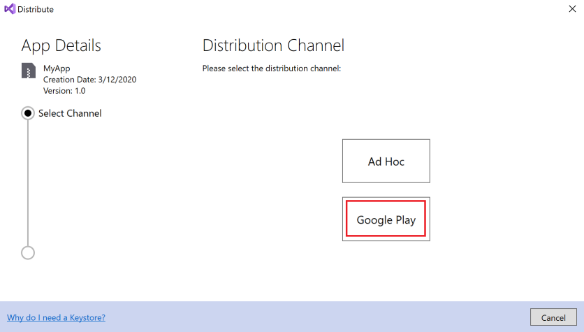](images/vs/01-distribution-channel.png#lightbox)

In the **Signing Identity** dialog, select the identity created in
[Creating a New Certificate](~/android/deploy-test/signing/index.md#newcert)
and click **Continue**:

[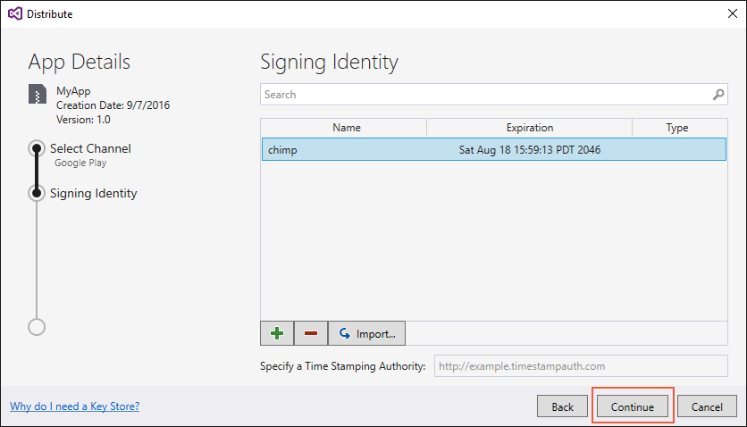](images/vs/02-select-identity.png#lightbox)

In the **Google Play Accounts** dialog, click the **+** button to add a new Google Play Account:

[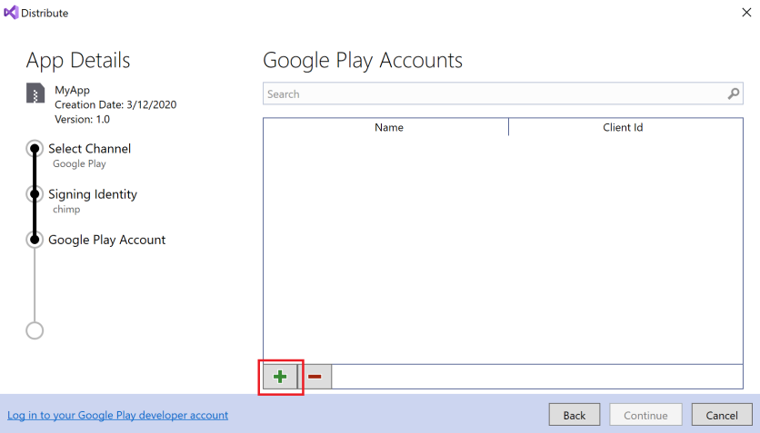](images/vs/03-google-play-accounts.png#lightbox)

In the **Register Google API Access** dialog, you must provide the
_Client ID_ and _Client secret_ that provides API access to your Google
Play Developer account:

[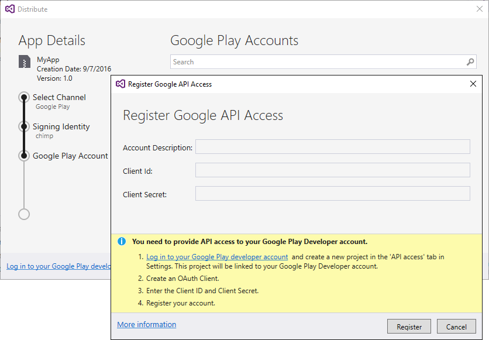](images/vs/04-register-google-api-access.png#lightbox)

The next section explains how to create a new Google API project and generate the
needed _Client ID_ and _Client secret_.

# [Visual Studio for Mac](#tab/macos)

Visual Studio for Mac has an integrated workflow for publishing
apps to Google Play.

[Creating a New Certificate](~/android/deploy-test/signing/index.md#newcert),
discussed creating a new certificate for signing Android apps. The
following steps outline how to publish a Xamarin.Android app to Google
Play:

1. Sign into your Google Play Developer account to create a new project that is linked to your Google Play Developer account.
2. Create an _OAuth Client_ that authenticates your app.
3. Enter the resulting _Client ID_ and _Client secret_ into Visual Studio for Mac.
4. Register your account with Visual Studio for Mac.
5. Sign the application with your certificate.
6. Publish your signed application to Google Play.

In [Archive for Publishing](~/android/deploy-test/release-prep/index.md#archive),
the **Sign and Distribute...** dialog presented two choices for
distribution. Select **Google Play** and click **Next**:

[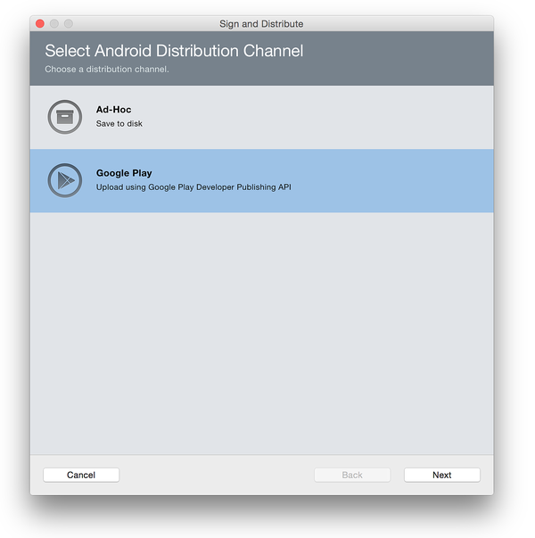](images/xs/01-select-google-play.png#lightbox)

In the **Google Play API Account** dialog, you must provide the _Client
ID_ and _Client secret_ that provides API access to your Google Play
Developer account:

[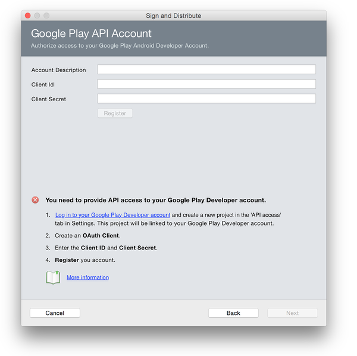](images/xs/02-google-play-api-account.png#lightbox)

The next section explains how to create a new Google API project and generate
the needed _Client ID_ and _Client secret_.

-----

#### Create a Google API Project

First, sign into your
[Google Play Developer account](https://play.google.com/apps/publish).
If you do not already have a
Google Play Developer account, see [Get Started with
Publishing](https://developer.android.com/distribute/googleplay/start.html).
Also, the Google Play Developer API [Getting Started](https://developers.google.com/android-publisher/getting_started)
explains how to use the Google Play Developer API. After you sign into
the Google Play Developer Console, click **CREATE APPLICATION**:

[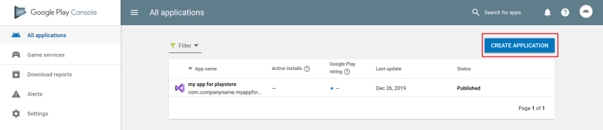](images/01-create-new-project.png#lightbox)

After creating the new project, it will be
linked to your Google Play Developer Console account.

The next step is to create an OAuth Client for the app (if one has not
already been created). When users request access to their private 
data using your app, your OAuth Client ID is used to authenticate your app.

Go to the **Settings** page.

[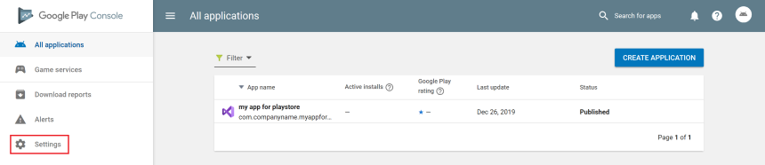](images/02-google-play-developer-console.png#lightbox)

In the **Settings** page, select **API access** and click **CREATE OAUTH CLIENT** to create a new OAuth client:

[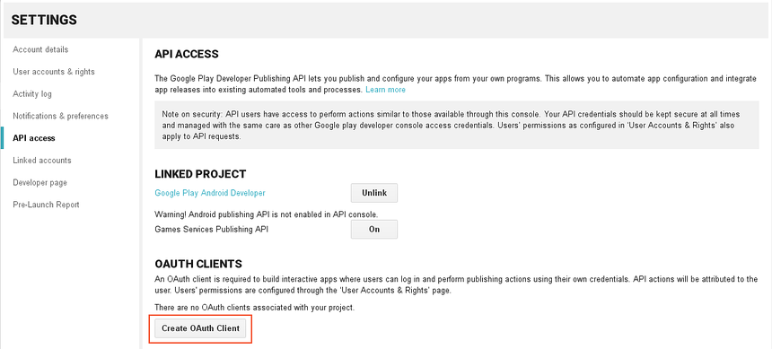](images/03-create-oauth-client.png#lightbox)

After a few seconds, a new Client ID is generated. Click **View in
Google Developers Console** to see your new Client ID in the Google
Developer's Console:

[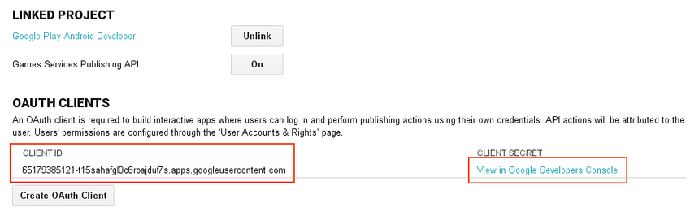](images/04-generated-client-id.png#lightbox)

The Client ID is displayed along its name and creation date. Click the
**Edit OAuth Client** icon to view the Client secret for your app:

[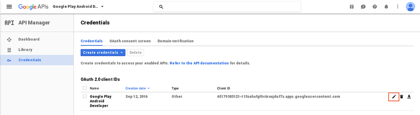](images/05-google-developer-console.png#lightbox)

The default name of the OAuth client is *Google Play Android
Developer*. This can be changed to the name of Xamarin.Android app, or any suitable name. In this example, the
OAuth Client name is changed to the name of the app, **MyApp**:

[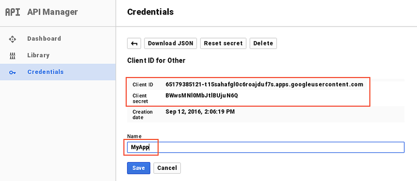](images/06-client-id-and-secret.png#lightbox)

Click **Save** to save changes. This returns to the **Credentials** page where to download the credentials by clicking on the  **Download JSON** icon:

[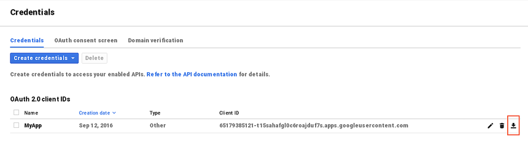](images/07-download-json.png#lightbox)

This JSON file contains the Client ID and Client secret that you can cut
and paste into the **Sign and Distribute** dialog in the next step.

#### Register Google API Access

# [Visual Studio](#tab/windows)

Use the Client ID and Client secret to complete the **Google Play API Account** dialog in
Visual Studio for Mac. It is possible to give the account a description &ndash; this makes
it possible to register more than one Google Play account and upload future APK's to
different Google Play accounts. Copy the Client ID and Client secret to this dialog
and click **Register**:

[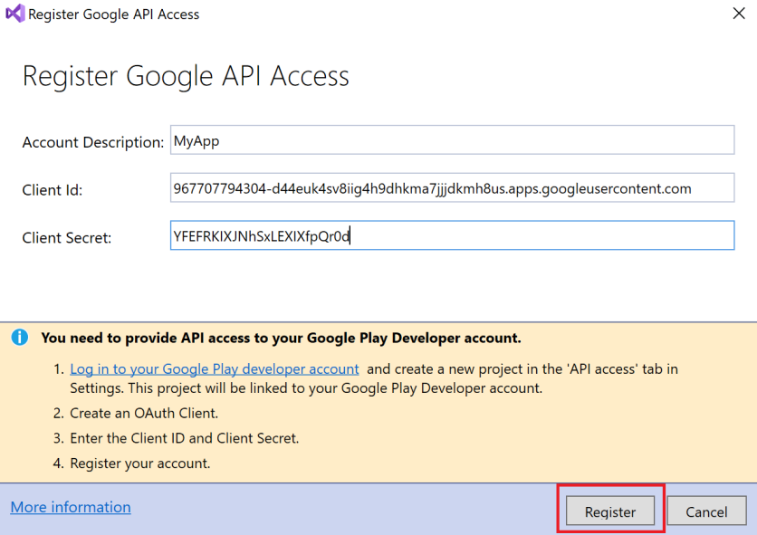](images/vs/05-enter-client-id-and-secret.png#lightbox)

A web browser will open and prompt you to sign into your Google Play Android
Developer account (if you are not already signed in). After you sign in, the
following prompt is displayed in the web browser.
Click **Allow** to authorize the app:

[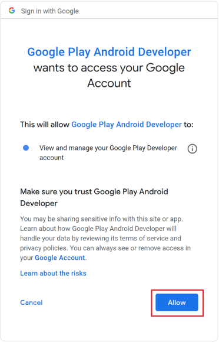](images/vs/06-authorize-app.png#lightbox)

#### Publish

After clicking **Allow**, the browser reports _Received verification
code. Closing..._ and the app is added to the list of Google Play
Accounts in Visual Studio. In the **Google Play Accounts** dialog,
click **Continue**:

[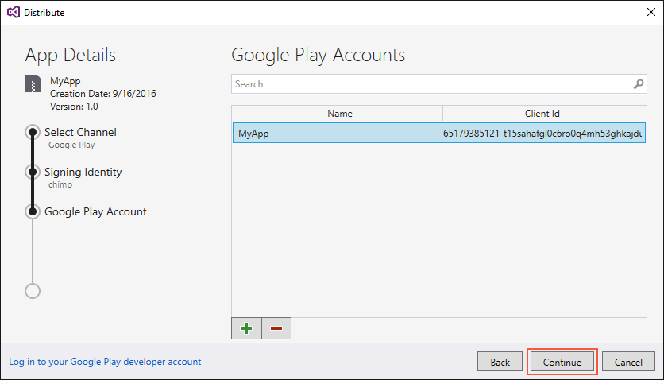](images/vs/07-account-added.png#lightbox)

Next, the **Google Play Track** dialog is presented. Google Play offers
five possible tracks for uploading your app:

- **Internal** &ndash; Used for quickly distributing your app for internal testing and quality assurance checks.
- **Alpha** &ndash; Used for uploading an early version of your app to a small list of testers.
- **Beta** &ndash; Used for uploading an early version of your app to a larger list of testers.
- **Production** &ndash; Used for full distribution to the Google Play store.
- **Custom** &ndash; Used for testing pre-release versions of your app with specific users by creating a list of testers by email address.

Choose which Google Play track will be used for uploading the app and click **Upload**.

[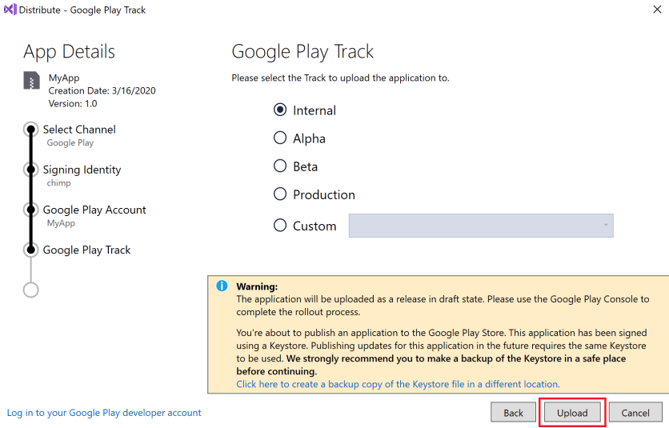](images/vs/08-google-play-track.png#lightbox)

For more information about Google Play testing, see
[Set up open/closed/internal tests](https://support.google.com/googleplay/android-developer/answer/3131213?hl=en).

Next, a dialog is presented to enter the password for the signing certificate.
Enter the password and click **OK**:

[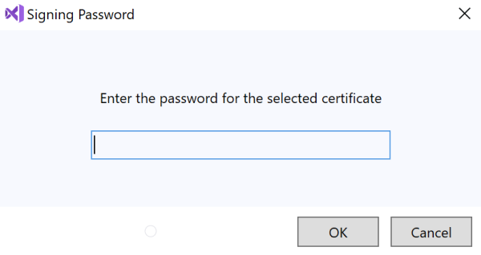](images/vs/09-certificate-password.png#lightbox)

The **Archive Manager** displays the progress of the upload:

[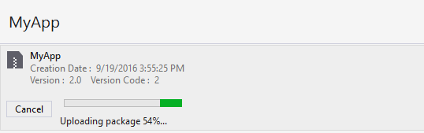](images/vs/10-uploading-apk.png#lightbox)

When the upload finishes, completion status is shown in the lower
left hand corner of Visual Studio:

[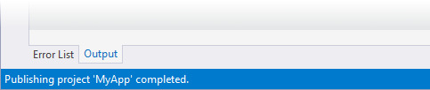](images/vs/11-published.png#lightbox)

### Troubleshooting

If you do not see your custom track when selecting a Google Play track, make sure you have created a release for that track on the Google Play Developer Console. For instructions on how to create a release, see [Prepare & roll out releases](https://support.google.com/googleplay/android-developer/answer/7159011?hl=en).

Note that one APK must have already been submitted to the Google Play
store before the **Publish to Google Play** will work. If an APK is not
already uploaded the Publishing Wizard will display the following error
in the **Errors** pane:

When this error occurs, manually upload an APK (such as an Ad Hoc build) via
the Google Play Developer Console and use the **Distribution Channel**
dialog for subsequent APK updates.  For more information, see
[Manually Uploading the APK](~/android/deploy-test/publishing/publishing-to-google-play/manually-uploading-the-apk.md). The version code of the APK must change with each upload, otherwise the following error will occur:

[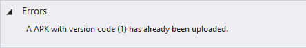](images/vs/13-version-code-error.png#lightbox)

To resolve this error, rebuild the app with a different version number
and resubmit it to Google Play via the **Distribution Channel** dialog.

# [Visual Studio for Mac](#tab/macos)

Use the Client ID and Client secret to complete the **Google Play API Account** dialog in
Visual Studio for Mac. It is possible to give the account a description &ndash; this makes
it possible to register more than one Google Play account and upload future APK's to
different Google Play accounts. Copy the Client ID and Client secret to this dialog
and click **Register**:

[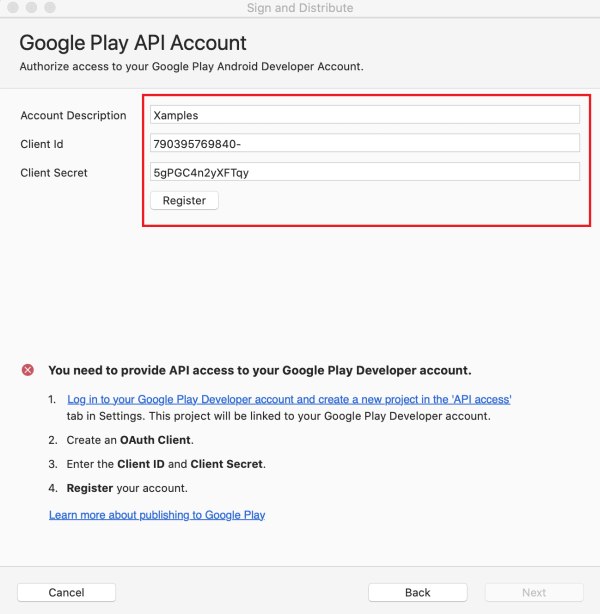](images/xs/03-register.png#lightbox)

If the Client ID and Client secret are accepted, a **Registration
Successful** message is displayed. Click **Next**:

[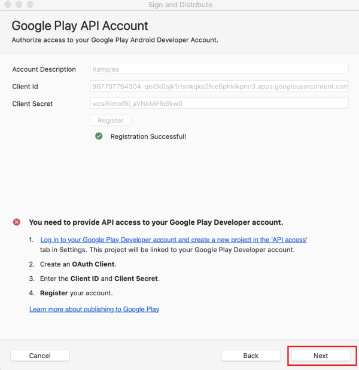](images/xs/04-registration-successful.png#lightbox)

In the **Google Play Account** dialog, select a Google account and a track
for uploading the application:

[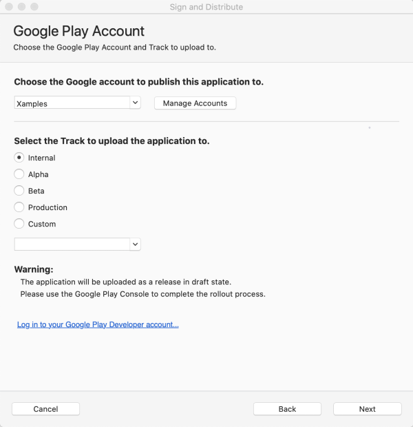](images/xs/05-choose-google-account.png#lightbox)

Google Play offers five possible tracks for uploading your app:

- **Internal** &ndash; Used for quickly distributing your app for internal testing and quality assurance checks.
- **Alpha** &ndash; Used for uploading an early version of your app to a small list of testers.
- **Beta** &ndash; Used for uploading an early version of your app to a larger list of testers.
- **Production** &ndash; Used for full distribution to the Google Play store.
- **Custom** &ndash; Used for testing pre-release versions of your app with specific users by creating a list of testers by email address.

For more information about Google Play testing, see [Set up
alpha/beta tests](https://support.google.com/googleplay/android-developer/answer/3131213?hl=en).

Next, choose a signing identity to that will be used to sign the app.
Select **Use Existing Key** to use an existing signing
identity, otherwise consult the guide
[Creating a New Certificate](~/android/deploy-test/signing/index.md#newcert)
for information about creating a new key. After you have selected a
certificate to sign the application, click **Next**:

[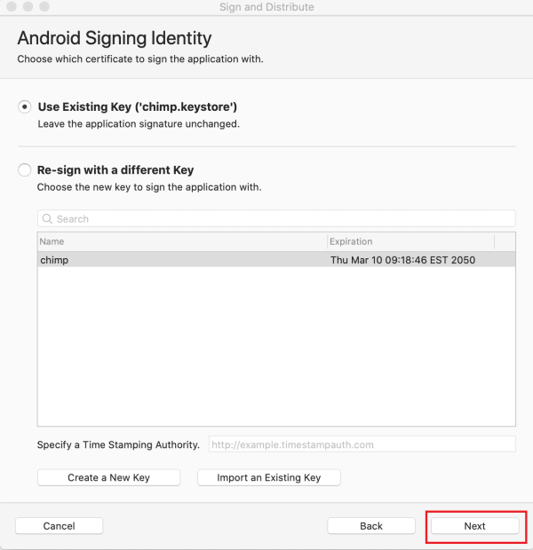](images/xs/06-android-signing-identity.png#lightbox)

At this point the app can be uploaded to Google Play. The **Publish to Google Play** dialog summarizes information about your app &ndash; click **Publish** to publish your app to Google Play:

[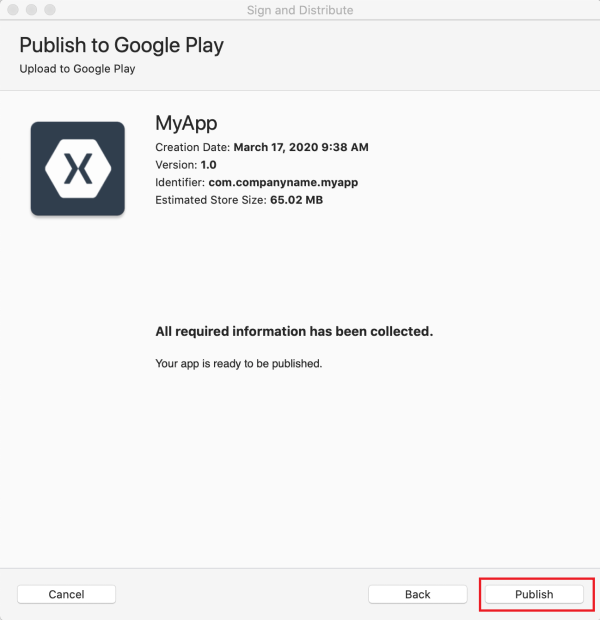](images/xs/07-publish-to-google-play.png#lightbox)

### Troubleshooting

If you do not see your custom track when selecting a Google Play track to upload your app to, make sure you have created a release for that track on the Google Play Developer Console. For instructions on how to create a release, see [Prepare & roll out releases](https://support.google.com/googleplay/android-developer/answer/7159011?hl=en).

Note that one APK must have already been submitted to the Google Play
store before the **Publish to Google Play** will work. If an APK is not uploaded the following error may occur:

> _Google Play requires you to manually upload your first APK for this app. You can use an ad-hoc APK for this._

or

> _No application was found for the given package name. [404]_

To resolve this error, manually upload an APK (such as an Ad Hoc build) via the Google
Play Developer Console and use the **Publish to Google Play** dialog for
subsequent APK updates. For information about how to manually upload an APK, see
[Manually Uploading the APK](~/android/deploy-test/publishing/publishing-to-google-play/manually-uploading-the-apk.md).

-----
