# Manually Uploading the APK

The first time an APK is submitted to Google Play (or if an early
version of Xamarin.Android is used) the APK must be manually uploaded
through the [Google Play Developer Console](https://play.google.com/apps/publish).
This guide explains the steps required for this process.

## Google Play Developer Console

Once the APK has been compiled and the promotional assets prepared, the
application must be uploaded to Google Play. This is done by logging in
to the [Google Play Developer Console](https://play.google.com/apps/publish),
pictured next. Click the **Publish an Android App on Google Play**
button to initialize the process of distributing an application.

[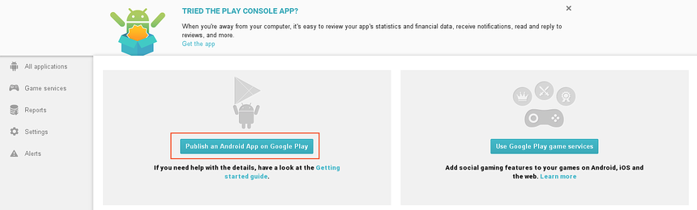](manually-uploading-the-apk-images/00-google-play-developer-console.png#lightbox)

If you already have an existing app registered with Google Play, click
the **Add new application** button:

[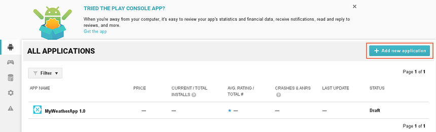](manually-uploading-the-apk-images/01-existing-app.png#lightbox)

When the **ADD NEW APPLICATION** dialog is displayed, enter the name of
the app and click **Upload APK**:

[](manually-uploading-the-apk-images/02-add-new-application.png#lightbox)

The next screen allows the app to be published for alpha testing, beta
testing, or production. In the following example, the **ALPHA TESTING**
tab is selected. Because **MyApp** does not use licensing services, the
**Get license key** button does not have to be clicked for this
example. Here, the **Upload your first APK to Alpha** button is clicked to
publish to the Alpha channel:

[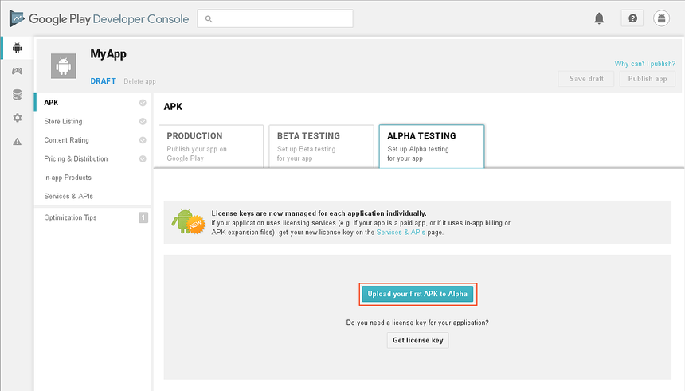](manually-uploading-the-apk-images/03-upload-to-alpha.png#lightbox)

The **UPLOAD NEW APK TO ALPHA** dialog is displayed. The APK can be
uploaded by either clicking the **Browse files** button or by
dragging-and-dropping the APK:

[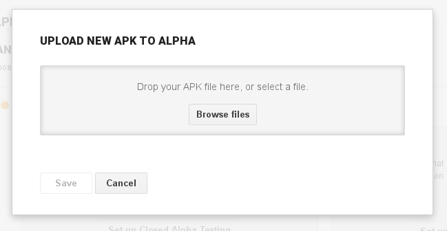](manually-uploading-the-apk-images/04-upload-dialog.png#lightbox)

Be sure to upload the release-ready APK that is to be distributed.
The next dialog indicates the progress of the APK upload:

[](manually-uploading-the-apk-images/05-upload-progress.png#lightbox)

After the APK is uploaded, it is possible to select a testing method:

[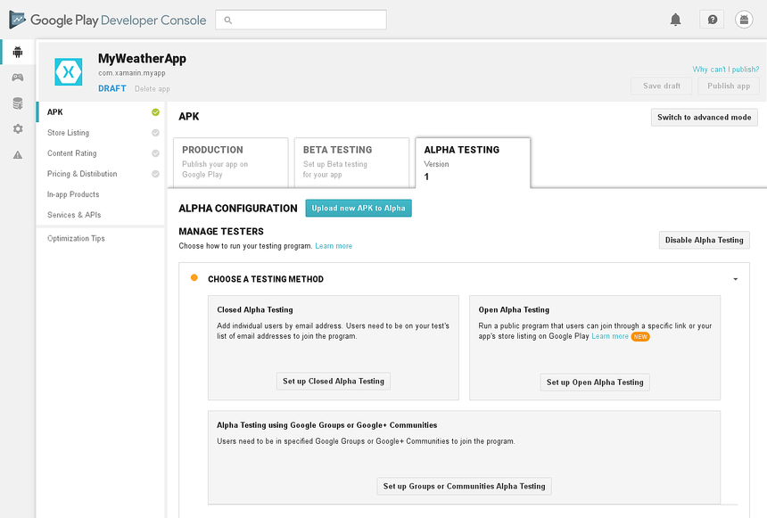](manually-uploading-the-apk-images/06-select-testing-method.png#lightbox)

For more information about app testing, see Google's
[Set up alpha/beta tests](https://support.google.com/googleplay/android-developer/answer/3131213?hl=en) guide.

After the APK is uploaded, it is saved as a draft. It cannot be
published until more details are provided to Google Play as described
next.

## Store Listing

Click **Store Listing** in the **Google Play Developer Console** to
enter the information that Google Play will display to potentials users
of the application:

[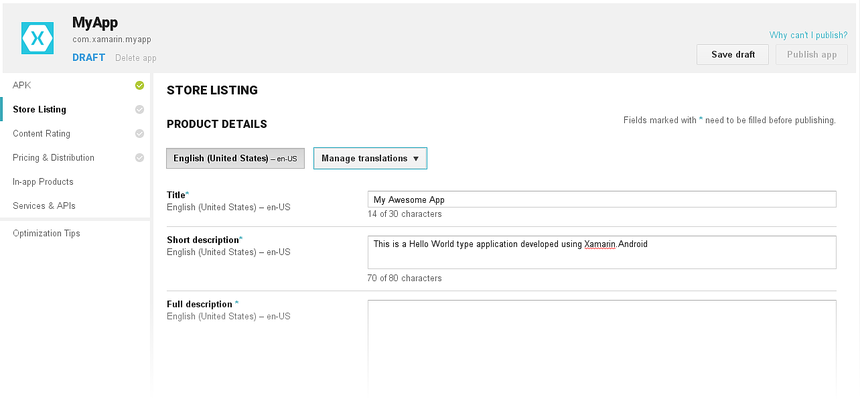](manually-uploading-the-apk-images/07-store-listing.png#lightbox)

### Graphics Assets

Scroll down to the **GRAPHICS ASSETS** section of the **Store Listing**
page:

[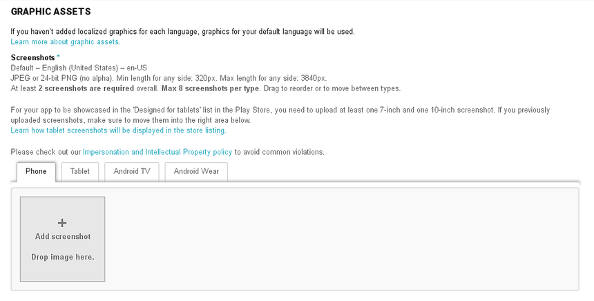](manually-uploading-the-apk-images/08-graphic-assets.png#lightbox)

All of the promotional assets that were prepared earlier are uploaded in
this section. Guidance is provided as to what promotional assets must
be provided and what format they should be provided in.

### Categorization

After the **GRAPHICS ASSETS** section is a **CATEGORIZATION** section, select the application type and category:

[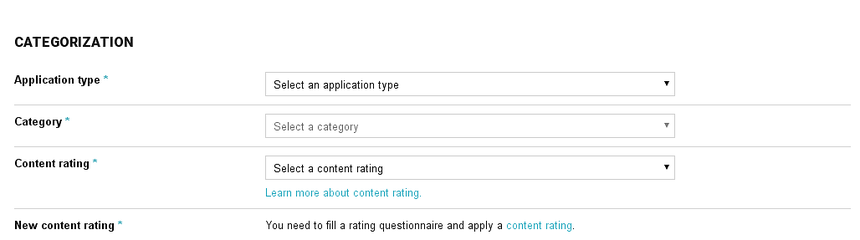](manually-uploading-the-apk-images/09-categorization.png#lightbox)

Content rating is covered after the next section.

### Contact Details

The final section of this page is a **CONTACT DETAILS** section. This
section is used to collect contact information about the developer of
the application:

[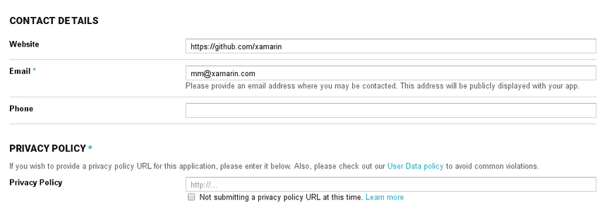](manually-uploading-the-apk-images/10-contact-details.png#lightbox)

It is possible to provide a URL for the privacy policy of the App in the **PRIVACY POLICY** section, as indicated above.

## Content Rating

Click **Content Rating** in the **Google Play Developer Console**. In
this page, you specify the content rating for your app. Google Play
requires that all applications specify a content rating. Click the
**Continue** button to complete the content rating questionaire:

[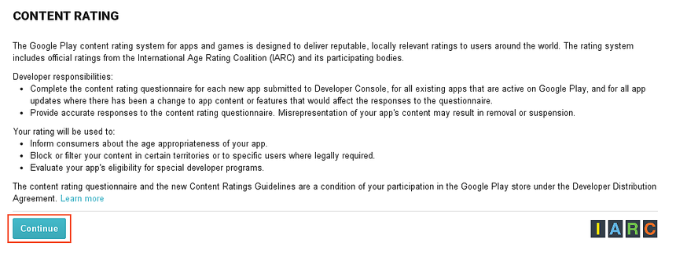](manually-uploading-the-apk-images/11-content-rating.png#lightbox)

All applications on Google Play must be rated according to the Google
Play ratings system. In addition to the content rating, all
applications must adhere to Google's
[Developer Content Policy](https://www.android.com/us/developer-content-policy.html).

The following lists the four levels in the Google Play rating system
and provides some guidelines as features or content that would require
or force the rating level:

- **Everyone** &ndash; May not access, publish, or share location
    data. May not host any user-generated content. May not enable
    communication between users.

- **Low maturity** &ndash; Applications that access, but do not
    share, location data. Depictions of mild or cartoon violence.

- **Medium maturity** &ndash; References to drugs, alcohol or
    tobacco. Gambling themes or simulated gambling. Inflammatory
    content. Profanity or crude humor. Suggestive or sexual references.
    Intense fantasy violence. Realistic violence. Allowing users to
    find each other. Allowing users to communicate with each other.
    Sharing of a user's location data.

- **High maturity** &ndash; A focus on the consumption or sale of
    alcohol, tobacco, or drugs. A focus on suggestive or sexual
    references. Graphic violence.

The items in the Medium maturity list are subjective, as such it is
possible that a guideline that may seem to dictate a Medium maturity
rating may be intense enough to warrant a High maturity rating.

## Pricing &amp; Distribution

Click **Pricing and Distribution** in the **Google Play Developer
Console**. In this page, set a price if the app is a paid app.
Alternately, the application can be distributed free of charge to all
users. Once an application is specified as free, it must remain free.
Google Play will not allow an application that is free to be changed to
a priced app (however, it is possible to sell content with in-app
billing with a free app). Google Play will allow a paid app to change
to a free app at any time.

A merchant account is required to before publishing a paid app.To do so,
click **set up a merchant account** and follow the instructions.

[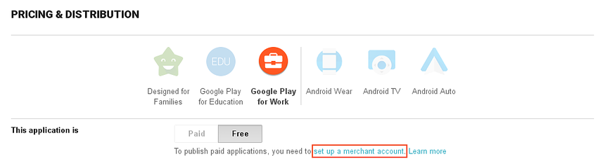](manually-uploading-the-apk-images/12-pricing.png#lightbox)

### Manage Countries

The next section, **Manage Countries**, provides control over what
countries an app may be distributed to:

[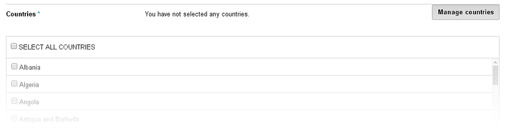](manually-uploading-the-apk-images/13-manage-countries.png#lightbox)

### Other Information

Scroll down further to specify whether the app contains ads. Also, the
**DEVICE CATEGORIES** section provides options to optionally distribute
the app for Android Wear, Android TV, or Android Auto:

[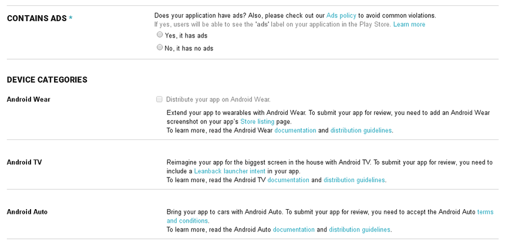](manually-uploading-the-apk-images/14-contains-ads.png#lightbox)

After this section are additional options that may be selected, such as
opting into **Designed for Families** and distributing the
app through Google Play for Education.

### Consent

At the bottom of the **Pricing &amp; Distribution** page is the **CONSENT** section.
This is a mandatory section and is used to declare that the application
meets the [Android Content Guidelines](https://play.google.com/about/restricted-content/)
and acknowledgement that the application is subject to U.S. export laws:

[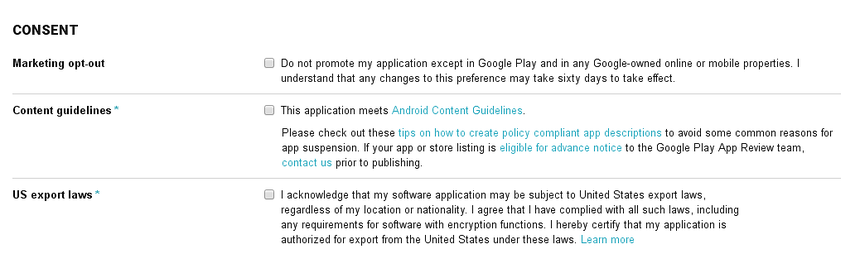](manually-uploading-the-apk-images/15-consent.png#lightbox)

There is much more to publishing a Xamarin.Android app than can be covered in this guide.
For more information about publishing your app in Google Play,
see [Welcome to the Google Play Developer Console Help Center](https://support.google.com/googleplay/android-developer#topic=3450769).

## Google Play Filters

When users browse the Google Play website for applications, they are
able to search all published applications. When users browse Google
Play from an Android device, the results are slightly different. The
results will be filtered according to compatibility with the device
that is being used. For example, if an application must send SMS
messages, then Google Play will not show that application to any device
which cannot send SMS messages. The filters that are applied to a
search are created from the following:

1. The hardware configuration of the device.
2. Declarations in the applications manifest file.
3. The carrier that is used (if any).
4. The location of the device.

It is possible to add elements to the app's manifest to help control how
app is filtered in the Google Play store. The following lists
manifest elements and attributes that can be used to filter
applications:

- [supports-screen](https://developer.android.com/guide/topics/manifest/supports-screens-element.html)
    &ndash; Google Play will use the attributes to determine if an
    application can be deployed to a device based on the screen size.
    Google Play will assume that Android can adapt smaller layout to
    larger screens, but not vice-versa. So an application that declares
    support for normal screens will appear in searches for large
    screens, but not small screens. If a Xamarin.Android application
    does not provide a `<supports-screen>` element in the manifest file,
    then Google Play will assume all attributes have a value of true
    and that the application supports all screen sizes. This element
    must be added to **AndroidManifest.xml** manually.

- [uses-configuration](https://developer.android.com/guide/topics/manifest/uses-configuration-element.html)
    &ndash; This manifest element is used to request certain hardware
    features, such as the type of keyboard, navigation devices, a touch
    screen, etc. This element must be added to **AndroidManifest.xml**
    manually.

- [uses-feature](https://developer.android.com/guide/topics/manifest/uses-feature-element.html)
    &ndash; This manifest element declares hardware or software
    features that a device must have in order for the application to
    function. This attribute is informational only. Google Play will
    not display the application to devices that do not meet this
    filter. It's still possible to install the application by other
    means (manually or downloading). This element must be added to
    **AndroidManifest.xml** manually.

- [uses-library](https://developer.android.com/guide/topics/manifest/uses-library-element.html)
    &ndash; This element specifies that certain shared libraries must
    be present on the device, for example Google Maps. This element may
    also be specified with the `Android.App.UsesLibraryAttribute`. For
    example:

    ```csharp
    [assembly: UsesLibrary("com.google.android.maps", true)]
    ```

- [uses-permission](https://developer.android.com/guide/topics/manifest/uses-permission-element.html)
    &ndash; This element is used to infer certain hardware features
    that are required for the application to run that may not have been
    properly declared with a `<uses-feature>` element. For example,
    if an application requests permission to use the camera, then
    Google Play assumes that devices must have a camera, even if there
    is no `<uses-feature>` element declaring the camera. This element
    may be set with the `Android.App.UsesPermissionsAttribute`. For
    example:

    ```csharp
    [assembly: UsesPermission(Manifest.Permission.Camera)]
    ```

- [uses-sdk](https://developer.android.com/guide/topics/manifest/uses-sdk-element.html)
    &ndash; The element is used to declare the minimum Android API
    Level required for the application. This element may set in the
    Xamarin.Android options of a Xamarin.Android project.

- [compatible-screens](https://developer.android.com/guide/topics/manifest/compatible-screens-element.html)
    &ndash; This element is used to filter applications that do not
    match the screen size and density specified by this element. Most
    applications should not use this filter. It is intended for
    specific high performance games or applications that required
    strict controls on application distribution. The `<support-screen>`
    attribute mentioned above is preferred.

- [supports-gl-texture](https://developer.android.com/guide/topics/manifest/supports-gl-texture-element.html)
    &ndash; This element is used to declare GL texture compression
    formations that the application requires. Most applications should
    not use this filter. It is intended for specific high performance
    games or applications that required strict controls on application
    distribution.

For more information about configuring the app manifest, see the Android
[App Manifest](https://developer.android.com/guide/topics/manifest/manifest-intro.html)
topic.
