# Preparing an Application for Release

After an application has been coded and tested, it is necessary to
prepare a package for distribution. The first task in preparing
this package is to build the application for release, which mainly
entails setting some application attributes.

Use the following steps to build the app for release:

- **[Specify the Application Icon](#Specify_the_Application_Icon)**
    &ndash; Each Xamarin.Android application should have an application
    icon specified. Although not technically necessary, some markets,
    such as Google Play, require it.

- **[Version the Application](#Versioning)** &ndash; This step
    involves initializing or updating the versioning information. This
    is important for future application updates and to ensure that the
    users are aware of which version of the application they have
    installed.

- **[Shrink the APK](#shrink_apk)** &ndash; The size of the final APK
    can be substantially reduced by using the Xamarin.Android linker on
    the managed code and ProGuard on the Java bytecode.

- **[Protect the Application](#protect_app)** &ndash; Prevent users
    or attackers from debugging, tampering, or reverse engineering the
    application by disabling debugging, obfuscating the managed code,
    adding anti-debug and anti-tamper, and using native compilation.

- **[Set Packaging Properties](#Set_Packaging_Properties)** &ndash;
    Packaging properties control the creation of the Android
    application package (APK). This step optimizes the APK, protects
    its assets, and modularizes the packaging as needed. Additionally,
    you can provide your users with an Android App Bundle that's optimized
    for their devices.

- **[Compile](#Compile)** &ndash; This step compiles the code and
    assets to verify that it builds in Release mode.

- **[Archive for Publishing](#archive)** &ndash; This step builds the
    app and places it in an archive for signing and publishing.

Each of these steps is described below in more detail.

<a name="Specify_the_Application_Icon"></a>

## Specify the Application Icon

It is strongly recommended that each Xamarin.Android application
specifies an application icon. Some application marketplaces will not
allow an Android application to be published without one. The `Icon`
property of the `Application` attribute is used to specify the
application icon for a Xamarin.Android project.

<!-- markdownlint-disable MD001 -->

# [Visual Studio](#tab/windows)

In Visual Studio 2017 and later, specify the application icon through
the **Android Manifest** section of project **Properties**, as shown in
the following screenshot:

[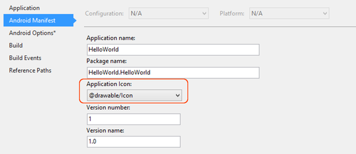](images/vs/01-application-icon.png#lightbox)

# [Visual Studio for Mac](#tab/macos)

In Visual Studio for Mac, it is also possible to specify the
application icon through the **Android Application** section of
**Project Options**, as shown in the following screenshot:

[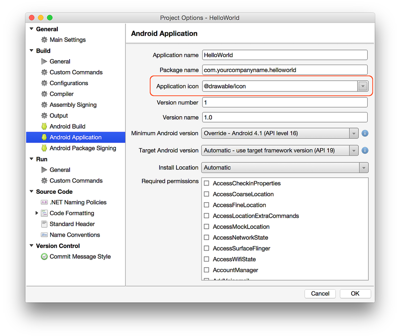](images/xs/01-application-icon.png#lightbox)

-----

In these examples, `@drawable/icon` refers to an icon file that is
located at **Resources/drawable/icon.png** (note that the **.png**
extension is not included in the resource name). This attribute
can also be declared in the file **Properties\AssemblyInfo.cs**, as
shown in this sample snippet:

```csharp
[assembly: Application(Icon = "@drawable/icon")]
```

Normally, `using Android.App` is declared at the top of
**AssemblyInfo.cs** (the namespace of the `Application` attribute is
`Android.App`); however, you may need to add this `using` statement if
it is not already present.

<a name="Versioning"></a>

## Version the Application

Versioning is important for Android application maintenance and
distribution. Without some sort of versioning in place, it is difficult
to determine if or how an application should be updated. To assist with
versioning, Android recognizes two different types of information:

- **Version Number** &ndash; An integer value (used internally by
    Android and the application) that represents the version of the
    application. Most applications start out with this value set to 1,
    and then it is incremented with each build. This value has no
    relationship or affinity with the version name attribute
    (see below). Applications and publishing services should not
    display this value to users. This value is stored in the
    **AndroidManifest.xml** file as `android:versionCode`.

- **Version Name** &ndash; A string that is used only for
    communicating information to the user about the version of the
    application (as installed on a specific device). The version name
    is intended to be displayed to users or in Google Play. This string
    is not used internally by Android. The version name can be any
    string value that would help a user identify the build that is
    installed on their device. This value is stored in the
    **AndroidManifest.xml** file as `android:versionName`.

# [Visual Studio](#tab/windows)

In Visual Studio, these values can be set in the **Android Manifest**
section of project **Properties**, as shown in the following
screenshot:

[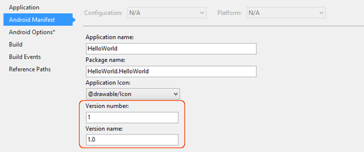](images/vs/02-versioning.png#lightbox)

# [Visual Studio for Mac](#tab/macos)

These values can be set via the **Build > Android Application** section
of **Project Options** as shown in the following screenshot:

[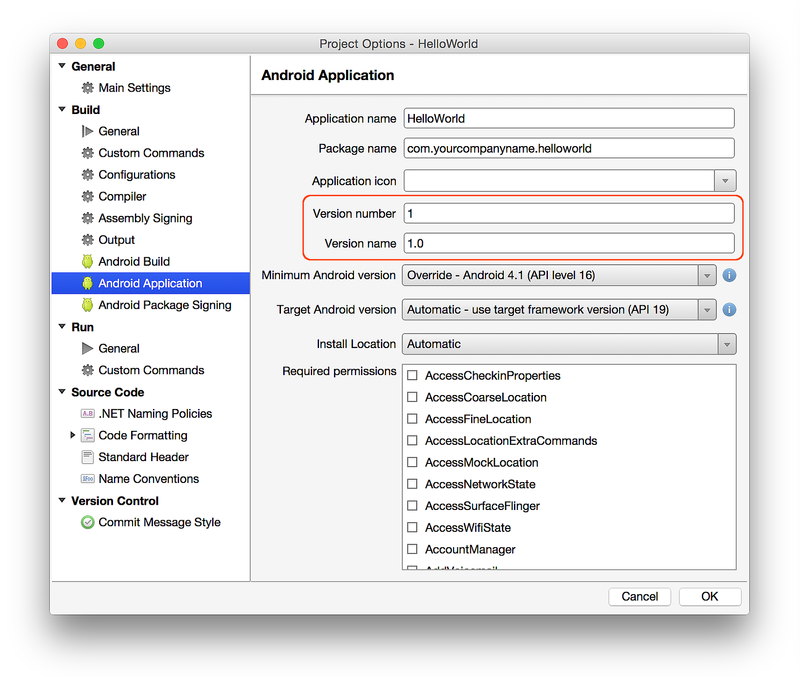](images/xs/02-versioning.png#lightbox)

-----

<a name="shrink_apk"></a>

## Shrink the APK

Xamarin.Android APKs can be made smaller through a combination of the
Xamarin.Android linker, which removes unnecessary *managed* code, and
the *ProGuard* tool from the Android SDK, which removes unused *Java
bytecode*. The build process first uses the Xamarin.Android linker to
optimize the app at the managed code (C#) level, and then it later uses
ProGuard (if enabled) to optimize the APK at the Java bytecode level.

### Configure the Linker

Release mode turns off the shared runtime and turns on linking so that
the application only ships the pieces of Xamarin.Android required at
runtime. The *linker* in Xamarin.Android uses static analysis to
determine which assemblies, types, and type members are used or
referenced by a Xamarin.Android application. The linker then discards
all the unused assemblies, types, and members that are not used (or
referenced). This can result in a significant reduction in the package
size. For example, consider the
[HelloWorld](~/android/deploy-test/linker.md) sample, which
experiences an 83% reduction in the final size of its APK:

- Configuration: None &ndash; Xamarin.Android 4.2.5 Size = 17.4 MB.

- Configuration: SDK Assemblies Only &ndash; Xamarin.Android 4.2.5 Size = 3.0 MB.

# [Visual Studio](#tab/windows)

Set linker options through the **Android Options** section of the project
**Properties**:

[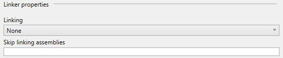](images/vs/03-linking.png#lightbox)

The **Linking** pull-down menu provides the following options for
controlling the linker:

- **None** &ndash; This turns off the linker; no linking will be
    performed.

- **SDK Assemblies Only** &ndash; This will only link the assemblies
    that are [required by Xamarin.Android](~/cross-platform/internals/available-assemblies.md).
    Other assemblies will not be linked.

- **Sdk and User Assemblies** &ndash; This will link all assemblies
    that are required by the application, and not just the ones
    required by Xamarin.Android.

# [Visual Studio for Mac](#tab/macos)

Set linker options through the **Linker** tab in the **Android Build**
section of **Project Options**, as shown in the following screenshot:

[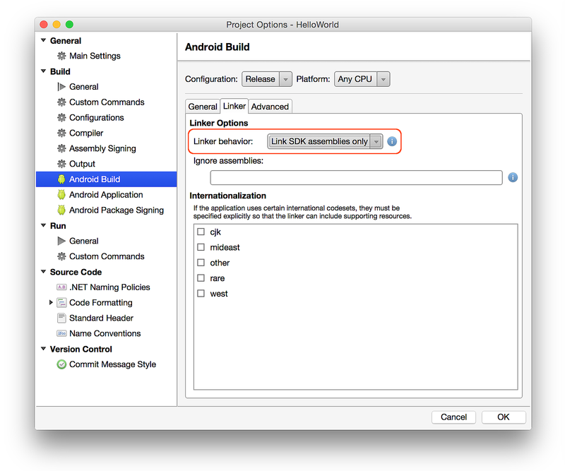](images/xs/03-linking.png#lightbox)

The options for controlling the linker are as follows:

- **Don't link** &ndash; This turns off the linker; no linking will
    be performed.

- **Link SDK assemblies only** &ndash; This will only link the
    assemblies that are
    [required by
    Xamarin.Android](~/cross-platform/internals/available-assemblies.md). Other
    assemblies will not be linked.

- **Link all assemblies** &ndash; This will link all assemblies that
    are required by the application, and not just the ones required by
    Xamarin.Android.

-----

Linking can produce some unintended side effects, so it is important
that an application be re-tested in Release mode on a physical device.

### ProGuard

*ProGuard* is an Android SDK tool that links and obfuscates Java code.
ProGuard is normally used to create smaller applications by reducing
the footprint of large included libraries (such as Google Play
Services) in your APK. ProGuard removes unused Java bytecode, which
makes the resulting app smaller. For example, using ProGuard on small
Xamarin.Android apps usually achieves about a 24% reduction in size
&ndash; using ProGuard on larger apps with multiple library
dependencies typically achieves an even greater size reduction.

ProGuard is not an alternative to the Xamarin.Android linker. The
Xamarin.Android linker links *managed* code, while ProGuard links Java
bytecode. The build process first uses the Xamarin.Android linker to
optimize the managed (C#) code in the app, and then it later uses
ProGuard (if enabled) to optimize the APK at the Java bytecode level.

When **Enable ProGuard** is checked, Xamarin.Android runs the ProGuard
tool on the resulting APK. A ProGuard configuration file is generated
and used by ProGuard at build time. Xamarin.Android also supports
custom *ProguardConfiguration* build actions. You can add a custom
ProGuard configuration file to your project, right-click it, and select
it as a build action as shown in this example:

# [Visual Studio](#tab/windows)

[](images/vs/05-proguard-build-action.png#lightbox)

# [Visual Studio for Mac](#tab/macos)

[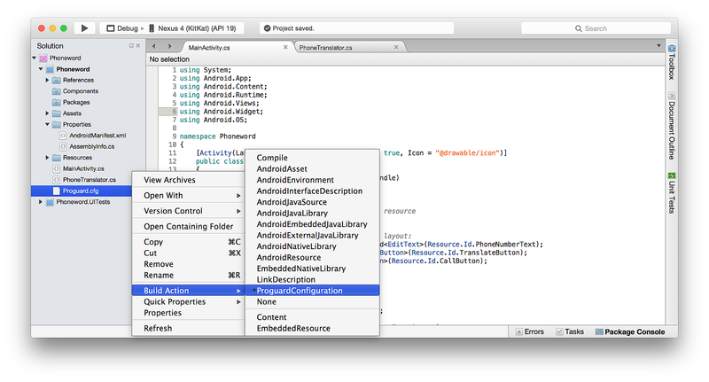](images/xs/05-proguard-build-action.png#lightbox)

-----

ProGuard is disabled by default. The **Enable ProGuard** option is
available only when the project is set to **Release** mode. All
ProGuard build actions are ignored unless **Enable ProGuard** is
checked. The Xamarin.Android ProGuard configuration does not obfuscate
the APK, and it is not possible to enable obfuscation, even with custom
configuration files. If you wish to use obfuscation, please see
[Application Protection with Dotfuscator](~/android/deploy-test/release-prep/index.md#dotfuscator).

For more detailed information about using the ProGuard tool, see
[ProGuard](~/android/deploy-test/release-prep/proguard.md).

<a name="protect_app"></a>

## Protect the Application

<a name="Disable_Debugging"></a>

### Disable Debugging

During development of an Android application, debugging is performed
with the use of the *Java Debug Wire Protocol* (JDWP). This is a
technology that allows tools such as **adb** to communicate with a JVM for
the purposes of debugging. JDWP is turned on by default for Debug
builds of a Xamarin.Android application. While JDWP is important during
development, it can pose a security issue for released applications.

> [!IMPORTANT]
> Always disable the debug state in a released application as it
is possible (via JDWP) to gain full access to the Java process and
execute arbitrary code in the context of the application if this debug
state is not disabled.

The Android Manifest contains the `android:debuggable` attribute, which
controls whether or not the application may be debugged. It is
considered a good practice to set the `android:debuggable` attribute to
`false`. The simplest way to do this is by adding a conditional compile
statement in **AssemblyInfo.cs**:

```csharp
#if DEBUG
[assembly: Application(Debuggable=true)]
#else
[assembly: Application(Debuggable=false)]
#endif
```

Note that Debug builds automatically set some permissions to make debug
easier (such as **Internet** and
**ReadExternalStorage**). Release builds, however, use only
the permissions that you explicitly configure. If you find that
switching to the Release build causes your app to lose a permission
that was available in the Debug build, verify that you have explicitly
enabled this permission in the **Required permissions**
list as described in
[Permissions](~/android/app-fundamentals/permissions.md).

<a name="dotfuscator" id="dotfuscator"></a>

### Application Protection with Dotfuscator

# [Visual Studio](#tab/windows)

Even with [debugging disabled](#Disable_Debugging), it is still possible for
attackers to re-package an application, adding or removing
configuration options or permissions. This allows them to
reverse-engineer, debug, or tamper with the application.
[Dotfuscator Community
Edition (CE)](https://www.preemptive.com/products/dotfuscator/overview) can
be used to obfuscate managed code and inject runtime security state
detection code into a Xamarin.Android app at build time to detect
and respond if the app is running on a rooted device.

Dotfuscator CE is included with Visual Studio 2017.
To use Dotfuscator, click **Tools > PreEmptive Protection - Dotfuscator**.

To configure Dotfuscator CE, please see
[Using Dotfuscator Community Edition with Xamarin](https://www.preemptive.com/obfuscating-xamarin-with-dotfuscator).
Once it is configured, Dotfuscator CE will automatically protect each
build that is created.

# [Visual Studio for Mac](#tab/macos)

Even with [debugging disabled](#Disable_Debugging), it is still possible for
attackers to re-package an application, adding or removing
configuration options or permissions. This allows them to
reverse-engineer, debug, or tamper with the application.
Although it does not support Visual Studio for Mac, you can use
[Dotfuscator Community Edition (CE)](https://www.preemptive.com/products/dotfuscator/overview)
with Visual Studio to obfuscate managed code and inject runtime security state
detection code into a Xamarin.Android app at build time to detect
and respond if the app is running on a rooted device.

To configure Dotfuscator CE, please see
[Using Dotfuscator Community Edition with Xamarin](https://www.preemptive.com/obfuscating-xamarin-with-dotfuscator).
Once it is configured, Dotfuscator CE will automatically protect each
build that is created.

-----

<a name="bundle"></a>

### Bundle Assemblies into Native Code

When this option is enabled, assemblies are bundled into a native
shared library. This allows assemblies to be compressed, permitting
smaller `.apk` files. Assembly compression also confers a *minimal*
form of obfuscation; such obfuscation should not be relied upon.

This option requires an Enterprise license and is only available when
**Use Fast Deployment** is disabled. **Bundle assemblies into native
code** is disabled by default.

Note that the **Bundle into Native Code** option does *not* mean that
the assemblies are compiled into native code. It is not possible to use
[**AOT Compilation**](#aot) to compile assemblies into native code.

<a name="aot"></a>

### AOT Compilation

The **AOT Compilation** option (on the
[Packaging Properties](#Set_Packaging_Properties) page) enables
Ahead-of-Time (AOT) compilation of assemblies. When this option is
enabled, Just In Time (JIT) startup overhead is minimized by
precompiling assemblies before runtime. The resulting native code is
included in the APK along with the uncompiled assemblies. This results
in shorter application startup time, but at the expense of slightly
larger APK sizes.

The **AOT Compilation** option requires an Enterprise license or
higher. **AOT compilation** is available only when the project is
configured for Release mode, and it is disabled by default. For more
information about AOT Compilation, see
[AOT](https://www.mono-project.com/docs/advanced/aot/).

#### LLVM Optimizing Compiler

The _LLVM Optimizing Compiler_ will create smaller and faster compiled
code and convert AOT-compiled assemblies into native code, but at the
expense of slower build times. The LLVM compiler is disabled by
default. To use the LLVM compiler, the **AOT Compilation** option must
first be enabled (on the
[Packaging Properties](#Set_Packaging_Properties) page).

> [!NOTE]
> The **LLVM Optimizing Compiler** option requires an Enterprise license.  

<a name="Set_Packaging_Properties"></a>

## Set Packaging Properties

# [Visual Studio](#tab/windows)

Packaging properties can be set in the **Android Options** section of
project **Properties**, as shown in the following screenshot:

[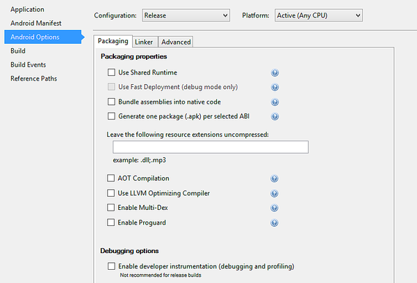](images/vs/04-packaging.png#lightbox)

# [Visual Studio for Mac](#tab/macos)

Packaging properties can be set in the **Project Options**, as shown in
the following screenshot:

[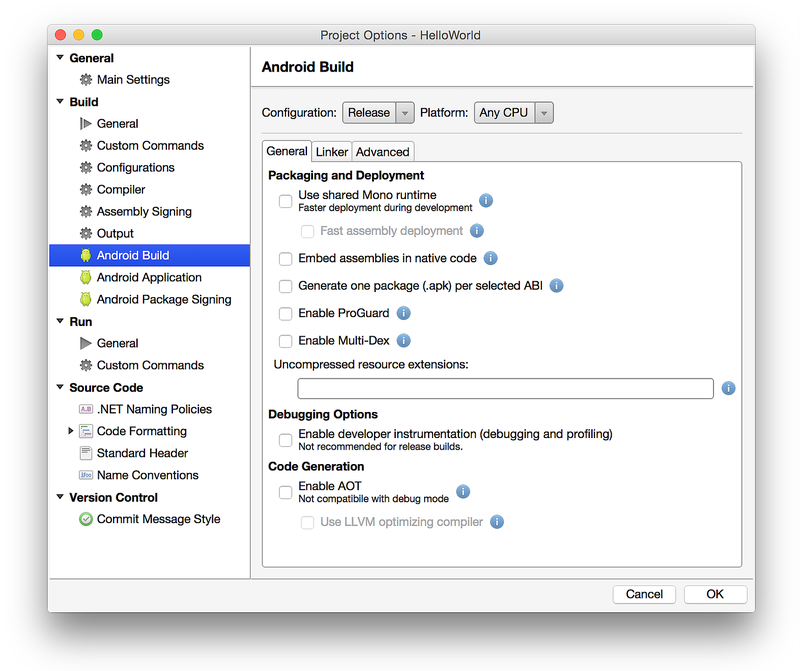](images/xs/04-packaging.png#lightbox)

-----

Many of these properties, such as **Use Shared Runtime**, and **Use
Fast Deployment** are intended for Debug mode. However, when the
application is configured for Release mode, there are other settings
that determine how the app is
[optimized for size and execution speed](#shrink_apk),
[how it is protected from tampering](#protect_app), and how it can be
packaged to support different architectures and size restrictions.

### Specify Supported Architectures

When preparing a Xamarin.Android app for release, it is necessary to
specify the CPU architectures that are supported. A single APK can
contain machine code to support multiple, different architectures. See
[CPU Architectures](~/android/app-fundamentals/cpu-architectures.md)
for details about supporting multiple CPU architectures.

### Generate One Package (.APK) per Selected ABI

When this option is enabled, one APK will be created for each of the
supported ABI's (selected on the **Advanced** tab, as described in
[CPU Architectures](~/android/app-fundamentals/cpu-architectures.md))
rather than a single, large APK for all supported ABI's. This option is
available only when the project is configured for Release mode, and it
is disabled by default.

### Multi-Dex

When the **Enable Multi-Dex** option is enabled, Android SDK tools are
used to bypass the 65K method limit of the **.dex** file format. The
65K method limitation is based on the number of Java methods that an
app _references_ (including those in any libraries that the app depends
on) &ndash; it is not based on the number of methods that are _written
in the source code_. If an application only defines a few methods but
uses many (or large libraries), it is possible that the 65K limit will
be exceeded.

It is possible that an app is not using every method in every library
that is referenced; therefore, it is possible that a tool such as
ProGuard (see above) can remove the unused methods from code. The best
practice is to enable **Enable Multi-Dex** only if absolutely
necessary, i.e.the app still references more than 65K Java methods even
after using ProGuard.

For more information about Multi-Dex, see
[Configure Apps with Over 64K Methods](https://developer.android.com/tools/building/multidex.html).

### Android App Bundles

App bundles differ from APKs as they cannot be deployed directly to a device. Rather, it's a format that is intended to be uploaded with all of your compiled code and resources. After you upload your signed app bundle, Google Play will have everything it needs to build and sign your application's APKs and serve them to your users using Dynamic Delivery.

To enable support for Android App Bundles, you'll need to opt-in to the `bundle` value of the **Android Package Format** property within your Android project options. Before you do this, ensure you change your project to a `Release` configuration as app bundles are intended for release packages only.

You can now generate an app bundle by following the [Archive Flow](#archive). This will generate an app bundle for your application.

For more information about Android App Bundles, see [Android App Bundles](https://developer.android.com/guide/app-bundle/).

<a name="Compile"></a>

## Compile

# [Visual Studio](#tab/windows)

After all of the above steps are completed, the app is ready for
compilation. Select **Build > Rebuild Solution** to verify that it
builds successfully in Release mode. Note that this step does not yet
produce an APK.

[Signing the App Package](~/android/deploy-test/signing/index.md) discusses packaging and signing in more detail.

# [Visual Studio for Mac](#tab/macos)

After all of the above steps are completed, compile the application
(select **Build > Build All**) to verify that it builds successfully
in Release mode. Note that this step does not yet produce an APK.

-----

<a name="archive"></a>

## Archive for Publishing

# [Visual Studio](#tab/windows)

To begin the publishing process, right-click the project in **Solution
Explorer** and select the **Archive...** context menu item:

[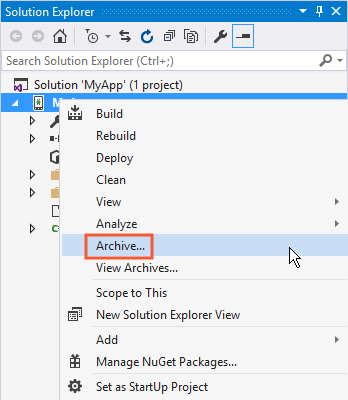](images/vs/07-archive-for-publishing.png#lightbox)

**Archive...** launches the **Archive Manager** and begins the process
of archiving the App bundle as shown in this screenshot:

[](images/vs/08-archive-manager.png#lightbox)

Another way to create an archive is to right-click the Solution in the
**Solution Explorer** and select **Archive All...**, which builds the
solution and archives all Xamarin projects that can generate an
archive:

[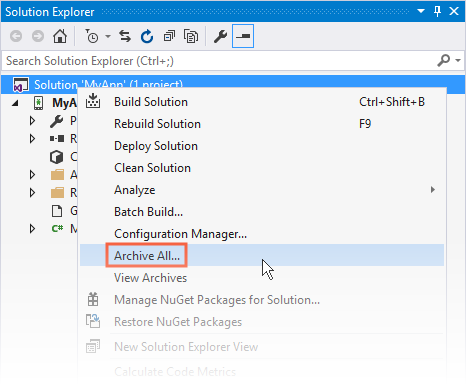](images/vs/09-archive-all.png#lightbox)

Both **Archive** and **Archive All** automatically launch the **Archive
Manager**. To launch the **Archive Manager** directly, click the
**Tools > Archive Manager...** menu item:

[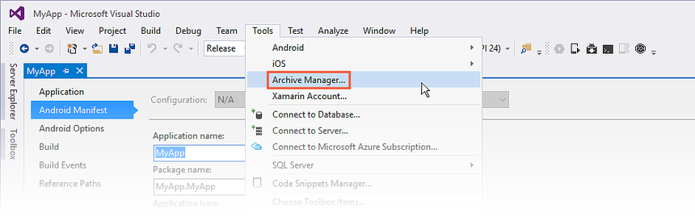](images/vs/10-launch-archive-manager.png#lightbox)

The solution's archives at any time by right clicking the **Solution**
node and selecting **View Archives**:

[](images/vs/11-view-archives.png#lightbox)

### The Archive Manager

The **Archive Manager** is comprised of a **Solution List** pane, an
**Archives List**, and a **Details Panel**:

[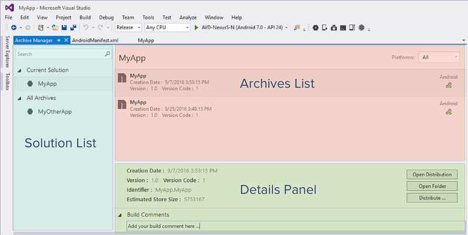](images/vs/12-archive-manager-detail.png#lightbox)

The **Solution List** displays all solutions having at least one
archived project. The **Solution List** includes the following
sections:

- **Current Solution** &ndash; Displays the current solution. Note that this area may be empty if the current solution does not have an existing archive.
- **All Archives** &ndash; Displays all solutions that have an archive.
- **Search** text box (at the top) &ndash; Filters the solutions listed in the **All Archives** list according to the search string entered in the text box.

The **Archives List** displays the list of all archives for the
selected solution. The **Archives List** includes the following
sections:

- **Selected solution name** &ndash; Displays the name of the solution selected in the **Solution List**. All information shown in the **Archives List** refers to this selected solution.
- **Platforms Filter** &ndash; This field makes it possible to filter archives by platform type (such as iOS or Android).
- **Archive Items** &ndash; List of archives for the selected solution. Each item in this list includes the project name, creation date, and platform. It can also show additional information such as the progress when an item is being archived or published.

The **Details Panel** displays additional information about each
archive. It also allows the user to start the Distribution workflow or
open the folder where the distribution has been created. The **Build
Comments** section makes it possible to include build comments in the
archive.

### Distribution

When an archived version of the application is ready to publish, select
the archive in the **Archive Manager** and click the **Distribute...**
button:

[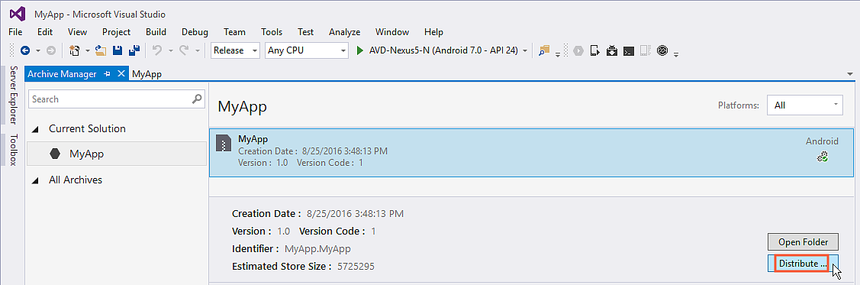](images/vs/13-distribute.png#lightbox)

The **Distribution Channel** dialog shows information about the app, an
indication of distribution workflow progress, and a choice of
distribution channels. On the first run, two choices are presented:

[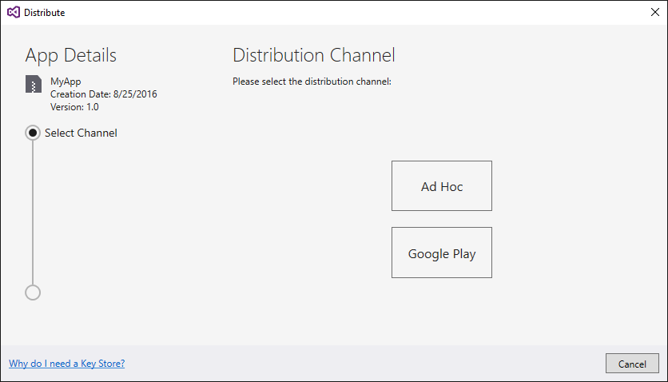](images/vs/14-distribution-channel.png#lightbox)

It is possible to choose one of the following distribution channels:

- **Ad-Hoc** &ndash; Saves a signed APK to disk that can be sideloaded to Android devices. Continue to [Signing the App Package](~/android/deploy-test/signing/index.md) to learn how to create an Android signing identity, create a new signing certificate for Android applications, and publish an _ad hoc_ version of the app to disk. This is a good way to create an APK for testing.

- **Google Play** &ndash; Publishes a signed APK to Google Play. Continue to [Publishing to Google Play](~/android/deploy-test/publishing/publishing-to-google-play/index.md) to learn how to sign and publish an APK in the Google Play store.

# [Visual Studio for Mac](#tab/macos)

To begin the publishing process, select **Build > Archive for Publishing**:

[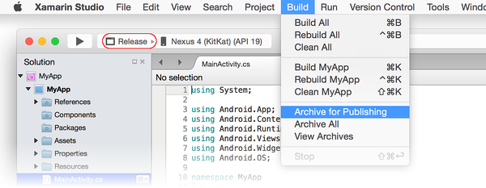](images/xs/07-archive-for-publishing.png#lightbox)

**Archive for Publishing** builds the project and bundles it into an
archive file. The **Archive All** menu choice archives all archivable
projects in the solution. Both options automatically open the **Archive
Manager** when the build and bundling operations complete:

[](images/xs/08-archives-view.png#lightbox)

In this example, the **Archive Manager** lists only one archived
application, **MyApp**. Notice that the comment field allows a short
comment to be saved with the archive. To publish an archived version of
a Xamarin.Android application, select the app in the **Archive
Manager** and click **Sign and Distribute...** as shown above. The
resulting **Sign and Distribute** dialog presents two choices:

[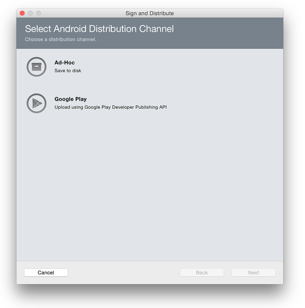](images/xs/09-sign-and-distribute.png#lightbox)

From here, it is possible to select the distribution channel:

- **Ad-Hoc** &ndash; Saves a signed APK to disk so it can be
    sideloaded to Android devices. Continue to
    [Signing the App
    Package](~/android/deploy-test/signing/index.md)
    to learn how to create an Android signing identity, create a new
    signing certificate for Android applications, and publish an
    &ldquo;ad hoc&rdquo; version of the app to disk. This is a good way
    to create an APK for testing.

- **Google Play** &ndash; Publishes a signed APK to Google Play.
    Continue to
    [Publishing to Google Play](~/android/deploy-test/publishing/publishing-to-google-play/index.md)
    to learn how to sign and publish an APK in the Google Play store.

-----

## Related Links

- [Multi-Core Devices and Xamarin.Android](~/android/deploy-test/multicore-devices.md)
- [CPU Architectures](~/android/app-fundamentals/cpu-architectures.md)
- [AOT](https://www.mono-project.com/docs/advanced/aot/)
- [Shrink Your Code and Resources](https://developer.android.com/tools/help/proguard.html)
- [Configure Apps with Over 64K Methods](https://developer.android.com/tools/building/multidex.html)
