# Hello, Android Multiscreen: Quickstart

_This two-part guide expands the Phoneword application to handle a second screen. Along the way, basic Android Application Building Blocks are introduced with a deeper dive into Android architecture._

In the walkthrough portion of this guide, you'll add a second screen to the
[Phoneword](/samples/xamarin/monodroid-samples/phoneword) application to keep track of
the history of numbers translated using the app. The
[final application](/samples/xamarin/monodroid-samples/phonewordmultiscreen) will have
a second screen that displays the numbers that were "translated", as illustrated by the
screenshot on the right:

[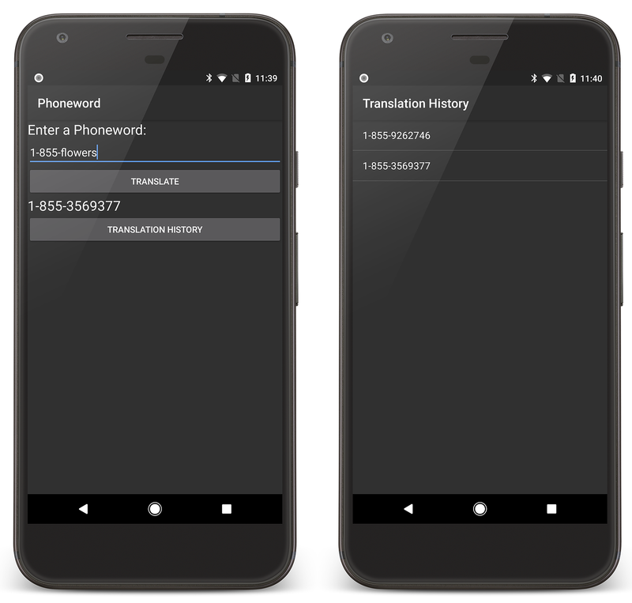](hello-android-multiscreen-quickstart-images/screenshot.png#lightbox)

The accompanying
[Deep Dive](~/android/get-started/hello-android-multiscreen/hello-android-multiscreen-deepdive.md)
reviews what was built and discusses architecture, navigation, and
other new Android concepts encountered along the way.

## Requirements

Because this guide picks up where [Hello, Android](~/android/get-started/hello-android/index.md)
leaves off, it requires completion of the
[Hello, Android Quickstart](~/android/get-started/hello-android/hello-android-quickstart.md).
If you would like to jump directly into the walkthrough below, you can download the completed version of
[Phoneword](/samples/xamarin/monodroid-samples/phoneword)
(from the Hello, Android Quickstart) and use it to start the walkthrough.

## Walkthrough

In this walkthrough you'll add a **Translation History** screen to the **Phoneword** application.

::: zone pivot="windows"

Start by opening the **Phoneword** application in Visual Studio and editing the **Main.axml**
file from the **Solution Explorer**.

> [!TIP]
> Newer releases of Visual Studio support opening .xml files inside the Android Designer.
>
> Both .axml and .xml files are supported in the Android Designer.

### Updating the layout

From the **Toolbox**, drag a **Button** onto the design surface and
place it below the **TranslatedPhoneWord** TextView. In the **Properties** pane, change the button **Id** to `@+id/TranslationHistoryButton`

[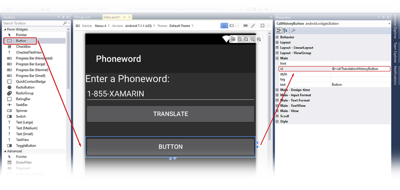](hello-android-multiscreen-quickstart-images/vs/02-new-button.png#lightbox)

Set the **Text** property of the button to
`@string/translationHistory`. The Android Designer will interpret this
literally, but you're going to make a few changes so that the
button's text shows up correctly:

[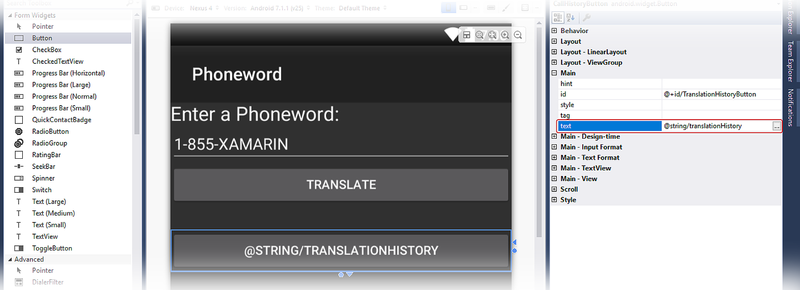](hello-android-multiscreen-quickstart-images/vs/03-translation-history-string.png#lightbox)

Expand the **values** node under the **Resources** folder in the
**Solution Explorer** and double-click the string resources file,
**Strings.xml**:

[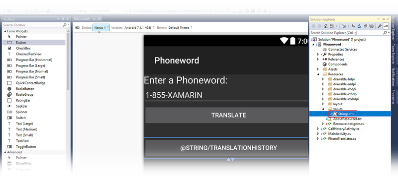](hello-android-multiscreen-quickstart-images/vs/04-strings-resources-file.png#lightbox)

Add the `translationHistory` string name and value to the **Strings.xml**
file and save it:

```xml
<?xml version="1.0" encoding="utf-8"?>
<resources>
    <string name="translationHistory">Translation History</string>
    <string name="ApplicationName">Phoneword</string>
</resources>
```

The **Translation History** button text should update to reflect the new
string value:

[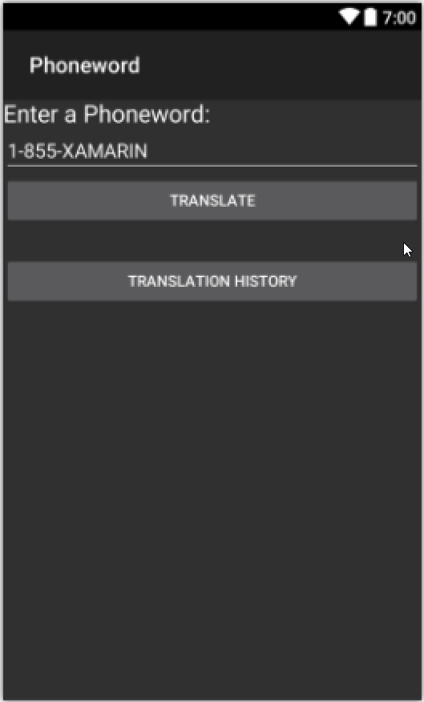](hello-android-multiscreen-quickstart-images/vs/05-new-string-value.png#lightbox)

With the **Translation History** button selected on the design surface,
find the `enabled` setting in the **Properties** pane and set its
value to `false` to disable the button. This will cause the button
to become darker on the design surface:

[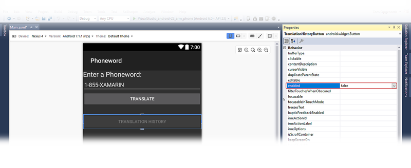](hello-android-multiscreen-quickstart-images/vs/06-enabled-false.png#lightbox)

### Creating the second activity

Create a second Activity to power the second screen. In the
**Solution Explorer**, right-click the **Phoneword** project and
choose **Add > New Item...**:

[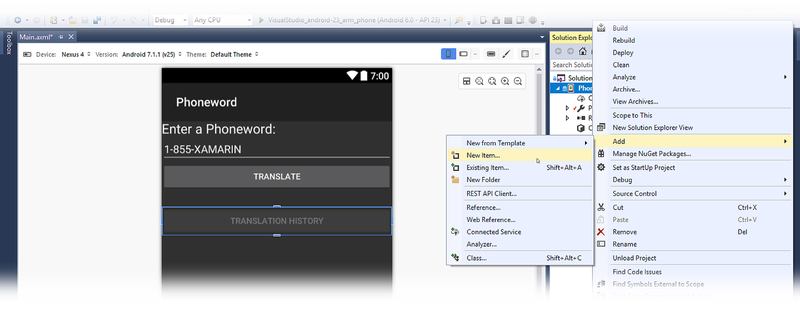](hello-android-multiscreen-quickstart-images/vs/07-add-new-file.png#lightbox)

In the **Add New Item** dialog, choose **Visual C# > Activity** and name the Activity file **TranslationHistoryActivity.cs**.

Replace the template code in **TranslationHistoryActivity.cs** with the
following:

```csharp
using System;
using System.Collections.Generic;
using Android.App;
using Android.OS;
using Android.Widget;
namespace Phoneword
{
    [Activity(Label = "@string/translationHistory")]
    public class TranslationHistoryActivity : ListActivity
    {
        protected override void OnCreate(Bundle bundle)
        {
            base.OnCreate(bundle);
            // Create your application here
            var phoneNumbers = Intent.Extras.GetStringArrayList("phone_numbers") ?? new string[0];
            this.ListAdapter = new ArrayAdapter<string>(this, Android.Resource.Layout.SimpleListItem1, phoneNumbers);
        }
    }
}
```

In this class, you're creating a `ListActivity` and populating it
programmatically, so you don't need to create a new layout file
for this Activity. This is discussed in more detail in the
[Hello, Android Multiscreen Deep Dive](~/android/get-started/hello-android-multiscreen/hello-android-multiscreen-deepdive.md).

### Adding a list

This app collects phone numbers (that the user has translated on the
first screen) and passes them to the second screen. The phone numbers
are stored as a list of strings. To support lists (and Intents, which
are used later), add the following `using` directives to the top of 
**MainActivity.cs**:

```csharp
using System.Collections.Generic;
using Android.Content;
```

Next, create an empty list that can be filled with phone numbers.
The `MainActivity` class will look like this:

```csharp
[Activity(Label = "Phoneword", MainLauncher = true)]
public class MainActivity : Activity
{
    static readonly List<string> phoneNumbers = new List<string>();
    ...// OnCreate, etc.
}
```

In the `MainActivity` class, add the following code to register the 
**Translation History** button (place this line after the `translateButton` declaration):

```csharp
Button translationHistoryButton = FindViewById<Button> (Resource.Id.TranslationHistoryButton);
```

Add the following code to the end of the `OnCreate` method to wire up 
the **Translation History** button:

```csharp
translationHistoryButton.Click += (sender, e) =>
{
    var intent = new Intent(this, typeof(TranslationHistoryActivity));
    intent.PutStringArrayListExtra("phone_numbers", phoneNumbers);
    StartActivity(intent);
};
```

Update the **Translate** button to add the phone number to the list of
`phoneNumbers`. The `Click` handler for the `translateButton`
should resemble the following code:

```csharp
// Add code to translate number
string translatedNumber = string.Empty;
translateButton.Click += (sender, e) =>
{
    // Translate user's alphanumeric phone number to numeric
    translatedNumber = Core.PhonewordTranslator.ToNumber(phoneNumberText.Text);
    if (string.IsNullOrWhiteSpace(translatedNumber))
    {
        translatedPhoneWord.Text = "";
    }
    else
    {
        translatedPhoneWord.Text = translatedNumber;
        phoneNumbers.Add(translatedNumber);
        translationHistoryButton.Enabled = true;
    }
};
```

Save and build the application to make sure there are no errors.

### Running the app

Deploy the application to an emulator or device. The following
screenshots illustrate the running **Phoneword** application:

[](hello-android-multiscreen-quickstart-images/screenshot.png#lightbox)

::: zone-end
::: zone pivot="macos"

Start by opening the **Phoneword** project  in Visual Studio for Mac and editing the **Main.axml** file from the **Solution Pad**.

> [!TIP]
> Newer releases of Visual Studio support opening .xml files inside the Android Designer.
>
> Both .axml and .xml files are supported in the Android Designer.

### Updating the layout

From the **Toolbox**, drag a **Button** onto the design surface and
place it below the **TranslatedPhoneWord** TextView. In the **Properties** pad, change the button **Id** to `@+id/TranslationHistoryButton`:

[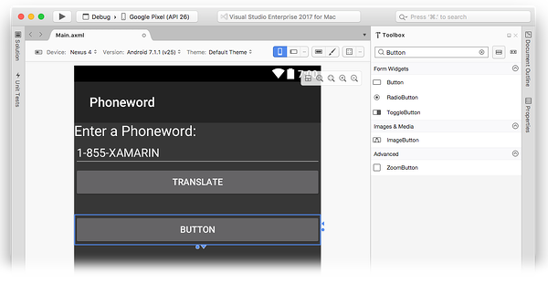](hello-android-multiscreen-quickstart-images/xs/02-new-button.png#lightbox)

Set the **Text** property of the button to
`@string/translationHistory`. The Android Designer will interpret this
literally, but you're going to make a few changes so that the
button's text shows up correctly:

[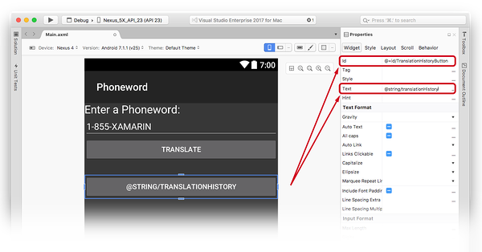](hello-android-multiscreen-quickstart-images/xs/03-call-history-string.png#lightbox)

Expand the **values** node under the **Resources** folder in the
**Solution Pad** and double-click the string resources file,
**Strings.xml**:

[](hello-android-multiscreen-quickstart-images/xs/04-strings-resources-file.png#lightbox)

Add the `translationHistory` string name and value to the **Strings.xml**
file and save it:

```xml
<?xml version="1.0" encoding="utf-8"?>
<resources>
    <string name="translationHistory">Translation History</string>
    <string name="ApplicationName">Phoneword</string>
</resources>
```

The **Translation History** button text should update to reflect the new
string value:

[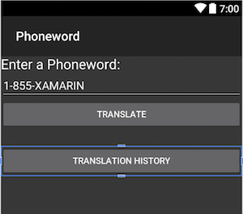](hello-android-multiscreen-quickstart-images/xs/05-new-string-value.png#lightbox)

With the **Translation History** button selected on the design surface,
open the **Behavior** tab in the **Properties Pad** and
double-click the **Enabled** checkbox to disable the button. This
will cause the button to become darker on the design surface:

[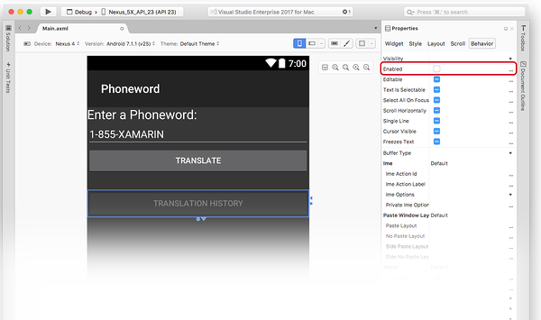](hello-android-multiscreen-quickstart-images/xs/06-enabled-false.png#lightbox)

### Creating the second activity

Create a second Activity to power the second screen. In the **Solution Pad**, click the gray gear icon next to the **Phoneword** project and choose **Add > New File...**:

From the **New File** dialog, choose **Android > Activity**, name the Activity `TranslationHistoryActivity`, then click **Add**.

Replace the template code in `TranslationHistoryActivity` with the
following:

```csharp
using System;
using System.Collections.Generic;
using Android.App;
using Android.OS;
using Android.Widget;
namespace Phoneword
{
    [Activity(Label = "@string/translationHistory")]
    public class TranslationHistoryActivity : ListActivity
    {
        protected override void OnCreate(Bundle bundle)
        {
            base.OnCreate(bundle);
            // Create your application here
            var phoneNumbers = Intent.Extras.GetStringArrayList("phone_numbers") ?? new string[0];
            this.ListAdapter = new ArrayAdapter<string>(this, Android.Resource.Layout.SimpleListItem1, phoneNumbers);
        }
    }
}
```

In this class, a `ListActivity` is created and populated
programmatically, so you don't have to create a new layout file for
this Activity. This is explained in more detail in the
[Hello, Android Multiscreen Deep Dive](~/android/get-started/hello-android-multiscreen/hello-android-multiscreen-deepdive.md).

### Adding a list

This app collects phone numbers (that the user has translated on the
first screen) and passes them to the second screen. The phone numbers
are stored as a list of strings. To support lists (and Intents, which
are used later), add the following `using` directives to the top of
**MainActivity.cs**:

```csharp
using System.Collections.Generic;
using Android.Content;
```

Next, create an empty list that can be filled with phone numbers. The `MainActivity`
class will look like this:

```csharp
[Activity(Label = "Phoneword", MainLauncher = true)]
public class MainActivity : Activity
{
    static readonly List<string> phoneNumbers = new List<string>();
    ...// OnCreate, etc.
}
```

In the `MainActivity` class, add the following code to register the 
**TranslationHistory History** button (place this line after the `TranslationHistoryButton` declaration):

```csharp
Button translationHistoryButton = FindViewById<Button> (Resource.Id.TranslationHistoryButton);
```

Add the following code to the end of the `OnCreate` method to wire up 
the **Translation History** button:

```csharp
translationHistoryButton.Click += (sender, e) =>
{
    var intent = new Intent(this, typeof(TranslationHistoryActivity));
    intent.PutStringArrayListExtra("phone_numbers", phoneNumbers);
    StartActivity(intent);
};
```

Update the **Translate** button to add the phone number to the list of
`phoneNumbers`. The `Click` handler for the `TranslateHistoryButton`
should resemble the following code:

```csharp
translateButton.Click += (sender, e) =>
{
    // Translate user's alphanumeric phone number to numeric
    translatedNumber = Core.PhonewordTranslator.ToNumber(phoneNumberText.Text);
    if (string.IsNullOrWhiteSpace(translatedNumber))
    {
        translatedPhoneWord.Text = "";
    }
    else
    {
        translatedPhoneWord.Text = translatedNumber;
        phoneNumbers.Add(translatedNumber);
        translationHistoryButton.Enabled = true;
    }
};
```

### Running the app

Deploy the application to an emulator or device. The following
screenshots illustrate the running **Phoneword** application:

[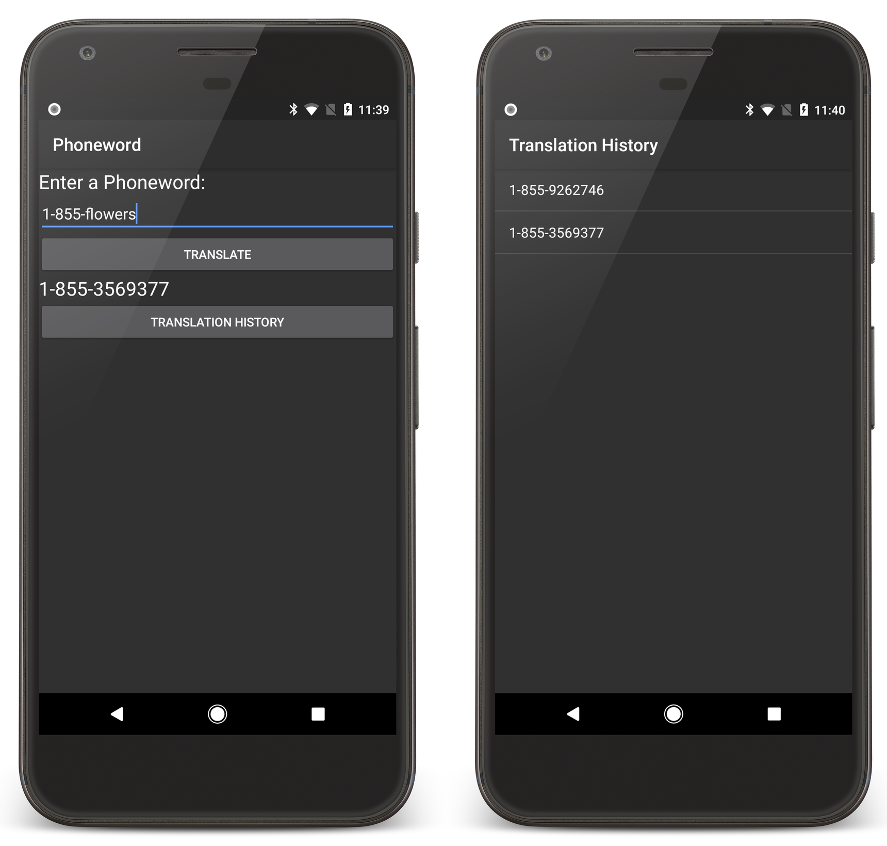](hello-android-multiscreen-quickstart-images/screenshot.png#lightbox)

::: zone-end

Congratulations on completing your first multi-screen Xamarin.Android
application! Now it's time to dissect the tools and skills you just
learned &ndash; next up is the
[Hello, Android Multiscreen Deep Dive](~/android/get-started/hello-android-multiscreen/hello-android-multiscreen-deepdive.md).

## Related links

- [Xamarin App Icons & Launch Screens (ZIP)](https://github.com/xamarin/monodroid-samples/blob/master/Phoneword/Resources/XamarinAndroidIcons.zip?raw=true)
- [Phoneword (sample)](/samples/xamarin/monodroid-samples/phoneword)
- [PhonewordMultiscreen (sample)](/samples/xamarin/monodroid-samples/phonewordmultiscreen)