# Hello, Android: Deep Dive

_In this two-part guide, you'll build your first Xamarin.Android application and develop an understanding of the fundamentals of Android application development with Xamarin. Along the way, you will be introduced to the tools, concepts, and steps required to build and deploy a Xamarin.Android application._

In the
[Hello, Android Quickstart](~/android/get-started/hello-android-multiscreen/hello-android-multiscreen-quickstart.md),
you built and ran your first Xamarin.Android application. Now it's time
to develop a deeper understanding of how Android applications work so
that you can build more sophisticated programs. This guide reviews the steps
that you took in the Hello, Android walkthrough so that you can
understand what you did and begin to develop a fundamental
understanding of Android application development.

This guide will touch upon the following topics:

::: zone pivot="windows"

- **Introduction to Visual Studio** &ndash; Introduction to Visual Studio
    and creating a new Xamarin.Android application.

- **Anatomy of a Xamarin.Android Application** - Tour of the
    essential parts of a Xamarin.Android application.

- **App Fundamentals and Architecture Basics** &ndash; Introduction to
    Activities, the Android Manifest, and the general flavor of Android
    development.

- **User Interface (UI)** &ndash; Creating user interfaces with the
    Android Designer.

- **Activities and the Activity Lifecycle** &ndash; An introduction to
    the Activity Lifecycle and wiring up the user interface in code.

- **Testing, Deployment, and Finishing Touches** &ndash; Complete your
    application with advice on testing, deployment, generating artwork,
    and more.

::: zone-end
::: zone pivot="macos"

- **Introduction to Visual Studio for Mac** &ndash; Introduction to Visual
    Studio for Mac and creating a new Xamarin.Android application.

- **Anatomy of a Xamarin.Android Application** &ndash; Tour of the
    essential parts of a Xamarin.Android application.

- **App Fundamentals and Architecture Basics** &ndash; Introduction
    to Activities, the Android Manifest, and the general flavor of
    Android development.

- **User Interface (UI)** &ndash; Creating user interfaces with the
    Android Designer.

- **Activities and the Activity Lifecycle** &ndash; An introduction
    to the Activity Lifecycle and wiring up the user interface in code.

- **Testing, Deployment, and Finishing Touches** &ndash; Complete
    your application with advice on testing, deployment, generating
    artwork, and more.

::: zone-end

This guide helps you develop the skills and knowledge required to build
a single-screen Android application. After you work through it, you
should understand the different parts of a Xamarin.Android application
and how they fit together.

::: zone pivot="windows"

## Introduction to Visual Studio

Visual Studio is a powerful IDE from Microsoft. It features a fully
integrated visual designer, a text editor that includes refactoring
tools, an assembly browser, source code integration, and more. In this
guide you'll learn to use some basic Visual Studio features with the
Xamarin plug-in.

Visual Studio organizes code into _Solutions_ and _Projects_. A
Solution is a container that can hold one or more Projects. A Project
can be an application (such as for iOS or Android), a supporting
library, a test application, and more. In the **Phoneword** app, you added
a new Android Project using the **Android Application** template to the
**Phoneword** Solution created in the
[Hello, Android](~/android/get-started/hello-android/hello-android-quickstart.md)
guide.

::: zone-end
::: zone pivot="macos"

## Introduction to Visual Studio for Mac

Visual Studio for Mac is a free, open-source IDE similar to Visual Studio. It
features a fully integrated visual designer, a text editor complete
with refactoring tools, an assembly browser, source code integration,
and more. In this guide, you'll learn to use some basic Visual Studio for Mac
features. If you're new to Visual Studio for Mac, you may want to check
out the more in-depth
[Introduction to Visual Studio for Mac](/visualstudio/mac/).

Visual Studio for Mac follows the Visual Studio practice of organizing code
into _Solutions_ and _Projects_. A Solution is a container that can
hold one or more Projects. A Project can be an application (such as
for iOS or Android), a supporting library, a test
application, and more. In the **Phoneword** app, you added a new Android
Project using the **Android Application** template to the **Phoneword**
Solution created in the
[Hello, Android](~/android/get-started/hello-android/hello-android-quickstart.md)
guide.

::: zone-end

<a name="anatomy"></a>

## Anatomy of a Xamarin.Android application

::: zone pivot="windows"

The following screenshot lists the Solution's contents. This is the
Solution Explorer, which contains the directory structure and all of
the files associated with the Solution:

[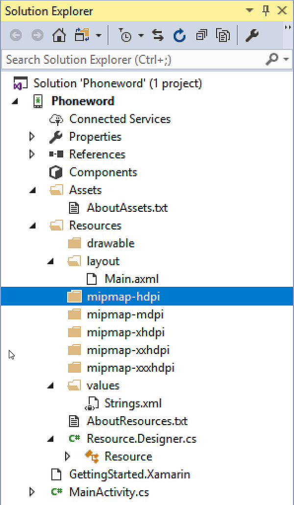](hello-android-deepdive-images/vs/02-solution-structure.png#lightbox)

::: zone-end
::: zone pivot="macos"

The following screenshot lists the Solution's contents. This is the
Solution Pad, which contains the directory structure and all of the
files associated with the Solution:

[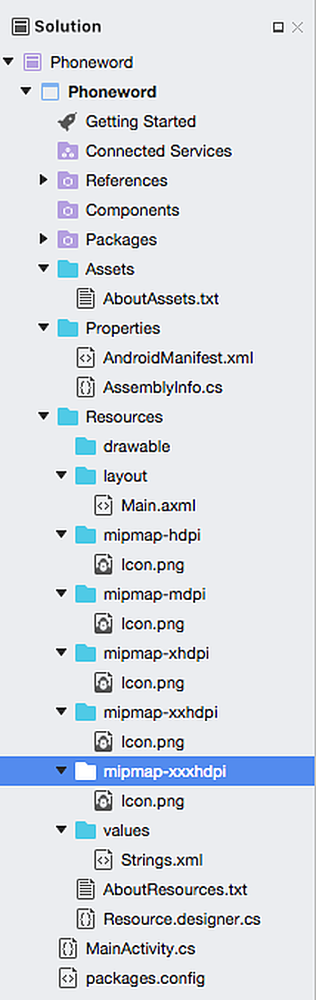](hello-android-deepdive-images/xs/02-solution-structure.png#lightbox)

::: zone-end

A Solution called **Phoneword** was created and the Android project
**Phoneword** was placed inside of it.

Look at the items inside the Project to see each folder and its purpose:

- **Properties** &ndash; Contains the
    [AndroidManifest.xml](~/android/platform/android-manifest.md)
    file that describes all of the requirements for the Xamarin.Android
    application, including name, version number, and permissions. The
    **Properties** folder also houses
    [AssemblyInfo.cs](xref:Microsoft.VisualBasic.ApplicationServices.AssemblyInfo),
    a .NET assembly metadata file. It is a good practice to fill this
    file with some basic information about your application.

- **References** &ndash; Contains the assemblies required to build
    and run the application. If you expand the References directory,
    you'll see references to .NET assemblies such as
    [System](xref:System),
    System.Core, and
    [System.Xml](xref:System.Xml),
    as well as a reference to Xamarin's Mono.Android assembly.

- **Assets** &ndash; Contains the files the application needs to run
    including fonts, local data files, and text files. Files included
    here are accessible through the generated `Assets` class. For more
    information on Android Assets, see the Xamarin
    [Using Android Assets](~/android/app-fundamentals/resources-in-android/android-assets.md)
    guide.

- **Resources** &ndash; Contains application resources such as
    strings, images, and layouts. You can access these resources in code
    through the generated `Resource` class. The
    [Android Resources](~/android/app-fundamentals/resources-in-android/index.md)
    guide provides more details about the **Resources** directory. The
    application template also includes a concise guide to Resources in
    the **AboutResources.txt** file.

### Resources

The **Resources** directory contains four folders named **drawable**,
**layout**, **mipmap** and **values**, as well as a file named **Resource.designer.cs**.

The items are summarized in the table below:

- **drawable** &ndash; The drawable directories house
    [drawable resources](https://developer.android.com/guide/topics/resources/drawable-resource.html)
    such as images and bitmaps.

- **mipmap** &ndash; The mipmap directory holds drawable files for different launcher icon densities. In the default template, the drawable directory houses the application icon file, **Icon.png**.

::: zone pivot="windows"

- **layout** &ndash; The layout directory contains _Android designer
    files_ (.axml) that define the user interface for each screen or
    Activity. The template creates a default layout called
    **activity_main.axml**.

::: zone-end
::: zone pivot="macos"

- **layout** &ndash; The layout directory contains _Android designer
    files_ (.axml) that define the user interface for each screen or
    Activity. The template creates a default layout called
    **Main.axml**.

::: zone-end

- **values** &ndash; This directory houses XML files that store
    simple values such as strings, integers, and colors. The template
    creates a file to store string values called **Strings.xml**.

- **Resource.designer.cs** &ndash; Also known as the `Resource`
    class, this file is a partial class that holds the unique IDs
    assigned to each resource. It is automatically created by the
    Xamarin.Android tools and is regenerated as necessary. This file
    should not be manually edited, as Xamarin.Android will overwrite
    any manual changes made to it.

## App fundamentals and architecture basics

Android applications do not have a single entry point; that is, there
is no single line of code in the application that the operating system
calls to start the application. Instead, an application starts when
Android instantiates one of its classes, during which time Android
loads the entire application's process into memory.

This unique feature of Android can be extremely useful when designing
complicated applications or interacting with the Android operating
system. However, these options also make Android complex when dealing
with a basic scenario like the **Phoneword** application. For this
reason, exploration of Android architecture is split in two. This guide
dissects an application that uses the most common entry point for an
Android app: the first screen. In
[Hello, Android Multiscreen](~/android/get-started/hello-android-multiscreen/index.md),
the full complexities of Android architecture are explored as
different ways to launch an application are discussed.

### Phoneword scenario - starting with an activity

When you open the **Phoneword** application for the first time in an
emulator or device, the operating system creates the first
*Activity*. An Activity is a special Android class that corresponds to
a single application screen, and it is responsible for drawing and
powering the user interface. When Android creates an application's
first Activity, it loads the entire application:

[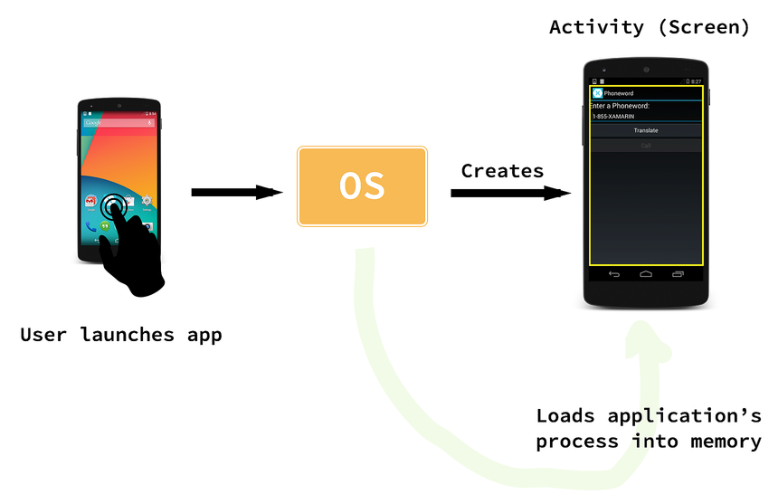](hello-android-deepdive-images/01-activity-load.png#lightbox)

Since there is no linear progression through an Android application
(you can launch the application from several points), Android has a
unique way of keeping track of what classes and files make up an
application. In the **Phoneword** example, all the parts that make up the
application are registered with a special XML file called the **Android
Manifest**. The role of the **Android Manifest** is to keep track of an
application's contents, properties, and permissions and to disclose them
to the Android operating system. You can think of the **Phoneword**
application as a single Activity (screen) and a collection of resource
and helper files tied together by the Android Manifest file, as
illustrated by the diagram below:

[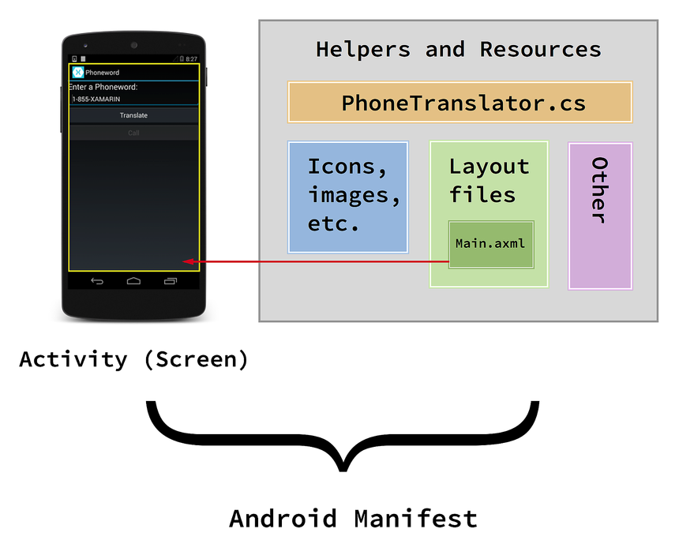](hello-android-deepdive-images/02-resources-helpers.png#lightbox)

The next few sections explore the relationships between the various
parts of the **Phoneword** application; this should provide you with a
better understanding of the diagram above. This exploration begins with
the user interface as it discusses the Android designer and layout
files.

## User Interface

> [!TIP]
> Newer releases of Visual Studio support opening .xml files inside the Android Designer.
>
> Both .axml and .xml files are supported in the Android Designer.

::: zone pivot="windows"

**activity_main.axml** is the user interface layout file for the first screen in
the application. The .axml indicates that this is an Android designer
file (AXML stands for *Android XML*). The name *Main* is arbitrary from
Android's point of view &ndash; the layout file could have been named
something else. When you open **activity_main.axml** in the IDE, it brings up the
visual editor for Android layout files called the *Android Designer*:

[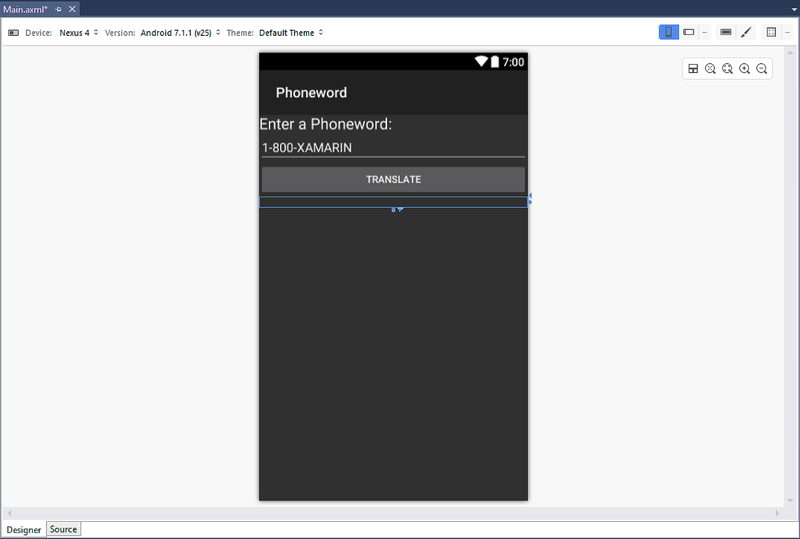](hello-android-deepdive-images/vs/03-android-designer.png#lightbox)

In the **Phoneword** app, the **TranslateButton**'s ID is set to
`@+id/TranslateButton`:

[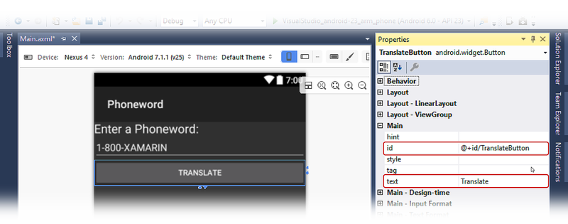](hello-android-deepdive-images/vs/04-translatebutton.png#lightbox)

::: zone-end
::: zone pivot="macos"

**Main.axml** is the user interface layout file for the first screen in
the application. The .axml indicates that this is an Android designer
file (AXML stands for *Android XML*). The name *Main* is arbitrary from
Android's point of view &ndash; the layout file could have been named
something else. When you open **Main.axml** in the IDE, it brings up the
visual editor for Android layout files called the *Android Designer*:

[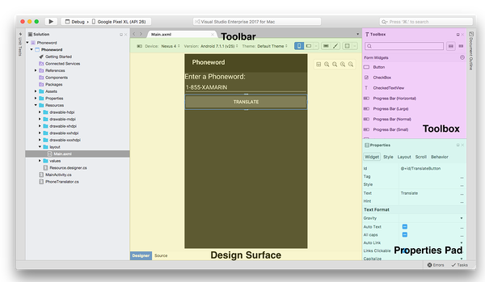](hello-android-deepdive-images/xs/03-android-designer.png#lightbox)

In the **Phoneword** app, the **TranslateButton**'s ID is set to
`@+id/TranslateButton`:

[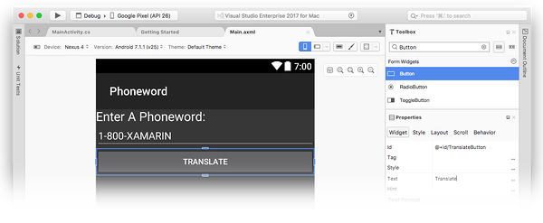](hello-android-deepdive-images/xs/04-translatebutton.png#lightbox)

::: zone-end

When you set the `id` property of the **TranslateButton**, the Android
Designer maps the **TranslateButton** control to the `Resource` class
and assigns it a *resource ID* of `TranslateButton`. This mapping of
visual control to class makes it possible to locate and use the
**TranslateButton** and other controls in app code. This will be
covered in more detail when you break apart the code that powers the
controls. All you need to know for now is that the code representation
of a control is linked to the visual representation of the control in
the designer via the `id` property.

### Source view

Everything defined on the design surface is translated into XML for
Xamarin.Android to use. The Android Designer provides a source view
that contains the XML that was generated from the visual designer. You
can view this XML by switching to the **Source** panel in the lower left
of the designer view, as illustrated by the screenshot below:

::: zone pivot="windows"

[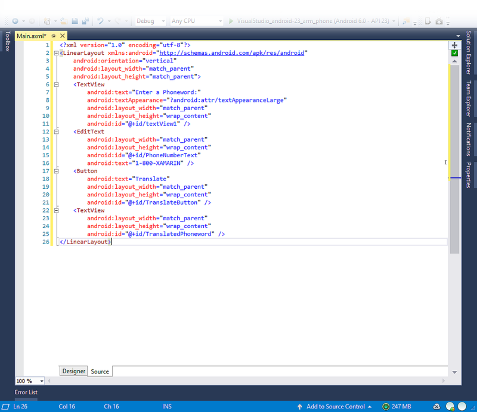](hello-android-deepdive-images/vs/05-source-view.png#lightbox)

::: zone-end
::: zone pivot="macos"

[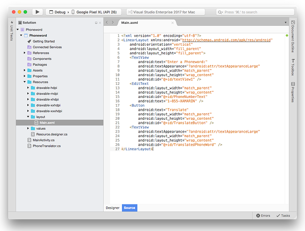](hello-android-deepdive-images/xs/05-source-view.png#lightbox)

::: zone-end

This XML source code should contain four control elements: Two **TextView**s, one **EditText** and one **Button** element. For a more in-depth tour of
the Android Designer, refer to the Xamarin Android
[Designer Overview](~/android/user-interface/android-designer/index.md)
guide.

The tools and concepts behind the visual part of the user interface
have now been covered. Next, it's time to jump into the code that
powers the user interface as Activities and the Activity Lifecycle are
explored.

## Activities and the Activity Lifecycle

The `Activity` class contains the code that powers the user interface.
The Activity is responsible for responding to user interaction and
creating a dynamic user experience.
This section introduces the `Activity` class, discusses the Activity
Lifecycle, and dissects the code that powers the user interface in the
**Phoneword** application.

### Activity class

The **Phoneword** application has only one screen (Activity). The class
that powers the screen is called `MainActivity` and lives in the
**MainActivity.cs** file. The name `MainActivity` has no special
significance in Android &ndash; although the convention is to name
the first Activity in an application `MainActivity`, Android does not
care if it is named something else.

When you open **MainActivity.cs**, you can see that the `MainActivity`
class is a *subclass* of the `Activity` class, and that the Activity is
adorned with the
[Activity](xref:Android.App.ActivityAttribute) attribute:

```csharp
[Activity (Label = "Phone Word", MainLauncher = true)]
public class MainActivity : Activity
{
  ...
}
```

The `Activity` Attribute registers the Activity with the Android
Manifest; this lets Android know that this class is part of the
**Phoneword** application managed by this manifest. The `Label`
property sets the text that will be displayed at the top of the screen.

The `MainLauncher` property tells Android to display this Activity when
the application starts up. This property becomes important as you add
more Activities (screens) to the application as explained in the
[Hello, Android Multiscreen](~/android/get-started/hello-android-multiscreen/index.md)
guide.

Now that the basics of `MainActivity` have been covered, it's time to
dive deeper into the Activity code by introducing the _Activity
Lifecycle_.

### Activity lifecycle

In Android, Activities go through different stages of a lifecycle
depending on their interactions with the user. Activities can be
created, started and paused, resumed and destroyed, and so on. The
`Activity` class contains methods that the system calls at certain points
in the screen's lifecycle. The following diagram illustrates a typical
life of an Activity as well as some of the corresponding lifecycle methods:

[](hello-android-deepdive-images/04-lifecycle.png#lightbox)

By overriding `Activity` lifecycle methods, you can control how the
Activity loads, how it reacts to the user, and even what happens after
it disappears from the device screen. For example, you can override the
lifecycle methods in the diagram above to perform some important tasks:

- **OnCreate** &ndash; Creates views, initializes variables, and
    performs other prep work that must be done before the user sees the
    Activity. This method is called only once when the Activity is
    loaded into memory.

- **OnResume** &ndash; Performs any tasks that must happen every
    time the Activity returns to the device screen.

- **OnPause** &ndash; Performs any tasks that must happen every time
    the Activity leaves the device screen.

When you add custom code to a lifecycle method in the `Activity`, you
*override* that lifecycle method's *base implementation*. You tap into
the existing lifecycle method (which has some code already attached to
it), and you extend that method with your own code. You call the base
implementation from inside your method to ensure that the original code
runs before your new code. An example of this is illustrated in the
next section.

The Activity Lifecycle is an important and complex part of Android. If
you'd like to learn more about Activities after you finish the _Getting
Started_ series, read the
[Activity Lifecycle](~/android/app-fundamentals/activity-lifecycle/index.md)
guide. In this guide, the next focus is the first stage of the Activity
Lifecycle, `OnCreate`.

### OnCreate

Android calls the `Activity`'s `OnCreate` method when it creates the
Activity (before the screen is presented to the user). You can override
the `OnCreate` lifecycle method to create views and prepare your
Activity to meet the user:

```csharp
protected override void OnCreate (Bundle bundle)
{
    base.OnCreate (bundle);

    // Set our view from the "main" layout resource
    SetContentView (Resource.Layout.Main);
    // Additional setup code will go here
}
```

::: zone pivot="windows"

In the **Phoneword** app, the first thing to do in `OnCreate` is load the
user interface created in the Android Designer. To load the UI, call
`SetContentView` and pass it the *resource layout name* for the layout
file: **activity_main.axml**. The layout is located at `Resource.Layout.activity_main`:

```csharp
SetContentView (Resource.Layout.activity_main);
```

When `MainActivity` starts up, it creates a view that is based on the
contents of the **activity_main.axml** file.

::: zone-end
::: zone pivot="macos"

In the **Phoneword** app, the first thing to do in `OnCreate` is load the
user interface created in the Android Designer. To load the UI, call
`SetContentView` and pass it the *resource layout name* for the layout
file: **Main.axml**. The layout is located at `Resource.Layout.Main`:

```csharp
SetContentView (Resource.Layout.Main);
```

When `MainActivity` starts up, it creates a view that is based on the
contents of the **Main.axml** file. Note that the layout file name is
matched to the Activity name &ndash; *Main*.axml is the layout for
*Main*Activity. This isn't required from Android's point of view, but
as you begin to add more screens to the application, you'll find that
this naming convention makes it easier to match the code file to the
layout file.

::: zone-end

After the layout file is prepared, you can start looking up controls.
To look up a control, call `FindViewById` and pass in the resource ID
of the control:

```csharp
EditText phoneNumberText = FindViewById<EditText>(Resource.Id.PhoneNumberText);
Button translateButton = FindViewById<Button>(Resource.Id.TranslateButton);
TextView translatedPhoneWord = FindViewById<TextView>(Resource.Id.TranslatedPhoneWord);
```

Now that you have references to the controls in the layout file, you can
start programming them to respond to user interaction.

### Responding to user interaction

In Android, the `Click` event listens for the user's touch. In this
app, the `Click` event is handled with a lambda, but a delegate or a
named event handler could be used instead. The final
**TranslateButton** code resembled the following:

```csharp
translateButton.Click += (sender, e) =>
{
    // Translate user's alphanumeric phone number to numeric
    translatedNumber = PhonewordTranslator.ToNumber(phoneNumberText.Text);
    if (string.IsNullOrWhiteSpace(translatedNumber))
    {
        translatedPhoneWord.Text = string.Empty;
    }
    else
    {
        translatedPhoneWord.Text = translatedNumber;
    }
};
```

## Testing, deployment, and finishing touches

Both Visual Studio for Mac and Visual Studio provide many options for testing
and deploying an application. This section covers debugging options,
demonstrates testing applications on a device, and introduces tools for
creating custom app icons for different screen densities.

### Debugging tools

Issues in application code can be difficult to diagnose. To help
diagnose complex code issues, you can
[Set a Breakpoint](https://github.com/xamarin/recipes/tree/master/Recipes/cross-platform/ide/debugging/set_a_breakpoint),
[Step Through Code](https://github.com/xamarin/recipes/tree/master/Recipes/cross-platform/ide/debugging/step_through_code), or
[Output Information to the Log Window](https://github.com/xamarin/recipes/tree/master/Recipes/cross-platform/ide/debugging/output_information_to_log_window).

### Deploy to a device

The emulator is a good start for deploying and testing an application,
but users will not consume the final app in an emulator. It's a good
practice to test applications on a real device early and often.

Before an Android device can be used for testing applications, it needs
to be configured for development. The
[Set Up Device for Development](~/android/get-started/installation/set-up-device-for-development.md)
guide provides thorough instructions on getting a device ready for
development.

::: zone pivot="windows"

After the device is configured, you can deploy to it by plugging it in,
selecting it from the **Select Device** dialog, and starting the
application:

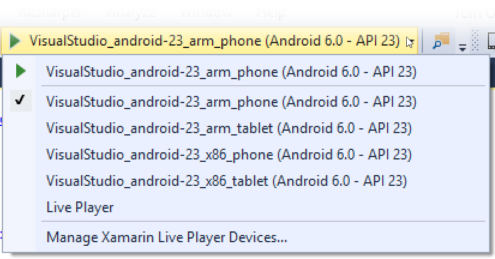

::: zone-end
::: zone pivot="macos"

After the device is configured, you can deploy to it by plugging it in,
pressing **Start (Play)**, selecting it from the **Select Device**
dialog, and pressing **OK**:

[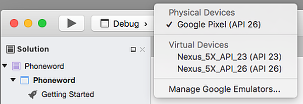](hello-android-deepdive-images/xs/06-select-device.png#lightbox)

::: zone-end

This launches the application on the device:

[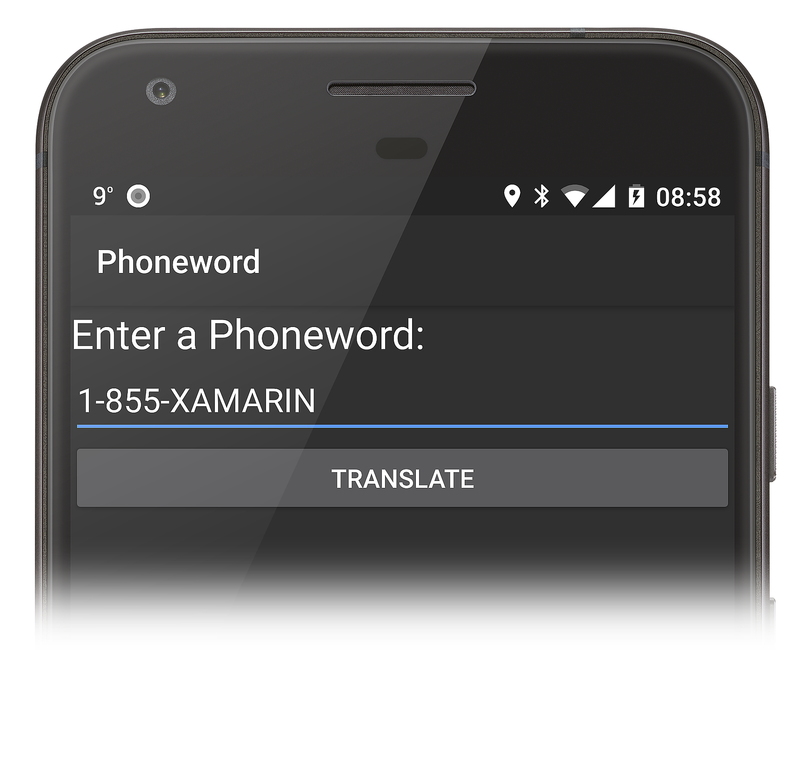](hello-android-deepdive-images/05-enter-phoneword.png#lightbox)

### Set icons for different screen densities

Android devices come in different screen sizes and resolutions, and not
all images look good on all screens. For example, here is a screenshot
of a low-density icon on a high-density Nexus 5. Notice how blurry it
is compared to the surrounding icons:

[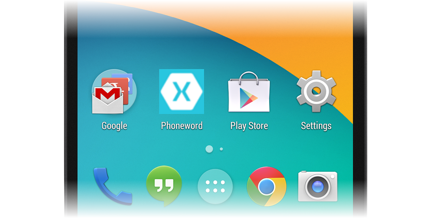](hello-android-deepdive-images/06-blurry-icon.png#lightbox)

To account for this, it is good practice to add icons of different
resolutions to the **Resources** folder. Android provides different
versions of the **mipmap** folder to handle launcher icons of different
densities, *mdpi* for medium, *hdpi* for high, and *xhdpi*, *xxhdpi*, *xxxhdpi* for very high density
screens. Icons of varying sizes are stored in the appropriate
**mipmap-** folders:

::: zone pivot="windows"

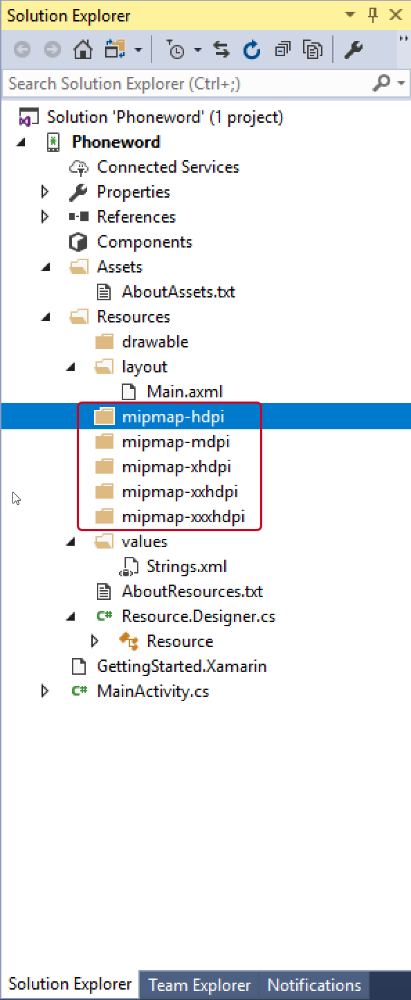

::: zone-end
::: zone pivot="windows"

[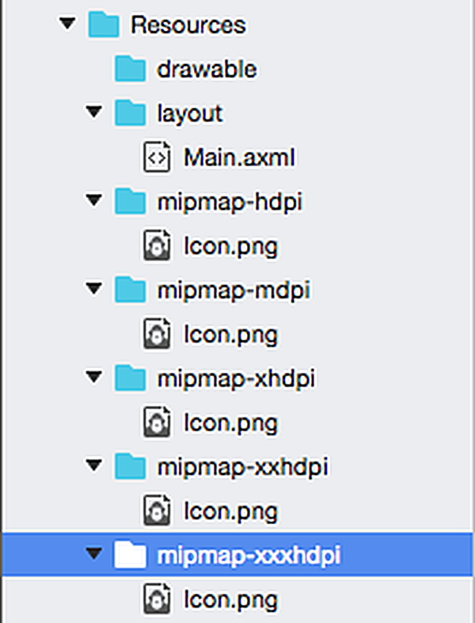](hello-android-deepdive-images/xs/07-mipmap-folders.png#lightbox)

::: zone-end

Android will pick the icon with the appropriate density:

[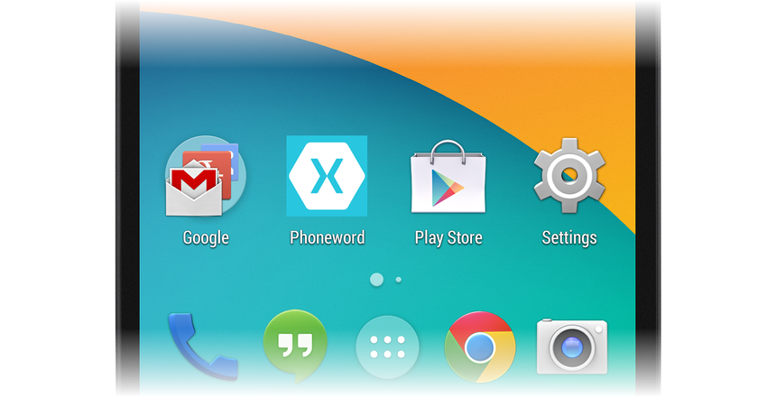](hello-android-deepdive-images/07-appropriate-density.png#lightbox)

### Generate custom icons

Not everyone has a designer available to create the custom icons and
launch images that an app needs to stand out. Here are several alternate
approaches to generating custom app artwork:

::: zone pivot="windows"

- [Android Asset Studio](https://romannurik.github.io/AndroidAssetStudio/index.html)
    &ndash; A web-based, in-browser generator for all types of Android
    icons, with links to other useful community tools. It works best in
    Google Chrome.

- Visual Studio &ndash; You can use this to create a simple icon set
    for your app directly in the IDE.

- [Fiverr](https://www.fiverr.com/) &ndash; Choose from a variety of
    designers to create an icon set for you, starting at $5. Can be hit
    or miss but a good resource if you need icons designed on the fly.

::: zone-end
::: zone pivot="macos"

- [Android Asset Studio](https://romannurik.github.io/AndroidAssetStudio/index.html)
    &ndash; A web-based, in-browser generator for all types of Android
    icons, with links to other useful community tools. It works best in
    Google Chrome.

- [Pixelmator](https://www.pixelmator.com/) &ndash; A versatile image
    editing app for Mac that costs about $30.

- [Fiverr](https://www.fiverr.com/) &ndash; Choose from a variety of
    designers to create an icon set for you, starting at $5. Can be hit
    or miss but a good resource if you need icons designed on the fly.

::: zone-end

For more information about icon sizes and requirements, refer to the
[Android Resources](~/android/app-fundamentals/resources-in-android/index.md)
guide.

::: zone pivot="macos"

### Adding Google Play Services packages

_Google Play Services_ is a set of add-on libraries that allows Android
developers to take advantage of the most recent features from Google
such as Google Maps, Google Cloud Messaging, and in-app billing.
Previously, bindings to all Google Play Services libraries were
provided by Xamarin in the form of a single package &ndash; beginning
with Visual Studio for Mac, a new project dialog is available for
selecting which Google Play Services packages to include in your app.

To add one or more Google Play Service libraries, right-click the
**Packages** node in your project tree and click **Add Google Play
Service...**:

[](hello-android-deepdive-images/xs/08-add-google-play-services.png#lightbox)

When the **Add Google Play Services** dialog is presented, select the
packages (nugets) that you want to add to your project:

[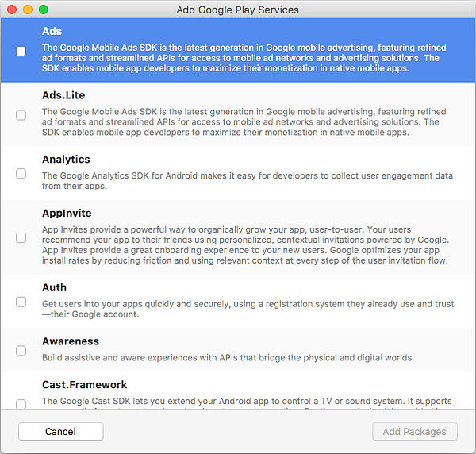](hello-android-deepdive-images/xs/09-add-dialog.png#lightbox)

When you select a service and click **Add Package**, Visual Studio for Mac downloads and installs
the package you select as well as any dependent Google Play Services
packages that it requires. In some cases, you may see a **License
Acceptance** dialog that requires you to click **Accept** before the
packages are installed:

[](hello-android-deepdive-images/xs/10-license-acceptance.png#lightbox)

::: zone-end

## Summary

Congratulations! You should now have a solid understanding of the
components of a Xamarin.Android application as well as the tools
required to create it.

In the next tutorial of the _Getting Started_ series, you will extend
your application to handle multiple screens as you explore more
advanced Android architecture and concepts.