# Hello, Android: Quickstart

_In this two-part guide, you will build your first Xamarin.Android application with Visual Studio and develop an understanding of the fundamentals of Android application development with Xamarin._

[ Download the sample](/samples/xamarin/monodroid-samples/phoneword)

You will create an application that translates an
alphanumeric phone number (entered by the user) into a numeric phone
number and display the numeric phone number to the user. The final application looks like
this:

[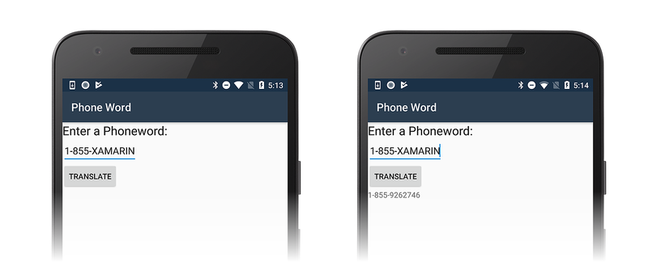](hello-android-quickstart-images/vs/15-running-app.png#lightbox)

::: zone pivot="windows"

## Windows requirements

To follow along with this walkthrough, you will need the following:

- Windows 10.

- Visual Studio 2019 or Visual Studio 2017 (version 15.8 or later): Community, Professional, or Enterprise.

::: zone-end
::: zone pivot="macos"

## macOS requirements

To follow along with this walkthrough, you will need the following:

- The latest version of Visual Studio for Mac.

- A Mac running macOS High Sierra (10.13) or later.

::: zone-end

This walkthrough assumes that the latest version of Xamarin.Android is
installed and running on your platform of choice. For a guide to
installing Xamarin.Android, refer to the
[Xamarin.Android Installation](~/android/get-started/installation/index.md) guides.

## Configuring emulators

If you are using the Android emulator, we recommend that you configure
the emulator to use hardware acceleration. Instructions for configuring
hardware acceleration are available in
[Hardware Acceleration for Emulator Performance](~/android/get-started/installation/android-emulator/hardware-acceleration.md).

## Create the project

::: zone pivot="windows"

Start Visual Studio. Click **File > New > Project** to create a new project.

In the **New Project** dialog, click the **Android App** template.
Name the new project `Phoneword` and click **OK**:

[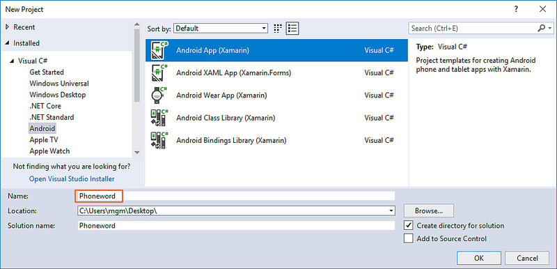](hello-android-quickstart-images/vs/01-new-project-name-w158.png#lightbox)

In the **New Android App** dialog, click **Blank App** and click **OK**
to create the new project:

[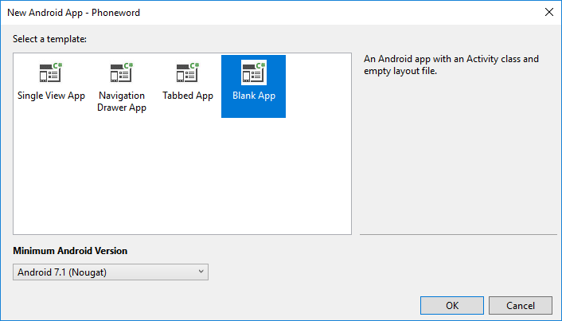](hello-android-quickstart-images/vs/02-blank-app-w158.png#lightbox)

## Create a layout

> [!TIP]
> Newer releases of Visual Studio support opening .xml files inside the Android Designer.
>
> Both .axml and .xml files are supported in the Android Designer.

After the new project is created, expand the **Resources**
folder and then the **layout** folder in the **Solution Explorer**.
Double-click **activity_main.axml** to open it in the Android Designer. This
is the layout file for the app's screen:

[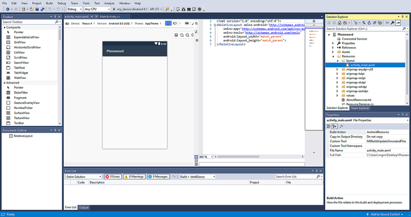](hello-android-quickstart-images/vs/03-open-layout-w158.png#lightbox)

> [!TIP]
> Newer releases of Visual Studio contain a slightly different app template.
>
> 1. Instead of **activity_main.axml**, the layout is in **content_main.axml**.
> 2. The default layout will be a `RelativeLayout`. For the rest of the steps on this page to work
>    you should change the `<RelativeLayout>` tag to `<LinearLayout>` and add another attribute
>    `android:orientation="vertical"` to the `LinearLayout` opening tag.

From the **Toolbox** (the area on the left), enter `text` into the search
field and drag a **Text (Large)** widget onto the design surface
(the area in the center):

[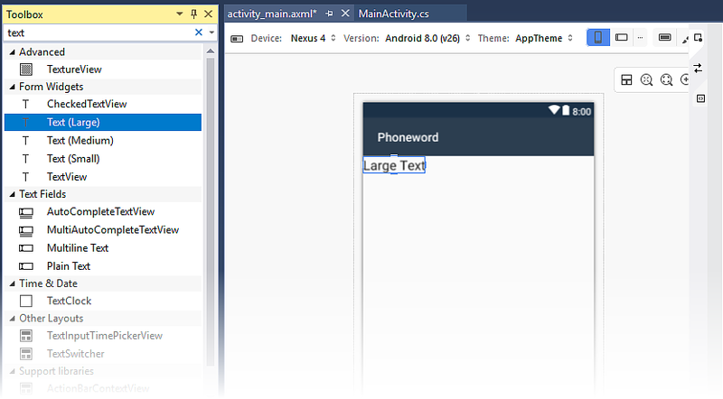](hello-android-quickstart-images/vs/04-large-text-w158.png#lightbox)

With the **Text (Large)** control selected on the design surface,
use the **Properties** pane to change the `Text` property of
the **Text (Large)** widget to `Enter a Phoneword:`:

[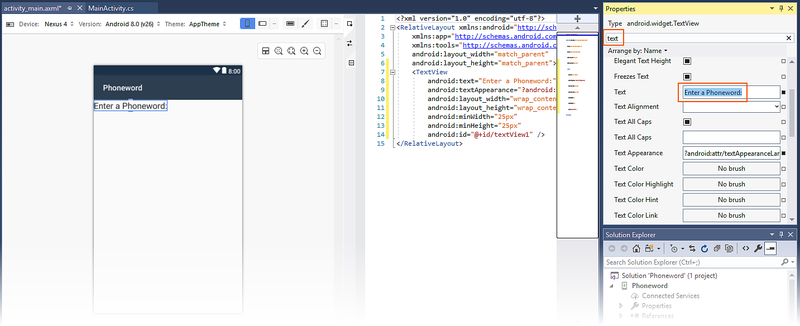](hello-android-quickstart-images/vs/05-enter-a-phoneword-w158.png#lightbox)

Drag a **Plain Text** widget from the **Toolbox** to the design surface
and place it underneath the **Text (Large)** widget. Placement of the
widget will not occur until you move the mouse pointer to a place in
the layout that can accept the widget. In the screenshots below, the
widget cannot be placed (as seen on the left) until the mouse pointer
is moved just below the previous `TextView` (as shown on the right):

[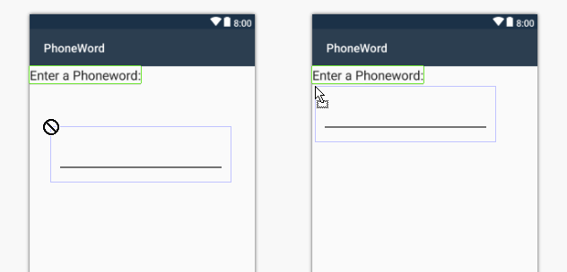](hello-android-quickstart-images/vs/06a-cant-drop-w158.png#lightbox)

When the **Plain Text** (an `EditText` widget) is placed correctly, it
will appear as illustrated in the following screenshot:

[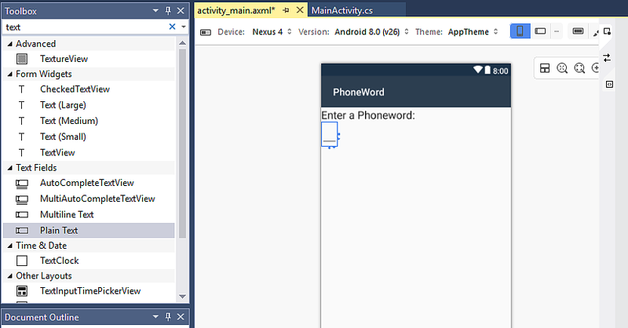](hello-android-quickstart-images/vs/06b-plain-text-w158.png#lightbox)

With the **Plain Text** widget selected on the design surface,
use the **Properties** pane to change the `Id` property of the
**Plain Text** widget to `@+id/PhoneNumberText` and change the
`Text` property to `1-855-XAMARIN`:

[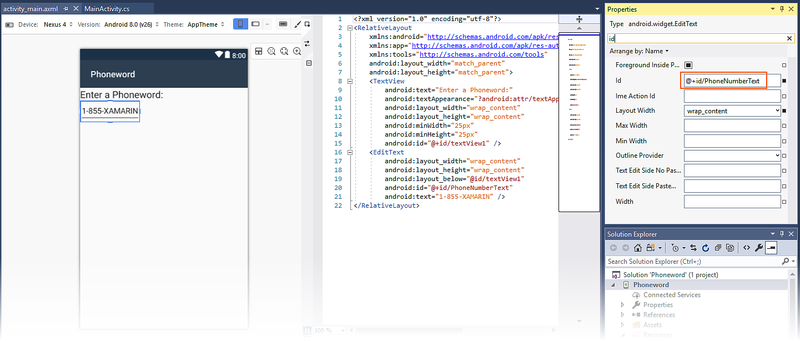](hello-android-quickstart-images/vs/07-add-properties-w158.png#lightbox)

Drag a **Button** from the **Toolbox** to the design
surface and place it underneath the **Plain Text** widget:

[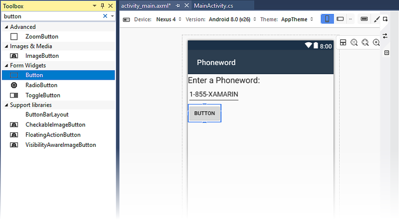](hello-android-quickstart-images/vs/08-drag-button-w158.png#lightbox)

With the **Button** selected on the design surface, use the
**Properties** pane to change its `Text` property to `Translate` and
its `Id` property to `@+id/TranslateButton`:

[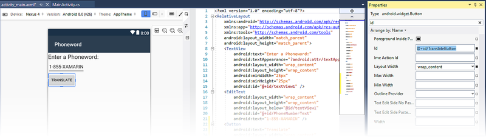](hello-android-quickstart-images/vs/09-translate-button-w158.png#lightbox)

Drag a **TextView** from the **Toolbox** to the design surface and
place it under the **Button** widget. Change the `Text` property of the
**TextView** to an empty string and set its `Id` property to
`@+id/TranslatedPhoneword`:

[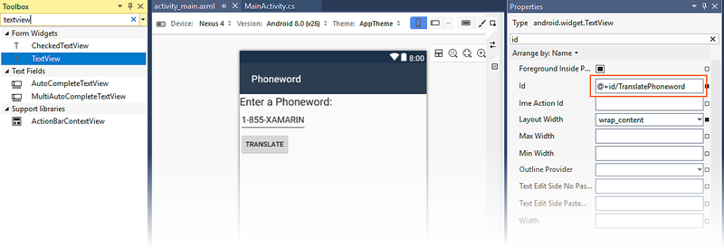](hello-android-quickstart-images/vs/10-textview-properties-w158.png#lightbox)

Save your work by pressing **CTRL+S**.

## Write some code

The next step is to add some code to translate phone numbers from
alphanumeric to numeric. Add a new file to the project by
right-clicking the **Phoneword** project in the **Solution
Explorer** pane and choosing **Add > New Item...** as shown below:

[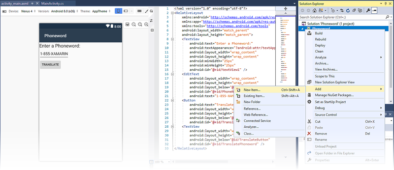](hello-android-quickstart-images/vs/12-add-new-item-w158.png#lightbox)

In the **Add New Item** dialog, select **Visual C# > Code > Code File**
and name the new code file **PhoneTranslator.cs**:

[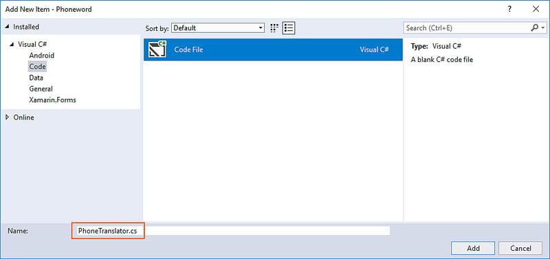](hello-android-quickstart-images/vs/14-add-class-w158.png#lightbox)

This creates a new empty C# class. Insert the following code into this file:

```csharp
using System.Text;
using System;
namespace Core
{
    public static class PhonewordTranslator
    {
        public static string ToNumber(string raw)
        {
            if (string.IsNullOrWhiteSpace(raw))
                return "";
            else
                raw = raw.ToUpperInvariant();

            var newNumber = new StringBuilder();
            foreach (var c in raw)
            {
                if (" -0123456789".Contains(c))
                {
                    newNumber.Append(c);
                }
                else
                {
                    var result = TranslateToNumber(c);
                    if (result != null)
                        newNumber.Append(result);
                }
                // otherwise we've skipped a non-numeric char
            }
            return newNumber.ToString();
        }
        static bool Contains (this string keyString, char c)
        {
            return keyString.IndexOf(c) >= 0;
        }
        static int? TranslateToNumber(char c)
        {
            if ("ABC".Contains(c))
                return 2;
            else if ("DEF".Contains(c))
                return 3;
            else if ("GHI".Contains(c))
                return 4;
            else if ("JKL".Contains(c))
                return 5;
            else if ("MNO".Contains(c))
                return 6;
            else if ("PQRS".Contains(c))
                return 7;
            else if ("TUV".Contains(c))
                return 8;
            else if ("WXYZ".Contains(c))
                return 9;
            return null;
        }
    }
}
```

Save the changes to the **PhoneTranslator.cs** file by clicking 
**File > Save** (or by pressing **CTRL+S**), then close the file.

## Wire up the user interface

The next step is to add code to wire up the user interface by inserting
backing code into the `MainActivity` class. Begin by wiring up the
**Translate** button. In the `MainActivity` class, find the `OnCreate`
method. The next step is to add the button code inside `OnCreate`,
below the `base.OnCreate(savedInstanceState)` and
`SetContentView(Resource.Layout.activity_main)` calls. First, modify the
template code so that the `OnCreate` method resembles the following:

```csharp
using Android.App;
using Android.OS;
using Android.Support.V7.App;
using Android.Runtime;
using Android.Widget;

namespace Phoneword
{
    [Activity(Label = "@string/app_name", Theme = "@style/AppTheme", MainLauncher = true)]
    public class MainActivity : AppCompatActivity
    {
        protected override void OnCreate(Bundle savedInstanceState)
        {
            base.OnCreate(savedInstanceState);

            // Set our view from the "main" layout resource
            SetContentView(Resource.Layout.activity_main);

            // New code will go here
        }
    }
}
```

Get a reference to the controls that were created in the layout
file via the Android Designer. Add the following code inside the
`OnCreate` method, after the call to `SetContentView`:

```csharp
// Get our UI controls from the loaded layout
EditText phoneNumberText = FindViewById<EditText>(Resource.Id.PhoneNumberText);
TextView translatedPhoneWord = FindViewById<TextView>(Resource.Id.TranslatedPhoneword);
Button translateButton = FindViewById<Button>(Resource.Id.TranslateButton);
```

Add code that responds to user presses of the **Translate** button.
Add the following code to the `OnCreate` method (after the lines
added in the previous step):

```csharp
// Add code to translate number
translateButton.Click += (sender, e) =>
{
    // Translate user's alphanumeric phone number to numeric
    string translatedNumber = Core.PhonewordTranslator.ToNumber(phoneNumberText.Text);
    if (string.IsNullOrWhiteSpace(translatedNumber))
    {
        translatedPhoneWord.Text = string.Empty;
    }
    else
    {
        translatedPhoneWord.Text = translatedNumber;
    }
};
```

Save your work by selecting **File > Save All** (or by
pressing **CTRL-SHIFT-S**) and build the application by selecting
**Build > Rebuild Solution** (or by pressing **CTRL-SHIFT-B**). 

If there are errors, go through the previous steps and correct any
mistakes until the application builds successfully. If you get a
build error such as, _Resource does not exist in the current
context_, verify that the namespace name in **MainActivity.cs**
matches the project name (`Phoneword`) and then completely rebuild
the solution. If you still get build errors, verify that you have
installed the latest Visual Studio updates.

## Set the app name

You should now have a working application &ndash; it's time to set the
name of the app. Expand the **values** folder (inside the **Resources**
folder) and open the file **strings.xml**. Change the app name string
to `Phone Word` as shown here:

```xml
<resources>
    <string name="app_name">Phone Word</string>
    <string name="action_settings">Settings</string>
</resources>
```

## Run the app

Test the application by running it on an Android device or emulator.
Tap the **TRANSLATE** button to translate **1-855-XAMARIN** into a
phone number:

[](hello-android-quickstart-images/vs/15-running-app.png#lightbox)

To run the app on an Android device, see how to [set up your device for development](~/android/get-started/installation/set-up-device-for-development.md).

::: zone-end
::: zone pivot="macos"

Launch Visual Studio for Mac from the **Applications** folder or from
**Spotlight**.

Click **New Project...** to create a new project.

In the **Choose a template for your new project** dialog, click
**Android > App** and select the **Android App** template. Click
**Next**.

[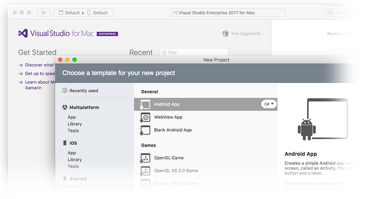](hello-android-quickstart-images/xs/03-choose-template.png#lightbox)

In the **Configure your Android app** dialog, name the new app `Phoneword` and click **Next**.

[](hello-android-quickstart-images/xs/04-configure-android-app.png#lightbox)

In the **Configure your new Android App** dialog, leave the Solution
and Project names set to `Phoneword` and click **Create** to create
the project.

## Create a layout

> [!TIP]
> Newer releases of Visual Studio support opening .xml files inside the Android Designer.
>
> Both .axml and .xml files are supported in the Android Designer.

After the new project is created, expand the **Resources** folder
and then the **layout** folder in the **Solution** pad.
Double-click **Main.axml** to open it in the Android Designer. This
is the layout file for the screen when it is viewed in the Android Designer:

[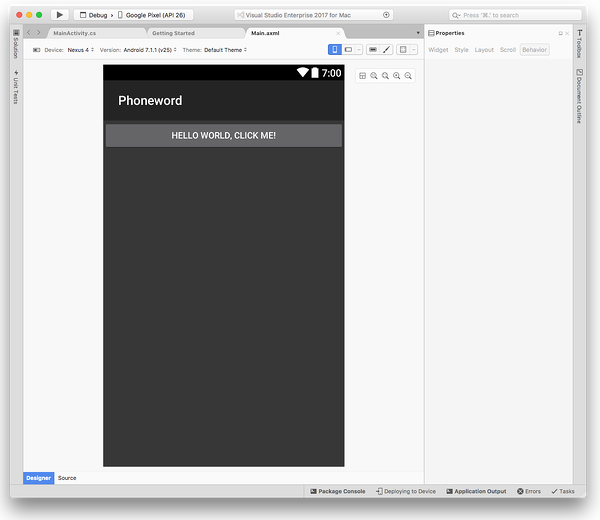](hello-android-quickstart-images/xs/05-open-layout.png#lightbox)

Select the **Hello World, Click Me!** **Button** on the design
surface and press the **Delete** key to remove it. 

From the **Toolbox** (the area on the right), enter `text` into the search field and drag a **Text (Large)** widget onto the design surface (the area in the center):

[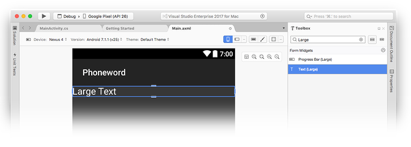](hello-android-quickstart-images/xs/06-large-text.png#lightbox)

With the **Text (Large)** widget selected on the design surface, you
can use the **Properties** pad to change the `Text` property of the
**Text (Large)** widget to `Enter a Phoneword:` as shown below:

[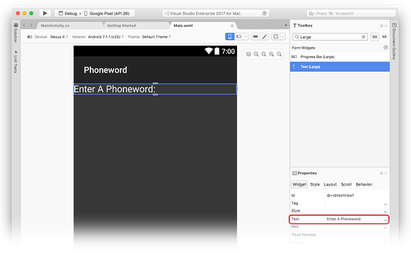](hello-android-quickstart-images/xs/07-enter-a-phoneword.png#lightbox)

Next, drag a **Plain Text** widget from the **Toolbox** to
the design surface and place it underneath the **Text (Large)**
widget. Notice that you can use the search field to help locate
widgets by name:

[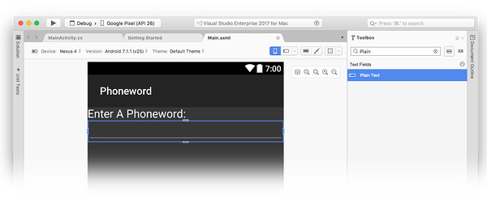](hello-android-quickstart-images/xs/08-plain-text.png#lightbox)

With the **Plain Text** widget selected on the design surface, you
can use the **Properties** pad to change the `Id` property of the
**Plain Text** widget to `@+id/PhoneNumberText` and change the
`Text` property to `1-855-XAMARIN`:

[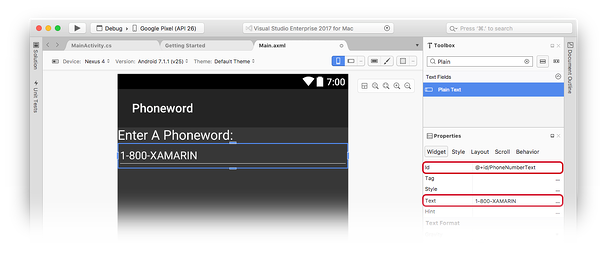](hello-android-quickstart-images/xs/09-add-properties.png#lightbox)

Drag a **Button** from the **Toolbox** to the design surface
and place it underneath the **Plain Text** widget:

[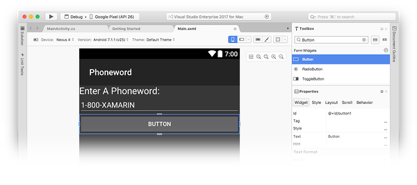](hello-android-quickstart-images/xs/10-drag-button.png#lightbox)

With the **Button** selected on the design surface, you can use the
**Properties** pad to change the `Id` property of the **Button** to
`@+id/TranslateButton` and change the `Text` property to `Translate`:

[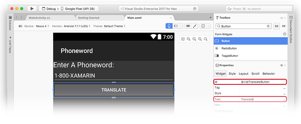](hello-android-quickstart-images/xs/11-translate-button.png#lightbox)

Drag a **TextView** from the **Toolbox** to the design surface and place it under the **Button** widget. With the **TextView** selected, set the `id` property of the **TextView** to `@+id/TranslatedPhoneWord` and change the `text` to an empty string:

[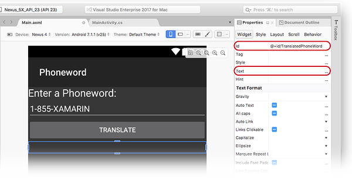](hello-android-quickstart-images/xs/12-textview-properties.png#lightbox)    

Save your work by pressing **&#8984; + S**.

## Write some code

Now, add some code to translate phone numbers from
alphanumeric to numeric. Add a new file to the project by
clicking the gear icon next to the **Phoneword** project in the
**Solution** pad and choosing **Add > New File...**:

[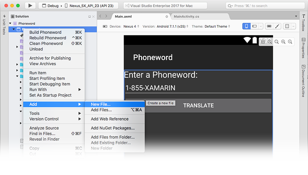](hello-android-quickstart-images/xs/14-add-new-file.png#lightbox)

In the **New File** dialog, select **General > Empty Class**, name the new file **PhoneTranslator**, and click **New**. This creates a new empty C# class for us.

Remove all of the template code in the new class and replace it with the following code:

```csharp
using System.Text;
using System;
namespace Core
{
    public static class PhonewordTranslator
    {
        public static string ToNumber(string raw)
        {
            if (string.IsNullOrWhiteSpace(raw))
                return "";
            else
                raw = raw.ToUpperInvariant();

            var newNumber = new StringBuilder();
            foreach (var c in raw)
            {
                if (" -0123456789".Contains(c))
                {
                    newNumber.Append(c);
                }
                else
                {
                    var result = TranslateToNumber(c);
                    if (result != null)
                        newNumber.Append(result);
                }
                // otherwise we've skipped a non-numeric char
            }
            return newNumber.ToString();
        }
        static bool Contains (this string keyString, char c)
        {
            return keyString.IndexOf(c) >= 0;
        }
        static int? TranslateToNumber(char c)
        {
            if ("ABC".Contains(c))
                return 2;
            else if ("DEF".Contains(c))
                return 3;
            else if ("GHI".Contains(c))
                return 4;
            else if ("JKL".Contains(c))
                return 5;
            else if ("MNO".Contains(c))
                return 6;
            else if ("PQRS".Contains(c))
                return 7;
            else if ("TUV".Contains(c))
                return 8;
            else if ("WXYZ".Contains(c))
                return 9;
            return null;
        }
    }
}
```

Save the changes to the **PhoneTranslator.cs** file by
choosing **File > Save** (or by pressing **&#8984; + S**), then
close the file. Ensure that there are no compile-time errors by
rebuilding the solution.

## Wire up the user interface

The next step is to add code to wire up the user interface by
adding the backing code into the `MainActivity` class.
Double-click **MainActivity.cs** in the **Solution Pad** to open it.

Begin by adding an event handler to the **Translate** button. In the
`MainActivity` class, find the `OnCreate` method. Add the button code
inside `OnCreate`, below the `base.OnCreate(bundle)` and
`SetContentView (Resource.Layout.Main)` calls. Remove any existing
button handling code (i.e., code that references `Resource.Id.myButton`
and creates a click handler for it) so that the `OnCreate` method
resembles the following:

```csharp
using System;
using Android.App;
using Android.Content;
using Android.Runtime;
using Android.Views;
using Android.Widget;
using Android.OS;

namespace Phoneword
{
    [Activity (Label = "Phone Word", MainLauncher = true)]
    public class MainActivity : Activity
    {
        protected override void OnCreate (Bundle bundle)
        {
            base.OnCreate (bundle);

            // Set our view from the "main" layout resource
            SetContentView (Resource.Layout.Main);

            // Our code will go here
        }
    }
}
```

Next, a reference is needed to the controls that were created in
the layout file with the Android Designer. Add the following
code inside the `OnCreate` method (after the call to
`SetContentView`):

```csharp
// Get our UI controls from the loaded layout
EditText phoneNumberText = FindViewById<EditText>(Resource.Id.PhoneNumberText);
TextView translatedPhoneWord = FindViewById<TextView>(Resource.Id.TranslatedPhoneWord);
Button translateButton = FindViewById<Button>(Resource.Id.TranslateButton);
```

Add code that responds to user presses of the **Translate** button
by adding the following code to the `OnCreate` method (after the
lines added in the last step):

```csharp
// Add code to translate number
string translatedNumber = string.Empty;

translateButton.Click += (sender, e) =>
{
    // Translate user's alphanumeric phone number to numeric
    translatedNumber = PhonewordTranslator.ToNumber(phoneNumberText.Text);
    if (string.IsNullOrWhiteSpace(translatedNumber))
    {
        translatedPhoneWord.Text = string.Empty;
    }
    else
    {
        translatedPhoneWord.Text = translatedNumber;
    }
};
```

Save your work and build the application by selecting **Build > Build All**
(or by pressing **&#8984; + B**). If the application
compiles, you will get a success message at the top of Visual Studio for Mac:

If there are errors, go through the previous steps and
correct any mistakes until the application builds successfully. If
you get a build error such as, _Resource does not exist in the
current context_, verify that the namespace name in
**MainActivity.cs** matches the project name (`Phoneword`) and then
completely rebuild the solution. If you still get build errors,
verify that you have installed the latest Xamarin.Android and
Visual Studio for Mac updates.

## Set the label and app icon

Now that you have a working application, it's time to add the
finishing touches! Start by editing the `Label` for `MainActivity`.
The `Label` is what Android displays at the top of the screen to
let users know where they are in the application. At the top of the
`MainActivity` class, change the `Label` to `Phone Word` as shown
here:

```csharp
namespace Phoneword
{
    [Activity (Label = "Phone Word", MainLauncher = true)]
    public class MainActivity : Activity
    {
        ...
    }
}
```

Now it's time to set the application icon. By default, Visual Studio for Mac will provide a default icon for the project. Delete these files from the solution, and replace them with a different icon. Expand the **Resources** folder in the **Solution Pad**. Notice that there are five folders that are prefixed with **mipmap-**, and that each of these folders contains a single **Icon.png** file:

[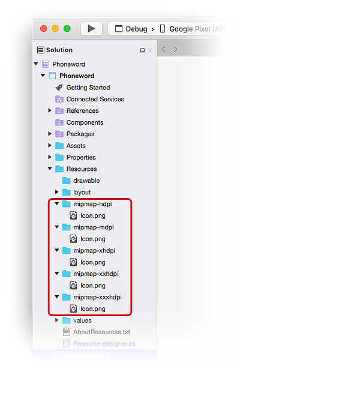](hello-android-quickstart-images/xs/23-mipmap-folders.png#lightbox)

It is necessary to delete each of these icon files from the project. Right click on each of **Icon.png** files, and select **Remove** from the context menu:

[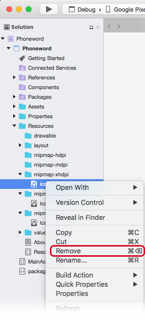](hello-android-quickstart-images/xs/23-delete-icon.png#lightbox)

Click on the **Delete** button in the dialog.

Next, download and unzip [Xamarin App Icons set](https://github.com/xamarin/monodroid-samples/blob/master/Phoneword/Resources/XamarinAndroidIcons.zip?raw=true). This zip file holds the icons for the application. Each icon is visually identical but at different resolutions it renders correctly on different devices with different screen densities.  The set of files must be copied into the Xamarin.Android project. In Visual Studio for Mac, in the **Solution Pad**, right-click the **mipmap-hdpi** folder and select **Add > Add Files**:

[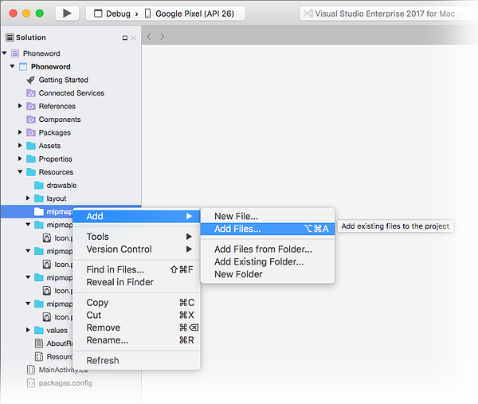](hello-android-quickstart-images/xs/24-add-files.png#lightbox)

From the selection dialog, navigate to the unzipped Xamarin AdApp Icons directory and open the **mipmap-hdpi** folder. Select **Icon.png** and click **Open**.

In the **Add File to Folder** dialog box, select **Copy the file into the directory** and click **OK**:

[](hello-android-quickstart-images/xs/26-copy-to-directory.png#lightbox)

Repeat these steps for each of the **mipmap-** folders until the contents of the **mipmap-** Xamarin App Icons folders are copied to their counterpart **mipmap-** folders in the **Phoneword** project.

After all the icons are copied to the Xamarin.Android project, open the **Project Options** dialog by right clicking on the project in the **Solution Pad**. Select **Build > Android Application** and select `@mipmap/icon` from the **Application icon** combo box:

[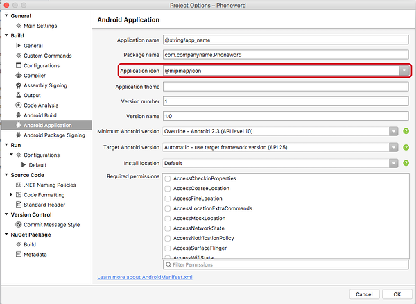](hello-android-quickstart-images/xs/28-set-project-icon.png#lightbox)

## Run the app

Finally, test the application by running it on an Android device or emulator and translating a Phoneword:

[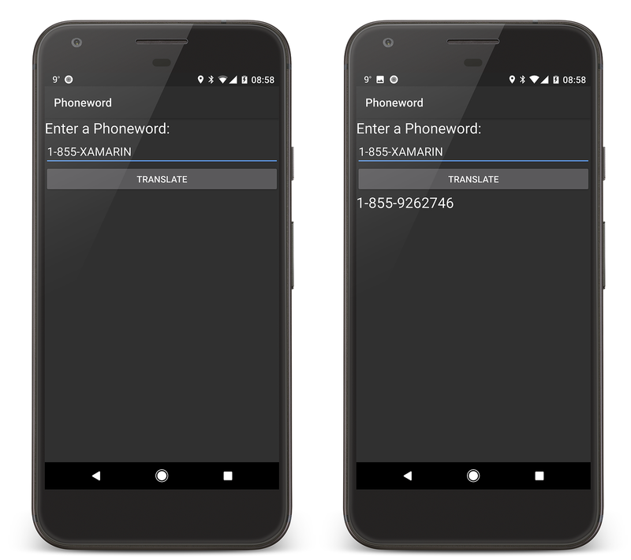](hello-android-quickstart-images/intro-app-examples.png#lightbox)

To run the app on an Android device, see how to [set up your device for development](~/android/get-started/installation/set-up-device-for-development.md).

::: zone-end

Congratulations on completing your first Xamarin.Android application!
Now it's time to dissect the tools and skills you have just learned. Next up is the
[Hello, Android Deep Dive](~/android/get-started/hello-android/hello-android-deepdive.md).

## Related links

- [Xamarin Android App Icons (ZIP)](https://github.com/xamarin/monodroid-samples/blob/master/Phoneword/Resources/XamarinAndroidIcons.zip?raw=true)
- [Phoneword (sample)](/samples/xamarin/monodroid-samples/phoneword)