# Managing Virtual Devices with the Android Device Manager

_This article explains how to use the Android Device Manager to create
and configure Android Virtual Devices (AVDs) that emulate physical Android
devices. You can use these virtual devices to run and test your app
without having to rely on a physical device._

## Overview

After you have verified that hardware acceleration is enabled (as
described in
[Hardware Acceleration for Emulator Performance](~/android/get-started/installation/android-emulator/hardware-acceleration.md)),
the next step is to use the _Android Device Manager_ (also referred to
as the _Xamarin Android Device Manager_) to create virtual devices that
you can use to test and debug your app.

# [Visual Studio](#tab/vswin)

This article explains how to use the Android Device Manager to create,
duplicate, customize, and launch Android virtual devices.

[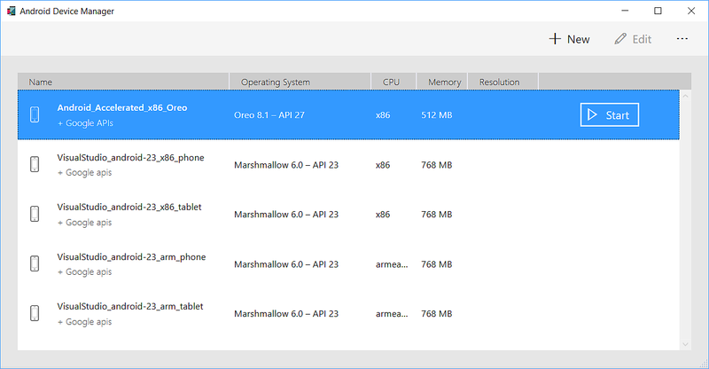](device-manager-images/win/01-devices-dialog.png#lightbox)

You use the Android Device Manager to create and configure _Android
Virtual Devices_ (AVDs) that run in the
[Google Android Emulator](~/android/deploy-test/debugging/android-sdk-emulator/index.md).
Each AVD is an emulator configuration that simulates a physical Android
device. This makes it possible to run and test your app in a variety of
configurations that simulate different physical Android devices.

## Requirements

To use the Android Device Manager, you will need the following:

-   Visual Studio 2017 version 15.7 or later is required. Visual Studio
    Community, Professional, and Enterprise editions are supported.

-   Visual Studio Tools for Xamarin version 4.9 or later.

-   The Android SDK must be installed (see
    [Setting up the Android SDK for Xamarin.Android](~/android/get-started/installation/android-sdk.md)),
    and SDK tools version 26.1.1 or later must be installed as explained in the
    next section. Be sure to install the Android SDK at the following location (if it
    is not already installed): **C:\\Program Files (x86)\\Android\\android-sdk**.

## Launching the Device Manager

Launch the Android Device Manager from the **Tools** menu by
clicking **Tools > Android > Android Device Manager**:

[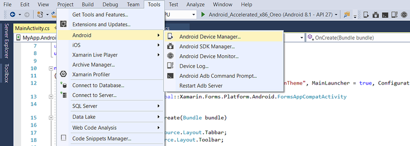](device-manager-images/win/04-tools-menu.png#lightbox)

If you see the following error dialog on launch, see 
[Troubleshooting Emulator Setup Problems](~/android/get-started/installation/android-emulator/troubleshooting.md) for workaround
instructions:

Before you can use the Android Device Manager, you must install Android
SDK tools version 26.1.1 or later. If Android SDK tools 26.1.1 or later
is not installed, you may see this error dialog on launch:

If you see this error dialog, click **Open SDK Manager** to open the
Android SDK Manager. In the Android SDK Manager, click the **Tools**
tab and install the following:

-   **Android SDK Tools 26.1.1** or later 
-   **Android SDK Platform-Tools 27.0.1** or later  
-   **Android SDK Build-Tools 27.0.3** or later

These packages should be shown with **Installed** status as seen in the
following screenshot:

After these packages are installed, you can close the SDK Manager
and re-launch the Android Device Manager.

## Main Screen

When you first launch the Android Device Manager, it presents a screen
that displays all currently-configured virtual devices. For each
device, the **Name**, **Operating System** (Android API Level),
**CPU**, **Memory** size, and screen resolution are displayed:

[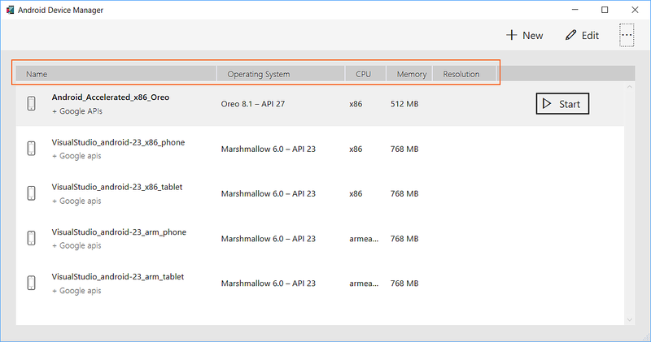](device-manager-images/win/05-installed-list.png#lightbox)

When you click a device in the list, the **Start** button appears on
the right. You can click the **Start** button to launch the emulator
with this virtual device:

[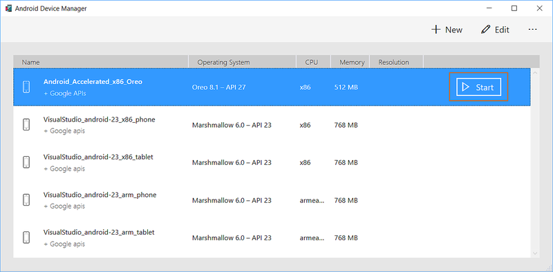](device-manager-images/win/06-start-button.png#lightbox)

After the emulator starts with the selected virtual device, the
**Start** button changes to a **Stop** button that you can use to halt
the emulator:

[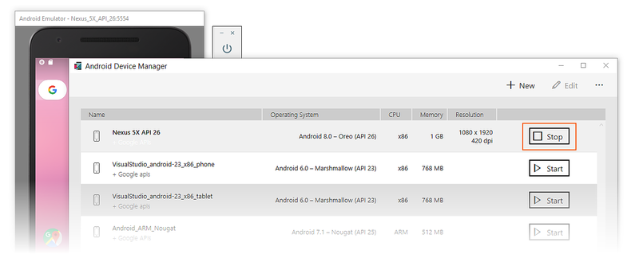](device-manager-images/win/07-stop-button.png#lightbox)

### New Device

To create a new device, click the **New** button (located in the upper
right-hand area of the screen):

[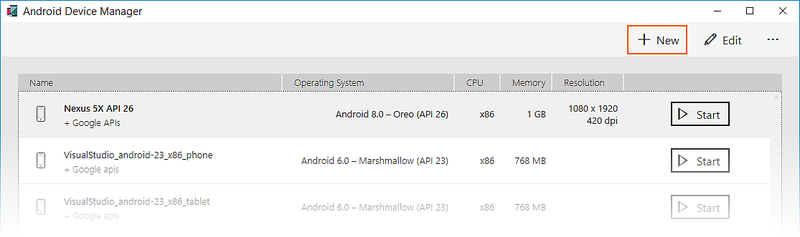](device-manager-images/win/08-new-button.png#lightbox)

Clicking **New** launches the **New Device** screen:

To configure a new device in the **New Device** screen, use the
following steps:

1. Select a physical device to emulate by clicking the **Device**
   pull-down menu:

    

2. Select a system image to use with this virtual device by clicking the 
   **System image** pull-down menu. This menu lists the installed system device manager images
   under **Installed**. The **Download** section lists system device manager images that are
   currently unavailable on your development computer but can be automatically
   installed:

    

3. Give the device a new name. In the following example, the new device
   is named **Nexus 5 API 25**:

    

4. Edit any properties that you need to modify. To make changes to
   properties, see
   [Editing Android Virtual Device Properties](~/android/get-started/installation/android-emulator/device-properties.md).

5. Add any additional properties that you need to explicitly set. The
   **New Device** screen lists only the most commonly-modified
   properties, but you can click the **Add Property** pull-down menu
   (in the bottom left-hand corner) to add additional properties. In
   the following example, the `hw.lcd.backlight` property is being
   added:

    

6. Click the **Create** button (lower right-hand corner) to create the new device:

    

7. You might get a **License Acceptance** screen. Click **Accept** if you
   agree to the license terms:

    

8. The Android Device Manager adds the new device to the list of
   installed virtual devices while displaying a **Creating** progress indicator
   during device creation:

    [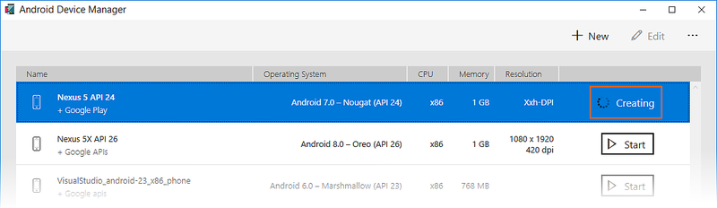](device-manager-images/win/16-creating-the-device.png#lightbox)

9. When the creation process is complete, the new device is shown in
   the list of installed virtual devices with a **Start** button, ready
   to launch:

   [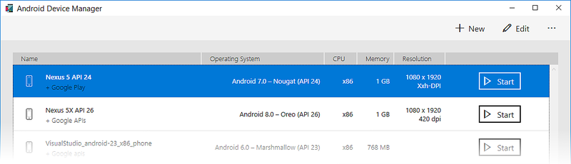](device-manager-images/win/17-created-device.png#lightbox)

### Edit Device

To edit an existing virtual device, select the device and click the
**Edit** button (located in the upper right-hand corner of the screen):

[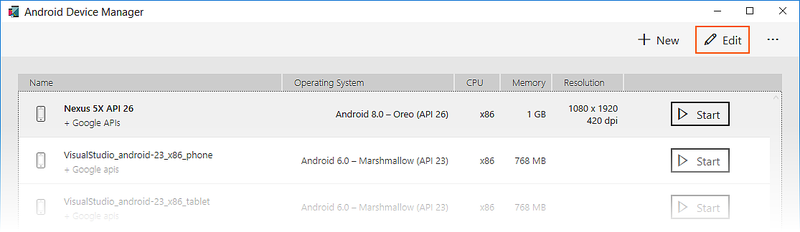](device-manager-images/win/19-edit-button.png#lightbox)

Clicking **Edit** launches the Device Editor for the selected virtual device:

The **Device Editor** screen lists the properties of the virtual device
in the first column, with the corresponding values of each property in
the second column. When you select a property, a detailed description
of that property is displayed on the right.

For example, in the following screenshot the `hw.lcd.density` property
is being changed from **420** to **240**:

After you have made the necessary configuration changes, click the **Save** button.
For more information about changing virtual device properties, see
[Editing Android Virtual Device Properties](~/android/get-started/installation/android-emulator/device-properties.md).

 
### Additional Options

Additional options for working with devices are available from the
&hellip; menu in the upper right-hand corner:

[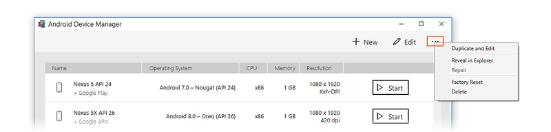](device-manager-images/win/22-overflow-menu.png#lightbox)

The additional options menu contains the following items:

-   **Duplicate and Edit** &ndash; Duplicates the currently-selected
    device and opens it in the **New Device** screen with a different
    unique name. For example, selecting
    **VisualStudio_android-23_x86_phone** and clicking **Duplicate and
    Edit** appends a counter to the name:

    

-   **Reveal in Explorer** &ndash; Opens a Windows Explorer window in
    the folder that holds the files for the virtual device. For
    example, selecting **Nexus 5X API 25** and clicking **Reveal in
    Explorer** opens a window like the following:

    

-   **Factory Reset** &ndash; Resets the selected device to its default
    settings, erasing any user changes made to the internal state of
    the device while it was running (this also erases the current
    [Quick Boot](~/android/deploy-test/debugging/android-sdk-emulator/running-the-emulator.md#quick-boot)
    snapshot, if any). This change does not alter modifications that
    you make to the virtual device during creation and editing. A
    dialog box will appear with the reminder that this reset cannot be
    undone. Click **Wipe user data** to confirm the reset.

-   **Delete** &ndash; Permanently deletes the selected virtual device.
    A dialog box will appear with the reminder that deleting a device
    cannot be undone. Click **Delete** if you are certain that you want
    to delete the device.

# [Visual Studio for Mac](#tab/vsmac)

This article explains how to use the Android Device Manager to create,
duplicate, customize, and launch Android virtual devices.

[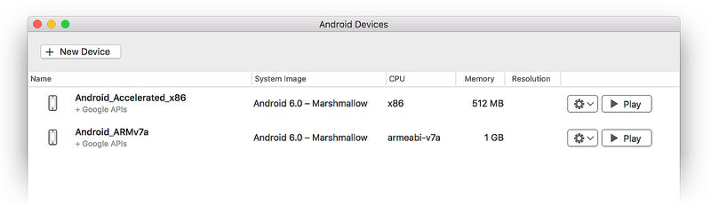](device-manager-images/mac/01-devices-dialog.png#lightbox)

> [!NOTE]
> This guide applies only to Visual Studio for Mac.
Xamarin Studio is incompatible with the Android Device Manager.

You use the Android Device Manager to create and configure *Android
Virtual Devices* (AVDs) that run in the
[Google Android Emulator](~/android/deploy-test/debugging/android-sdk-emulator/index.md).
Each AVD is an emulator configuration that simulates a physical Android
device. This makes it possible to run and test your app in a variety of
configurations that simulate different physical Android devices.

## Requirements

- Visual Studio for Mac 7.5 or later.

- Android SDK 8.0 (API 26) or later must be installed via the Android SDK Manager.

## Launching the Device Manager

Launch the Android Device Manager by clicking **Tools > Device Manager**:

[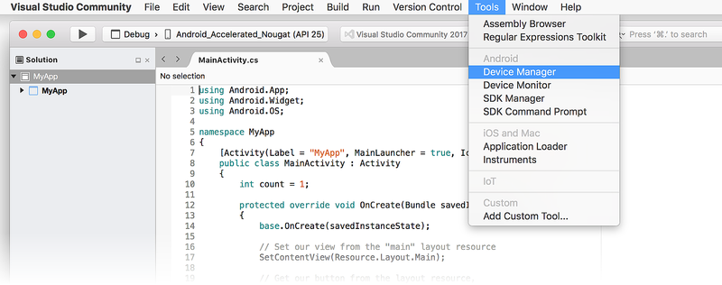](device-manager-images/mac/16-tools-menu.png#lightbox)

Before you can use the Android Device Manager, you must install Android
SDK tools version 26.0.2 or later. If Android SDK tools 26.0.2 or later
is not installed, you will see this error dialog on launch:

If you see this error dialog, click **OK** to open the Android SDK
Manager. In the Android SDK Manager, click the **Tools** tab and
install the following:

-   **Android SDK Tools 26.0.2** or later 
-   **Android SDK Platform-Tools 26.0.0** or later 
-   **Android SDK Build-Tools 26.0.0** or later

These packages should be shown with **Installed** status as seen in
the following screenshot:

[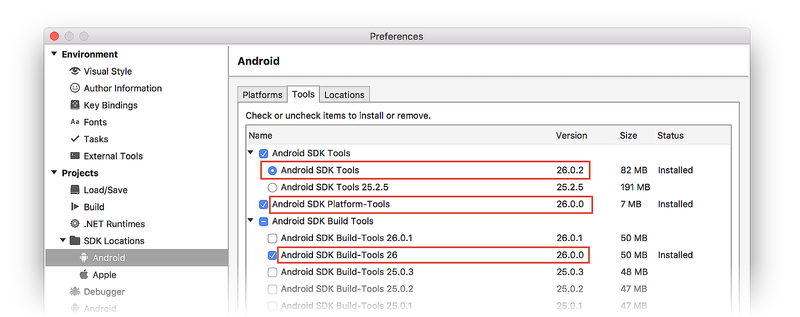](device-manager-images/mac/03-sdk-tools.png#lightbox)

## Main Screen

When you first launch the Android Device Manager, it presents a screen
that displays all currently-configured virtual devices. For each
device, the **Name**, **System Image** (Android API Level), **CPU**,
**Memory** size, and screen resolution are displayed:

[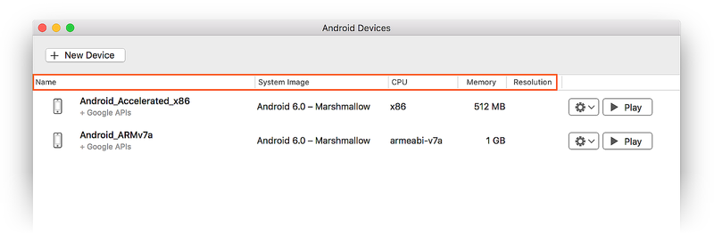](device-manager-images/mac/05-devices-list.png#lightbox)

Click a **Play** button to launch the emulator with the virtual
device of your choice:

[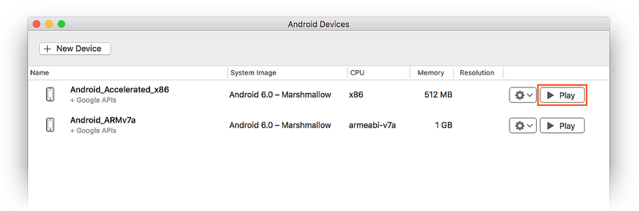](device-manager-images/mac/06-start-button.png#lightbox)

After the emulator starts with the selected virtual device, the
**Play** button changes to a **Stop** button that you can use to halt
the emulator:

[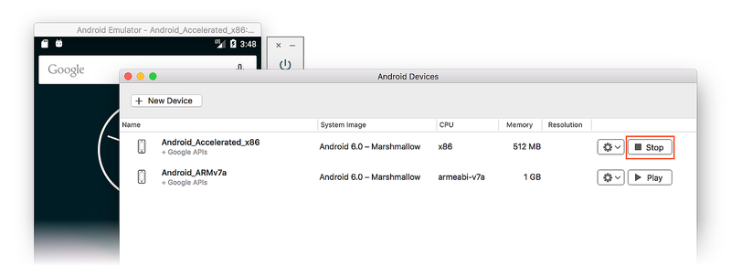](device-manager-images/mac/07-stop-button.png#lightbox)

### New Device

To create a new device, click the **New Device** button (located in the upper
right-hand area of the screen):

[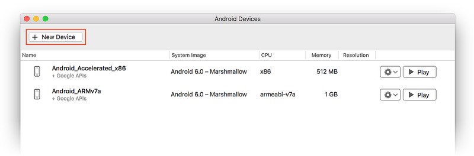](device-manager-images/mac/08-new-button.png#lightbox)

Clicking **New Device** launches the **New Device** screen:

[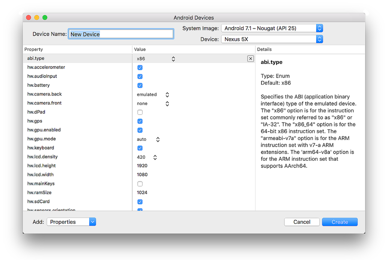](device-manager-images/mac/09-new-device-editor.png#lightbox)

Use the following steps to configure a new device in the **New Device**
screen:

1. Select a physical device to emulate by clicking the **Device** pull-down menu:

    [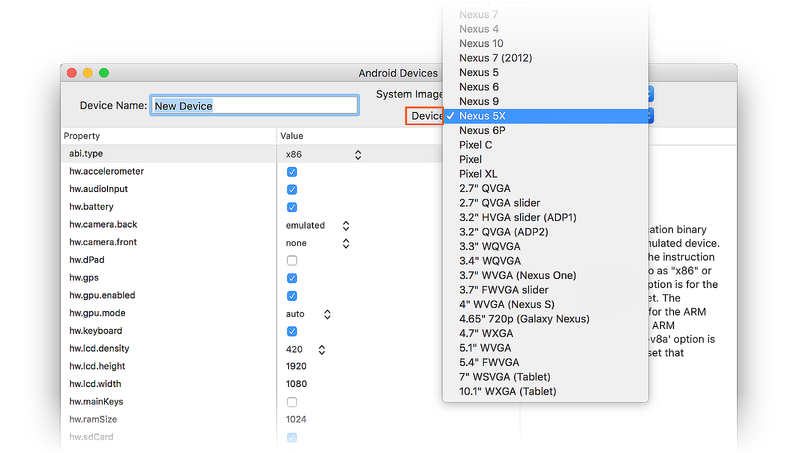](device-manager-images/mac/10-device-menu.png#lightbox)

2. Select a system image to use with this virtual device by clicking
   the **System image** pull-down menu. This menu lists the installed
   system device manager images under **Installed**. the **Download** section (if
   shown) lists system device manager images that are currently unavailable on your
   development computer but can be automatically installed:

    [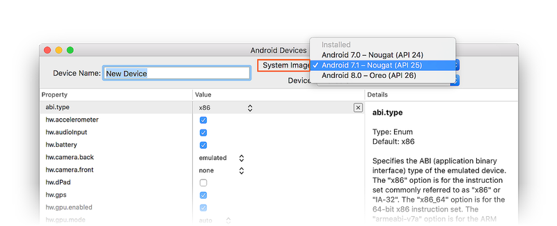](device-manager-images/mac/11-system-image-menu.png#lightbox)

3. Give the device a new name. In the following example, the new device
   is named **Nexus 5X API 25**:

    [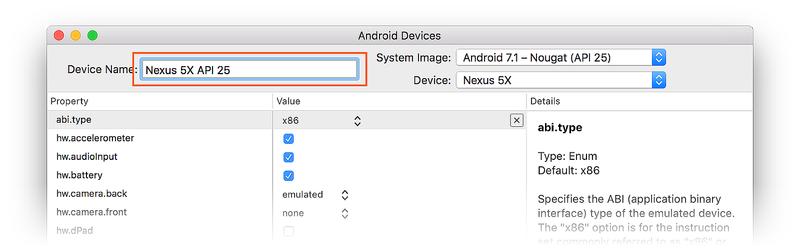](device-manager-images/mac/12-device-name.png#lightbox)

4. Edit any properties that you need to modify. To make changes to
   properties, see
   [Editing Android Virtual Device Properties](~/android/get-started/installation/android-emulator/device-properties.md).

5. Add any additional properties that you need to explicitly set. The
   **New Device** screen lists only the most commonly-modified
   properties, but you can click the **Add Property** pull-down menu
   (in the bottom left-hand corner) to add additional properties:

    [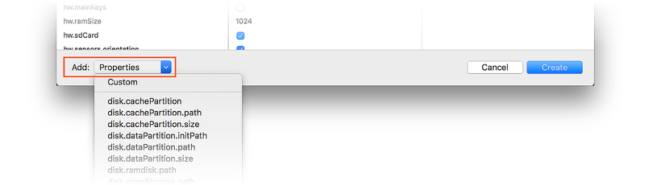](device-manager-images/mac/13-add-property-menu.png#lightbox)

6. You can also click **Custom** to define a new property for the device:

    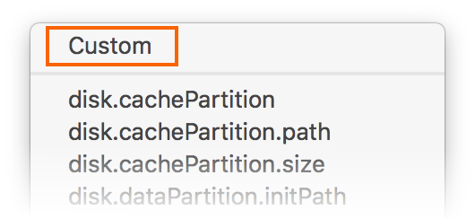

7. Click the **Create** button (lower right-hand corner) to create the new device:

    

8. You might get a **License Acceptance** screen. Click **Accept** if
   you agree to the license terms.

9. The Android Device Manager adds the new device to the list of
   installed virtual devices while displaying a **Creating** progress indicator
   during device creation:

    

10. When the creation process is complete, the new device is shown in
    the device list with a **Play** button, ready to launch:

   [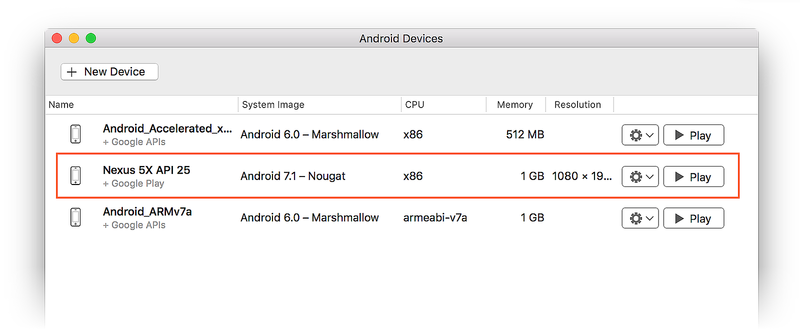](device-manager-images/mac/18-created-device.png#lightbox)

### Edit Device

To edit an existing virtual device, select the **Additional Options**
pull-down menu (gear icon) and select **Edit**:
 
[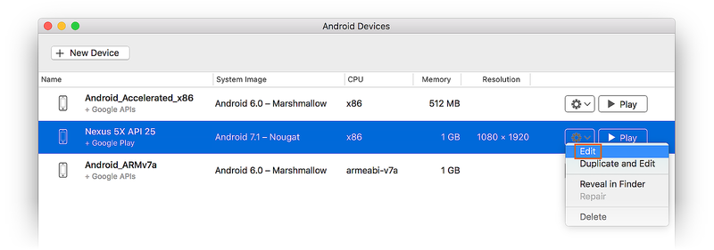](device-manager-images/mac/19-edit-button.png#lightbox)

Clicking **Edit** launches the Device Editor for the selected virtual device:
 
[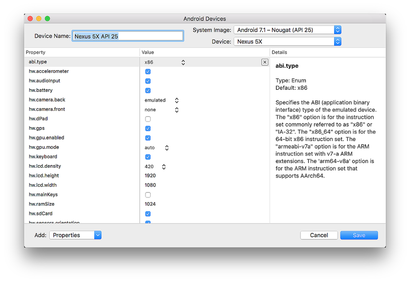](device-manager-images/mac/20-device-editor.png#lightbox)

The **Device Editor** screen lists the properties of the virtual device
in the first column, with the corresponding values of each property in
the second column. When you select a property, a detailed description
of that property is displayed on the right.

For example, in the following screenshot the `hw.lcd.density` property
is changed from **320** to **240** and the `hw.ramSize` property
is changed to **768**:
 
[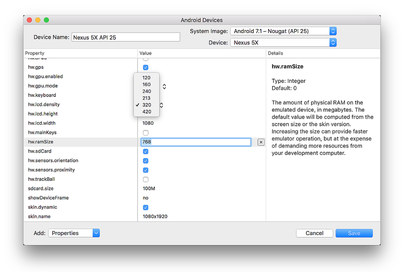](device-manager-images/mac/21-device-editing.png#lightbox)

After you have made the necessary configuration changes, click the **Save** button.
For more information about changing virtual device properties, see
[Editing Android Virtual Device Properties](~/android/get-started/installation/android-emulator/device-properties.md).

 
### Additional Options

Additional options for working with a device are available from the
pull-down menu located to the left of the **Play** button:

[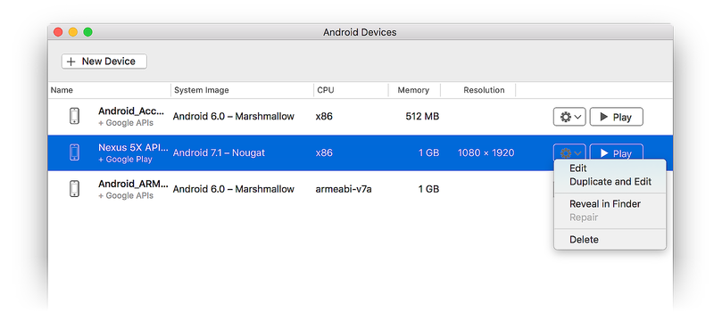](device-manager-images/mac/22-overflow-menu.png#lightbox)

The additional options menu contains the following items:

-   **Edit** &ndash; Opens the currently-selected device in the device
    editor as described earlier.

-   **Duplicate and Edit** &ndash; Duplicates the currently-selected device
    and opens it in the **New Device** screen with a different unique name.
    For example, selecting **Nexus 5X API 25** and
    clicking **Duplicate and Edit** appends a counter to the name:

    [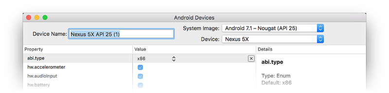](device-manager-images/mac/23-dupe-and-edit.png#lightbox)

-   **Reveal in Finder** &ndash; Opens a macOS Finder window in the
    folder that holds the files for the virtual device. For example,
    selecting **Nexus 5X API 25** and clicking **Reveal in Finder**
    opens a window like the following:

    [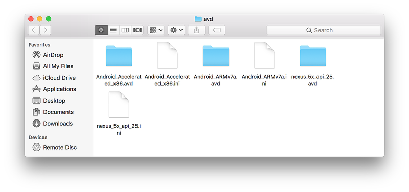](device-manager-images/mac/24-reveal-in-finder.png#lightbox)

-   **Factory Reset** &ndash; Resets the selected device to its default
    settings, erasing any user changes made to the internal state of
    the device while it was running. This change does not alter
    modifications that you make to the virtual device during creation
    and editing. A dialog box will appear with the reminder that this
    reset cannot be undone. Click **Wipe user data** to confirm the
    reset.

-   **Delete** &ndash; Permanently deletes the selected virtual device.
    A dialog box will appear with the reminder that deleting a device
    cannot be undone. Click **Delete** if you are certain that you
    want to delete the device.

-----

## Summary

This guide introduced the Android Device Manager available in Visual
Studio for Mac and Visual Studio Tools for Xamarin. It explained
essential features such as starting and stopping the Android emulator,
selecting an Android virtual device (AVD) to run, creating new virtual
devices, and how to edit a virtual device. It also explained how to
edit profile hardware properties for further customization.

## Related Links

- [Changes to the Android SDK Tooling](~/android/troubleshooting/sdk-cli-tooling-changes.md)
- [Debugging with the Android SDK Emulator](~/android/deploy-test/debugging/android-sdk-emulator/index.md)
- [SDK Tools Release Notes (Google)](https://developer.android.com/studio/releases/sdk-tools)
- [avdmanager](https://developer.android.com/studio/command-line/avdmanager.html)
- [sdkmanager](https://developer.android.com/studio/command-line/sdkmanager.html)
