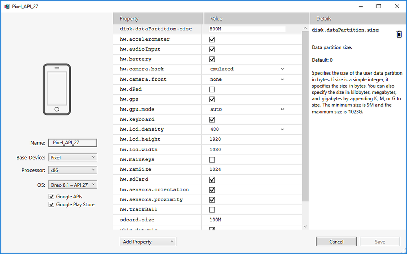
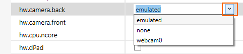
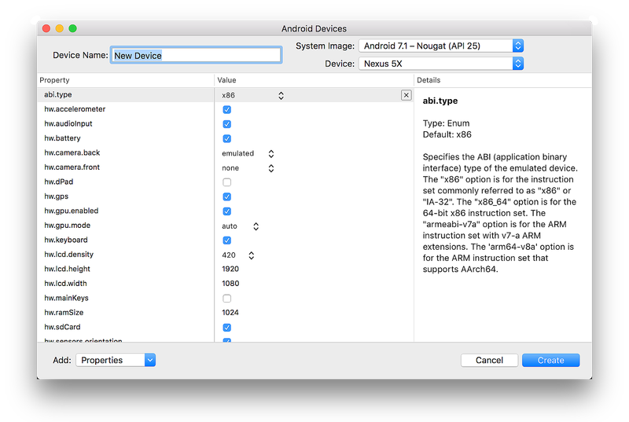

# Editing Android Virtual Device Properties

_This article explains how to use the Android Device Manager to edit the
profile properties of an Android virtual device._

::: zone pivot="windows"

## Android Device Manager on Windows

The **Android Device Manager** supports the editing of individual
Android virtual device profile properties. The **New Device** and
**Device Edit** screens list the properties of the virtual device in
the first column, with the corresponding values of each property in the
second column (as seen in this example): 

When you select a property, a detailed description of that property is
displayed on the right. You can modify *hardware profile properties*
and *AVD properties*. Hardware profile properties (such as `hw.ramSize`
and `hw.accelerometer`) describe the physical characteristics of the
emulated device. These characteristics include screen size, the amount
of available RAM, whether or not an accelerometer is present. AVD
properties specify the operation of the AVD when it runs. For example,
AVD properties can be configured to specify how the AVD uses your
development computer's graphics card for rendering.

You can change properties by using the following guidelines:

-   To change a boolean property, click the check mark to the right of
    the boolean property:

    

-   To change an *enum* (enumerated) property, click the down-arrow to
    the right of the property and choose a new value.

    

-   To change a string or integer property, double-click the current
    string or integer setting in the value column and enter a new value.

    

::: zone-end
::: zone pivot="macos"

## Android Device Manager on macOS

The **Android Device Manager** supports the editing of individual
Android virtual device profile properties. The **New Device** and
**Device Edit** screens list the properties of the virtual device in
the first column, with the corresponding values of each property in the
second column (as seen in this example): 

When you select a property, a detailed description of that property is
displayed on the right. You can modify *hardware profile properties*
and *AVD properties*. Hardware profile properties (such as `hw.ramSize`
and `hw.accelerometer`) describe the physical characteristics of the
emulated device. These characteristics include screen size, the amount
of available RAM, whether or not an accelerometer is present. AVD
properties specify the operation of the AVD when it runs. For example,
AVD properties can be configured to specify how the AVD uses your
development computer's graphics card for rendering.

You can change properties by using the following guidelines:

-   To change a boolean property, click the check mark to the right of
    the boolean property:

    

-   To change an *enum* (enumerated) property, click the pull-down menu
    to the right of the property and choose a new value.

    

-   To change a string or integer property, double-click the current
    string or integer setting in the value column and enter a new value.

    

::: zone-end

The following table provides a detailed explanation of the properties
listed in the **New Device** and **Device Editor** screens:

[!include]

For more information about these properties, see
[Hardware Profile Properties](https://developer.android.com/studio/run/managing-avds.html#hpproperties).

