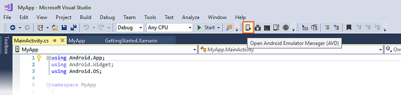
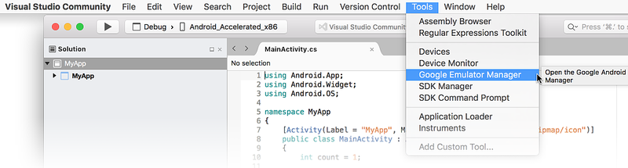
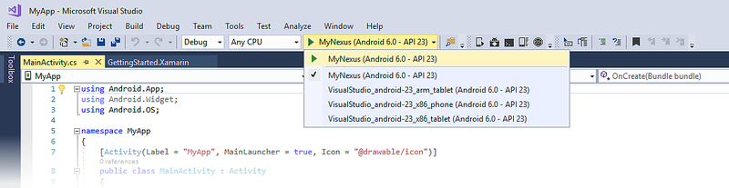
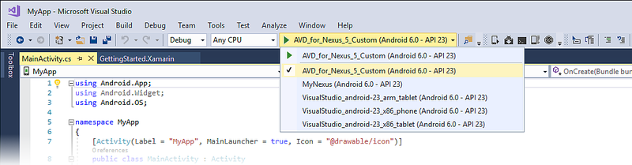

# Google Emulator Manager

After you have verified that hardware acceleration is enabled (as
described in
[Android Emulator Hardware Acceleration](~/android/get-started/installation/android-emulator/hardware-acceleration.md)),
the next step is to create virtual devices to use for testing and
debugging your app. You can use the legacy Google Emulator Manager (also known
as the *Android Virtual Device (AVD) Manager*) to create virtual
devices for use by the Android SDK Emulator.

> [!NOTE]
> If you are targeting Android 8.0 Oreo, you must use the [Xamarin Android Device Manager](~/android/get-started/installation/android-emulator/xamarin-device-manager.md) to create and configure virtual devices.

## Installing System Images

Depending on which Android API level(s) you want to target, you must
download and install API level-specific system images that are used by
the Android SDK emulator. For each Android API level, there are a set
of **x86** system images that you will need to download and install for
creating virtual devices.

# [Visual Studio](#tab/vswin)

To install the necessary system images, start the Android SDK Manager
(**Tools > Android > Android SDK Manager**) and scroll to the API
level(s) you want to support. For each API level, enable the check mark
next to the following system images:

# [Visual Studio for Mac](#tab/vsmac)

To install the necessary system images, start the Android SDK Manager
(**Tools > SDK Manager**) and scroll to the API level(s) you want to
support. For each API level, enable the check mark next to the
following system images:

-----

-   **Intel x86 Atom System Image**
-   **Google APIs Intel x86 Atom System Image**

The latter system image adds Google APIs (for example, Google Maps
APIs) to the virtual device. 

In the following screenshot, **Intel x86 Atom** images will be
installed so that virtual devices running Android 6.0 can be created:

# [Visual Studio](#tab/vswin)

# [Visual Studio for Mac](#tab/vsmac)

-----

If you are developing 64-bit apps, install the following system images
instead:

-   **Intel x86 Atom_64 System Image**
-   **Google APIs Intel x86 Atom_64 System Image**

You can use these 64-bit system images to run 32-bit apps; however, the
32-bit **Intel x86 Atom System Image** runs slightly faster in the
Android SDK emulator.

If you are developing apps for Android Wear, install the following
system images:

-   **Android Wear Intel x86 Atom System Image**
-   **Google APIs Intel x86 Atom System Image**

After these system images are installed, you can create **x86**-based
Android virtual devices by selecting the appropriate API level and
CPU/ABI choices during virtual device configuration (this is described
next).

## Configuring Virtual Devices

# [Visual Studio](#tab/vswin)

Virtual devices are configured via the **Android Emulator Manager** 
(also referred to as the _Android Virtual Device Manager_ or
_AVD Manager_). To launch the Android Emulator Manager from Visual
Studio, click the **Android Emulator Manager** icon in the toolbar:

You can also launch the Android Emulator Manager from the menu bar by
selecting **Tools > Android > Android Emulator Manager**:

The **Android Virtual Device (AVD) Manager** dialog displays the list of existing
Android virtual devices:

# [Visual Studio for Mac](#tab/vsmac)

Virtual devices are configured via the **Android Emulator Manager** 
(also referred to as the _Android Virtual Device Manager_ or
_AVD Manager_). 

You can launch the Android Emulator Manager from the menu bar by
selecting **Tools > Google Emulator Manager**:

The **Android Virtual Device (AVD) Manager** dialog displays the list of existing
Android virtual devices:

-----

You can create new virtual device images with different device
characteristics and API levels &ndash; the next section explains how to
create custom device definitions and virtual devices.

### Creating a Custom Device Definition

To create a custom device definition, click **Create...** in the
**Android Virtual Device (AVD) Manager**. This opens the **Create new Android
Virtual Device (AVD)** dialog:

# [Visual Studio](#tab/vswin)

# [Visual Studio for Mac](#tab/vsmac)

-----

In this dialog, configure the following options:

-   **AVD Name** &ndash; The unique name for your device definition. In
    the example screenshot above, the name is set to **MyNexus**. Note
    that the AVD name cannot contain spaces &ndash; the **OK** button will 
    be disabled if you try to use spaces in the AVD name.

-   **Device** &ndash; Select the hardware profile that you want to
    emulate (for example, **Nexus 5** or **Nexus 6**).

-   **Target** &ndash; Select the Android API level for the virtual
    device. This setting should be greater than or equal to the Minimum
    Android Version of your app.

-   **CPU/ABI** &ndash; Select **Google APIs Intel Atom (x86)** so that 
    Google APIs will be available in your device definition.

-   **Skin** &ndash; Select the appearance of the virtual device. In
    the example screenshot above, the **HVGA** skin is selected (the
    the emulator screenshot at the end of this article is an example
    of the **HVGA** skin).

-   **Memory Options** &ndash; Typically, the default RAM setting is
    too high and, on Windows, causes the warning: **emulating RAM
    greater than 768M may fail**. For most users, we recommend setting
    RAM to 768MB (as shown in the above screenshot). Large RAM values
    can slow down the emulator.

-   **Use Host GPU** &ndash; This option causes the emulator to use the
    host computer's Graphical Processing Unit (GPU) to perform graphics
    operations. We recommend that you enable this option to further
    increase the performance of the emulator. For more information on
    the **Emulation Options** section, see
    [What are Snapshot and Use Host GPU emulation options used for?](https://android.stackexchange.com/questions/51739/what-is-snapshot-and-use-host-gpu-emulation-options-for)

The remaining options can be left at their default settings. When you
are ready, click **OK** to create the new virtual device. The results
of the new virtual device configuration are detailed in the next
dialog:

# [Visual Studio](#tab/vswin)

# [Visual Studio for Mac](#tab/vsmac)

-----

For a detailed explanation of the configuration properties listed in
this dialog, see
[Hardware Profile Properties](https://developer.android.com/studio/run/managing-avds.html#hpproperties).
After you click **OK**, the new device configuration is displayed in
the list of existing Android virtual devices. In the following screenshot,
**MyNexus** was added to the list:

# [Visual Studio](#tab/vswin)

# [Visual Studio for Mac](#tab/vsmac)

-----

The new custom virtual device is also added to the device pull-down
menu:

# [Visual Studio](#tab/vswin)

# [Visual Studio for Mac](#tab/vsmac)

-----

### Cloning a Device Definition

It is possible to select an existing device definition and *clone*
it to create a new custom device definition. This is a good strategy to
use when there is an existing device definition that needs only a few
minor adjustments to meet your needs. The **Device Definitions** tab in
the **Android Virtual Device (AVD) Manager** lists all available device
definitions:

# [Visual Studio](#tab/vswin)

# [Visual Studio for Mac](#tab/vsmac)

-----

The pre-configured devices in this list cannot be modified &ndash; only
user-created virtual devices can be edited. It is possible to derive a
new device definition from a pre-configured device definition by
selecting the device definition and clicking **Clone**. For example,
selecting the **Nexus 5** definition and clicking **Clone** presents
the following dialog:

# [Visual Studio](#tab/vswin)

# [Visual Studio for Mac](#tab/vsmac)

-----

In the next screenshot, the name is changed to **Nexus 5 Custom** and the
device parameters are modified to create a new custom device definition:

# [Visual Studio](#tab/vswin)

# [Visual Studio for Mac](#tab/vsmac)

-----

Clicking **Clone Device** creates the new device definition, which now
appears in the **Device Definitions** list:

# [Visual Studio](#tab/vswin)

# [Visual Studio for Mac](#tab/vsmac)

-----

Note that each user-created device definition is displayed with a green
icon, as shown above. This new device definition can be used to create
a new AVD by selecting the definition and clicking **Create AVD**. This
displays the **Create new Android Virtual Device (AVD)** dialog. In the
following example, the name **AVD\_for\_Nexus\_5\_Custom** was
automatically generated for new virtual device:

# [Visual Studio](#tab/vswin)

# [Visual Studio for Mac](#tab/vsmac)

-----

After **OK** is clicked, the custom device configuration is displayed
in the list of existing Android virtual devices. In addition, it is
added to the device pull-down menu:

# [Visual Studio](#tab/vswin)

# [Visual Studio for Mac](#tab/vsmac)

-----

