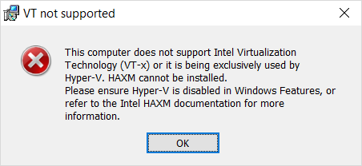
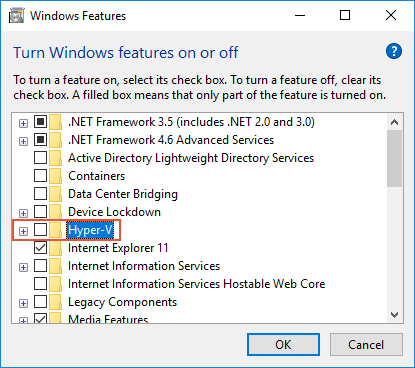

# Android Emulator Hardware Acceleration

Because the Android SDK Emulator is prohibitively slow without hardware
acceleration, Intel's HAXM (Hardware Accelerated Execution Manager) is
the recommended way to drastically improve the performance of the
Android SDK Emulator.

## HAXM Overview

HAXM is a hardware-assisted virtualization engine (hypervisor) that
uses Intel Virtualization Technology (VT) to speed up Android app
emulation on a host machine. In combination with Android x86 emulator
images provided by Intel and the official Android SDK Manager, HAXM
allows for faster Android emulation on VT-enabled systems. If you are
developing on a machine with an Intel CPU that has VT capabilities, you
can take advantage of HAXM to greatly speed up the Android SDK Emulator
(if you're not sure whether your CPU supports VT, see
[Determine If Your Processor Supports Intel Virtualization Technology](https://www.intel.com/content/www/us/en/support/processors/000005486.html)).

The Android SDK Emulator automatically makes use of HAXM when it is
available. When you select an **x86**-based virtual device (as
described in
[Configuration and Use](~/android/deploy-test/debugging/android-sdk-emulator/index.md)),
that virtual device will use HAXM for hardware acceleration. Before you
use the Android SDK Emulator for the first time, it's a good idea to
verify that HAXM is installed and available to the Android SDK
Emulator.

> [!NOTE]
> You cannot run HAXM on a virtual machine.

## Verifying HAXM Installation

You can check to see if HAXM is available by viewing the **Starting
Android Emulator** window while the emulator starts. To start the
Android SDK Emulator, do the following:

# [Visual Studio](#tab/vswin)

1. Launch the Android Emulator Manager by clicking **Tools > Android >
   Android Emulator Manager**:

    

2. If you see a **Performance Warning** dialog similar to the following, then HAXM is
   not yet installed or configured properly on your computer:

    

   If a **Performance Warning** dialog like this is shown, see
   [Performance Warnings](~/android/deploy-test/debugging/android-sdk-emulator/troubleshooting.md#perfwarn)
   to identify the cause and resolve the underlying problem.

3. Select an **x86** image (for example, **VisualStudio\_android-23\_x86\_phone**), click **Start**, then
   click **Launch**:

    

4. Watch for the **Starting Android Emulator** dialog window while the
   emulator starts up. If HAXM is installed, you will see the message,
   **HAX is working and emulator runs in fast virt mode** as shown in
   this screenshot:

    

   If you do not see this message, then HAXM is probably not installed. For example, here
   is a screenshot of a message you may see if HAXM is not available:

    

   If HAXM is not available on your computer, use the steps in the next
   section to install HAXM.

# [Visual Studio for Mac](#tab/vsmac)

1. Launch the Android Emulator Manager by clicking **Tools >
   Google Emulator Manager**:

    

2. If you see a **Performance Warning** dialog similar to the following, then HAXM is
   not yet installed or configured properly on your computer:

    

   If a **Performance Warning** dialog like this is shown, see
   [Performance Warnings](~/android/deploy-test/debugging/android-sdk-emulator/troubleshooting.md#perfwarn)
   to identify the cause and resolve the underlying problem.

3. Select the **x86** image (for example, **Android\_Accelerated\_x86**), click **Start**, then
   click **Launch**:

    

3. Watch for the **Starting Android Emulator** dialog window while the
   emulator starts up. If HAXM is installed, you will see the message,
   **HAX is working and emulator runs in fast virt mode** as shown in
   this screenshot:

    

   If HAXM is not available on your computer (for example, if you see an
   error message like _Please ensure Intel HAXM is propertly installed and
   usable_), use the steps in the next section to install HAXM.

-----

<a name="install-haxm" />

## Installing HAXM

If the emulator does not start, HAXM may have to be installed
manually. HAXM install packages for both Windows and macOS are
available from the
[Intel Hardware Accelerated Execution Manager](https://software.intel.com/en-us/android/articles/intel-hardware-accelerated-execution-manager)
page. Use the following steps to download and install HAXM manually:

# [Visual Studio](#tab/vswin)

1. From the Intel website, download the latest
   [HAXM virtualization engine](https://software.intel.com/en-us/android/articles/intel-hardware-accelerated-execution-manager/)
   installer for Windows. The advantage of downloading the HAXM
   installer directly from the Intel website is that you can be assured
   of using the latest version.

   Alternately, you can use the SDK Manager to download the HAXM
   installer (In the SDK Manager, click **Tools > Extras > Intel x86
   Emulator Accelerator (HAXM installer)**). The Android SDK
   normally downloads the HAXM installer to the following location:

   **C:\\Program Files (x86)\\Android\\android-sdk\\extras\\intel\\Hardware\_Accelerated\_Execution\_Manager**

   Note that the SDK Manager does not install HAXM, it merely downloads the
   HAXM installer to the above location; you still have to launch it manually.

2. Run **intelhaxm-android.exe** to start the HAXM installer. Accept
   the default values in the installer dialogs:

   

If you see the following error dialog (_This computer does not support
Intel Virtualization Technology (VT-x) or it is being exclusively used
by Hyper-V_), then Hyper-V must be disabled before you can install
HAXM:

The next section explains how to disable Hyper-V.

<a name="disable-hyperv" />

## Disabling Hyper-V

If you are using Windows with Hyper-V enabled, you must disable it and
reboot your computer to install and use HAXM. You can disable
Hyper-V from the Control Panel by following these steps:

1. In the Windows search box, enter **Programs and** then click the
   **Programs and Features** search result.

2. In the Control Panel **Programs and Features** dialog, click
   **Turn Windows features on or off**:

    

3. Uncheck **Hyper-V** and restart the computer:

    

Alternately, you can use the following Powershell cmdlet to disable Hyper-V:

`Disable-WindowsOptionalFeature -Online -FeatureName Microsoft-Hyper-V-Hypervisor`

Intel HAXM and Microsoft Hyper-V cannot both be active at the same
time. Unfortunately, there is currently no way to switch between
between Hyper-V and HAXM without restarting your computer. If you
want to use the
[Visual Studio Emulator for Android](~/android/deploy-test/debugging/visual-studio-android-emulator.md)
(which depends on Hyper-V), you will be unable to use the Android SDK
Emulator without rebooting. One way to use both Hyper-V and HAXM is
to create a multi-boot setup as explained in
[Creating a no hypervisor boot entry](https://blogs.msdn.microsoft.com/virtual_pc_guy/2008/04/14/creating-a-no-hypervisor-boot-entry/).

In some cases, using the above steps will not succeed in disabling
Hyper-V if Device Guard and Credential Guard are enabled. If you are
unable to disable Hyper-V (or it seems to be disabled but HAXM
installation still fails), use the steps in the next section to disable
Device Guard and Credential Guard.

<a name="disable-devguard" />

## Disabling Device Guard

Device Guard and Credential Guard can prevent Hyper-V from being
disabled on Windows machines. This is often a problem for domain-joined
machines that are configured and controlled by an owning organization.
On Windows 10, use the following steps to see if **Device Guard** is
running:

1. In **Windows Search**, type **System info** to start the **System
   Information** app.

2. In the **System Summary**, look to see if **Device Guard
   Virtualization based security** is present and is in the **Running**
   state:

   

If Device Guard is enabled, use the following steps to disable it:

1. Ensure that **Hyper-V** is disabled (under **Turn Windows Features
   on or off**) as described in the previous section.

2. In the Windows Search Box, type **gpedit** and select the **Edit
   group policy** search result. This launches the **Local Group
   Policy Editor**.

3. In the **Local Group Policy Editor**, navigate to **Computer
   Configuration > Administrative Templates > System > Device Guard**:

   

4. Change **Turn On Virtualization Based Security** to **Disabled** (as
   shown above) and exit the **Local Group Policy Editor**.

5. In the Windows Search Box, type **cmd**. When **Command Prompt** appears
   in the search results, right-click **Command Prompt** and select
   **Run as Administrator**.

6. Copy and paste the following commands into the command prompt window
   (if drive **Z:** is in use, pick an unused drive letter to use
   instead):

        mountvol Z: /s
        copy %WINDIR%\System32\SecConfig.efi Z:\EFI\Microsoft\Boot\SecConfig.efi /Y
        bcdedit /create {0cb3b571-2f2e-4343-a879-d86a476d7215} /d "DebugTool" /application osloader
        bcdedit /set {0cb3b571-2f2e-4343-a879-d86a476d7215} path "\EFI\Microsoft\Boot\SecConfig.efi"
        bcdedit /set {bootmgr} bootsequence {0cb3b571-2f2e-4343-a879-d86a476d7215}
        bcdedit /set {0cb3b571-2f2e-4343-a879-d86a476d7215} loadoptions DISABLE-LSA-ISO,DISABLE-VBS
        bcdedit /set {0cb3b571-2f2e-4343-a879-d86a476d7215} device partition=Z:
        mountvol Z: /d

7. Restart your computer. On the boot screen, you should see a prompt like the following:

   **Do you want to disable Credential Guard?**

   Press the indicated key to disable Credential Guard as prompted.

8. After the computer reboots, check again to ensure that Hyper-V is
   disabled (as described in the previous steps).

If Hyper-V is still not disabled, the policies of your domain-joined
computer may prevent you from disabling Device Guard or Credential
Guard. In this case, you can request an exemption from your domain
adminstrator to allow you to opt out of Credential Guard. Alternately,
you can use a computer that is not domain-joined to use HAXM.

# [Visual Studio for Mac](#tab/vsmac)

1. From the Intel website, download the latest
   [HAXM virtualization engine](https://software.intel.com/en-us/android/articles/intel-hardware-accelerated-execution-manager/)
   installer for macOS.

2. Run the HAXM installer. Accept the default values in the installer dialogs:

   

-----
