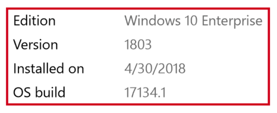
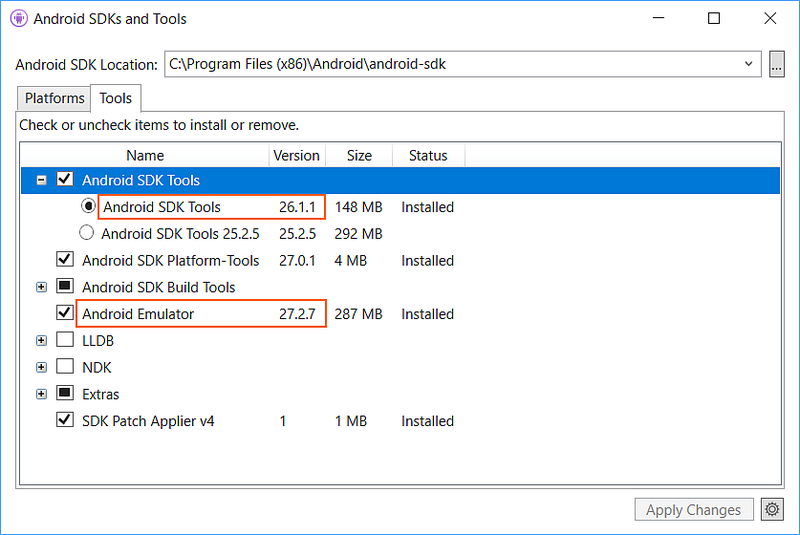
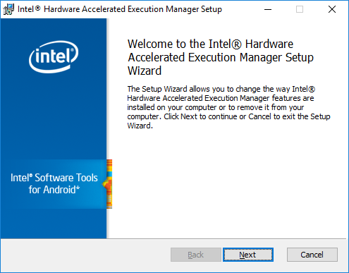

# Hardware acceleration for emulator performance (Hyper-V & HAXM)

_This article explains how to use your computer's hardware acceleration
features to maximize Android Emulator performance._

Visual Studio makes it easier for developers to test and debug their
Xamarin.Android applications by using the Android emulator in
situations where an Android device is unavailable or impractical.
However, the Android emulator runs too slowly if hardware acceleration
is not available on the computer that runs it. You can drastically
improve the performance of the Android emulator by using special x86
virtual device images in conjunction with the virtualization features
of your computer.

| Scenario    | HAXM        | WHPX       | Hypervisor.Framework |
| ----------- | ----------- | -----------| ----------- |
| You have an Intel Processor | X | X | X |
| You have an AMD Processor   |   | X |   |
| You want to support Hyper-V |   | X |   |
| You want to support nested Virtualization |   | Limited |   |
| You want to use technologies like Docker  |   | X | X |

::: zone pivot="windows"

## Accelerating Android emulators on Windows

The following virtualization technologies are available for
accelerating the Android emulator:

1. **Microsoft's Hyper-V and the Windows Hypervisor Platform (WHPX)**.
   [Hyper-V](/virtualization/hyper-v-on-windows/)
   is a virtualization feature of Windows that makes it possible to run
   virtualized computer systems on a physical host computer.

2. **Intel's Hardware Accelerated Execution Manager (HAXM)**.
   HAXM is a virtualization engine for computers running Intel CPUs.

For the best experience on Windows, it is recommended that you use WHPX to
accelerate the Android emulator. If WHPX is not available on your
computer, then HAXM can be used. The Android emulator will
automatically make use of hardware acceleration if the following
criteria are met:

- Hardware acceleration is available and enabled on your development
  computer.

- The emulator is running a system image created for
  an **x86**-based virtual device.

> [!IMPORTANT]
> You can't run a VM-accelerated emulator inside another VM, such as
> a VM hosted by VirtualBox, VMware, or Docker. You must run the Android
> emulator [directly on your system hardware](https://developer.android.com/studio/run/emulator-acceleration.html#extensions).

For information about launching and debugging with the Android
emulator, see
[Debugging on the Android Emulator](~/android/deploy-test/debugging/debug-on-emulator.md).

<a name="hyper-v-win"></a>

## Accelerating with Hyper-V

Before enabling Hyper-V, read the following section to verify
that your computer supports Hyper-V.

### Verifying support for Hyper-V

Hyper-V runs on the Windows Hypervisor Platform. To use the Android
emulator with Hyper-V, your computer must meet the following criteria
to support the Windows Hypervisor Platform:

- Your computer hardware must meet the following requirements:

  - A 64-bit Intel or AMD Ryzen CPU with Second Level Address Translation (SLAT).
  - CPU support for VM Monitor Mode Extension (VT-c on Intel CPUs).
  - Minimum of 4-GB memory.

- In your computer's BIOS, the following items must be enabled:

  - Virtualization Technology (may have a different label depending on motherboard manufacturer).
  - Hardware Enforced Data Execution Prevention.

- Your computer must be updated to Windows 10 April 2018 update
  (build 1803) or later. You can verify that your Windows version
  is up-to-date by using the following steps:

  1. Enter **About** in the Windows search box.
  2. Select **About your PC** in the search results.
  3. Scroll down in the **About** dialog to the **Windows specifications**
      section.
  4. Verify that the **Version** is at least 1803:

      [](hardware-acceleration-images/win/01-about-windows-w10.png#lightbox)

To verify that your computer hardware and software is compatible with
Hyper-V, open a command prompt and type the following command:

```cmd
systeminfo
```

If all listed Hyper-V requirements have a value of **Yes**, then your
computer can support Hyper-V. For example:

[](hardware-acceleration-images/win/02-systeminfo-w158.png#lightbox)

### Enabling Hyper-V acceleration

If your computer meets the above criteria, use the following steps
to accelerate the Android emulator with Hyper-V:

1. Enter **windows features** in the Windows search box and select
   **Turn Windows features on or off** in the search results. In the
   **Windows Features** dialog, enable both **Hyper-V** and **Windows
   Hypervisor Platform**:

    [](hardware-acceleration-images/win/03-hyper-v-settings-w158.png#lightbox)

   After making these changes, reboot your computer.
   
> [!IMPORTANT]
>
> On Windows 10 October 2018 Update (RS5) and higher, you
> only need to enable Hyper-V, as it will use
> Windows Hypervisor Platform (WHPX) automatically.

2. **Install [Visual Studio 15.8 or later](https://visualstudio.microsoft.com/vs/)**
   (this version of Visual Studio provides IDE support for
   running the Android emulator with Hyper-V).

3. **Install the Android Emulator package 27.2.7 or later**. To
   install this package, navigate to **Tools > Android > Android SDK
   Manager** in Visual Studio. Select the **Tools** tab and ensure that
   the Android emulator version is at least 27.2.7. Also ensure that
   the Android SDK Tools version is 26.1.1 or later:

    [](hardware-acceleration-images/win/04-sdk-manager-w158.png#lightbox)

When you create a virtual device (see
[Managing Virtual Devices with the Android Device Manager](~/android/get-started/installation/android-emulator/device-manager.md)),
be sure to select an **x86**-based system image. If you use an ARM-based system image,
the virtual device will not be accelerated and will run slowly.

Hyper-V should now be enabled and you can run your accelerated Android emulator.

## Accelerating with HAXM

If your computer
does not support Hyper-V, you may use HAXM to accelerate the Android emulator. You must
[disable Device Guard](~/android/get-started/installation/android-emulator/troubleshooting.md?tabs=vswin#disable-devguard)
if you want to use HAXM.

### Verifying HAXM support

To determine if your hardware supports HAXM, follow the steps in
[Does My Processor Support Intel Virtualization Technology?](https://www.intel.com/content/www/us/en/support/processors/000005486.html).
If your hardware supports HAXM,
you can check to see if HAXM is already installed by using the
following steps:

1. Open a command prompt window and enter the following command:

    ```cmd
    sc query intelhaxm
    ```

2. Examine the output to see if the HAXM process is running. if it is,
   you should see output listing the `intelhaxm` state as `RUNNING`. For
   example:

    

   If `STATE` is not set to `RUNNING`, then HAXM is not installed.

If your computer can support HAXM but HAXM is not installed, use the
steps in the next section to install HAXM.

<a name="install-haxm-win"></a>

### Installing HAXM

HAXM install packages for Windows are available from the
[Intel Hardware Accelerated Execution Manager](https://github.com/intel/haxm/releases) GitHub releases
page. Use the following steps to download and install HAXM:

1. From the Intel website, download the latest
   [HAXM virtualization engine](https://github.com/intel/haxm/releases)
   installer for Windows. The advantage of downloading the HAXM
   installer directly from the Intel website is that you can be assured
   of using the latest version.

2. Run **intelhaxm-android.exe** to start the HAXM installer. Accept
   the default values in the installer dialogs:

   

When you create a virtual device (see
[Managing Virtual Devices with the Android Device Manager](~/android/get-started/installation/android-emulator/device-manager.md)),
be sure to select an **x86**-based system image. If you use an ARM-based system image,
the virtual device will not be accelerated and will run slowly.

## Troubleshooting

For help with troubleshooting hardware acceleration issues, see the
Android emulator
[Troubleshooting](~/android/get-started/installation/android-emulator/troubleshooting.md?tabs=vswin#accel-issues-win)
guide.

::: zone-end
::: zone pivot="macos"

## Accelerating Android emulators on macOS

The following virtualization technologies are available for
accelerating the Android emulator:

1. **Apple's Hypervisor Framework**.
   [Hypervisor](https://developer.apple.com/documentation/hypervisor)
   is a feature of macOS 10.10 and later that makes it possible to run
   virtual machines on a Mac.

2. **Intel's Hardware Accelerated Execution Manager (HAXM)**.
   [HAXM](https://software.intel.com/articles/intel-hardware-accelerated-execution-manager-intel-haxm)
   is a virtualization engine for computers running Intel CPUs.

It is recommended that you use the Hypervisor
Framework to accelerate the Android emulator. If the Hypervisor
Framework is not available on your Mac, then HAXM can be used. The
Android emulator will automatically make use of hardware acceleration
if the following criteria are met:

- Hardware acceleration is available and enabled on the development
  computer.

- The emulator is running a system image created for
  an **x86**-based virtual device.

> [!IMPORTANT]
>
> You can't run a  VM-accelerated emulator inside another VM,
> such as a VM  hosted by VirtualBox, VMware, or Docker. You
> must run the Android emulator
> [directly on your system hardware](https://developer.android.com/studio/run/emulator-acceleration.html#extensions).

For information about launching and debugging with the Android
emulator, see
[Debugging on the Android Emulator](~/android/deploy-test/debugging/debug-on-emulator.md).

<a name="hypervisor"></a>

## Accelerating with the Hypervisor Framework

To use the Android emulator with the Hypervisor Framework, your Mac must
meet the following criteria:

- Your Mac must be running macOS 10.10 or later.

- Your Mac's CPU must be able to support the Hypervisor Framework.

If your Mac meets these criteria, the Android emulator will
automatically use the Hypervisor Framework for acceleration. If you are not sure if Hypervisor Framework
is supported on your Mac, see the
[Troubleshooting](~/android/get-started/installation/android-emulator/troubleshooting.md?tabs=vsmac#hypervisor-issues)
guide for ways to verify that your Mac supports Hypervisor.

If the Hypervisor Framework is not supported by your Mac, you can use
HAXM to accelerate the Android emulator (described next).

<a name="haxm-mac"></a>

## Accelerating with HAXM

If your Mac does not support the Hypervisor framework (or you are using
a version of macOS earlier than 10.10), you can use **Intel's Hardware
Accelerated Execution Manager**
([HAXM](https://software.intel.com/articles/intel-hardware-accelerated-execution-manager-intel-haxm))
to speed up the Android emulator.

Before using the Android emulator with HAXM for the first time, it's a
good idea to verify that HAXM is installed and available for the
Android emulator to use.

### Verifying HAXM support

You can check to see if HAXM is already installed by using
the following steps:

1. Open a Terminal and enter the following command:

    ```bash
    ~/Library/Developer/Xamarin/android-sdk-macosx/tools/emulator -accel-check
    ```

   This command assumes that the Android SDK is installed at the
   default location of **~/Library/Developer/Xamarin/android-sdk-macosx**;
   if not, modify the above path for
   the location of the Android SDK on your Mac.

2. If HAXM is installed, the above command will
   return a message similar to the following result:

    ```bash
    HAXM version 7.2.0 (3) is installed and usable.
    ```

   If HAXM is *not* installed, a message similar to
   the following output is returned:

    ```bash
    HAXM is not installed on this machine (/dev/HAX is missing).
    ```

If HAXM is not installed, use the steps in the next section to
install HAXM.

<a name="install-haxm-mac"></a>

### Installing HAXM

HAXM installation packages for macOS are available from the
[Intel Hardware Accelerated Execution Manager](https://software.intel.com/android/articles/intel-hardware-accelerated-execution-manager)
page. Use the following steps to download and install HAXM:

1. From the Intel website, download the latest
   [HAXM virtualization engine](https://software.intel.com/android/articles/intel-hardware-accelerated-execution-manager/)
   installer for macOS.

2. Run the HAXM installer. Accept the default values in the installer dialogs:

   [](hardware-acceleration-images/mac/01-haxm-installer.png#lightbox)

## Troubleshooting

For help with troubleshooting hardware acceleration issues, see the
Android emulator
[Troubleshooting](~/android/get-started/installation/android-emulator/troubleshooting.md?tabs=vsmac#accel-issues-mac)
guide.

::: zone-end

## Related Links

- [Run Apps on the Android Emulator](https://developer.android.com/studio/run/emulator)
