# Android Emulator Hardware Acceleration

The Google Android Emulator is prohibitively slow without hardware acceleration. It is possible to drastically improve the performance of the Google Android Emulator using special emulator hardward images that target x86 hardware and one of two virtualization technologies:

1. **Microsoft's Hyper-V and the Hypervisor Platform** &ndash; Hyper-V is a virtualization component that is available on Windows 10 that enables running virtualized computer systems on top of a physical host. This is the recommended virtualization technology for the accelerated Google Android Emulator images. To learn more about Hyper-V, please consult the [Hyper-V on Windows 10 guide](https://docs.microsoft.com/en-us/virtualization/hyper-v-on-windows/).
2. **Intel's Hardware Accelerated Execution Manager (HAXM)** &ndash; this is a virtualization engine for computers running Intel CPUs. This is the recommended virtualization engine for developers that are unable to use Hyper-V.

The Android SDK Manager will automatically make use of hardware acceleration when it is available it is running an emulator image specifically for an **x86**-based virtual device (as described in [Configuration and Use](~/android/deploy-test/debugging/android-sdk-emulator/index.md)).

## Hyper-V Overview

# [Visual Studio](#tab/vswin)


> [!NOTE]
> Hyper-V support is currently in Preview.

Developers who are using Windows 10 (April 2018 Update) are strongly
encouraged to use Microsoft's Hyper-V. The Visual Studio Tools for
Xamarin make it easy for developers to test and debug their
Xamarin.Android applications in situations where an Android device is
unavailable or impractical.

To get started with using Hyper-V and the Google Android Emulator:

1. **Update to Windows 10 April 2018 Update (build 1803)** &ndash; To
   verify what version of Windows is running, click in the Cortana
   search bar, and type **About**. Select **About your PC** in the
   search results. Scroll down in the **About** dialog, to the
   **Windows specifications** section. The **Version** should be at
   least 1803:

    [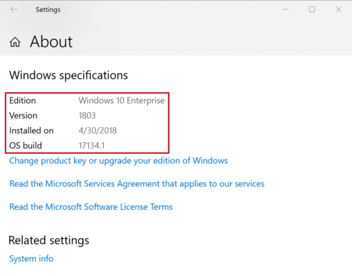](hardware-acceleration-images/win/12-about-windows.w10.png#lightbox)

2. **Enable both Hyper-V and the Windows Hypervisor Platform** &ndash;
   In the Cortana Search bar, type **Turn Windows features on or off**.
   Scroll down in the **Windows Features** dialog, and ensure that the
   **Windows Hypervisor Platform** is enabled.

    [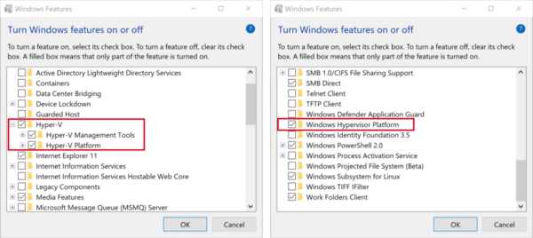](hardware-acceleration-images/win/13-windows-features.w10.png#lightbox)

    It may be necessary to reboot Windows after enabling Hyper-V and the Windows Hypervisor Platform.

3. **Install
   [Visual Studio 15.8 Preview 1](https://aka.ms/hyperv-emulator-dl)**
   &ndash; This version of Visual Studio provides IDE support for
   starting the Google Android Emulator with Hyper-V support.

4. **Install the Google Android emulator package 27.2.7 or higher**
   &ndash; To install this package, navigate to **Tools > Android >
   Android SDK Manager** in Visual Studio. Select the **Tools** tab,
   and ensure the Android Emulator component is at least of version
   27.2.7.

    [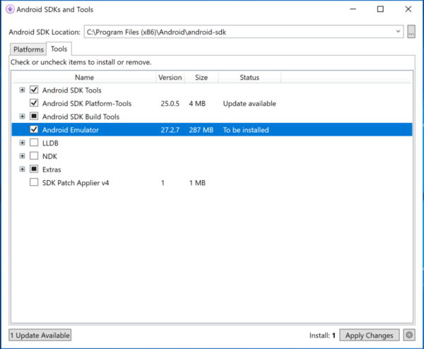](hardware-acceleration-images/win/14-sdk-manager.w158.png#lightbox)

5. If the Android Emulator version is less than 27.3.1, apply the
   additional workaround step explained in **Known Issues** (next).


### Known Issues

-   If the emulator version is at least 27.2.7 but less than 27.3.1,
    the following workaround is required to use Hyper-V:
    1.  In the **C:\\Users\\_username_\\.android** folder, create a file called **advancedFeatures.ini** if it doesn't already exist.
    2.  Add the following line to **advancedFeatures.ini**:
        ```
        WindowsHypervisorPlatform = on
        ```

-   Performance may be reduced when using certain Intel and AMD-based
    processors.

-   Android application may take an abnormal amount of time to load on
    deployment.

-   MMIO access error may intermittently prevent a boot of the Android
    emulator. Restarting the emulator should resolve this.


# [Visual Studio for Mac](#tab/vsmac)

Hyper-V support requires Windows 10. Please see the [Hyper-V requirements](https://docs.microsoft.com/en-us/virtualization/hyper-v-on-windows/quick-start/enable-hyper-v#check-requirements) for more details.

-----

## HAXM Overview

HAXM is a hardware-assisted virtualization engine (hypervisor) that
uses Intel Virtualization Technology (VT) to speed up Android app
emulation on a host machine. In combination with Android x86 emulator
images provided by Intel and the official Android SDK Manager, HAXM
allows for faster Android emulation on VT-enabled systems. 

If you are developing on a machine with an Intel CPU that has VT
capabilities, you can take advantage of HAXM to greatly speed up the
Google Android Emulator (if you're not sure whether your CPU supports VT,
see [Determine If Your Processor Supports Intel Virtualization Technology](https://www.intel.com/content/www/us/en/support/processors/000005486.html)).

> [!NOTE]
> You can't run a VM-accelerated emulator inside another VM, such as a VM
> hosted by VirtualBox, VMWare, or Docker. You must run the Google Android emulator
> [directly on your system hardware](https://developer.android.com/studio/run/emulator-acceleration.html#extensions).

Before you use the Google Android Emulator for the first time, it's a good idea to verify that HAXM is installed and available to the Google Android Emulator.

### Verifying HAXM Installation

You can check to see if HAXM is available by viewing the **Starting
Android Emulator** window while the emulator starts. To start the
Google Android Emulator, do the following:

# [Visual Studio](#tab/vswin)

1. Launch the Android Emulator Manager by clicking **Tools > Android >
   Android Emulator Manager**:

    [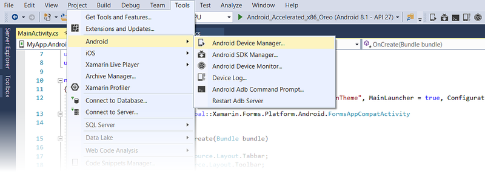](hardware-acceleration-images/win/01-avd-manager-menu-item.png#lightbox)

2. If you see a **Performance Warning** dialog similar to the following, then HAXM is
   not yet installed or configured properly on your computer:

    

   If a **Performance Warning** dialog like this is shown, see
   [Performance Warnings](~/android/deploy-test/debugging/android-sdk-emulator/troubleshooting.md#perfwarn)
   to identify the cause and resolve the underlying problem.

3. Select an **x86** image (for example, **VisualStudio\_android-23\_x86\_phone**), click **Start**, then
   click **Launch**:

    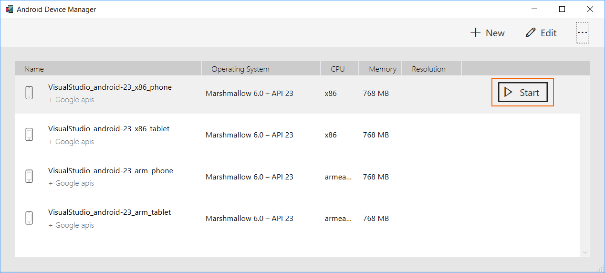

4. Watch for the **Starting Android Emulator** dialog window while the
   emulator starts up. If HAXM is installed, you will see the message,
   **HAX is working and emulator runs in fast virt mode** as shown in
   this screenshot:

    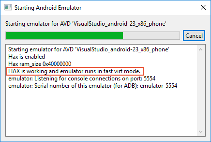

   If you do not see this message, then HAXM is probably not installed. For example, here
   is a screenshot of a message you may see if HAXM is not available:

    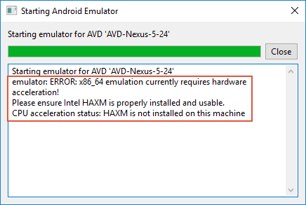

   If HAXM is not available on your computer, use the steps in the next
   section to install HAXM.

# [Visual Studio for Mac](#tab/vsmac)

1. Launch the Android Emulator Manager by clicking **Tools >
   Google Emulator Manager**:

    [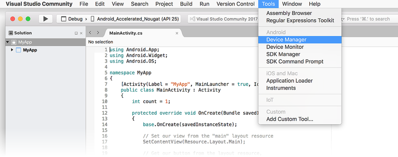](hardware-acceleration-images/mac/01-avd-manager-menu-item.png#lightbox)

2. If you see a **Performance Warning** dialog similar to the following, then HAXM is
   not yet installed or configured properly on your computer:

    

   If a **Performance Warning** dialog like this is shown, see
   [Performance Warnings](~/android/deploy-test/debugging/android-sdk-emulator/troubleshooting.md#perfwarn)
   to identify the cause and resolve the underlying problem.

3. Select the **x86** image (for example, **Android\_Accelerated\_x86**), click **Start**, then
   click **Launch**:

    [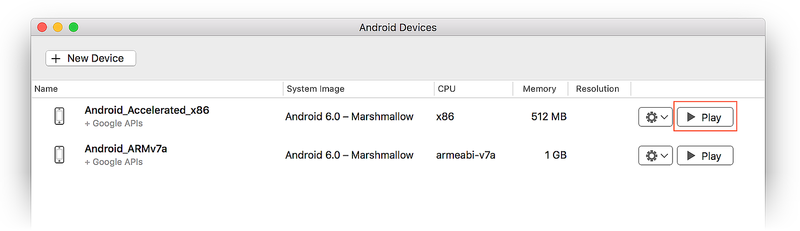](hardware-acceleration-images/mac/02-start-default-avd.png#lightbox)

3. Watch for the **Starting Android Emulator** dialog window while the
   emulator starts up. If HAXM is installed, you will see the message,
   **HAX is working and emulator runs in fast virt mode** as shown in
   this screenshot:

    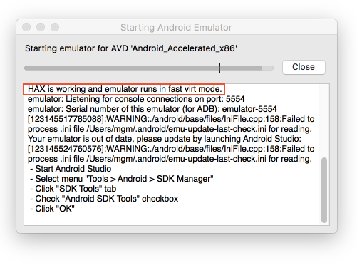

   If HAXM is not available on your computer (for example, if you see an
   error message like _Please ensure Intel HAXM is propertly installed and
   usable_), use the steps in the next section to install HAXM.


-----

<a name="install-haxm" />

### Installing HAXM

If the emulator does not start, HAXM may have to be installed
manually. HAXM install packages for both Windows and macOS are
available from the
[Intel Hardware Accelerated Execution Manager](https://software.intel.com/en-us/android/articles/intel-hardware-accelerated-execution-manager)
page. Use the following steps to download and install HAXM manually:

# [Visual Studio](#tab/vswin)

1. From the Intel website, download the latest
   [HAXM virtualization engine](https://software.intel.com/en-us/android/articles/intel-hardware-accelerated-execution-manager/)
   installer for Windows. The advantage of downloading the HAXM
   installer directly from the Intel website is that you can be assured
   of using the latest version.

   Alternately, you can use the SDK Manager to download the HAXM
   installer (In the SDK Manager, click **Tools > Extras > Intel x86
   Emulator Accelerator (HAXM installer)**). The Android SDK
   normally downloads the HAXM installer to the following location:

   **C:\\Program Files (x86)\\Android\\android-sdk\\extras\\intel\\Hardware\_Accelerated\_Execution\_Manager**

   Note that the SDK Manager does not install HAXM, it merely downloads the
   HAXM installer to the above location; you still have to launch it manually.

2. Run **intelhaxm-android.exe** to start the HAXM installer. Accept
   the default values in the installer dialogs:

   

## Hardware Acceleration and AMD CPUs

Because Google's Android emulator currently supports AMD hardware acceleration
[only on Linux](https://developer.android.com/studio/run/emulator-acceleration.html#dependencies), hardware
acceleration is not available for AMD-based computers running Windows.


# [Visual Studio for Mac](#tab/vsmac)

1. From the Intel website, download the latest
   [HAXM virtualization engine](https://software.intel.com/en-us/android/articles/intel-hardware-accelerated-execution-manager/)
   installer for macOS.

2. Run the HAXM installer. Accept the default values in the installer dialogs:

   [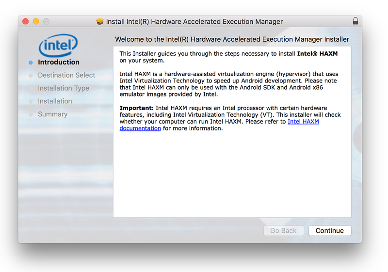](hardware-acceleration-images/win/05-haxm-installer.png#lightbox)

-----


## Related Links

* [Run Apps on the Android Emulator](https://developer.android.com/studio/run/emulator)
